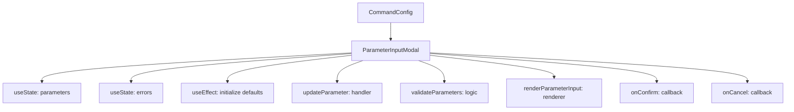
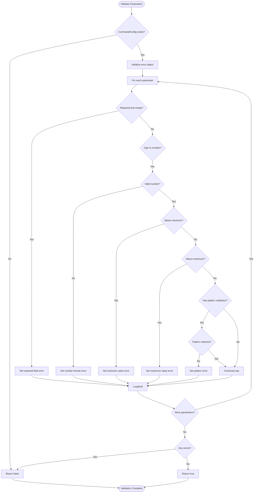
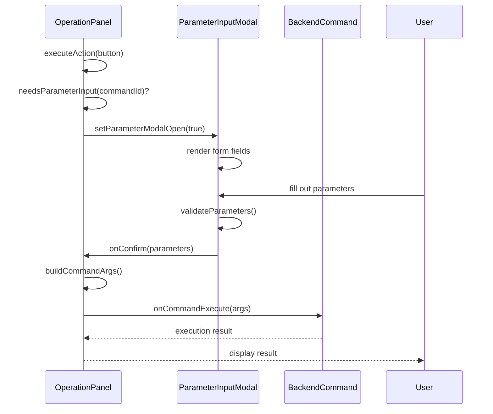

# Parameter Input Modal

<cite>
**Referenced Files in This Document**   
- [ParameterInputModal.tsx](file://cli-ui/src/components/ParameterInputModal.tsx)
- [index.ts](file://cli-ui/src/types/index.ts)
- [commandConfigs.ts](file://cli-ui/src/config/commandConfigs.ts)
- [OperationPanel.tsx](file://cli-ui/src/components/OperationPanel.tsx)
</cite>

## Table of Contents
1. [Introduction](#introduction)
2. [Core Functionality](#core-functionality)
3. [Component Architecture](#component-architecture)
4. [Parameter Types and Input Rendering](#parameter-types-and-input-rendering)
5. [Validation Logic](#validation-logic)
6. [Integration with Command Execution](#integration-with-command-execution)
7. [Error Handling and User Feedback](#error-handling-and-user-feedback)
8. [Usage Examples](#usage-examples)
9. [Common Issues and Troubleshooting](#common-issues-and-troubleshooting)
10. [Extension Guidelines](#extension-guidelines)

## Introduction
The **ParameterInputModal** component is a dynamic form interface that collects user input before executing backend commands in the Duck Client application. It provides a flexible, configuration-driven approach to parameter collection, supporting various input types, validation rules, and default values. The modal is designed to be reusable across different operations, adapting its form fields based on the specific requirements of each command.

This document provides a comprehensive analysis of the component's implementation, functionality, and integration points within the application architecture.

**Section sources**
- [ParameterInputModal.tsx](file://cli-ui/src/components/ParameterInputModal.tsx#L1-L289)

## Core Functionality
The ParameterInputModal serves as a bridge between user interaction and command execution, enabling dynamic parameter collection through a configuration-driven interface. It renders form fields based on command-specific requirements, validates user input in real-time, and structures the collected parameters for backend processing.

Key features include:
- Dynamic form generation from command configuration
- Support for multiple input types (text, number, boolean, select, multiselect)
- Real-time validation with immediate feedback
- Default value initialization
- Secure handling of sensitive inputs
- Responsive modal interface with accessibility considerations

The component operates as a controlled form, maintaining its state internally and only submitting validated parameters to the parent component.

**Section sources**
- [ParameterInputModal.tsx](file://cli-ui/src/components/ParameterInputModal.tsx#L1-L289)

## Component Architecture
The ParameterInputModal follows a React functional component pattern with hooks for state management and side effects. It receives configuration through props and communicates results via callback functions.



**Diagram sources**
- [ParameterInputModal.tsx](file://cli-ui/src/components/ParameterInputModal.tsx#L1-L289)

**Section sources**
- [ParameterInputModal.tsx](file://cli-ui/src/components/ParameterInputModal.tsx#L1-L289)

## Parameter Types and Input Rendering
The component supports five distinct parameter types, each rendered with appropriate UI controls:

- **text**: Single-line text input with placeholder support
- **number**: Numeric input with min/max constraints
- **boolean**: Checkbox input for true/false values
- **select**: Dropdown selection with optional default option
- **multiselect**: Multiple checkbox selection for array values

The rendering logic is implemented in the `renderParameterInput` function, which uses a switch statement to determine the appropriate input component based on the parameter type.

```mermaid
classDiagram
class ParameterInputModal {
+parameters : ParameterInputResult
+errors : { [key : string] : string }
+updateParameter(name : string, value : any) : void
+validateParameters() : boolean
+handleConfirm() : void
+renderParameterInput(param : CommandParameter) : JSX.Element
}
class CommandParameter {
+name : string
+label : string
+type : 'text'|'number'|'boolean'|'select'|'multiselect'
+required? : boolean
+defaultValue? : any
+placeholder? : string
+description? : string
+options? : Array<{value : string, label : string}>
+min? : number
+max? : number
+validation? : {pattern? : string, message? : string}
}
class CommandConfig {
+id : string
+name : string
+description : string
+parameters : CommandParameter[]
+examples? : string[]
}
ParameterInputModal --> CommandConfig : "receives"
CommandConfig --> CommandParameter : "contains"
```

**Diagram sources**
- [ParameterInputModal.tsx](file://cli-ui/src/components/ParameterInputModal.tsx#L1-L289)
- [index.ts](file://cli-ui/src/types/index.ts#L38-L86)

**Section sources**
- [ParameterInputModal.tsx](file://cli-ui/src/components/ParameterInputModal.tsx#L135-L201)
- [index.ts](file://cli-ui/src/types/index.ts#L46-L49)

## Validation Logic
The component implements comprehensive client-side validation to ensure data integrity before command execution. The validation process checks for:

1. **Required fields**: Ensures mandatory parameters are provided
2. **Type validation**: Verifies numeric inputs are valid numbers
3. **Range constraints**: Enforces min/max limits for numeric values
4. **Pattern matching**: Applies regex validation when specified
5. **Conditional validation**: Skips validation for optional empty fields



**Diagram sources**
- [ParameterInputModal.tsx](file://cli-ui/src/components/ParameterInputModal.tsx#L90-L133)

**Section sources**
- [ParameterInputModal.tsx](file://cli-ui/src/components/ParameterInputModal.tsx#L64-L90)

## Integration with Command Execution
The ParameterInputModal integrates with the application's command execution pipeline through the OperationPanel component. When a command requiring parameters is selected, the OperationPanel opens the modal with the appropriate configuration.



The integration follows a clear flow:
1. OperationPanel detects a command with parameters
2. ParameterInputModal is opened with CommandConfig
3. User provides input and submits
4. Validated parameters are passed back to OperationPanel
5. OperationPanel constructs the command line arguments
6. Command is executed through the backend interface

**Diagram sources**
- [OperationPanel.tsx](file://cli-ui/src/components/OperationPanel.tsx#L64-L119)
- [ParameterInputModal.tsx](file://cli-ui/src/components/ParameterInputModal.tsx#L90-L98)

**Section sources**
- [OperationPanel.tsx](file://cli-ui/src/components/OperationPanel.tsx#L64-L119)
- [commandConfigs.ts](file://cli-ui/src/config/commandConfigs.ts#L312-L320)

## Error Handling and User Feedback
The component provides immediate visual feedback for validation errors, enhancing user experience and reducing input mistakes. Error states are displayed with:

- Red border around invalid input fields
- Error icon (XCircleIcon) next to error message
- Descriptive error text in red color
- Real-time error clearing when input is corrected

The error handling system uses React state to maintain error messages and automatically clears errors when the corresponding field is updated. This creates a responsive and intuitive user interface that guides users toward correct input.

**Section sources**
- [ParameterInputModal.tsx](file://cli-ui/src/components/ParameterInputModal.tsx#L224-L250)

## Usage Examples
The following examples demonstrate how the ParameterInputModal is used for different commands:

### Delay Deployment Command
```json
{
  "id": "delay-deploy",
  "name": "Delay Deployment",
  "description": "Delay specified time before executing auto-upgrade deployment",
  "parameters": [
    {
      "name": "time",
      "label": "Delay Time",
      "type": "number",
      "required": true,
      "min": 1,
      "max": 9999,
      "placeholder": "2",
      "description": "Delay time value"
    },
    {
      "name": "unit",
      "label": "Time Unit",
      "type": "select",
      "required": true,
      "defaultValue": "hours",
      "options": [
        { "value": "minutes", "label": "Minutes" },
        { "value": "hours", "label": "Hours" },
        { "value": "days", "label": "Days" }
      ],
      "description": "Time unit"
    }
  ],
  "examples": [
    "duck-cli auto-upgrade-deploy delay-time-deploy 2 --unit hours",
    "duck-cli auto-upgrade-deploy delay-time-deploy 30 --unit minutes"
  ]
}
```

### Check Update Command
```json
{
  "id": "check-update",
  "name": "Client Check Update",
  "description": "Check client updates, or install latest version",
  "parameters": [
    {
      "name": "action",
      "label": "Action Type",
      "type": "select",
      "required": true,
      "defaultValue": "check",
      "options": [
        { "value": "check", "label": "Check Update" },
        { "value": "install", "label": "Install Version" }
      ],
      "description": "Select operation to perform"
    },
    {
      "name": "version",
      "label": "Version Number",
      "type": "text",
      "required": false,
      "placeholder": "0.0.1",
      "description": "Specify version to install (empty for latest)"
    },
    {
      "name": "force",
      "label": "Force Reinstall",
      "type": "boolean",
      "required": false,
      "defaultValue": false,
      "description": "Force reinstall even if already latest version"
    }
  ]
}
```

**Section sources**
- [commandConfigs.ts](file://cli-ui/src/config/commandConfigs.ts#L45-L140)

## Common Issues and Troubleshooting
### Incomplete Parameter Sets
**Issue**: Users may submit forms with missing required fields.
**Solution**: The validation system prevents submission of incomplete forms and highlights missing fields with descriptive error messages.

### Type Mismatches
**Issue**: Users may enter non-numeric values in number fields.
**Solution**: The component validates numeric input and displays appropriate error messages when non-numeric values are entered.

### Modal Dismissal During Input
**Issue**: Users may close the modal without completing input.
**Solution**: The modal can be closed via the X button or background click, triggering the onCancel callback. This allows the parent component to handle cancellation appropriately.

### Default Value Initialization
**Issue**: Default values may not be properly applied when the command configuration changes.
**Solution**: The useEffect hook listens for commandConfig changes and reinitializes default values accordingly.

**Section sources**
- [ParameterInputModal.tsx](file://cli-ui/src/components/ParameterInputModal.tsx#L15-L25)
- [ParameterInputModal.tsx](file://cli-ui/src/components/ParameterInputModal.tsx#L252-L288)

## Extension Guidelines
### Adding New Input Types
To support additional input types:
1. Extend the `type` union in CommandParameter interface
2. Add a new case to the renderParameterInput switch statement
3. Implement appropriate validation logic
4. Update documentation

### Adding Validation Patterns
To add new validation patterns:
1. Extend the validation object in CommandParameter
2. Add corresponding validation logic in validateParameters
3. Ensure error messages are clear and descriptive

### Parameter Presets
To implement parameter presets:
1. Add a presets field to CommandConfig
2. Create a preset selection UI in the modal
3. Implement preset application logic
4. Update state management to handle preset selection

The component's modular design makes it easy to extend with new features while maintaining backward compatibility.

**Section sources**
- [index.ts](file://cli-ui/src/types/index.ts#L46-L86)
- [ParameterInputModal.tsx](file://cli-ui/src/components/ParameterInputModal.tsx#L1-L289)