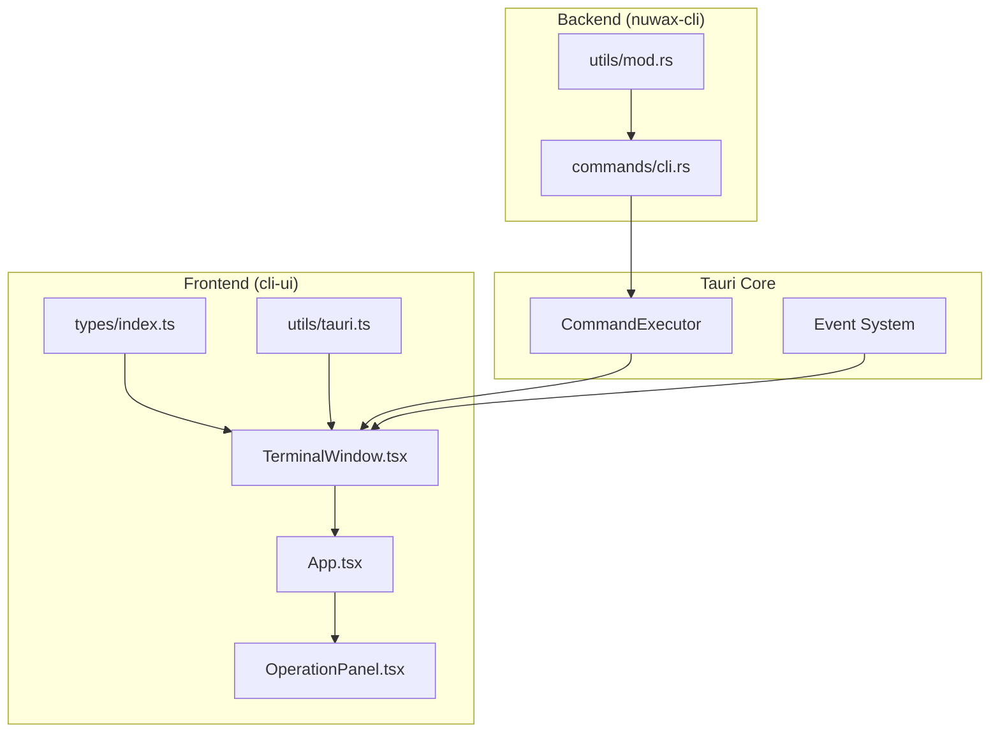
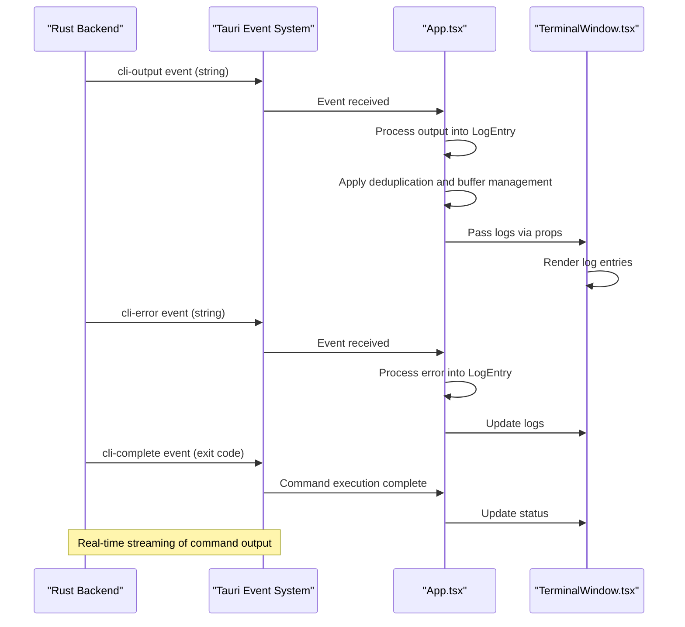
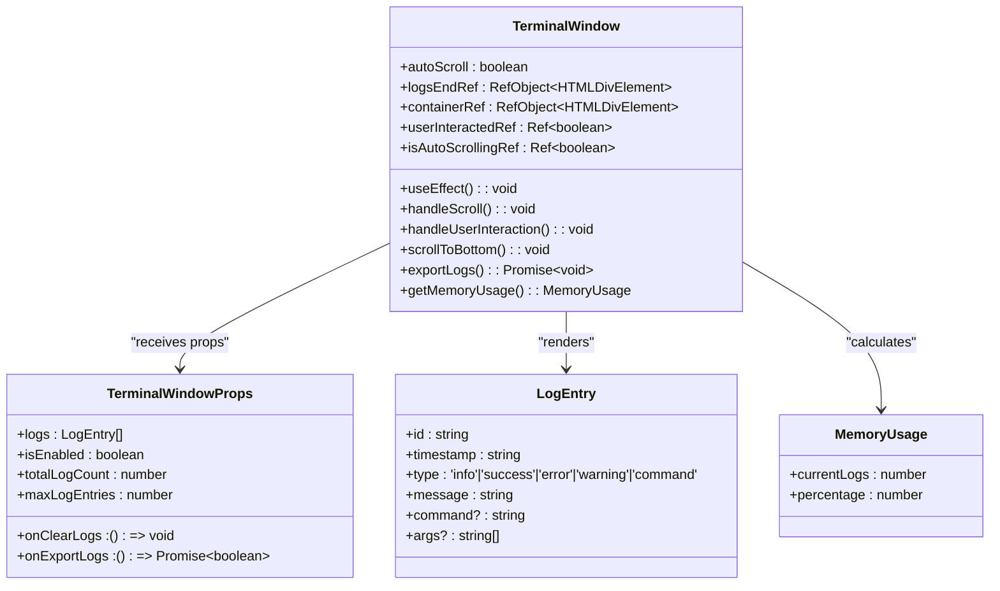
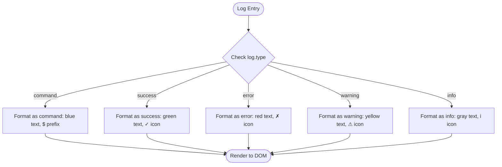
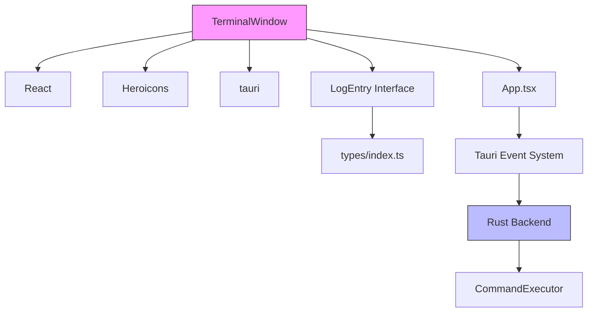
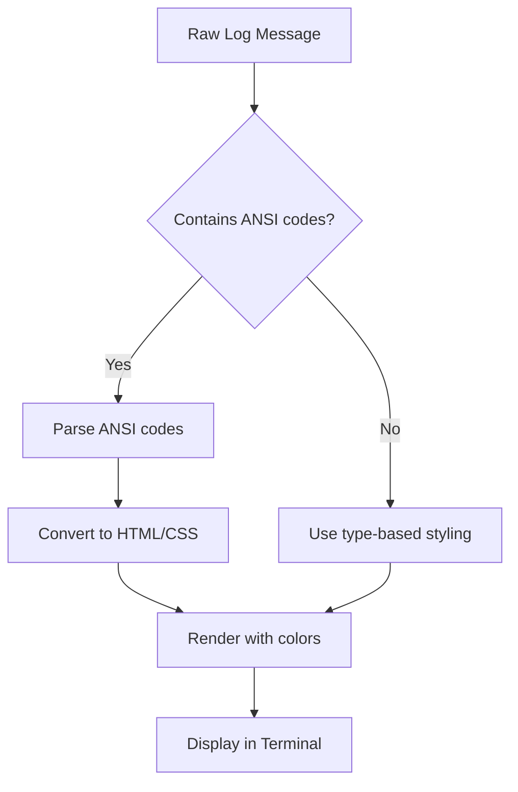

# Terminal Window

<cite>
**Referenced Files in This Document**   
- [TerminalWindow.tsx](file://cli-ui/src/components/TerminalWindow.tsx#L1-L251)
- [App.tsx](file://cli-ui/src/App.tsx#L1-L465)
- [index.ts](file://cli-ui/src/types/index.ts#L1-L87)
- [cli-ui.md](file://spec/cli-ui.md#L407-L557)
</cite>

## Table of Contents
1. [Introduction](#introduction)
2. [Project Structure](#project-structure)
3. [Core Components](#core-components)
4. [Architecture Overview](#architecture-overview)
5. [Detailed Component Analysis](#detailed-component-analysis)
6. [Dependency Analysis](#dependency-analysis)
7. [Performance Considerations](#performance-considerations)
8. [Troubleshooting Guide](#troubleshooting-guide)
9. [Conclusion](#conclusion)

## Introduction
The TerminalWindow component is a critical UI element in the Duck Client application, responsible for displaying real-time log output and command execution results from backend processes. It serves as the primary interface for users to monitor operations such as upgrades, backups, and service management. Built using React and integrated with Tauri for desktop functionality, the component implements a streaming architecture that efficiently handles high-frequency log updates while maintaining smooth UI performance. This documentation provides a comprehensive analysis of its implementation, covering event handling, text buffer management, scroll behavior, and integration patterns with other components like OperationPanel.

## Project Structure
The TerminalWindow component resides within the `cli-ui` module of the Duck Client repository, specifically at `cli-ui/src/components/TerminalWindow.tsx`. It is part of a larger frontend application built with React and TypeScript, leveraging Tauri for system-level operations. The component interacts with backend Rust code through Tauri's event system, receiving real-time output from CLI operations. The project follows a modular structure with clear separation between UI components, utility functions, and type definitions.



**Diagram sources**
- [TerminalWindow.tsx](file://cli-ui/src/components/TerminalWindow.tsx#L1-L251)
- [App.tsx](file://cli-ui/src/App.tsx#L1-L465)
- [index.ts](file://cli-ui/src/types/index.ts#L1-L87)

**Section sources**
- [TerminalWindow.tsx](file://cli-ui/src/components/TerminalWindow.tsx#L1-L251)
- [App.tsx](file://cli-ui/src/App.tsx#L1-L465)

## Core Components
The TerminalWindow component is the central focus of this documentation, responsible for rendering real-time log output from backend processes. It receives log entries through Tauri event listeners and displays them with appropriate styling based on message type (info, success, error, warning, command). The component implements sophisticated scroll behavior with automatic scrolling that can be paused when users manually scroll through logs. It also provides controls for clearing logs, exporting logs to files, and monitoring buffer usage.

The LogEntry interface, defined in `types/index.ts`, structures each log message with properties including id, timestamp, type, message, and optional command and arguments. The component integrates with the application state managed in App.tsx, receiving logs as a prop and communicating actions like log clearing and exporting through callback functions.

**Section sources**
- [TerminalWindow.tsx](file://cli-ui/src/components/TerminalWindow.tsx#L1-L251)
- [index.ts](file://cli-ui/src/types/index.ts#L1-L87)

## Architecture Overview
The TerminalWindow component operates within a streaming architecture that connects the frontend React UI with backend Rust processes through Tauri's event system. When backend processes generate output, they emit events that are captured by event listeners in the frontend application. These events are processed and transformed into LogEntry objects that are added to the application state. The TerminalWindow component re-renders whenever new logs are added, efficiently updating the display without performance degradation.



**Diagram sources**
- [App.tsx](file://cli-ui/src/App.tsx#L161-L199)
- [TerminalWindow.tsx](file://cli-ui/src/components/TerminalWindow.tsx#L191-L221)

## Detailed Component Analysis

### TerminalWindow Component Analysis
The TerminalWindow component is implemented as a React functional component with several state variables and refs to manage its behavior. It receives logs and control functions as props from its parent component (App.tsx) and renders them in a scrollable container with syntax highlighting and type-specific styling.

#### State and Ref Management
The component uses multiple React hooks to manage its internal state and references:
- `autoScroll` state controls whether the terminal automatically scrolls to the bottom when new logs arrive
- `logsEndRef` references the bottom of the log container for scroll positioning
- `containerRef` references the scrollable container for scroll event handling
- `userInteractedRef` tracks whether the user has manually interacted with the scroll container
- `isAutoScrollingRef` prevents scroll event conflicts during automatic scrolling



**Diagram sources**
- [TerminalWindow.tsx](file://cli-ui/src/components/TerminalWindow.tsx#L43-L251)

#### Event Subscription Patterns
The TerminalWindow component itself does not directly subscribe to Tauri events. Instead, event subscription is managed in App.tsx, which acts as the central event handler for the application. This design pattern prevents multiple instances of event listeners and ensures consistent event processing.

In App.tsx, three primary event listeners are established:
- `cli-output`: Captures standard output from CLI commands and adds info-type log entries
- `cli-error`: Captures error output and adds error-type log entries
- `cli-complete`: Signals command completion and adds success/error messages based on exit code

```typescript
// Event listener setup in App.tsx
unlistenOutput = await listen('cli-output', (event) => {
  const output = event.payload as string;
  if (output.trim()) {
    addLogEntryRef.current('info', output.trim());
  }
});

unlistenError = await listen('cli-error', (event) => {
  const error = event.payload as string;
  if (error.trim()) {
    addLogEntryRef.current('error', error.trim());
  }
});

unlistenComplete = await listen('cli-complete', (event) => {
  const exitCode = event.payload as number;
  setIsExecuting(false);
  if (exitCode === 0) {
    addLogEntryRef.current('success', `命令执行完成 (退出码: ${exitCode})`);
  } else {
    addLogEntryRef.current('error', `命令执行失败 (退出码: ${exitCode})`);
  }
});
```

**Section sources**
- [App.tsx](file://cli-ui/src/App.tsx#L161-L199)

#### Log Formatting and Display
The TerminalWindow component formats log entries based on their type, applying different colors and icons for visual distinction:
- **Command entries**: Blue text with a dollar sign prefix
- **Success entries**: Green text with a checkmark icon
- **Error entries**: Red text with an X icon
- **Warning entries**: Yellow text with a warning icon
- **Info entries**: Gray text with an information icon

The component also displays metadata about the log buffer, including the current number of logs, total log count, and buffer usage percentage. This information is presented in the header with color-coded indicators for buffer status (green for low usage, yellow for medium, red for high).



**Section sources**
- [TerminalWindow.tsx](file://cli-ui/src/components/TerminalWindow.tsx#L219-L250)

### OperationPanel Integration
The TerminalWindow component integrates closely with the OperationPanel component to display progress during operations like upgrades, backups, and service management. When a user initiates an operation through OperationPanel, the command is executed through the Tauri backend, and all output is streamed to the TerminalWindow via the event system.

The integration flow is as follows:
1. User triggers an operation in OperationPanel
2. OperationPanel calls `handleCommandExecute` callback
3. App.tsx executes the command via Tauri and sets `isExecuting` state
4. Backend process generates output events
5. Events are captured and converted to log entries
6. TerminalWindow re-renders with new logs

This architecture ensures that users receive real-time feedback on long-running operations, with clear indication of progress and any errors that occur.

**Section sources**
- [App.tsx](file://cli-ui/src/App.tsx#L265-L298)
- [TerminalWindow.tsx](file://cli-ui/src/components/TerminalWindow.tsx#L191-L221)

## Dependency Analysis
The TerminalWindow component has several key dependencies that enable its functionality:



The component depends on React for its core functionality, Heroicons for UI icons, and Tauri utilities for dialog management. It receives data from App.tsx, which acts as a container component managing application state and event handling. The ultimate source of log data is the Rust backend, which executes commands and emits events through Tauri's inter-process communication system.

**Diagram sources**
- [TerminalWindow.tsx](file://cli-ui/src/components/TerminalWindow.tsx#L1-L251)
- [App.tsx](file://cli-ui/src/App.tsx#L1-L465)

## Performance Considerations
The TerminalWindow component implements several performance optimizations to handle high-frequency log updates efficiently:

### Text Buffer Management
The component uses a circular buffer implementation to manage log entries, preventing memory leaks during long-running operations. The buffer management is handled in App.tsx with the `manageLogBuffer` function, which enforces a maximum number of log entries (default 100,000) and trims old entries when the limit is exceeded.

```typescript
const manageLogBuffer = useCallback((newLogs: LogEntry[]) => {
  setLogs(currentLogs => {
    const allLogs = [...currentLogs, ...newLogs];
    
    if (allLogs.length > logConfig.maxEntries) {
      const excessCount = allLogs.length - logConfig.maxEntries;
      const trimCount = Math.max(excessCount, logConfig.trimBatchSize);
      const trimmedLogs = allLogs.slice(trimCount);
      return trimmedLogs;
    }
    
    return allLogs;
  });
}, [logConfig.maxEntries, logConfig.trimBatchSize]);
```

This approach ensures that the application maintains responsive performance even with extensive logging, as older entries are systematically removed to make room for new ones.

### Scroll Behavior Optimization
The component implements an optimized scroll behavior that prevents performance issues during rapid log updates. The automatic scrolling is implemented with a debounce mechanism using refs to track scrolling state, preventing scroll event conflicts.

```typescript
useEffect(() => {
  if (autoScroll && logsEndRef.current) {
    isAutoScrollingRef.current = true;
    logsEndRef.current.scrollIntoView({ behavior: 'smooth' });
    setTimeout(() => {
      isAutoScrollingRef.current = false;
    }, 100);
  }
}, [logs, autoScroll]);
```

The component also detects user interaction with the scroll container and temporarily disables automatic scrolling when users manually scroll through logs, providing a natural user experience.

### Rendering Optimization
The component uses React's `useCallback` and `useEffect` hooks to minimize unnecessary re-renders. Log entries are rendered with stable keys (using the log id), allowing React's reconciliation algorithm to efficiently update the DOM. The component also implements a clean empty state with appropriate messaging when no logs are present.

**Section sources**
- [App.tsx](file://cli-ui/src/App.tsx#L30-L67)
- [TerminalWindow.tsx](file://cli-ui/src/components/TerminalWindow.tsx#L45-L82)

## Troubleshooting Guide
This section addresses common issues that may occur with the TerminalWindow component and provides guidance for resolution.

### Output Lag
**Issue**: Delay between backend output and display in the terminal window.

**Cause**: This can occur when the event processing pipeline is blocked or when the UI thread is busy with other operations.

**Solution**: 
- Ensure the event listeners are properly set up in App.tsx
- Check for long-running synchronous operations in the UI thread
- Verify that the Tauri backend is emitting events promptly
- Monitor application performance and optimize rendering if necessary

### Buffer Overflow
**Issue**: Logs are being lost or the buffer usage indicator shows high memory usage.

**Cause**: The application is generating logs faster than they can be processed, or the buffer limits are too restrictive.

**Solution**:
- Adjust the `maxEntries` and `trimBatchSize` values in `DEFAULT_LOG_CONFIG`
- Implement more aggressive log filtering at the source
- Ensure the circular buffer implementation is working correctly
- Monitor the `manageLogBuffer` function for proper trimming behavior

### Desynchronization Between UI and Backend Events
**Issue**: The terminal shows incomplete or out-of-order log messages.

**Cause**: Race conditions in event handling or improper event sequencing.

**Solution**:
- Ensure event listeners are set up only once using the global flag `__duck_cli_listeners_setup`
- Verify that all event types (output, error, complete) are properly handled
- Check that the `addLogEntryRef` is properly synchronized with the latest function version
- Implement sequence numbers or timestamps to verify message ordering

### ANSI Color Code Handling
**Issue**: Colored output from backend processes is not properly displayed.

**Current Implementation**: The TerminalWindow component does not currently process ANSI color codes. Instead, it relies on the backend to emit appropriately typed log entries (info, success, error, warning) that are then styled with predefined colors.

**Recommendation for Enhancement**: To support ANSI color codes, implement a parser that converts ANSI escape sequences to appropriate HTML/CSS styling. This could be done by:
1. Creating an ANSI-to-HTML converter function
2. Applying the conversion to log messages before rendering
3. Preserving the existing type-based styling as a fallback



**Section sources**
- [App.tsx](file://cli-ui/src/App.tsx#L69-L120)
- [TerminalWindow.tsx](file://cli-ui/src/components/TerminalWindow.tsx#L219-L250)

## Conclusion
The TerminalWindow component is a sophisticated UI element that effectively bridges the gap between backend processes and user interface in the Duck Client application. Its streaming architecture, powered by Tauri's event system, enables real-time display of command output with minimal latency. The component's thoughtful design includes performance optimizations for handling high-frequency log updates, intelligent scroll behavior, and comprehensive buffer management to prevent memory issues.

Key strengths of the implementation include:
- Centralized event handling in App.tsx to prevent listener duplication
- Circular buffer implementation for efficient memory management
- User-friendly scroll behavior with automatic and manual modes
- Clear visual distinction between different log types
- Integration with OperationPanel for comprehensive operation monitoring

For future enhancements, implementing ANSI color code support would allow richer terminal output, while adding search functionality and log filtering would improve usability for debugging complex operations. The component's modular design makes it well-suited for these extensions without requiring significant architectural changes.