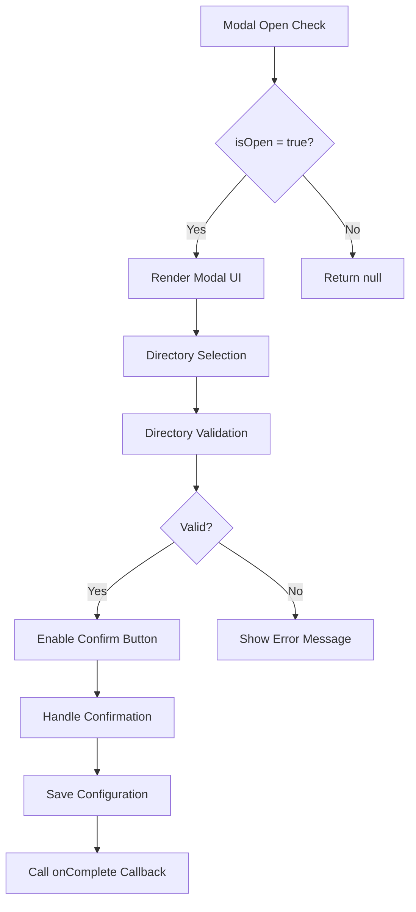
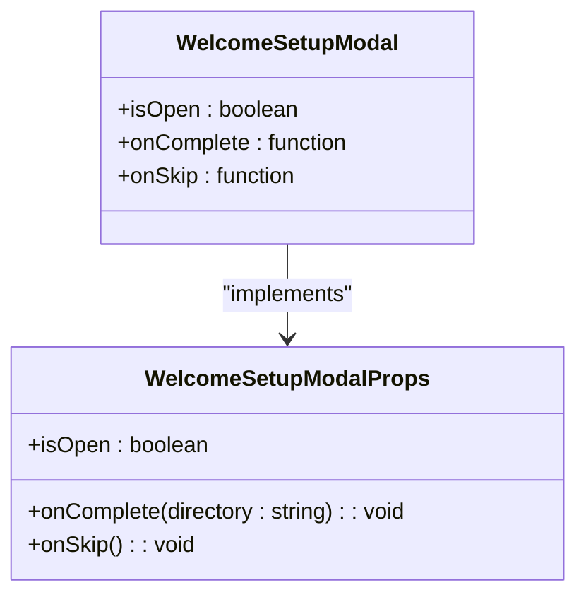
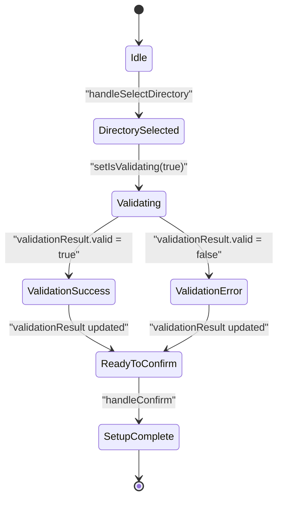
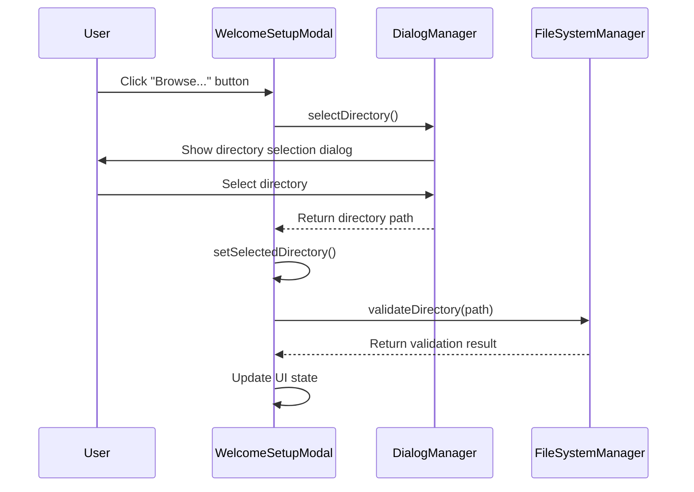
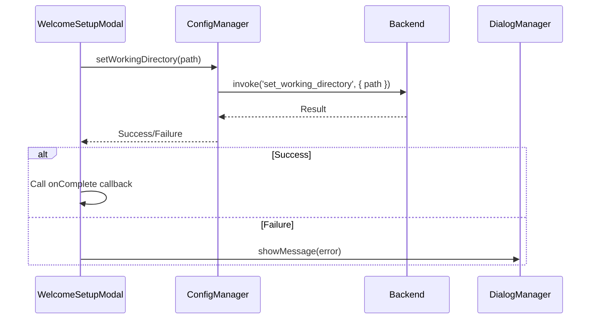
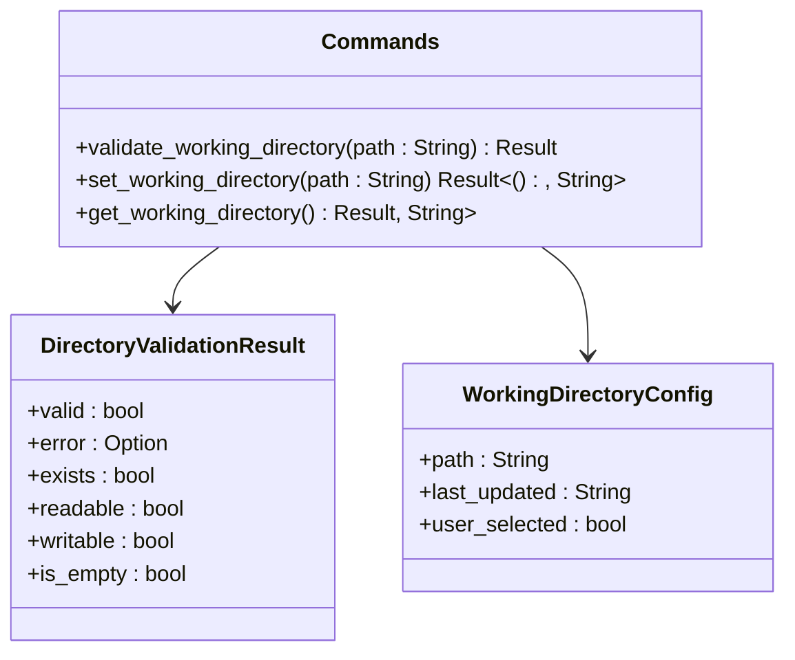
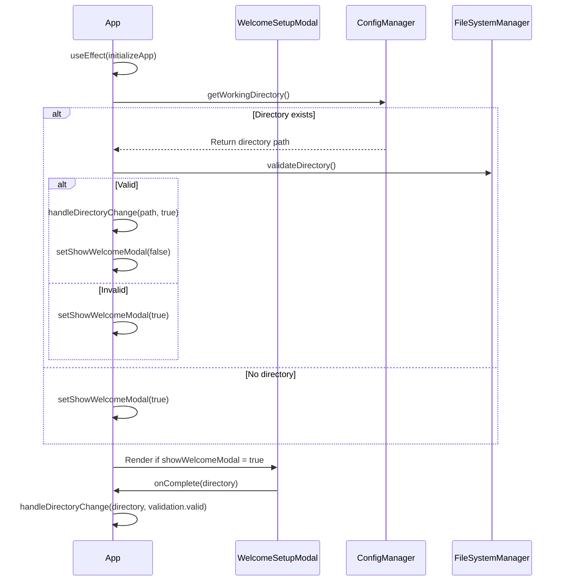

# Welcome Setup Modal

<cite>
**Referenced Files in This Document**   
- [WelcomeSetupModal.tsx](file://cli-ui/src/components/WelcomeSetupModal.tsx)
- [tauri.ts](file://cli-ui/src/utils/tauri.ts)
- [config.rs](file://cli-ui/src-tauri/src/commands/config.rs)
- [mod.rs](file://cli-ui/src-tauri/src/commands/mod.rs)
- [App.tsx](file://cli-ui/src/App.tsx)
</cite>

## Table of Contents
1. [Introduction](#introduction)
2. [Component Overview](#component-overview)
3. [Props and Configuration](#props-and-configuration)
4. [State Management](#state-management)
5. [Directory Selection and Validation](#directory-selection-and-validation)
6. [Integration with Configuration System](#integration-with-configuration-system)
7. [Backend Implementation](#backend-implementation)
8. [Application Integration](#application-integration)
9. [Error Handling and Recovery](#error-handling-and-recovery)
10. [User Experience Design](#user-experience-design)
11. [Troubleshooting Guide](#troubleshooting-guide)

## Introduction
The WelcomeSetupModal component serves as the initial onboarding interface for new users of the Duck CLI GUI application. This modal guides users through the essential setup process by prompting them to select a working directory, which forms the foundation for all subsequent operations within the application. The component implements a streamlined workflow that combines user interaction, system validation, and configuration persistence to ensure a smooth onboarding experience. It plays a critical role in the application's initialization sequence, ensuring that users establish a valid working environment before accessing core functionality.

## Component Overview
The WelcomeSetupModal is a React functional component that presents a modal dialog when the application requires directory configuration. It provides a user-friendly interface for selecting and validating a working directory, with visual feedback on the selection status. The component is designed to be conditionally rendered based on the application's state, appearing only when no valid working directory has been configured or when the existing directory becomes invalid.

**Diagram sources**
- [WelcomeSetupModal.tsx](file://cli-ui/src/components/WelcomeSetupModal.tsx#L1-L227)

**Section sources**
- [WelcomeSetupModal.tsx](file://cli-ui/src/components/WelcomeSetupModal.tsx#L1-L227)

## Props and Configuration
The WelcomeSetupModal component accepts three primary props that enable customization of its behavior and integration with the parent component:

**WelcomeSetupModalProps**
- `isOpen`: boolean - Controls the visibility of the modal
- `onComplete`: (directory: string) => void - Callback function executed when setup is successfully completed
- `onSkip`: () => void - Callback function executed when the user chooses to skip the setup process

These props allow the parent component to control the modal's lifecycle and respond to user actions appropriately. The `onComplete` callback receives the selected directory path as a parameter, enabling the parent to update its state accordingly.

**Diagram sources**
- [WelcomeSetupModal.tsx](file://cli-ui/src/components/WelcomeSetupModal.tsx#L10-L17)

**Section sources**
- [WelcomeSetupModal.tsx](file://cli-ui/src/components/WelcomeSetupModal.tsx#L10-L17)

## State Management
The component maintains several state variables to track the user's progress through the setup process:

**State Variables**
- `selectedDirectory`: string - Stores the currently selected directory path
- `isValidating`: boolean - Indicates whether directory validation is in progress
- `validationResult`: { valid: boolean; error?: string } | null - Stores the result of the directory validation

This state management approach enables the component to provide real-time feedback to users as they interact with the interface. The validation result is updated asynchronously when the user selects a directory, with appropriate loading indicators displayed during the validation process.

**Diagram sources**
- [WelcomeSetupModal.tsx](file://cli-ui/src/components/WelcomeSetupModal.tsx#L19-L25)

**Section sources**
- [WelcomeSetupModal.tsx](file://cli-ui/src/components/WelcomeSetupModal.tsx#L19-L25)

## Directory Selection and Validation
The component implements a comprehensive directory selection and validation workflow that ensures users select an appropriate working directory. The process begins with the `handleSelectDirectory` function, which invokes the system's directory selection dialog through the DialogManager utility.

**Diagram sources**
- [WelcomeSetupModal.tsx](file://cli-ui/src/components/WelcomeSetupModal.tsx#L27-L58)
- [tauri.ts](file://cli-ui/src/utils/tauri.ts#L100-L114)
- [tauri.ts](file://cli-ui/src/utils/tauri.ts#L180-L230)

**Section sources**
- [WelcomeSetupModal.tsx](file://cli-ui/src/components/WelcomeSetupModal.tsx#L27-L58)

The validation process is handled by the `validateDirectory` function, which performs asynchronous validation of the selected directory through the FileSystemManager. This function manages loading states and displays appropriate feedback to the user during the validation process.

## Integration with Configuration System
The WelcomeSetupModal integrates with the application's configuration system through the ConfigManager utility class. When the user confirms their directory selection, the `handleConfirm` function is called, which saves the selected directory to the application's persistent configuration.

**Diagram sources**
- [WelcomeSetupModal.tsx](file://cli-ui/src/components/WelcomeSetupModal.tsx#L59-L78)
- [tauri.ts](file://cli-ui/src/utils/tauri.ts#L370-L390)

**Section sources**
- [WelcomeSetupModal.tsx](file://cli-ui/src/components/WelcomeSetupModal.tsx#L59-L78)

The ConfigManager acts as a bridge between the frontend and backend, using Tauri's invoke mechanism to communicate with the Rust backend. This integration ensures that the working directory configuration is persisted across application restarts.

## Backend Implementation
The backend implementation of the directory management functionality is located in the Tauri commands module. The `config.rs` file contains the Rust implementations of the `validate_working_directory`, `set_working_directory`, and `get_working_directory` functions that are invoked from the frontend.

**Diagram sources**
- [config.rs](file://cli-ui/src-tauri/src/commands/config.rs#L1-L201)

**Section sources**
- [config.rs](file://cli-ui/src-tauri/src/commands/config.rs#L1-L201)

The `validate_working_directory` function performs comprehensive checks on the specified directory, including existence, directory type, read permissions, write permissions, and emptiness. The validation logic creates a temporary test file to verify write permissions, ensuring that the application can write to the selected directory.

The `set_working_directory` function first validates the directory before saving the configuration to a JSON file in the application's data directory. The configuration includes the directory path, timestamp of the last update, and a flag indicating that the directory was user-selected.

The `get_working_directory` function reads the configuration file and validates that the stored directory is still accessible and valid, automatically clearing the configuration if the directory becomes invalid.

## Application Integration
The WelcomeSetupModal is integrated into the main application through the App component, which manages the overall application state and determines when to display the modal.

**Diagram sources**
- [App.tsx](file://cli-ui/src/App.tsx#L1-L465)

**Section sources**
- [App.tsx](file://cli-ui/src/App.tsx#L1-L465)

The App component uses the `handleDirectoryChange` function to manage the application's response to directory changes. When a new directory is selected, the function updates the application state, saves the configuration, and performs background checks for conflicting processes and database locks.

The modal is conditionally rendered based on the `showWelcomeModal` state, which is controlled by the application's initialization logic and the validity of the current working directory.

## Error Handling and Recovery
The WelcomeSetupModal implements comprehensive error handling at multiple levels to ensure a robust user experience:

**Frontend Error Handling**
- Directory selection errors are caught and logged to the console
- Validation errors are displayed directly in the UI with appropriate error messages
- Configuration save errors trigger error dialogs through the DialogManager

**Backend Error Handling**
- Directory validation errors include specific reasons (e.g., "directory does not exist", "directory is not readable")
- Configuration save errors provide detailed information about the failure cause
- Invalid directory paths are rejected before attempting to save configuration

The component follows a fail-safe approach, ensuring that invalid directory configurations are not persisted. If a previously valid directory becomes invalid (e.g., due to permission changes or deletion), the application automatically detects this condition and prompts the user to select a new directory.

## User Experience Design
The WelcomeSetupModal incorporates several user experience enhancements to guide users through the setup process:

**Informational Guidance**
- Clear instructions explaining the purpose of the working directory
- Recommendations for suitable directory locations
- Warnings about directories to avoid (system directories, etc.)

**Visual Feedback**
- Loading indicators during directory validation
- Color-coded validation status (green for valid, red for invalid)
- Icon-based status indicators for better visual recognition

**Convenience Features**
- Pre-populated directory suggestions for common locations
- Integrated directory browser for easy selection
- Ability to skip setup for later configuration

The design follows accessibility best practices with proper labeling, keyboard navigation support, and clear visual hierarchy to ensure usability for all users.

## Troubleshooting Guide
This section addresses common issues users may encounter with the WelcomeSetupModal and provides solutions:

**Directory Validation Fails**
- **Cause**: Insufficient read/write permissions on the selected directory
- **Solution**: Select a directory where the user has full permissions, such as within the user's home directory

**"Directory Does Not Exist" Error**
- **Cause**: The selected path points to a non-existent location
- **Solution**: Use the browse button to select an existing directory, or create the directory before selecting it

**Configuration Not Persisting**
- **Cause**: Application data directory permissions issue
- **Solution**: Ensure the application has write permissions to its data directory, typically located in the system's application data folder

**Modal Does Not Appear on Startup**
- **Cause**: A valid working directory is already configured
- **Solution**: To reconfigure the working directory, manually clear the configuration file located at [app_data_dir]/working_directory.json

**Slow Directory Validation**
- **Cause**: Network drive or slow storage device
- **Solution**: Select a directory on local storage for better performance

**Section sources**
- [WelcomeSetupModal.tsx](file://cli-ui/src/components/WelcomeSetupModal.tsx#L1-L227)
- [config.rs](file://cli-ui/src-tauri/src/commands/config.rs#L1-L201)
- [App.tsx](file://cli-ui/src/App.tsx#L1-L465)