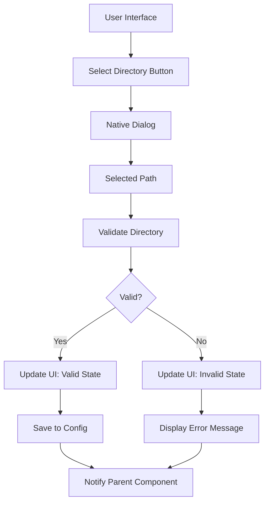
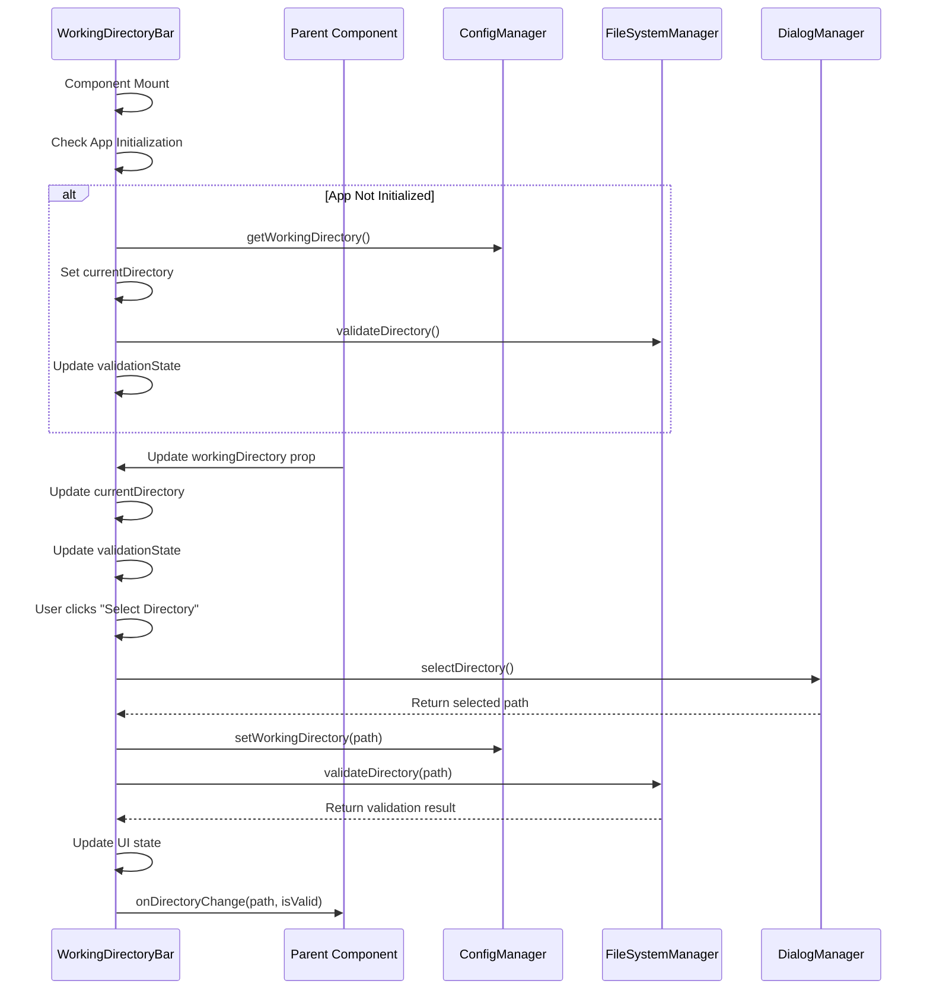
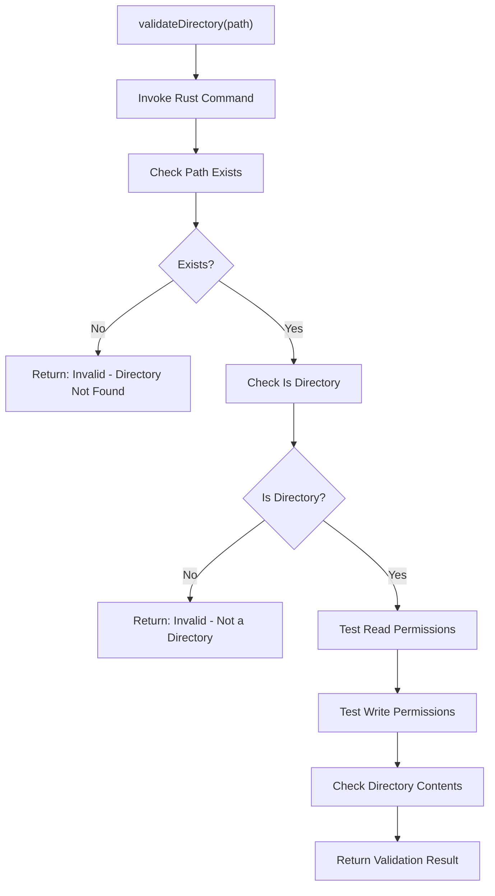
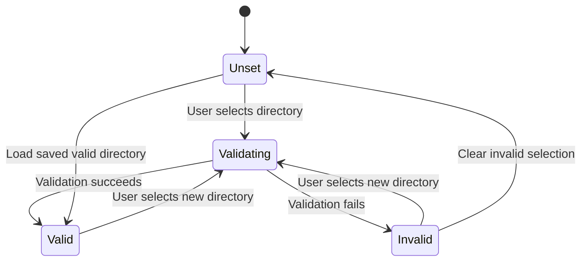

# Working Directory Bar

<cite>
**Referenced Files in This Document**   
- [WorkingDirectoryBar.tsx](file://cli-ui/src/components/WorkingDirectoryBar.tsx)
- [tauri.ts](file://cli-ui/src/utils/tauri.ts)
- [config.rs](file://cli-ui/src-tauri/src/commands/config.rs)
</cite>

## Table of Contents
1. [Introduction](#introduction)
2. [Core Functionality](#core-functionality)
3. [Component Architecture](#component-architecture)
4. [State Management and Lifecycle](#state-management-and-lifecycle)
5. [Integration with Tauri Plugins](#integration-with-tauri-plugins)
6. [Path Validation Process](#path-validation-process)
7. [User Interaction Flow](#user-interaction-flow)
8. [Error Handling and UI Feedback](#error-handling-and-ui-feedback)
9. [Initialization Strategy](#initialization-strategy)
10. [Common Issues and Solutions](#common-issues-and-solutions)
11. [Enhancement Opportunities](#enhancement-opportunities)

## Introduction
The Working Directory Bar is a critical UI component in the Duck Client application that provides users with visual feedback and control over the current project working directory. It serves as the primary interface for directory selection, validation, and status monitoring, ensuring that the application operates within a valid and accessible workspace. The component integrates tightly with Tauri's backend system through various plugins to interact with the file system, manage configuration, and display system dialogs.

**Section sources**
- [WorkingDirectoryBar.tsx](file://cli-ui/src/components/WorkingDirectoryBar.tsx#L1-L197)

## Core Functionality
The Working Directory Bar component provides several key functions:
- **Directory Selection**: Allows users to choose a working directory through a native file dialog
- **Path Visualization**: Displays the current directory path with truncation for long paths
- **Validation Status**: Shows real-time validation status with appropriate icons and colors
- **Configuration Persistence**: Saves and retrieves the selected directory to/from application configuration
- **State Synchronization**: Communicates directory changes to parent components via callback

The component accepts two primary props:
- **onDirectoryChange**: Callback function triggered when directory selection or validation changes
- **workingDirectory**: Optional prop to set the initial working directory from external state



**Diagram sources**
- [WorkingDirectoryBar.tsx](file://cli-ui/src/components/WorkingDirectoryBar.tsx#L1-L197)

**Section sources**
- [WorkingDirectoryBar.tsx](file://cli-ui/src/components/WorkingDirectoryBar.tsx#L1-L197)

## Component Architecture
The Working Directory Bar follows a React functional component pattern with hooks for state management and side effects. It leverages several Tauri plugin wrappers to interact with the system:

```mermaid
classDiagram
class WorkingDirectoryBar {
+currentDirectory : string | null
+validationState : 'validating' | 'valid' | 'invalid' | 'none'
+validationError : string
+isAppInitialized : boolean
+loadSavedDirectory() : Promise~void~
+validateDirectory(path : string) : Promise~void~
+selectDirectory() : Promise~void~
+getStatusIcon() : JSX.Element
+getStatusText() : string
+getStatusColor() : string
}
class DialogManager {
+selectDirectory() : Promise~string | null~
+showMessage(title, content, kind) : Promise~void~
}
class FileSystemManager {
+validateDirectory(path : string) : Promise~{valid : boolean, error? : string}~
}
class ConfigManager {
+getWorkingDirectory() : Promise~string | null~
+setWorkingDirectory(path : string) : Promise~boolean~
}
WorkingDirectoryBar --> DialogManager : "uses"
WorkingDirectoryBar --> FileSystemManager : "uses"
WorkingDirectoryBar --> ConfigManager : "uses"
```

**Diagram sources**
- [WorkingDirectoryBar.tsx](file://cli-ui/src/components/WorkingDirectoryBar.tsx#L1-L197)
- [tauri.ts](file://cli-ui/src/utils/tauri.ts#L1-L920)

**Section sources**
- [WorkingDirectoryBar.tsx](file://cli-ui/src/components/WorkingDirectoryBar.tsx#L1-L197)
- [tauri.ts](file://cli-ui/src/utils/tauri.ts#L1-L920)

## State Management and Lifecycle
The component manages its state through React's useState and useEffect hooks, handling multiple lifecycle scenarios:

- **State Variables**:
  - **currentDirectory**: Tracks the currently selected directory path
  - **validationState**: Represents the current validation status (validating, valid, invalid, none)
  - **validationError**: Stores error messages from failed validation attempts
  - **isAppInitialized**: Prevents duplicate initialization logic

- **Lifecycle Effects**:
  - **workingDirectory Prop Listener**: Responds to external changes in the working directory
  - **Application Initialization Check**: Ensures proper initialization sequence to avoid conflicts



**Diagram sources**
- [WorkingDirectoryBar.tsx](file://cli-ui/src/components/WorkingDirectoryBar.tsx#L1-L197)

**Section sources**
- [WorkingDirectoryBar.tsx](file://cli-ui/src/components/WorkingDirectoryBar.tsx#L1-L197)

## Integration with Tauri Plugins
The component relies on three key utility classes from the tauri.ts file, which serve as wrappers for Tauri's native plugins:

- **DialogManager**: Interfaces with @tauri-apps/plugin-dialog for native system dialogs
- **FileSystemManager**: Wraps @tauri-apps/plugin-fs for file system operations and validation
- **ConfigManager**: Manages application configuration persistence using Tauri's invoke system

These managers abstract the complexity of direct Tauri API calls, providing a clean interface for the frontend component to interact with the backend.

```typescript
// Example of Tauri integration in WorkingDirectoryBar
const selectDirectory = async () => {
  const selectedPath = await DialogManager.selectDirectory();
  if (selectedPath) {
    setCurrentDirectory(selectedPath);
    await ConfigManager.setWorkingDirectory(selectedPath);
    await validateDirectory(selectedPath);
  }
};
```

**Section sources**
- [WorkingDirectoryBar.tsx](file://cli-ui/src/components/WorkingDirectoryBar.tsx#L1-L197)
- [tauri.ts](file://cli-ui/src/utils/tauri.ts#L1-L920)

## Path Validation Process
The path validation process involves multiple layers of verification to ensure the selected directory is suitable for use:

1. **Frontend Initiation**: The WorkingDirectoryBar component calls `FileSystemManager.validateDirectory()`
2. **Backend Execution**: This triggers a Tauri command `validate_working_directory` in Rust
3. **Comprehensive Checks**: The backend performs several validation steps:
   - Directory existence check
   - Path type verification (ensuring it's a directory, not a file)
   - Read permission testing
   - Write permission testing (via temporary file creation)
   - Empty directory check



**Diagram sources**
- [config.rs](file://cli-ui/src-tauri/src/commands/config.rs#L1-L201)
- [WorkingDirectoryBar.tsx](file://cli-ui/src/components/WorkingDirectoryBar.tsx#L1-L197)

**Section sources**
- [config.rs](file://cli-ui/src-tauri/src/commands/config.rs#L1-L201)
- [WorkingDirectoryBar.tsx](file://cli-ui/src/components/WorkingDirectoryBar.tsx#L1-L197)

## User Interaction Flow
The user interaction flow for selecting and validating a working directory follows a clear sequence:

1. User clicks the "Select Directory" button
2. Native system dialog opens for directory selection
3. User selects a directory and confirms
4. Selected path is stored in component state
5. Path is saved to application configuration
6. Directory validation begins immediately
7. UI updates to show validation status (validating → valid/invalid)
8. Parent components are notified of the directory change

The component provides immediate visual feedback at each stage, using different icons and colors to indicate the current state:
- **Yellow triangle**: Unset or uninitialized state
- **Blue spinner**: Validation in progress
- **Green check**: Valid directory
- **Red X**: Invalid directory with error details

**Section sources**
- [WorkingDirectoryBar.tsx](file://cli-ui/src/components/WorkingDirectoryBar.tsx#L1-L197)

## Error Handling and UI Feedback
The component implements comprehensive error handling to provide users with meaningful feedback:

- **Validation Errors**: Displayed both in the status badge and in an expanded error panel
- **Selection Failures**: Caught and logged, with user notification via message dialog
- **Configuration Errors**: Handled gracefully, allowing the application to continue with defaults

Error states trigger both visual indicators and detailed messages to help users understand and resolve issues:



**Diagram sources**
- [WorkingDirectoryBar.tsx](file://cli-ui/src/components/WorkingDirectoryBar.tsx#L1-L197)

**Section sources**
- [WorkingDirectoryBar.tsx](file://cli-ui/src/components/WorkingDirectoryBar.tsx#L1-L197)

## Initialization Strategy
The component implements a sophisticated initialization strategy to handle different startup scenarios:

- **Primary Initialization**: When App.tsx initializes first, WorkingDirectoryBar defers to it
- **Fallback Initialization**: If App.tsx hasn't initialized, WorkingDirectoryBar handles initialization itself
- **Saved Configuration**: Attempts to load the previously saved working directory
- **Race Condition Prevention**: Uses window flags and timeouts to coordinate initialization

This dual-path initialization ensures the component works correctly regardless of the application's startup sequence, preventing duplicate operations and state conflicts.

**Section sources**
- [WorkingDirectoryBar.tsx](file://cli-ui/src/components/WorkingDirectoryBar.tsx#L1-L197)

## Common Issues and Solutions
Several common issues may arise with the Working Directory Bar, along with their solutions:

- **Path Resolution Errors**: Occur when symbolic links or network paths are used
  - *Solution*: Implement path normalization and provide clear error messages

- **UI Flickering During Rapid Changes**: Can happen when multiple state updates occur in quick succession
  - *Solution*: Implement debouncing or state batching to smooth transitions

- **Permission-Related Failures**: Common on restricted systems or network drives
  - *Solution*: Provide specific guidance on required permissions and suggest alternative locations

- **Race Conditions During Startup**: Possible when multiple components try to initialize simultaneously
  - *Solution*: Use coordination flags and initialization checks as implemented

- **Validation Timeouts**: Long-running validation on slow storage systems
  - *Solution*: Implement timeout mechanisms and progress indicators

**Section sources**
- [WorkingDirectoryBar.tsx](file://cli-ui/src/components/WorkingDirectoryBar.tsx#L1-L197)
- [config.rs](file://cli-ui/src-tauri/src/commands/config.rs#L1-L201)

## Enhancement Opportunities
Several enhancements could improve the Working Directory Bar's functionality:

- **Breadcrumb Navigation**: Implement clickable path segments for quick navigation within the directory hierarchy
- **Recent Directories**: Add a dropdown to quickly access recently used directories
- **Quick Access Shortcuts**: Include buttons for common locations (Desktop, Documents, etc.)
- **Path Search**: Add search functionality for quickly finding directories
- **Directory Previews**: Show basic information about the selected directory (size, file count)
- **Multiple Directory Support**: Allow users to manage multiple project directories
- **Drag and Drop**: Enable drag-and-drop directory selection from the file system

These enhancements would improve usability and make directory management more efficient for users working with multiple projects.

**Section sources**
- [WorkingDirectoryBar.tsx](file://cli-ui/src/components/WorkingDirectoryBar.tsx#L1-L197)