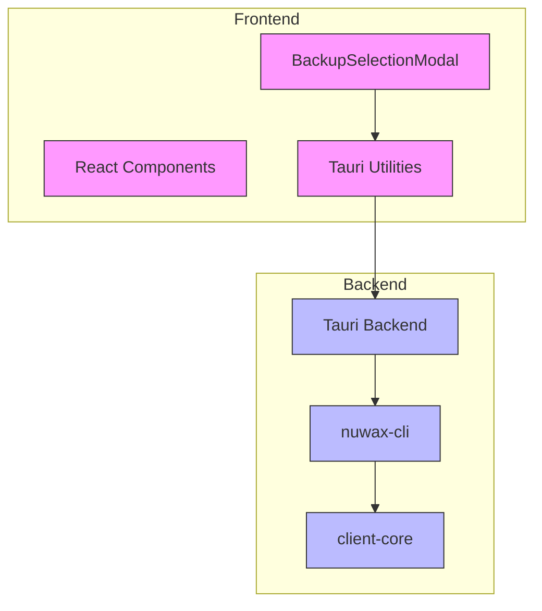
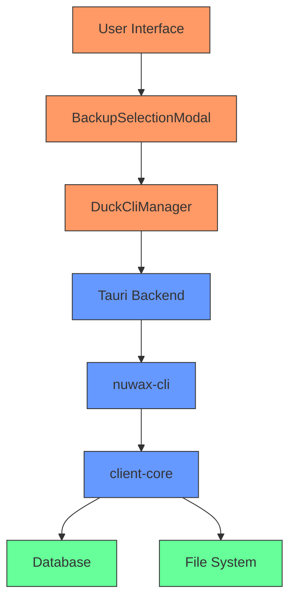
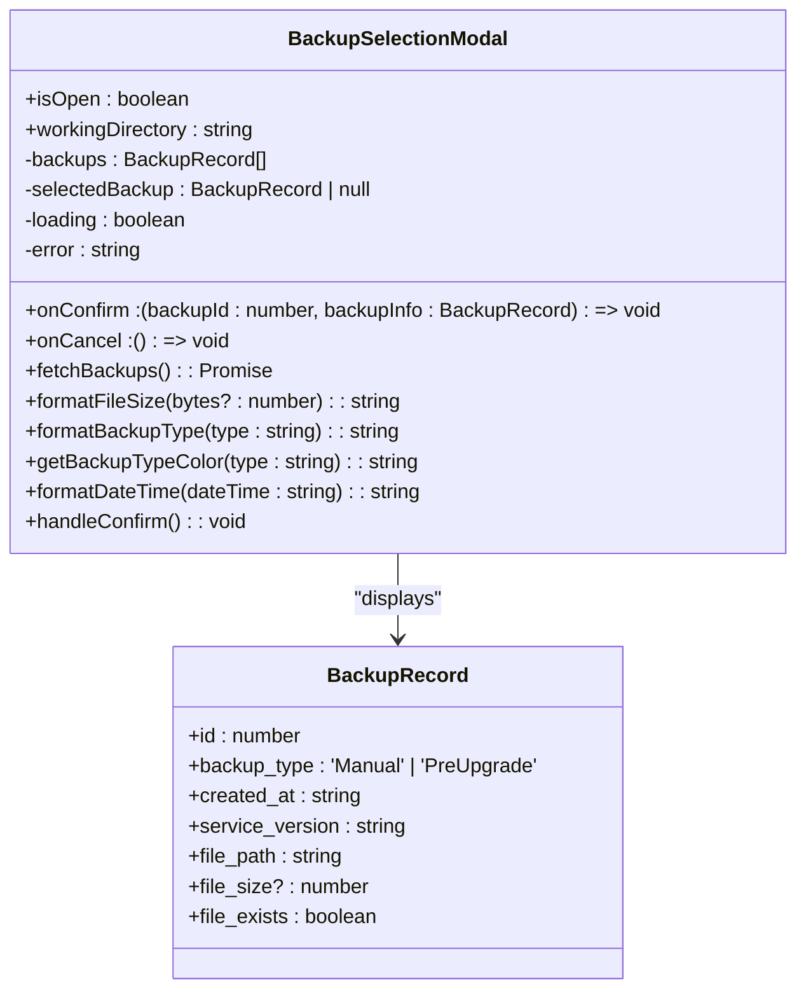
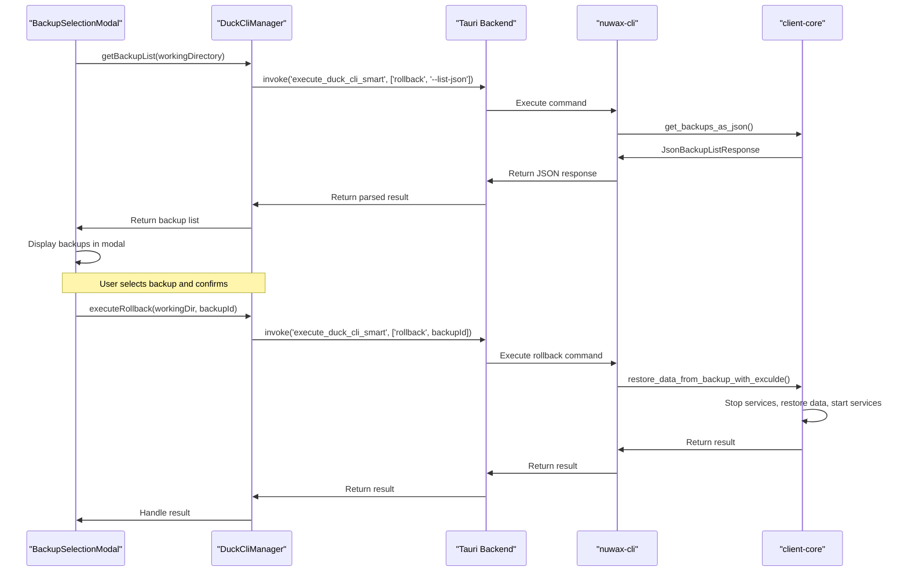
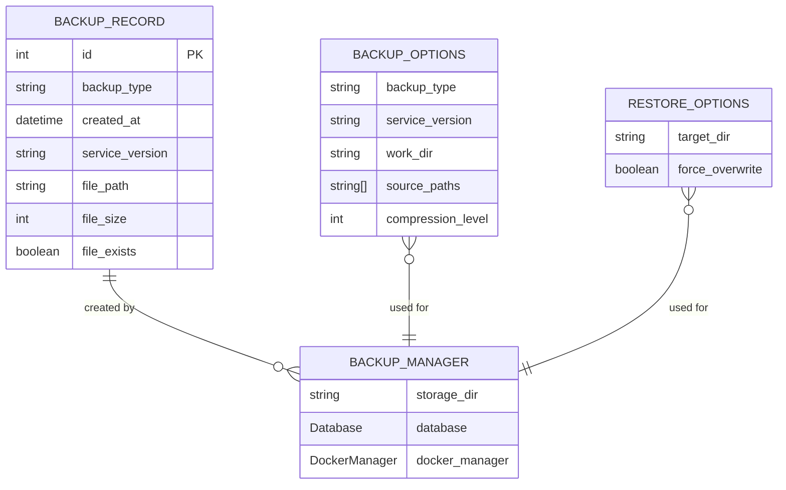
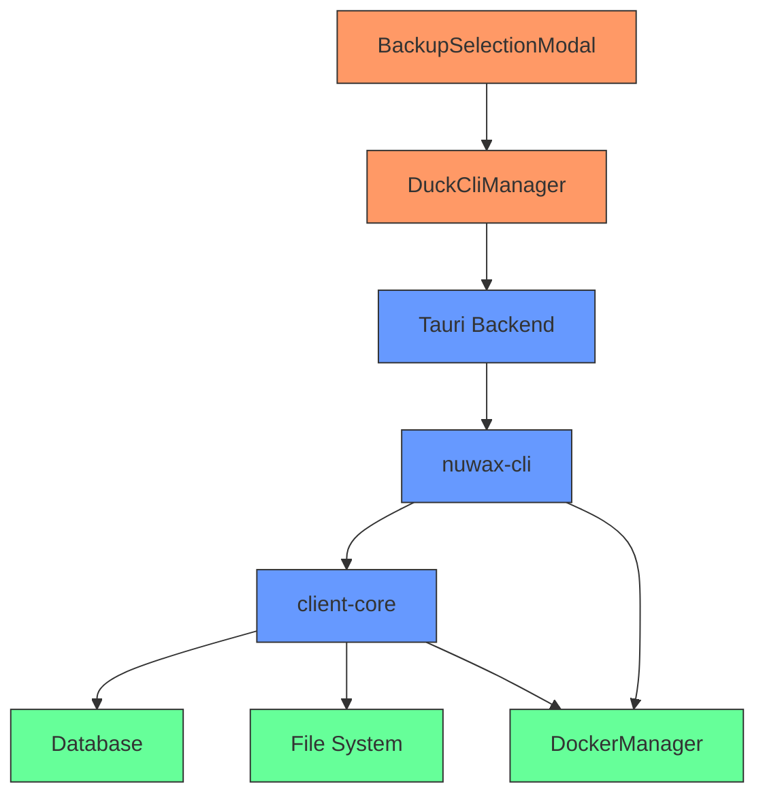

# GUI Backup Management

<cite>
**Referenced Files in This Document**   
- [BackupSelectionModal.tsx](file://cli-ui/src/components/BackupSelectionModal.tsx)
- [tauri.ts](file://cli-ui/src/utils/tauri.ts)
- [backup.rs](file://client-core/src/backup.rs)
- [backup.rs](file://nuwax-cli/src/commands/backup.rs)
- [auto_backup.rs](file://nuwax-cli/src/commands/auto_backup.rs)
</cite>

## Table of Contents
1. [Introduction](#introduction)
2. [Project Structure](#project-structure)
3. [Core Components](#core-components)
4. [Architecture Overview](#architecture-overview)
5. [Detailed Component Analysis](#detailed-component-analysis)
6. [Dependency Analysis](#dependency-analysis)
7. [Performance Considerations](#performance-considerations)
8. [Troubleshooting Guide](#troubleshooting-guide)
9. [Conclusion](#conclusion)

## Introduction
This document provides a comprehensive analysis of the backup creation and selection workflow in the Duck Client GUI application. It details how users can select backup strategies before upgrades, including full, incremental, or no backup options. The integration between the modal UI and the underlying backup command execution is thoroughly documented, including parameter passing, confirmation handling, and post-backup state updates. The domain model for backup configurations and their validation rules are explained, along with common issues such as insufficient disk space detection, backup naming conflicts, and handling of corrupted backup archives. Best practices for backup retention and performance impact mitigation during service operation are also provided.

## Project Structure
The Duck Client repository follows a modular architecture with distinct components for the frontend UI, backend logic, and shared utilities. The project is organized into several key directories:

- **cli-ui**: Contains the React frontend application with components, utilities, and configuration
- **client-core**: Houses the core business logic, database models, and backup functionality
- **nuwax-cli**: Implements the command-line interface with backup and upgrade commands
- **src-tauri**: Contains the Tauri backend that bridges the frontend and backend systems

The structure follows a clear separation of concerns, with the frontend handling user interaction, the backend managing business logic, and the Tauri layer facilitating communication between them.



**Diagram sources**
- [BackupSelectionModal.tsx](file://cli-ui/src/components/BackupSelectionModal.tsx)
- [tauri.ts](file://cli-ui/src/utils/tauri.ts)
- [backup.rs](file://nuwax-cli/src/commands/backup.rs)

**Section sources**
- [BackupSelectionModal.tsx](file://cli-ui/src/components/BackupSelectionModal.tsx)
- [tauri.ts](file://cli-ui/src/utils/tauri.ts)

## Core Components
The backup management system consists of several core components that work together to provide a seamless user experience. The primary components include the BackupSelectionModal for user interaction, the DuckCliManager for command execution, and the BackupManager for actual backup operations.

The BackupSelectionModal enables users to choose from available backups before performing a restore operation. It displays key information such as backup type, creation time, service version, and file size. The DuckCliManager serves as the interface between the frontend and backend, handling the execution of backup-related commands. The BackupManager implements the core backup functionality, including creation, restoration, and management of backup records.

**Section sources**
- [BackupSelectionModal.tsx](file://cli-ui/src/components/BackupSelectionModal.tsx)
- [tauri.ts](file://cli-ui/src/utils/tauri.ts)
- [backup.rs](file://client-core/src/backup.rs)

## Architecture Overview
The backup management architecture follows a layered approach with clear separation between presentation, business logic, and data access layers. The frontend React components handle user interaction and display, while the Tauri backend facilitates communication with the Rust-based command-line interface. The client-core library provides the domain models and business logic for backup operations.



**Diagram sources**
- [BackupSelectionModal.tsx](file://cli-ui/src/components/BackupSelectionModal.tsx)
- [tauri.ts](file://cli-ui/src/utils/tauri.ts)
- [backup.rs](file://client-core/src/backup.rs)

## Detailed Component Analysis

### Backup Selection Modal Analysis
The BackupSelectionModal component provides a user-friendly interface for selecting backups. It fetches the list of available backups from the backend and displays them in a scrollable list with detailed information.



**Diagram sources**
- [BackupSelectionModal.tsx](file://cli-ui/src/components/BackupSelectionModal.tsx#L1-L303)

**Section sources**
- [BackupSelectionModal.tsx](file://cli-ui/src/components/BackupSelectionModal.tsx#L1-L303)

### Backup Command Execution Flow
The backup command execution follows a well-defined sequence from the UI to the backend and back. When a user interacts with the backup system, the request flows through multiple layers before reaching the actual backup implementation.



**Diagram sources**
- [BackupSelectionModal.tsx](file://cli-ui/src/components/BackupSelectionModal.tsx#L1-L303)
- [tauri.ts](file://cli-ui/src/utils/tauri.ts#L1-L919)
- [backup.rs](file://nuwax-cli/src/commands/backup.rs#L1-L1033)

**Section sources**
- [BackupSelectionModal.tsx](file://cli-ui/src/components/BackupSelectionModal.tsx#L1-L303)
- [tauri.ts](file://cli-ui/src/utils/tauri.ts#L1-L919)
- [backup.rs](file://nuwax-cli/src/commands/backup.rs#L1-L1033)

### Backup Domain Model
The backup system implements a comprehensive domain model that defines the structure and behavior of backup operations. This model includes entities for backup records, backup options, and restore operations.



**Diagram sources**
- [backup.rs](file://client-core/src/backup.rs#L1-L624)

**Section sources**
- [backup.rs](file://client-core/src/backup.rs#L1-L624)

## Dependency Analysis
The backup management system has a well-defined dependency structure that ensures loose coupling between components. The frontend depends on the Tauri utilities for communication with the backend, while the backend components depend on shared libraries for common functionality.



**Diagram sources**
- [BackupSelectionModal.tsx](file://cli-ui/src/components/BackupSelectionModal.tsx)
- [tauri.ts](file://cli-ui/src/utils/tauri.ts)
- [backup.rs](file://client-core/src/backup.rs)
- [backup.rs](file://nuwax-cli/src/commands/backup.rs)

**Section sources**
- [BackupSelectionModal.tsx](file://cli-ui/src/components/BackupSelectionModal.tsx)
- [tauri.ts](file://cli-ui/src/utils/tauri.ts)
- [backup.rs](file://client-core/src/backup.rs)
- [backup.rs](file://nuwax-cli/src/commands/backup.rs)

## Performance Considerations
The backup system implements several performance optimizations to ensure efficient operation:

1. **Background Processing**: Backup and restore operations are executed in background threads using `tokio::task::spawn_blocking` to prevent blocking the main async runtime.

2. **Streaming Operations**: The system uses streaming compression and decompression with `flate2` and `tar` libraries to minimize memory usage during backup operations.

3. **Efficient File Operations**: The backup process uses `WalkDir` for efficient directory traversal and only processes files that need to be backed up.

4. **Size Estimation**: The system provides an `estimate_backup_size` function that calculates the expected backup size before creation, helping users plan for adequate disk space.

5. **Selective Restoration**: The restore functionality supports selective restoration of specific directories, reducing the time and resources needed for partial restores.

**Section sources**
- [backup.rs](file://client-core/src/backup.rs#L1-L624)

## Troubleshooting Guide
This section addresses common issues encountered with the backup system and provides solutions.

### Insufficient Disk Space
When disk space is insufficient for backup creation, the system will fail with a file system error. To resolve:
1. Check available disk space in the backup directory
2. Clean up old backups using the `nuwax-cli backup list` and `nuwax-cli rollback <id>` commands
3. Configure a different backup directory with more space

### Backup Naming Conflicts
The system uses a timestamp-based naming convention to prevent conflicts:
```
backup_{type}_v{version}_{timestamp}.tar.gz
```
This ensures each backup has a unique name based on type, version, and creation time.

### Corrupted Backup Archives
If a backup archive becomes corrupted:
1. Verify the file exists and has the expected size
2. Check file permissions and ownership
3. Attempt to manually extract the archive using standard tools
4. If corruption is confirmed, create a new backup

### Service State Management
The backup system requires services to be stopped before creating a backup to ensure data consistency. If services are running:
1. The system will detect running persistent services
2. Display a warning message indicating which services need to be stopped
3. Prevent backup creation until services are stopped

**Section sources**
- [backup.rs](file://client-core/src/backup.rs#L1-L624)
- [backup.rs](file://nuwax-cli/src/commands/backup.rs#L1-L1033)

## Conclusion
The Duck Client backup management system provides a robust and user-friendly solution for creating and restoring backups. The architecture follows a clean separation of concerns with well-defined interfaces between components. The system handles various backup scenarios, including manual backups and pre-upgrade backups, with proper validation and error handling.

Key strengths of the system include:
- Comprehensive domain model for backup operations
- Efficient streaming backup and restore operations
- Clear separation between UI, business logic, and data access
- Robust error handling and user feedback
- Support for selective restoration of specific directories

The system could be enhanced with additional features such as:
- Automated backup retention policies
- Compression level configuration
- Backup encryption
- Cloud storage integration
- Progress reporting for long-running operations

Overall, the backup management system provides a solid foundation for data protection and recovery in the Duck Client application.