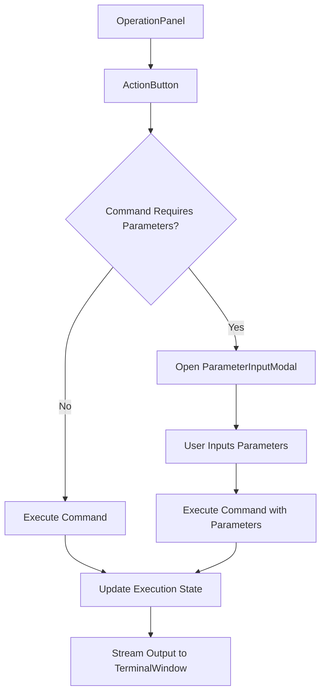
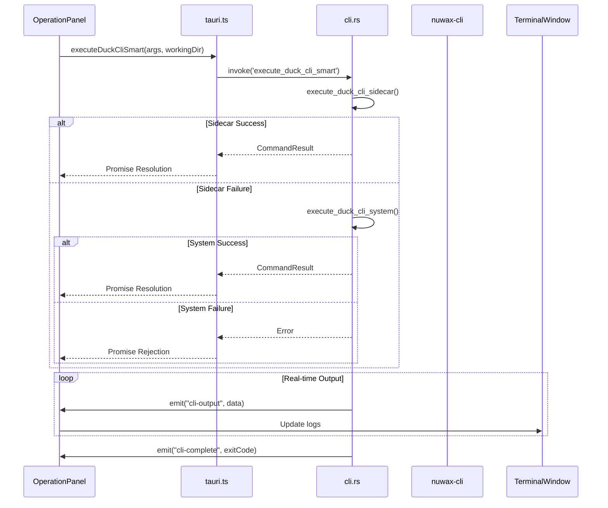
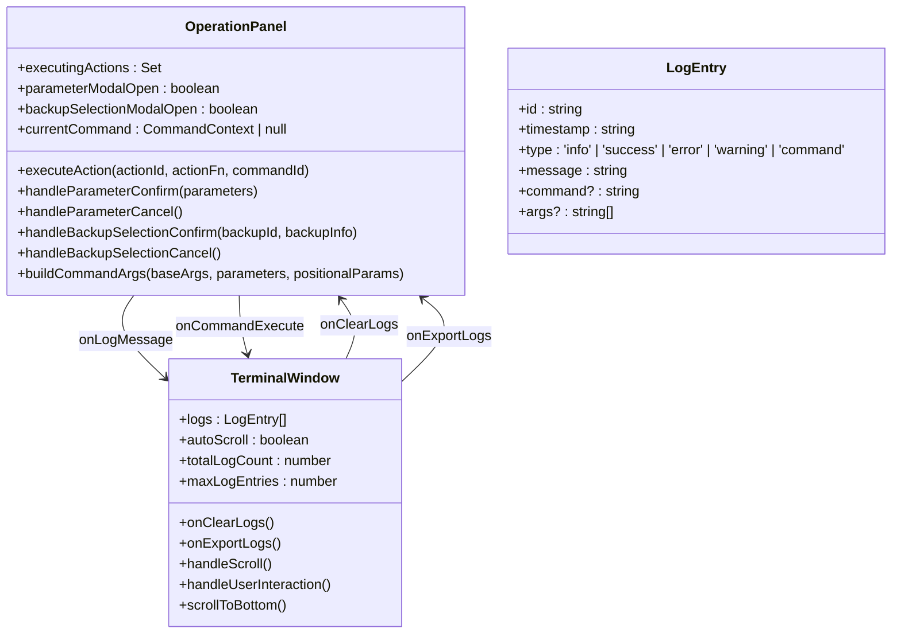
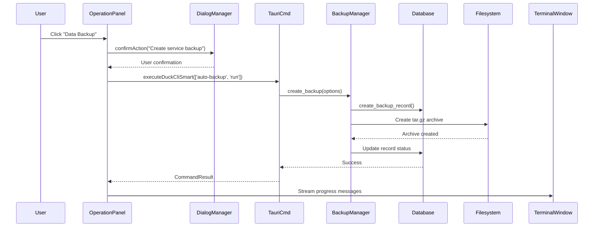
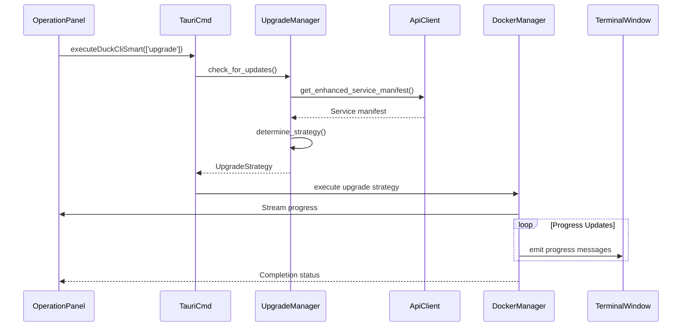
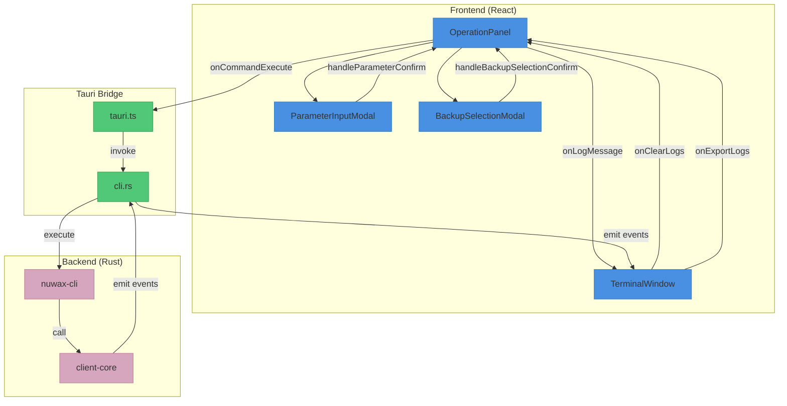

# GUI Operations Workflow

<cite>
**Referenced Files in This Document**   
- [OperationPanel.tsx](file://cli-ui/src/components/OperationPanel.tsx)
- [TerminalWindow.tsx](file://cli-ui/src/components/TerminalWindow.tsx)
- [tauri.ts](file://cli-ui/src/utils/tauri.ts)
- [cli.rs](file://cli-ui/src-tauri/src/commands/cli.rs)
- [backup.rs](file://client-core/src/backup.rs)
- [upgrade.rs](file://client-core/src/upgrade.rs)
</cite>

## Table of Contents
1. [Introduction](#introduction)
2. [Core Components Overview](#core-components-overview)
3. [Operation Panel Implementation](#operation-panel-implementation)
4. [Command Execution Flow](#command-execution-flow)
5. [Real-time Output Streaming](#real-time-output-streaming)
6. [State Management and Synchronization](#state-management-and-synchronization)
7. [Backup and Rollback Workflows](#backup-and-rollback-workflows)
8. [Upgrade Execution Process](#upgrade-execution-process)
9. [Error Handling and Common Issues](#error-handling-and-common-issues)
10. [Architecture Diagram](#architecture-diagram)

## Introduction
The GUI Operations Workflow document provides a comprehensive analysis of the operational workflows enabled by the Duck Client application's graphical interface. This document details the implementation of service initialization, upgrade execution, backup management, and status monitoring through the frontend components and their integration with backend Tauri commands. The analysis covers the invocation relationships between user interface actions and backend functionality, data serialization mechanisms, error propagation patterns, and progress tracking systems. Special attention is given to the domain model for operation state management and its synchronization across various components in the application.

## Core Components Overview
The Duck Client application implements a modern desktop application architecture using Tauri for bridging a React-based frontend with Rust-based backend functionality. The core components involved in the GUI operations workflow include the OperationPanel for user interaction, TerminalWindow for output display, tauri.ts for frontend-backend communication, and various backend Rust modules for business logic implementation.

**Section sources**
- [OperationPanel.tsx](file://cli-ui/src/components/OperationPanel.tsx)
- [TerminalWindow.tsx](file://cli-ui/src/components/TerminalWindow.tsx)
- [tauri.ts](file://cli-ui/src/utils/tauri.ts)

## Operation Panel Implementation
The OperationPanel component serves as the primary interface for executing various operations on the Duck Client application. It provides a grid of action buttons that trigger different workflows such as service deployment, start/stop operations, backups, and upgrades.



The component maintains several state variables to track the execution status of operations:
- **executingActions**: A Set that tracks currently executing actions by their IDs
- **parameterModalOpen**: Boolean state for showing/hiding parameter input modal
- **backupSelectionModalOpen**: Boolean state for showing/hiding backup selection modal
- **currentCommand**: Stores command configuration when awaiting parameter input

When a user clicks an action button, the `executeAction` function is called, which first checks if the working directory is valid. If parameters are required, it opens the ParameterInputModal; otherwise, it directly executes the command through the `onCommandExecute` callback.

**Section sources**
- [OperationPanel.tsx](file://cli-ui/src/components/OperationPanel.tsx#L45-L82)

## Command Execution Flow
The command execution flow follows a well-defined pattern that connects the frontend React components with the backend Rust functionality through Tauri's command system. This flow ensures proper error handling, progress tracking, and state synchronization.



The execution begins when a button click in the OperationPanel triggers the `executeAction` function, which calls the `onCommandExecute` callback with the appropriate command and arguments. This callback is implemented in the tauri.ts utility file, which uses Tauri's invoke mechanism to call Rust commands defined in cli.rs.

**Diagram sources**
- [OperationPanel.tsx](file://cli-ui/src/components/OperationPanel.tsx)
- [tauri.ts](file://cli-ui/src/utils/tauri.ts)
- [cli.rs](file://cli-ui/src-tauri/src/commands/cli.rs)

**Section sources**
- [OperationPanel.tsx](file://cli-ui/src/components/OperationPanel.tsx)
- [tauri.ts](file://cli-ui/src/utils/tauri.ts)
- [cli.rs](file://cli-ui/src-tauri/src/commands/cli.rs)

## Real-time Output Streaming
The TerminalWindow component is responsible for displaying real-time command output and progress information to the user. It receives log entries from various sources and renders them in a terminal-like interface with appropriate styling based on message type.

```mermaid
flowchart TD
A[Tauri Command Execution] --> B{Output Type}
B --> |stdout| C[emit "cli-output" event]
B --> |stderr| D[emit "cli-error" event]
C --> E[TerminalWindow Event Listener]
D --> E
E --> F[Create LogEntry Object]
F --> G[Add to logs array]
G --> H{Auto-scroll enabled?}
H --> |Yes| I[Scroll to bottom]
H --> |No| J[Preserve scroll position]
I --> K[Display in UI]
J --> K
```

The TerminalWindow implements several key features for effective output management:
- **Auto-scrolling**: Automatically scrolls to the bottom when new output arrives, with user override capability
- **Memory management**: Limits the number of stored log entries to prevent memory issues
- **Visual indicators**: Uses different colors and icons for different message types (info, success, error, warning)
- **User controls**: Provides buttons for clearing logs, exporting logs, and toggling auto-scroll

The component uses React refs to track user interaction with the scroll area, allowing it to distinguish between automatic scrolling and manual user scrolling. When the user manually scrolls away from the bottom, auto-scrolling is temporarily disabled until the user explicitly scrolls back to the bottom.

**Section sources**
- [TerminalWindow.tsx](file://cli-ui/src/components/TerminalWindow.tsx)

## State Management and Synchronization
The application implements a robust state management system that synchronizes operation states across multiple components. The domain model for operation state includes loading, success, error, and warning states, which are propagated from the backend to the frontend through a well-defined event system.



The state synchronization works as follows:
1. When an operation starts, the OperationPanel adds the action ID to the `executingActions` Set, which triggers a loading state in the UI (spinner icon)
2. As the command executes, output is streamed to the TerminalWindow through event emissions
3. The TerminalWindow updates its logs array and automatically scrolls to show new output
4. When the command completes, the OperationPanel removes the action ID from `executingActions`, ending the loading state
5. Any errors are propagated through the `onLogMessage` callback with 'error' type

This pattern ensures that the UI accurately reflects the current state of operations and provides immediate feedback to users.

**Diagram sources**
- [OperationPanel.tsx](file://cli-ui/src/components/OperationPanel.tsx)
- [TerminalWindow.tsx](file://cli-ui/src/components/TerminalWindow.tsx)

**Section sources**
- [OperationPanel.tsx](file://cli-ui/src/components/OperationPanel.tsx)
- [TerminalWindow.tsx](file://cli-ui/src/components/TerminalWindow.tsx)

## Backup and Rollback Workflows
The backup and rollback workflows are critical operations that ensure data safety during service upgrades and maintenance. The implementation involves coordination between the frontend components and backend services to provide a seamless user experience.

### Backup Process
When a user initiates a backup through the "Data Backup" button in the OperationPanel, the following sequence occurs:



The backup process automatically stops the Docker service, creates a compressed archive of the service data, and then restarts the service. The backup metadata is stored in the application database for future reference.

### Rollback Process
The rollback process allows users to restore their service to a previous state using an existing backup:

```mermaid
flowchart TD
A[User Clicks "Data Rollback"] --> B[Open BackupSelectionModal]
B --> C[Fetch Available Backups]
C --> D[Display Backup List]
D --> E{User Selects Backup}
E --> |Cancel| F[Close Modal]
E --> |Confirm| G[Call handleBackupSelectionConfirm]
G --> H[Execute 'duck-cli rollback' command]
H --> I[Stop Docker Service]
I --> J[Extract Backup Archive]
J --> K[Start Docker Service]
K --> L[Update UI with Result]
```

The BackupSelectionModal component fetches available backup records from the database and displays them in a list, allowing the user to select which backup to restore. Once confirmed, the rollback command is executed with the selected backup ID.

**Section sources**
- [OperationPanel.tsx](file://cli-ui/src/components/OperationPanel.tsx)
- [backup.rs](file://client-core/src/backup.rs)

## Upgrade Execution Process
The upgrade execution process enables users to update their Docker services to new versions through the GUI interface. This process involves checking for updates, downloading new service files, and applying the upgrade with appropriate safeguards.



The UpgradeManager in the client-core crate is responsible for determining the appropriate upgrade strategy based on the current service version and available updates. It can handle both full and incremental upgrades, with options to skip backups or force re-downloads.

The OperationPanel's "Application Upgrade" button triggers the upgrade process by executing the 'upgrade' command through the Tauri bridge. The process includes automatic backup creation (unless skipped), service stopping, file downloading, and service restart, with all progress streamed to the TerminalWindow for user feedback.

**Section sources**
- [OperationPanel.tsx](file://cli-ui/src/components/OperationPanel.tsx)
- [upgrade.rs](file://client-core/src/upgrade.rs)

## Error Handling and Common Issues
The application implements comprehensive error handling strategies to address common issues that may occur during GUI operations. These strategies ensure robustness and provide meaningful feedback to users when problems arise.

### Command Timeout Handling
The application addresses command timeout issues through multiple mechanisms:
- **Tauri command timeouts**: The Tauri framework provides built-in timeout handling for command execution
- **Progress feedback**: Regular progress updates prevent the perception of hanging operations
- **User controls**: The interface allows users to monitor operation progress and understand that processing is ongoing

### Progress Bar Inaccuracies
Progress tracking in operations like upgrades and backups can be challenging due to the variable nature of these processes. The application addresses this by:
- **Event-based progress**: Using discrete events (e.g., "Downloading update", "Extracting files") rather than percentage-based progress when exact metrics are unavailable
- **Real-time output**: Streaming actual command output to provide transparency about what is happening
- **Clear status messages**: Using descriptive messages that indicate the current operation phase

### Race Conditions During Concurrent Operations
To prevent race conditions when multiple operations are attempted simultaneously:
- **Execution state tracking**: The `executingActions` Set in OperationPanel prevents multiple instances of the same operation
- **Process cleanup**: The `check_and_cleanup_duck_processes` command ensures no conflicting processes are running
- **Database locking detection**: The `check_database_lock` command prevents operations when the database is in use by another process

### Error Propagation
Errors are propagated through the system in a consistent manner:
1. Backend Rust code returns Result types with appropriate error information
2. Tauri commands convert these to JavaScript Error objects
3. The tauri.ts utility functions catch and re-throw errors with context
4. OperationPanel handles errors through try-catch blocks and displays them via `onLogMessage`
5. Users see error messages in the TerminalWindow with appropriate styling

This layered approach ensures that errors are not silently swallowed and that users receive meaningful information about what went wrong.

**Section sources**
- [OperationPanel.tsx](file://cli-ui/src/components/OperationPanel.tsx)
- [tauri.ts](file://cli-ui/src/utils/tauri.ts)
- [cli.rs](file://cli-ui/src-tauri/src/commands/cli.rs)

## Architecture Diagram
The following diagram illustrates the overall architecture of the GUI operations workflow, showing the relationships between frontend components, Tauri bridge, and backend services.



This architecture demonstrates the clean separation of concerns between the presentation layer (React components), the integration layer (Tauri bridge), and the business logic layer (Rust backend). The unidirectional data flow ensures predictable state changes and makes the system easier to debug and maintain.

**Diagram sources**
- [OperationPanel.tsx](file://cli-ui/src/components/OperationPanel.tsx)
- [TerminalWindow.tsx](file://cli-ui/src/components/TerminalWindow.tsx)
- [tauri.ts](file://cli-ui/src/utils/tauri.ts)
- [cli.rs](file://cli-ui/src-tauri/src/commands/cli.rs)
- [backup.rs](file://client-core/src/backup.rs)
- [upgrade.rs](file://client-core/src/upgrade.rs)