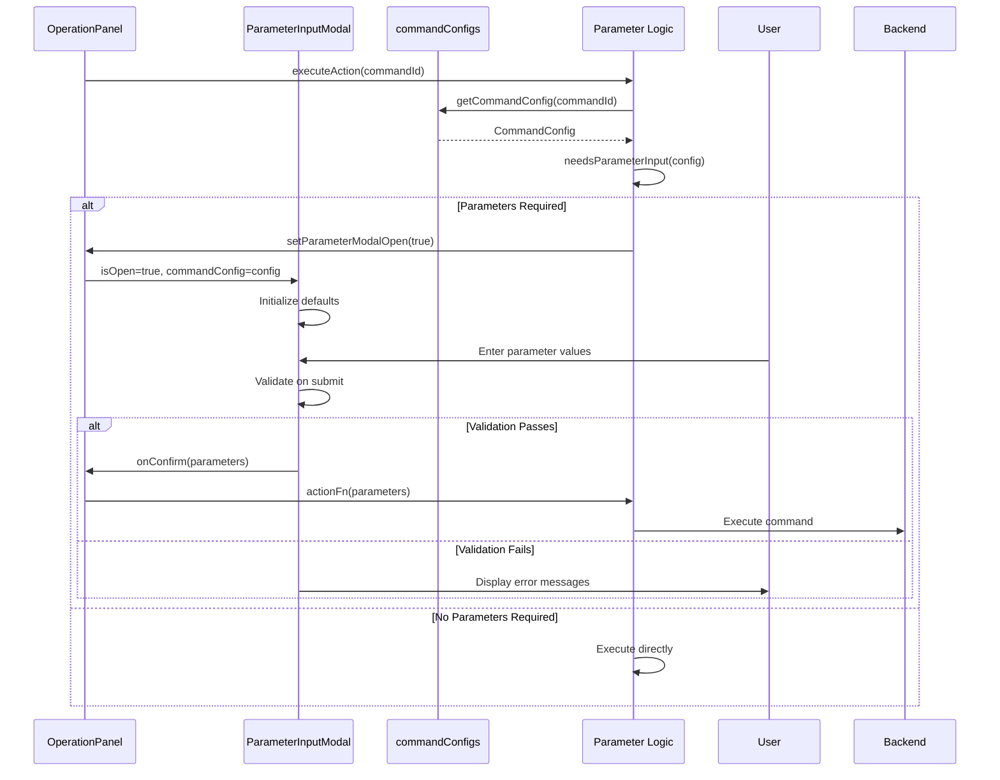
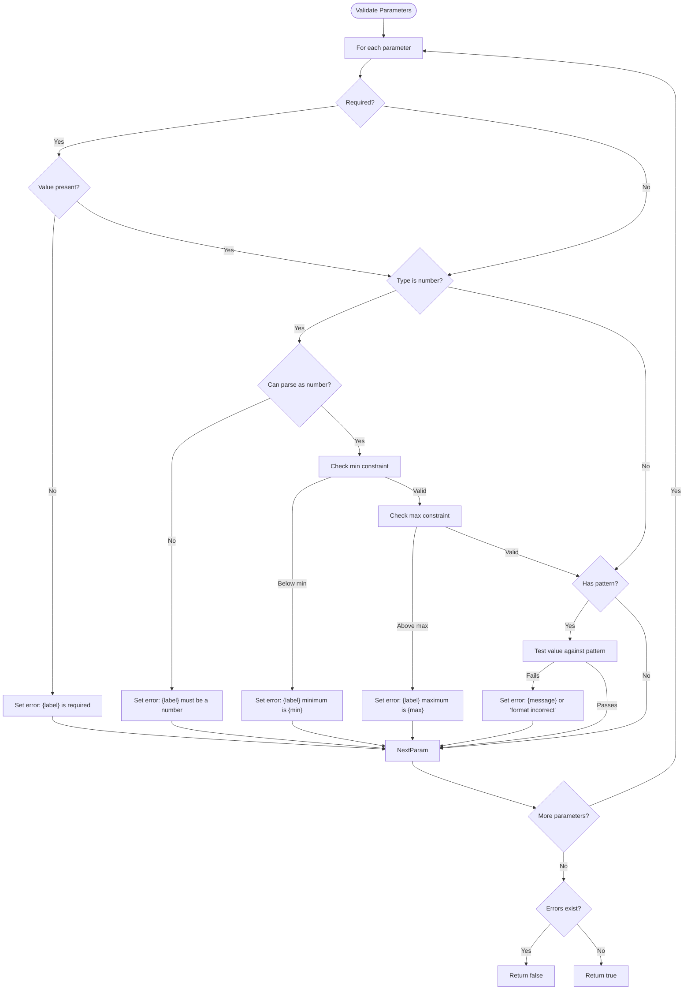
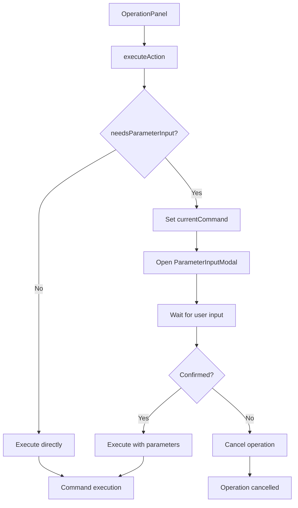

# GUI Parameter Configuration

<cite>
**Referenced Files in This Document**   
- [ParameterInputModal.tsx](file://cli-ui/src/components/ParameterInputModal.tsx)
- [commandConfigs.ts](file://cli-ui/src/config/commandConfigs.ts)
- [index.ts](file://cli-ui/src/types/index.ts)
- [OperationPanel.tsx](file://cli-ui/src/components/OperationPanel.tsx)
</cite>

## Table of Contents
1. [Introduction](#introduction)
2. [Core Data Model](#core-data-model)
3. [Parameter Input Workflow](#parameter-input-workflow)
4. [Form Generation and Rendering](#form-generation-and-rendering)
5. [Validation and Error Handling](#validation-and-error-handling)
6. [Command Parameter Serialization](#command-parameter-serialization)
7. [Integration with Operation Panel](#integration-with-operation-panel)
8. [Common Issues and Troubleshooting](#common-issues-and-troubleshooting)
9. [Extensibility and Best Practices](#extensibility-and-best-practices)

## Introduction
The GUI parameter configuration system enables dynamic collection of user-defined service parameters during operations such as service upgrade, initialization, or deployment. This document details the implementation of the `ParameterInputModal` component, which renders input forms based on command-specific schemas defined in configuration files. The system supports various input types including text, number, boolean, select, and multiselect, with comprehensive validation, default value handling, and type coercion. Parameters are serialized into command-line arguments and submitted to backend commands via Tauri's inter-process communication layer.

## Core Data Model
The parameter configuration system is built around a well-defined TypeScript type system that ensures type safety across the frontend. The data model consists of hierarchical interfaces that define command configurations, parameter definitions, and input results.

```mermaid
classDiagram
class CommandConfig {
+string id
+string name
+string description
+CommandParameter[] parameters
+string[] examples
}
class CommandParameter {
+string name
+string label
+string type
+boolean required
+any defaultValue
+string placeholder
+string description
+{value : string, label : string}[] options
+number min
+number max
+Validation validation
}
class Validation {
+string pattern
+string message
}
class ParameterInputResult {
+[key : string] : any
}
CommandConfig --> CommandParameter : "contains"
CommandParameter --> Validation : "has"
```

**Diagram sources**
- [index.ts](file://cli-ui/src/types/index.ts#L38-L86)

**Section sources**
- [index.ts](file://cli-ui/src/types/index.ts#L38-L86)

### Data Structure Definitions
:CommandConfig:
- **id**: Unique identifier for the command
- **name**: Display name shown in UI
- **description**: Brief explanation of command purpose
- **parameters**: Array of CommandParameter objects
- **examples**: Array of usage examples

:CommandParameter:
- **name**: Internal parameter name (used in CLI)
- **label**: User-facing label for form field
- **type**: One of 'text', 'number', 'boolean', 'select', 'multiselect'
- **required**: Whether parameter must be provided
- **defaultValue**: Default value when not specified
- **placeholder**: Input placeholder text
- **description**: Detailed explanation tooltip
- **options**: For select types, array of value/label pairs
- **min/max**: For number types, value constraints
- **validation**: Regex pattern and error message

:ParameterInputResult:
- Dynamic key-value object storing user input
- Keys correspond to parameter names
- Values are typed based on parameter configuration

## Parameter Input Workflow
The parameter input workflow begins when a user triggers a command that requires configuration. The system determines if parameters are needed by checking the command's configuration, displays the modal if necessary, collects user input, validates it, and submits the result to the executing function.



**Diagram sources**
- [OperationPanel.tsx](file://cli-ui/src/components/OperationPanel.tsx#L45-L503)
- [ParameterInputModal.tsx](file://cli-ui/src/components/ParameterInputModal.tsx#L0-L289)

**Section sources**
- [OperationPanel.tsx](file://cli-ui/src/components/OperationPanel.tsx#L45-L503)
- [ParameterInputModal.tsx](file://cli-ui/src/components/ParameterInputModal.tsx#L0-L289)

## Form Generation and Rendering
The `ParameterInputModal` dynamically generates form fields based on the `CommandConfig` provided. Each parameter type is rendered with appropriate UI controls, and the form automatically handles default values and state management.

### Supported Input Types
:text:
- Renders as `<input type="text">`
- Supports placeholder and validation
- Example: version numbers, file paths

:number:
- Renders as `<input type="number">`
- Enforces min/max constraints
- Validates numeric input
- Example: port numbers, timeout values

:boolean:
- Renders as checkbox
- Shows description as label
- Default value determines initial state
- Example: --force, --verbose flags

:select:
- Renders as `<select>` dropdown
- Displays options with labels
- Optional "please select" placeholder
- Example: time units (minutes/hours/days)

:multiselect:
- Renders as multiple checkboxes
- Allows selection of multiple values
- Stores values as string array
- Example: feature flags, module selections

```mermaid
flowchart TD
Start([Render Parameter]) --> TypeCheck{Parameter Type}
TypeCheck --> |text| RenderText["Render <input type='text'>"]
TypeCheck --> |number| RenderNumber["Render <input type='number'>"]
TypeCheck --> |boolean| RenderBoolean["Render checkbox"]
TypeCheck --> |select| RenderSelect["Render <select>"]
TypeCheck --> |multiselect| RenderMulti["Render checkbox group"]
TypeCheck --> |unknown| RenderNull["Return null"]
RenderText --> End
RenderNumber --> End
RenderBoolean --> End
RenderSelect --> End
RenderMulti --> End
RenderNull --> End
```



**Diagram sources**
- [ParameterInputModal.tsx](file://cli-ui/src/components/ParameterInputModal.tsx#L100-L200)

**Section sources**
- [ParameterInputModal.tsx](file://cli-ui/src/components/ParameterInputModal.tsx#L100-L200)

## Validation and Error Handling
The system implements client-side validation to ensure parameter correctness before submission. Validation occurs on form submission and provides immediate feedback through inline error messages.

### Validation Rules
:Required Fields:
- Check for undefined, null, or empty string values
- Display "{label} is required" message
- Highlight field with red border

:Number Validation:
- Verify input can be parsed as number
- Check against min/max constraints
- Display range-specific error messages

:Pattern Validation:
- Apply regex patterns from validation.rule
- Use custom error message or default format error
- Example: version number format, email validation



**Diagram sources**
- [ParameterInputModal.tsx](file://cli-ui/src/components/ParameterInputModal.tsx#L100-L150)

**Section sources**
- [ParameterInputModal.tsx](file://cli-ui/src/components/ParameterInputModal.tsx#L100-L150)

## Command Parameter Serialization
After validation, parameter values are serialized into command-line arguments according to specific rules for different value types. This process converts the structured parameter object into an array of strings suitable for CLI execution.

### Serialization Logic
:boolean:
- Only include if value is true
- Format as `--parameter-name`
- Example: `{force: true}` → `['--force']`

:string/number:
- Format as `--parameter-name value`
- Example: `{port: 8080}` → `['--port', '8080']`

:array:
- Repeat flag for each value
- Example: `{features: ['a', 'b']}` → `['--features', 'a', '--features', 'b']`

:positional:
- Include as standalone value
- Example: `{backup_id: 1}` → `['1']`

```typescript
// Example from OperationPanel.tsx
const buildCommandArgs = (baseArgs: string[], parameters: ParameterInputResult, positionalParams: string[] = []): string[] => {
  const args = [...baseArgs];
  
  // Handle positional parameters first
  positionalParams.forEach(paramName => {
    const value = parameters[paramName];
    if (value !== undefined && value !== null && value !== '') {
      args.push(value.toString());
    }
  });
  
  // Handle option parameters
  for (const [key, value] of Object.entries(parameters)) {
    if (positionalParams.includes(key)) continue;
    if (value === undefined || value === null || value === '') continue;
    
    if (typeof value === 'boolean') {
      if (value) args.push(`--${key}`);
    } else if (Array.isArray(value)) {
      value.forEach(v => args.push(`--${key}`, v));
    } else {
      args.push(`--${key}`, value.toString());
    }
  }
  
  return args;
};
```

**Section sources**
- [OperationPanel.tsx](file://cli-ui/src/components/OperationPanel.tsx#L250-L280)

## Integration with Operation Panel
The `OperationPanel` component orchestrates the parameter input workflow by determining when to show the modal and handling the execution flow. It maintains state for the current command and parameters.

### Integration Points
- **Command Configuration Access**: Uses `getCommandConfig()` to retrieve schema
- **Parameter Requirement Check**: Uses `needsParameterInput()` to decide modal display
- **State Management**: Tracks `currentCommand` and `parameterModalOpen` state
- **Callback Handling**: Implements `handleParameterConfirm` and `handleParameterCancel`



**Section sources**
- [OperationPanel.tsx](file://cli-ui/src/components/OperationPanel.tsx#L45-L503)

## Common Issues and Troubleshooting
This section addresses frequent problems encountered in the parameter configuration system and provides solutions.

### Schema Mismatch Errors
**Symptom**: Modal displays incorrect fields or missing parameters  
**Cause**: Command configuration ID does not match available schemas  
**Solution**: Verify command ID in `commandConfigs.ts` and ensure exact match

### Invalid User Inputs
**Symptom**: Validation fails despite seemingly correct input  
**Cause**: Number fields accepting non-numeric characters or pattern mismatches  
**Solution**: Implement input masking or provide clearer format guidance in descriptions

### Missing Required Parameters
**Symptom**: Command fails with "missing parameter" error  
**Cause**: Required field not properly marked or validation bypassed  
**Solution**: Ensure `required: true` in schema and verify validation is called

### Default Value Issues
**Symptom**: Default values not appearing in form  
**Cause**: `useEffect` dependency array missing `commandConfig`  
**Solution**: Verify effect runs when config changes

### Type Coercion Problems
**Symptom**: Number parameters treated as strings  
**Cause**: Input event returns string values  
**Solution**: Parse values during validation using `Number(value)`

## Extensibility and Best Practices
The parameter system is designed to be extensible for new command types and service configurations.

### Adding New Commands
1. Add entry to `commandConfigs` object in `commandConfigs.ts`
2. Define parameters with appropriate types and validation
3. Reference command ID in `OperationPanel` action buttons
4. Ensure backend supports new parameters

### Best Practices
:Validation:
- Always specify min/max for number inputs
- Use descriptive error messages
- Provide examples for complex formats

:User Experience:
- Order parameters by importance
- Use clear, concise labels
- Provide helpful descriptions and placeholders
- Set sensible default values

:Type Safety:
- Leverage TypeScript interfaces
- Validate input before submission
- Handle edge cases (null, undefined, empty)

:Performance:
- Minimize re-renders with proper state management
- Use memoization for complex calculations
- Keep validation efficient for large forms