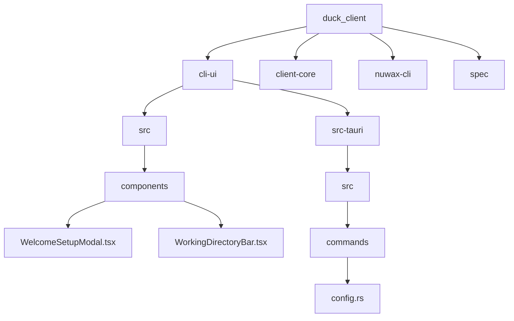
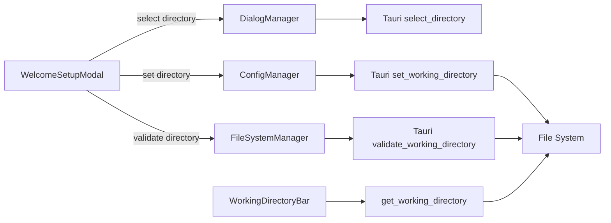
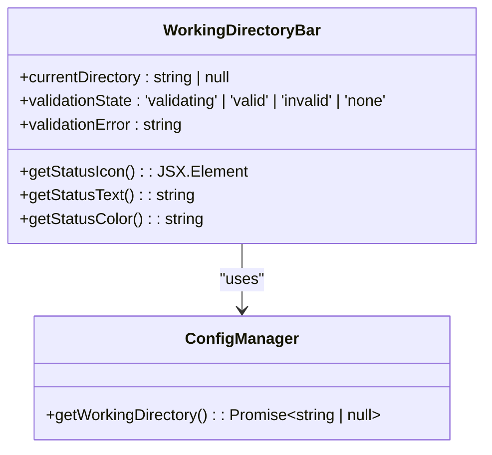
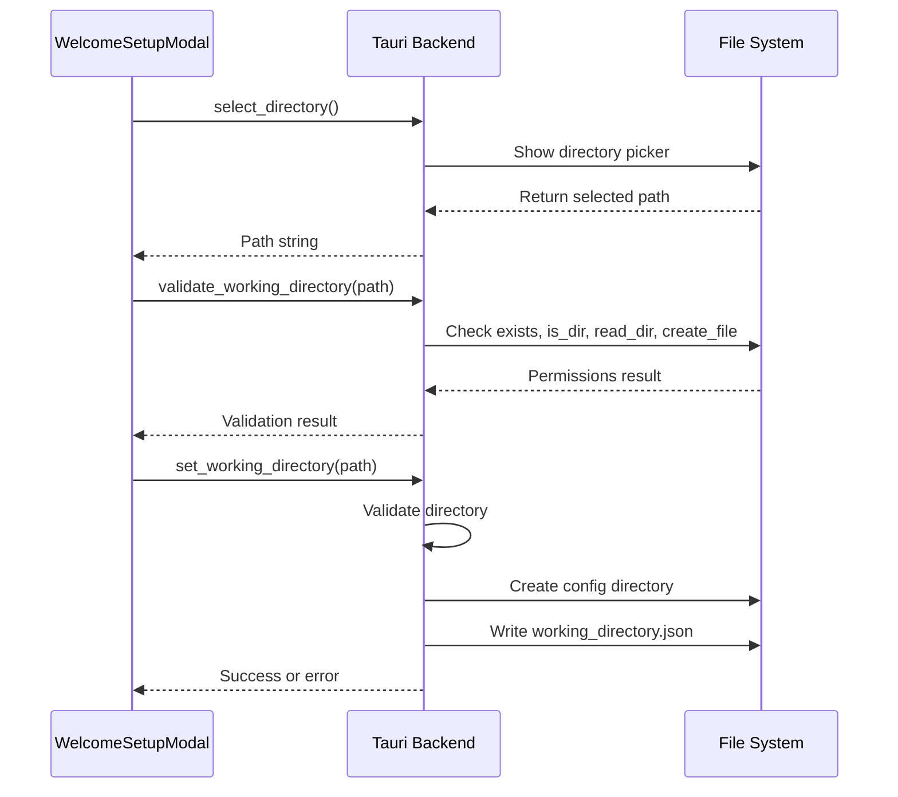
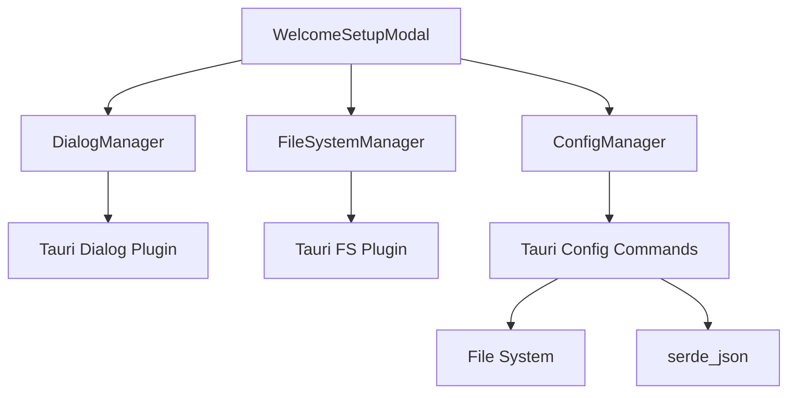
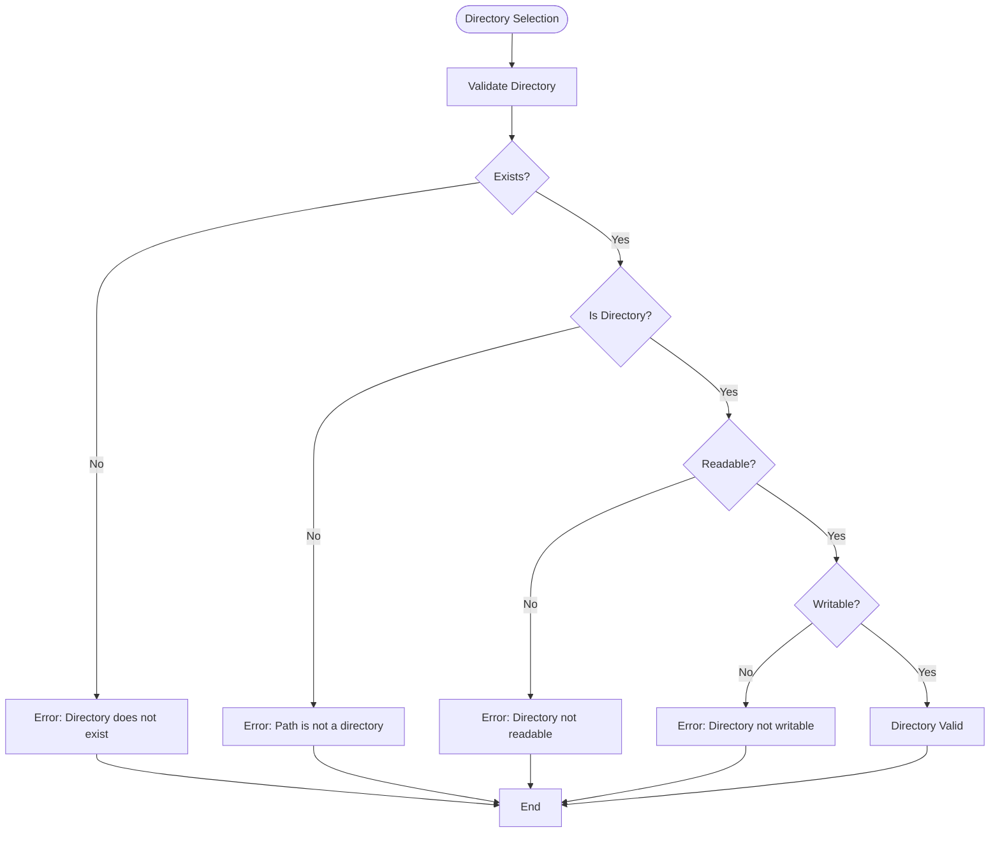

# GUI Service Initialization

<cite>
**Referenced Files in This Document**   
- [WelcomeSetupModal.tsx](file://cli-ui/src/components/WelcomeSetupModal.tsx)
- [WorkingDirectoryBar.tsx](file://cli-ui/src/components/WorkingDirectoryBar.tsx)
- [config.rs](file://cli-ui/src-tauri/src/commands/config.rs)
- [cli-ui.md](file://spec/cli-ui.md)
</cite>

## Table of Contents
1. [Introduction](#introduction)
2. [Project Structure](#project-structure)
3. [Core Components](#core-components)
4. [Architecture Overview](#architecture-overview)
5. [Detailed Component Analysis](#detailed-component-analysis)
6. [Dependency Analysis](#dependency-analysis)
7. [Performance Considerations](#performance-considerations)
8. [Troubleshooting Guide](#troubleshooting-guide)
9. [Conclusion](#conclusion)

## Introduction
This document provides a comprehensive analysis of the GUI service initialization workflow in the Duck Client application. The system guides users through initial configuration via the WelcomeSetupModal, focusing on working directory selection, service parameter setup, and environment configuration. The implementation leverages Tauri's backend commands for configuration persistence, with robust data validation, error handling, and user feedback mechanisms. The documentation covers the complete initialization flow, domain model for setup state, component synchronization, common issues, and best practices for reliable initialization.

## Project Structure
The Duck Client repository follows a modular structure with clear separation between frontend and backend components. The GUI initialization functionality is primarily located in the `cli-ui` module, with Tauri backend commands in `src-tauri`. The project structure shows a well-organized frontend with React components, configuration files, and utility functions, alongside a Rust-based backend for system-level operations.



**Diagram sources**
- [WelcomeSetupModal.tsx](file://cli-ui/src/components/WelcomeSetupModal.tsx)
- [WorkingDirectoryBar.tsx](file://cli-ui/src/components/WorkingDirectoryBar.tsx)
- [config.rs](file://cli-ui/src-tauri/src/commands/config.rs)

**Section sources**
- [WelcomeSetupModal.tsx](file://cli-ui/src/components/WelcomeSetupModal.tsx)
- [WorkingDirectoryBar.tsx](file://cli-ui/src/components/WorkingDirectoryBar.tsx)
- [config.rs](file://cli-ui/src-tauri/src/commands/config.rs)

## Core Components
The core components for GUI service initialization include the WelcomeSetupModal for user onboarding, WorkingDirectoryBar for directory status display, and backend configuration commands for persistent storage. These components work together to guide users through the initial setup process, validate directory permissions, and store configuration data reliably.

**Section sources**
- [WelcomeSetupModal.tsx](file://cli-ui/src/components/WelcomeSetupModal.tsx#L1-L226)
- [WorkingDirectoryBar.tsx](file://cli-ui/src/components/WorkingDirectoryBar.tsx#L1-L196)
- [config.rs](file://cli-ui/src-tauri/src/commands/config.rs#L55-L199)

## Architecture Overview
The service initialization architecture follows a client-server pattern with the React frontend communicating with the Tauri Rust backend through defined command interfaces. The frontend components manage UI state and user interactions, while the backend handles file system operations, configuration persistence, and validation logic.



**Diagram sources**
- [WelcomeSetupModal.tsx](file://cli-ui/src/components/WelcomeSetupModal.tsx)
- [WorkingDirectoryBar.tsx](file://cli-ui/src/components/WorkingDirectoryBar.tsx)
- [config.rs](file://cli-ui/src-tauri/src/commands/config.rs)

## Detailed Component Analysis

### WelcomeSetupModal Analysis
The WelcomeSetupModal component serves as the primary interface for service initialization, guiding users through the working directory selection process. It manages the setup state and coordinates with backend services for directory validation and configuration.

```mermaid
classDiagram
class WelcomeSetupModal {
+selectedDirectory : string
+isValidating : boolean
+validationResult : {valid : boolean, error? : string}
+handleSelectDirectory() : Promise~void~
+validateDirectory(path : string) : Promise~void~
+handleConfirm() : Promise~void~
+onSkip() : void
}
class DialogManager {
+selectDirectory() : Promise~string | null~
}
class FileSystemManager {
+validateDirectory(path : string) : Promise~{valid : boolean, error? : string}~
}
class ConfigManager {
+setWorkingDirectory(path : string) : Promise~void~
}
WelcomeSetupModal --> DialogManager : "uses"
WelcomeSetupModal --> FileSystemManager : "uses"
WelcomeSetupModal --> ConfigManager : "uses"
```

**Diagram sources**
- [WelcomeSetupModal.tsx](file://cli-ui/src/components/WelcomeSetupModal.tsx#L1-L226)

**Section sources**
- [WelcomeSetupModal.tsx](file://cli-ui/src/components/WelcomeSetupModal.tsx#L1-L226)

### WorkingDirectoryBar Analysis
The WorkingDirectoryBar component displays the current working directory status and provides visual feedback on validation results. It synchronizes with the application state and updates in response to directory changes.



**Diagram sources**
- [WorkingDirectoryBar.tsx](file://cli-ui/src/components/WorkingDirectoryBar.tsx#L1-L196)

**Section sources**
- [WorkingDirectoryBar.tsx](file://cli-ui/src/components/WorkingDirectoryBar.tsx#L1-L196)

### Configuration Commands Analysis
The backend configuration commands handle the core logic for working directory management, including validation, persistence, and retrieval. These Tauri commands provide a secure interface between the frontend and file system operations.



**Diagram sources**
- [config.rs](file://cli-ui/src-tauri/src/commands/config.rs#L55-L199)

**Section sources**
- [config.rs](file://cli-ui/src-tauri/src/commands/config.rs#L55-L199)

## Dependency Analysis
The initialization components have well-defined dependencies that follow the separation of concerns principle. The frontend components depend on utility managers that abstract the Tauri command interface, while the backend commands depend on Tauri plugins for file system and dialog operations.



**Diagram sources**
- [WelcomeSetupModal.tsx](file://cli-ui/src/components/WelcomeSetupModal.tsx)
- [config.rs](file://cli-ui/src-tauri/src/commands/config.rs)

**Section sources**
- [WelcomeSetupModal.tsx](file://cli-ui/src/components/WelcomeSetupModal.tsx)
- [config.rs](file://cli-ui/src-tauri/src/commands/config.rs)

## Performance Considerations
The initialization workflow includes several performance considerations, particularly around file system operations which can be slow on certain storage devices. The asynchronous nature of Tauri commands prevents UI blocking during directory validation and configuration saving. The validation process minimizes disk I/O by combining multiple checks in a single operation and using efficient file system calls.

Best practices for performance include:
- Using asynchronous operations to maintain UI responsiveness
- Caching validation results to avoid redundant checks
- Minimizing file system operations in the validation process
- Providing clear feedback during potentially slow operations
- Implementing timeout mechanisms for long-running operations

## Troubleshooting Guide
Common issues in the service initialization process include invalid directory permissions, incomplete configuration states, and race conditions. The system includes several mechanisms to handle these issues:

**Invalid Directory Permissions**
- The system checks for read and write permissions before accepting a directory
- Error messages clearly indicate whether the issue is with read or write access
- Users are guided to select a different directory with proper permissions



**Incomplete Configuration States**
- The system validates stored configuration on startup
- If the configured directory is no longer valid, the configuration is cleared
- Users are prompted to reconfigure the working directory

**Race Conditions**
- The initialization process uses a single source of truth (the configuration file)
- Operations are serialized to prevent concurrent modifications
- The UI state is synchronized with the backend state

**Section sources**
- [config.rs](file://cli-ui/src-tauri/src/commands/config.rs#L55-L199)
- [WelcomeSetupModal.tsx](file://cli-ui/src/components/WelcomeSetupModal.tsx#L1-L226)

## Conclusion
The GUI service initialization workflow in Duck Client provides a robust and user-friendly experience for setting up the application environment. The system effectively guides users through working directory selection with clear validation feedback and persistent configuration storage. The architecture separates concerns between frontend and backend components, with well-defined interfaces for communication. The implementation includes comprehensive error handling and addresses common issues such as permission problems and configuration corruption. By following best practices for asynchronous operations and state management, the system ensures a responsive and reliable initialization process.