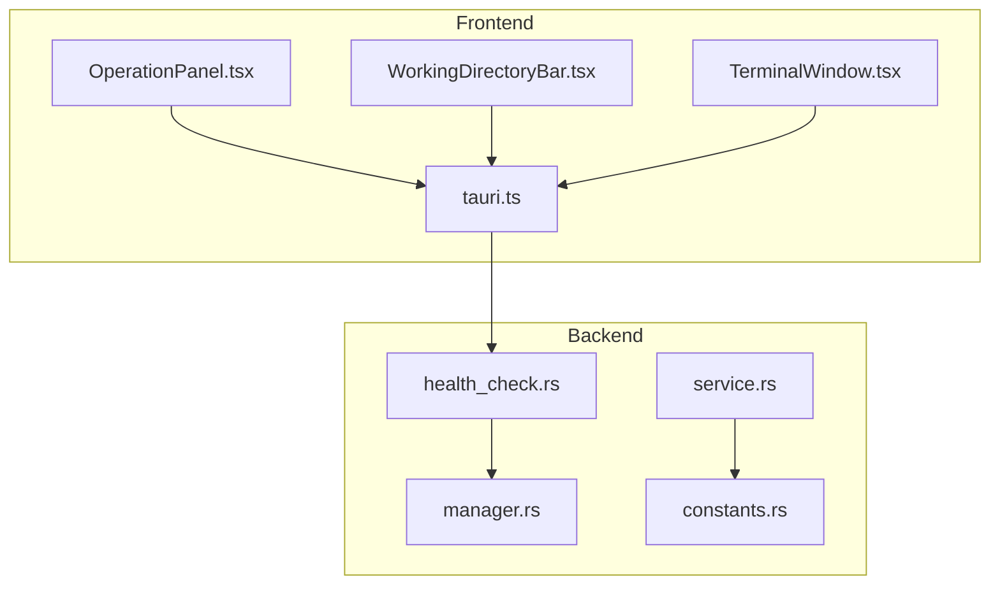
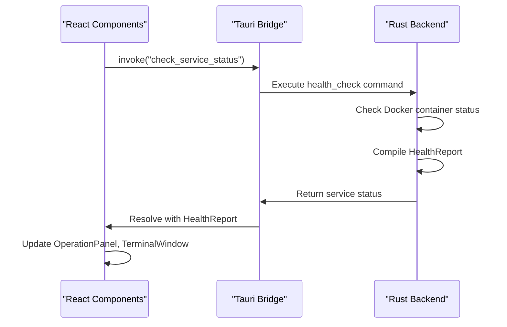
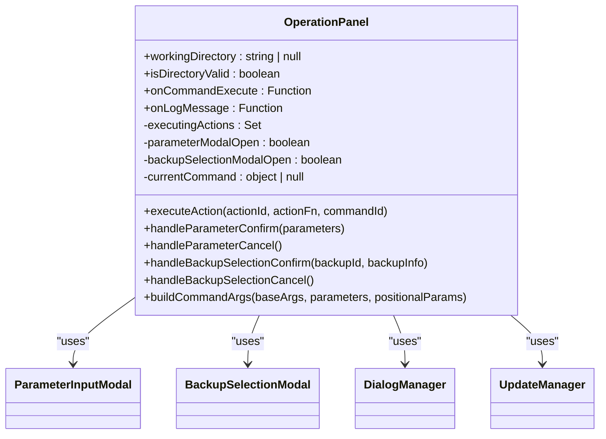
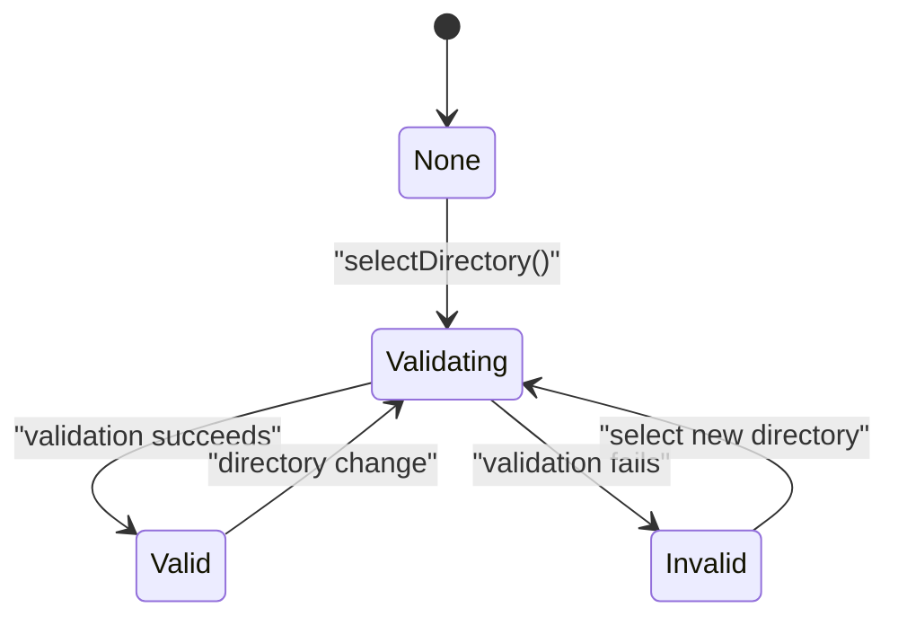
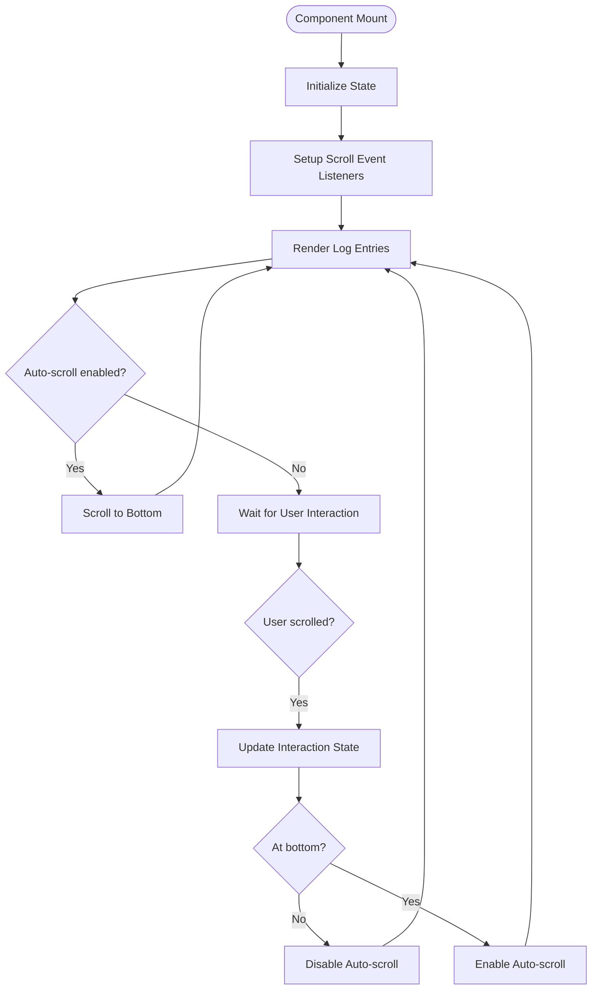
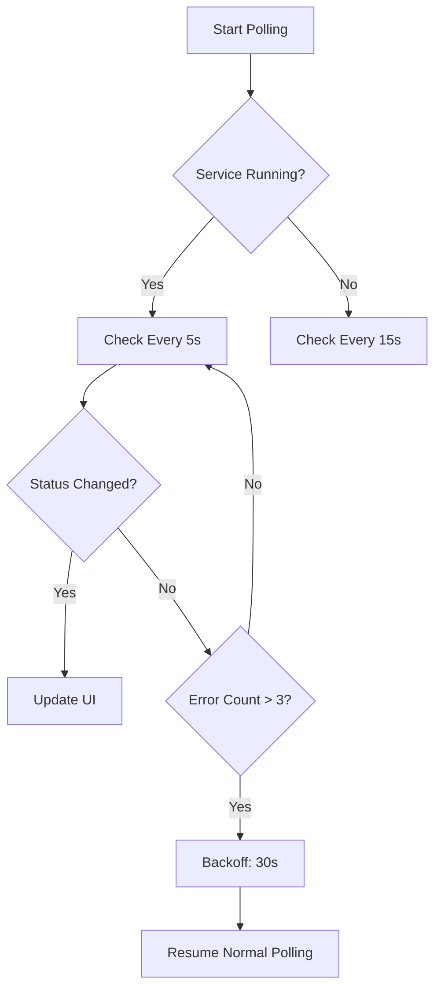

# GUI Status Monitoring

<cite>
**Referenced Files in This Document**   
- [OperationPanel.tsx](file://cli-ui/src/components/OperationPanel.tsx)
- [WorkingDirectoryBar.tsx](file://cli-ui/src/components/WorkingDirectoryBar.tsx)
- [TerminalWindow.tsx](file://cli-ui/src/components/TerminalWindow.tsx)
- [tauri.ts](file://cli-ui/src/utils/tauri.ts)
- [health_check.rs](file://nuwax-cli/src/docker_service/health_check.rs)
- [manager.rs](file://nuwax-cli/src/docker_service/manager.rs)
- [service.rs](file://client-core/src/container/service.rs)
- [constants.rs](file://client-core/src/constants.rs)
</cite>

## Table of Contents
1. [Introduction](#introduction)
2. [Project Structure](#project-structure)
3. [Core Components](#core-components)
4. [Architecture Overview](#architecture-overview)
5. [Detailed Component Analysis](#detailed-component-analysis)
6. [Dependency Analysis](#dependency-analysis)
7. [Performance Considerations](#performance-considerations)
8. [Troubleshooting Guide](#troubleshooting-guide)
9. [Conclusion](#conclusion)

## Introduction
This document provides a comprehensive analysis of the real-time service status monitoring capabilities within the GUI of the Duck Client application. The system enables users to monitor the operational state, health indicators, and version information of backend services through a responsive and intuitive interface. The monitoring functionality is implemented through periodic polling via Tauri commands, with status updates displayed across multiple UI components including the OperationPanel, WorkingDirectoryBar, and TerminalWindow. This documentation details the implementation of live data refresh, error handling, UI synchronization, and optimization strategies to ensure reliable and efficient monitoring.

## Project Structure
The Duck Client repository is organized into several key modules that support the GUI status monitoring functionality. The frontend interface is implemented in the `cli-ui` module using React and TypeScript, while the backend logic resides in `client-core` and `nuwax-cli` modules written in Rust. The status monitoring system spans both frontend and backend components, with communication facilitated through Tauri's command system.

The `cli-ui` directory contains the React components responsible for displaying service status, including OperationPanel.tsx, WorkingDirectoryBar.tsx, and TerminalWindow.tsx. These components interact with backend services through utility functions in tauri.ts. The backend status checking logic is implemented in the nuwax-cli module, specifically in the docker_service/health_check.rs file, which defines the ServiceStatus enum and HealthReport structure used to represent service health.



**Diagram sources**
- [OperationPanel.tsx](file://cli-ui/src/components/OperationPanel.tsx)
- [WorkingDirectoryBar.tsx](file://cli-ui/src/components/WorkingDirectoryBar.tsx)
- [TerminalWindow.tsx](file://cli-ui/src/components/TerminalWindow.tsx)
- [tauri.ts](file://cli-ui/src/utils/tauri.ts)
- [health_check.rs](file://nuwax-cli/src/docker_service/health_check.rs)
- [manager.rs](file://nuwax-cli/src/docker_service/manager.rs)
- [service.rs](file://client-core/src/container/service.rs)
- [constants.rs](file://client-core/src/constants.rs)

## Core Components
The GUI status monitoring system consists of three primary React components that work together to display service status information: OperationPanel, WorkingDirectoryBar, and TerminalWindow. These components receive status updates through Tauri commands that interface with the Rust backend.

The OperationPanel component provides the main interface for service control and status display, containing action buttons for starting, stopping, and restarting services. The WorkingDirectoryBar displays the current working directory status and validation state, while the TerminalWindow shows detailed log output from service operations. All components receive status information through a shared mechanism that ensures consistent state across the interface.

**Section sources**
- [OperationPanel.tsx](file://cli-ui/src/components/OperationPanel.tsx#L0-L506)
- [WorkingDirectoryBar.tsx](file://cli-ui/src/components/WorkingDirectoryBar.tsx#L0-L197)
- [TerminalWindow.tsx](file://cli-ui/src/components/TerminalWindow.tsx#L0-L251)

## Architecture Overview
The status monitoring architecture follows a client-server pattern where the React frontend periodically polls the Rust backend for service status information. The communication is facilitated by Tauri's command system, which enables secure inter-process communication between the frontend and backend.

When the user interface needs to display current service status, it invokes a Tauri command that executes the appropriate Rust function. The backend performs health checks on Docker containers and returns a structured response containing service status, version information, and operational details. This response is then parsed by the frontend and used to update the UI components.



**Diagram sources**
- [tauri.ts](file://cli-ui/src/utils/tauri.ts#L0-L920)
- [health_check.rs](file://nuwax-cli/src/docker_service/health_check.rs#L226-L321)
- [OperationPanel.tsx](file://cli-ui/src/components/OperationPanel.tsx#L0-L506)

## Detailed Component Analysis

### OperationPanel Analysis
The OperationPanel component serves as the primary interface for service control and status monitoring. It displays action buttons for service operations and reflects the current operational state of backend services.

The component receives working directory and validation status as props, which determine whether service operations can be executed. When the working directory is invalid or not set, all action buttons are disabled, and a warning message is displayed. The component maintains state for executing actions to prevent multiple concurrent operations on the same action.



**Diagram sources**
- [OperationPanel.tsx](file://cli-ui/src/components/OperationPanel.tsx#L0-L506)

**Section sources**
- [OperationPanel.tsx](file://cli-ui/src/components/OperationPanel.tsx#L0-L506)

### WorkingDirectoryBar Analysis
The WorkingDirectoryBar component displays the current working directory and its validation status. It provides a visual indicator of directory validity through color-coded status messages and icons.

The component implements a validation workflow that checks whether the selected directory contains the necessary configuration files and has appropriate permissions. Validation status is represented by different states: 'valid', 'invalid', 'validating', and 'none'. Each state has a corresponding icon and color scheme to provide clear visual feedback to the user.



**Diagram sources**
- [WorkingDirectoryBar.tsx](file://cli-ui/src/components/WorkingDirectoryBar.tsx#L0-L197)

**Section sources**
- [WorkingDirectoryBar.tsx](file://cli-ui/src/components/WorkingDirectoryBar.tsx#L0-L197)

### TerminalWindow Analysis
The TerminalWindow component displays real-time log output from service operations, providing detailed information about command execution and service status changes.

The component implements an auto-scroll feature that keeps the most recent log entries visible. When users manually scroll up to review older logs, auto-scroll is temporarily disabled to prevent disruption. The component also displays memory usage statistics, showing the current number of log entries as a percentage of the maximum allowed entries.



**Diagram sources**
- [TerminalWindow.tsx](file://cli-ui/src/components/TerminalWindow.tsx#L0-L251)

**Section sources**
- [TerminalWindow.tsx](file://cli-ui/src/components/TerminalWindow.tsx#L0-L251)

## Dependency Analysis
The status monitoring system has a well-defined dependency chain that ensures proper data flow from the backend to the frontend components. The React components depend on utility functions in tauri.ts, which in turn depend on Tauri's plugin system for inter-process communication.

The backend components in nuwax-cli depend on Docker API bindings to check container status and on configuration management modules to determine service endpoints and parameters. The health checking functionality is centralized in the health_check.rs module, which is used by both the CLI and the GUI interface.

```mermaid
graph TD
A[OperationPanel] --> B[tauri.ts]
C[WorkingDirectoryBar] --> B
D[TerminalWindow] --> B
B --> E[@tauri-apps/api]
B --> F[@tauri-apps/plugin-shell]
B --> G[@tauri-apps/plugin-dialog]
H[health_check.rs] --> I[docker_service/manager.rs]
I --> J[client-core/container/service.rs]
J --> K[client-core/constants.rs]
```

**Diagram sources**
- [tauri.ts](file://cli-ui/src/utils/tauri.ts#L0-L920)
- [OperationPanel.tsx](file://cli-ui/src/components/OperationPanel.tsx#L0-L506)
- [WorkingDirectoryBar.tsx](file://cli-ui/src/components/WorkingDirectoryBar.tsx#L0-L197)
- [TerminalWindow.tsx](file://cli-ui/src/components/TerminalWindow.tsx#L0-L251)
- [health_check.rs](file://nuwax-cli/src/docker_service/health_check.rs#L226-L321)
- [manager.rs](file://nuwax-cli/src/docker_service/manager.rs#L476-L519)
- [service.rs](file://client-core/src/container/service.rs#L343-L380)
- [constants.rs](file://client-core/src/constants.rs#L380)

**Section sources**
- [tauri.ts](file://cli-ui/src/utils/tauri.ts#L0-L920)
- [health_check.rs](file://nuwax-cli/src/docker_service/health_check.rs#L226-L321)

## Performance Considerations
The status monitoring system implements several strategies to balance real-time updates with system resource efficiency. The polling interval for service status is configurable through constants defined in the client-core module, with a default check interval of 5 seconds.

To prevent excessive resource usage during polling, the system implements exponential backoff in error scenarios and limits the frequency of status updates based on user interface requirements. The TerminalWindow component manages memory usage by limiting the number of stored log entries and providing options to clear or export logs.

The backend health checking process is optimized to minimize Docker API calls by batching container status requests and caching results when appropriate. The system also implements timeout mechanisms to prevent hanging operations, with a default service start timeout of 300 seconds.



**Diagram sources**
- [constants.rs](file://client-core/src/constants.rs#L380)
- [service.rs](file://client-core/src/container/service.rs#L374-L385)
- [TerminalWindow.tsx](file://cli-ui/src/components/TerminalWindow.tsx#L45-L82)

## Troubleshooting Guide
Common issues with the status monitoring system typically fall into three categories: stale status display, excessive polling overhead, and handling of disconnected or unresponsive services.

For stale status display, ensure that the polling mechanism is properly initialized and that the Tauri command bridge is functioning correctly. Verify that the backend health_check command returns timely responses and that network connectivity between frontend and backend is stable.

To address excessive polling overhead, review the polling interval configuration in constants.rs and adjust based on system requirements. Consider implementing conditional polling that reduces frequency when services are in a stable state.

For disconnected or unresponsive services, the system should display appropriate error messages and provide recovery options. The WorkingDirectoryBar component should clearly indicate validation failures, and the TerminalWindow should display detailed error logs to aid in diagnosis.

**Section sources**
- [OperationPanel.tsx](file://cli-ui/src/components/OperationPanel.tsx#L0-L506)
- [WorkingDirectoryBar.tsx](file://cli-ui/src/components/WorkingDirectoryBar.tsx#L0-L197)
- [TerminalWindow.tsx](file://cli-ui/src/components/TerminalWindow.tsx#L0-L251)
- [health_check.rs](file://nuwax-cli/src/docker_service/health_check.rs#L226-L321)

## Conclusion
The GUI status monitoring system in the Duck Client application provides a robust and user-friendly interface for monitoring service health and operational status. Through a combination of periodic polling, efficient error handling, and thoughtful UI design, the system delivers real-time status information while maintaining optimal performance.

The architecture effectively separates concerns between frontend presentation and backend status checking, with well-defined interfaces that facilitate maintenance and extension. By implementing configurable polling intervals, exponential backoff for error recovery, and memory-efficient log management, the system balances responsiveness with resource efficiency.

Future improvements could include websocket-based push notifications to eliminate polling overhead, more granular status indicators for individual service components, and enhanced visualization of service dependencies and relationships.