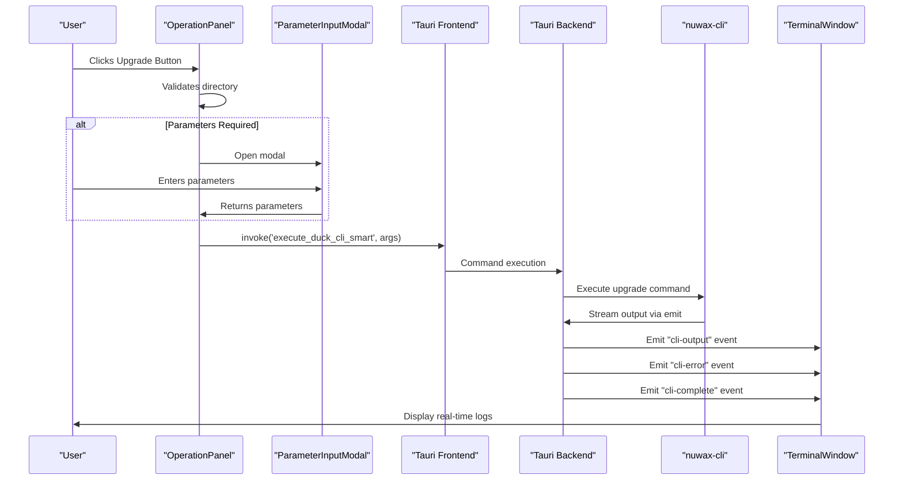
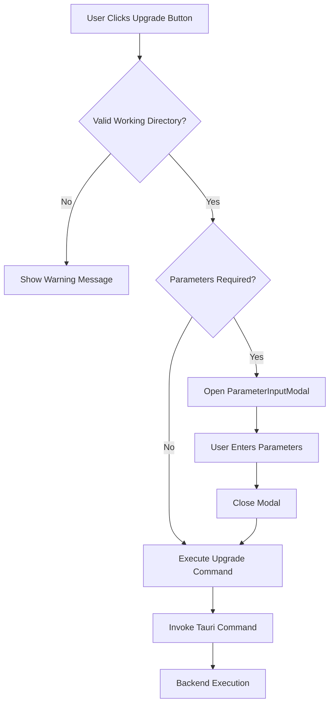
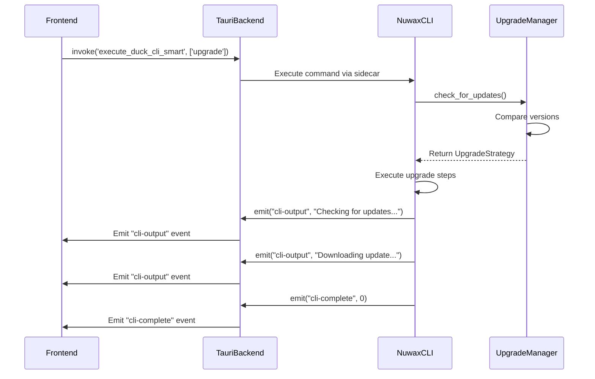

# GUI Upgrade Execution

<cite>
**Referenced Files in This Document**   
- [OperationPanel.tsx](file://cli-ui/src/components/OperationPanel.tsx)
- [TerminalWindow.tsx](file://cli-ui/src/components/TerminalWindow.tsx)
- [tauri.ts](file://cli-ui/src/utils/tauri.ts)
- [cli.rs](file://cli-ui/src-tauri/src/commands/cli.rs)
- [upgrade.rs](file://client-core/src/upgrade.rs)
- [upgrade_strategy.rs](file://client-core/src/upgrade_strategy.rs)
- [version.rs](file://client-core/src/version.rs)
</cite>

## Table of Contents
1. [Upgrade Execution Flow](#upgrade-execution-flow)
2. [Operation Panel: Upgrade Button Interaction](#operation-panel-upgrade-button-interaction)
3. [Parameter Input Modal Integration](#parameter-input-modal-integration)
4. [Tauri Command Invocation System](#tauri-command-invocation-system)
5. [Backend Command Execution and Progress Streaming](#backend-command-execution-and-progress-streaming)
6. [Real-Time Terminal Output Rendering](#real-time-terminal-output-rendering)
7. [State Management for Upgrade Operations](#state-management-for-upgrade-operations)
8. [Error Handling and Recovery Mechanisms](#error-handling-and-recovery-mechanisms)
9. [Common Issues and Troubleshooting](#common-issues-and-troubleshooting)
10. [Performance Optimization Recommendations](#performance-optimization-recommendations)

## Upgrade Execution Flow

The GUI upgrade process follows a well-defined sequence from user interaction to backend execution and real-time feedback. When a user clicks the "应用升级" (Upgrade) button in the OperationPanel, the system initiates a command execution flow that involves frontend state management, Tauri's inter-process communication, backend command processing, and real-time progress updates streamed back to the terminal interface.

The complete flow consists of:
1. User clicks the upgrade button in the OperationPanel
2. Frontend validates working directory and checks if parameters are needed
3. If parameters are required, ParameterInputModal is displayed
4. Upon confirmation, command is constructed and sent via Tauri invoke
5. Backend executes the upgrade command through nuwax-cli
6. Progress events and output are emitted in real-time
7. TerminalWindow receives and renders the output
8. State is updated based on completion or failure

This end-to-end process ensures a responsive user experience with detailed feedback throughout the upgrade operation.

**Diagram sources**
- [OperationPanel.tsx](file://cli-ui/src/components/OperationPanel.tsx)
- [TerminalWindow.tsx](file://cli-ui/src/components/TerminalWindow.tsx)
- [cli.rs](file://cli-ui/src-tauri/src/commands/cli.rs)

## Operation Panel: Upgrade Button Interaction

The OperationPanel component serves as the primary interface for initiating upgrade operations. It contains a collection of action buttons, including the "应用升级" (Upgrade) button that triggers the upgrade process.

When the upgrade button is clicked, the `executeAction` function is invoked with the upgrade command configuration. The system first validates that a valid working directory is set. If the directory is invalid, a warning message is displayed and the operation is prevented.

The upgrade button is configured with the following properties:
- **id**: 'upgrade'
- **title**: '应用升级' (Upgrade)
- **description**: '下载Docker应用服务文件，支持全量下载和强制重新下载' (Download Docker application service files, supports full download and forced re-download)
- **icon**: WrenchScrewdriverIcon
- **variant**: 'primary'
- **commandId**: 'upgrade'

The action function constructs the command arguments and calls `onCommandExecute` with the 'duck-cli' command and 'upgrade' subcommand. This function is passed down from the parent component and ultimately connects to the Tauri invocation system.

**Diagram sources**
- [OperationPanel.tsx](file://cli-ui/src/components/OperationPanel.tsx)

**Section sources**
- [OperationPanel.tsx](file://cli-ui/src/components/OperationPanel.tsx#L300-L330)

## Parameter Input Modal Integration

The ParameterInputModal provides a dynamic interface for collecting user input before executing commands that require parameters. For the upgrade operation, this modal allows users to specify options such as whether to skip backup, force the upgrade, or use incremental updates.

The integration between OperationPanel and ParameterInputModal follows a controlled state management pattern. When a command with a commandId is executed, the system checks if parameters are needed using the `needsParameterInput` function from commandConfigs. If parameters are required, the OperationPanel sets the current command context and opens the modal.

The modal receives its configuration through props:
- **isOpen**: Controls visibility
- **commandConfig**: Defines the parameters to collect
- **onConfirm**: Callback for successful parameter submission
- **onCancel**: Callback for modal cancellation

When the user confirms the parameters, the `handleParameterConfirm` function in OperationPanel is called with the collected parameters. These parameters are then used to build the command arguments using the `buildCommandArgs` function, which processes both positional and option parameters according to their types (boolean, string, array).

The parameter building process handles various parameter types:
- Boolean parameters are converted to flags (e.g., `--skip-backup`)
- String parameters are added as key-value pairs (e.g., `--backup-dir /path/to/backup`)
- Array parameters are expanded into multiple key-value pairs
- Special cases like the 'args' parameter are handled to support direct argument passing

This flexible parameter system allows the GUI to support complex command-line operations while providing a user-friendly interface.

**Section sources**
- [OperationPanel.tsx](file://cli-ui/src/components/OperationPanel.tsx#L100-L150)
- [OperationPanel.tsx](file://cli-ui/src/components/OperationPanel.tsx#L400-L430)

## Tauri Command Invocation System

The Tauri command invocation system provides the bridge between the frontend React interface and the backend Rust implementation. This system uses Tauri's `invoke` mechanism to call backend commands asynchronously and handle their results.

The invocation process begins in the `onCommandExecute` function (passed from the parent component), which calls the `executeCommand` function from the tauri utility module. This function uses Tauri's `invoke` API to call the `execute_duck_cli_smart` command defined in the backend.

The backend command `execute_duck_cli_smart` implements a hybrid execution strategy:
1. First attempts to execute using the Sidecar method
2. If Sidecar fails, falls back to system command execution
3. Returns appropriate error messages if both methods fail

The Sidecar execution method is preferred as it provides better integration and real-time output streaming. It uses Tauri's sidecar feature to execute the nuwax-cli binary that is bundled with the application. The system command method serves as a fallback when the sidecar is not available.

Both execution methods set up enhanced environment variables by calling `get_user_environment`, which ensures that Docker and other container tools are available in the PATH. This function intelligently adds common installation paths for different operating systems.

The command execution is asynchronous and returns a `CommandResult` struct containing:
- **success**: Boolean indicating if the command succeeded
- **exit_code**: The process exit code
- **stdout**: Standard output as string
- **stderr**: Standard error as string

Throughout execution, progress events are emitted using Tauri's event system, allowing real-time updates to be sent to the frontend.

**Section sources**
- [cli.rs](file://cli-ui/src-tauri/src/commands/cli.rs#L200-L350)
- [tauri.ts](file://cli-ui/src/utils/tauri.ts)

## Backend Command Execution and Progress Streaming

The backend command execution system in the Tauri Rust layer handles the actual invocation of the nuwax-cli upgrade command and streams progress updates back to the frontend. This process is implemented in the `execute_duck_cli_sidecar` and `execute_duck_cli_system` functions in cli.rs.

When using the sidecar method, the system creates a command process and establishes a channel to receive events. The event loop processes three types of events:
1. **CommandEvent::Stdout**: Contains standard output data
2. **CommandEvent::Stderr**: Contains standard error data  
3. **CommandEvent::Terminated**: Indicates process completion

For each stdout and stderr event, the system converts the byte data to a UTF-8 string and emits it to the frontend using `app.emit` with the events "cli-output" and "cli-error" respectively. This enables real-time streaming of the command output to the terminal interface.

When the process terminates, a "cli-complete" event is emitted with the exit code, signaling the end of the operation. This event-driven approach ensures that users receive immediate feedback without waiting for the entire command to complete.

The upgrade command itself is implemented in the client-core crate, specifically in the upgrade.rs and upgrade_strategy.rs modules. The UpgradeManager checks for updates by calling `check_for_updates`, which uses the UpgradeStrategyManager to determine the appropriate upgrade approach.

The strategy decision process evaluates several factors:
- Current version vs. server version
- Architecture compatibility
- Presence of docker directory and compose file
- Force full upgrade flag
- Network conditions and disk space

Based on this analysis, the system decides between:
- **FullUpgrade**: Complete replacement of application files
- **PatchUpgrade**: Incremental update with only changed files
- **NoUpgrade**: Current version is already up-to-date

The version comparison logic in version.rs supports four-segment version numbers (major.minor.patch.build) and determines upgrade requirements based on base version equality and build level differences.

**Diagram sources**
- [cli.rs](file://cli-ui/src-tauri/src/commands/cli.rs)
- [upgrade.rs](file://client-core/src/upgrade.rs)
- [upgrade_strategy.rs](file://client-core/src/upgrade_strategy.rs)

**Section sources**
- [cli.rs](file://cli-ui/src-tauri/src/commands/cli.rs#L200-L350)
- [upgrade.rs](file://client-core/src/upgrade.rs#L50-L80)
- [upgrade_strategy.rs](file://client-core/src/upgrade_strategy.rs#L100-L200)

## Real-Time Terminal Output Rendering

The TerminalWindow component is responsible for rendering real-time output from command execution in a user-friendly terminal interface. It receives log entries through props and displays them with appropriate formatting and styling.

The component maintains several key states:
- **autoScroll**: Controls whether the view automatically scrolls to the bottom
- **userInteractedRef**: Tracks if the user has manually scrolled
- **isAutoScrollingRef**: Prevents scroll event conflicts during automatic scrolling

The rendering system uses a combination of React refs and effect hooks to manage scrolling behavior. When new logs are received and autoScroll is enabled, the `useEffect` hook automatically scrolls to the bottom with smooth behavior. The system detects manual user interaction through scroll, mouse, and keyboard events, temporarily disabling auto-scroll to allow users to review previous output.

Each log entry is displayed with:
- Timestamp
- Type-specific icon (info, success, error, warning, command)
- Color-coded text based on message type
- Command prefix ($) for command entries

The terminal header includes useful statistics:
- Current log count vs. total log count
- Memory buffer usage percentage
- Control buttons for clearing logs, exporting logs, and toggling auto-scroll

The component implements a circular buffer system with a maximum log entry limit (maxLogEntries). When this limit is exceeded, older entries are automatically removed to prevent memory issues. This ensures stable performance even during long-running operations with extensive output.

The export functionality allows users to save logs for troubleshooting, while the clear function provides a way to reset the display when needed. The auto-scroll toggle gives users control over the viewing experience, automatically resuming after manual interaction ceases.

**Section sources**
- [TerminalWindow.tsx](file://cli-ui/src/components/TerminalWindow.tsx)

## State Management for Upgrade Operations

The system implements a comprehensive state management approach for upgrade operations, tracking the lifecycle from initiation to completion. State is managed across multiple components and layers, ensuring consistency and proper user feedback.

At the component level, OperationPanel maintains execution state using the `executingActions` Set, which tracks which actions are currently in progress. This prevents multiple concurrent executions of the same operation and updates button appearance to show a loading spinner.

The upgrade process itself follows a defined state progression:
- **Idle**: No operation in progress
- **In Progress**: Command is executing
- **Completed**: Operation finished successfully
- **Failed**: Operation encountered an error

These states are communicated through the event system:
- "cli-output": Informational messages during execution
- "cli-error": Error messages and warnings
- "cli-complete": Final status with exit code

The UpgradeStep enum in upgrade.rs defines specific stages of the upgrade process:
- CheckingUpdates
- CreatingBackup
- StoppingServices
- DownloadingUpdate
- ExtractingUpdate
- LoadingImages
- StartingServices
- VerifyingServices
- CleaningUp
- Completed
- Failed

This granular state tracking allows the system to provide detailed progress feedback to users. The terminal output reflects these stages, giving users visibility into the current operation.

The system also manages state related to the upgrade strategy decision:
- Current version information
- Available update information
- Decision factors (version compatibility, network condition, disk space)
- Selected strategy (FullUpgrade, PatchUpgrade, NoUpgrade)

This state is used to determine the appropriate upgrade approach and communicate it to the user through the output logs.

**Section sources**
- [OperationPanel.tsx](file://cli-ui/src/components/OperationPanel.tsx#L50-L80)
- [TerminalWindow.tsx](file://cli-ui/src/components/TerminalWindow.tsx)
- [upgrade.rs](file://client-core/src/upgrade.rs#L20-L40)

## Error Handling and Recovery Mechanisms

The system implements robust error handling and recovery mechanisms at multiple levels to ensure reliability during upgrade operations.

At the command execution level, the hybrid execution strategy provides redundancy. If the preferred sidecar method fails, the system automatically falls back to system command execution. Only if both methods fail is an error reported to the user.

The `execute_duck_cli_smart` function implements this fallback pattern:
1. Attempt sidecar execution
2. On failure, log the error and attempt system execution
3. If system execution also fails, return a comprehensive error message

For process management, the `check_and_cleanup_duck_processes` command ensures that conflicting processes are terminated before upgrade operations. This function:
- Identifies running nuwax-cli processes
- Attempts to terminate them gracefully with SIGTERM
- Verifies termination and forces kill with SIGKILL if necessary
- Returns detailed information about cleaned-up processes

The upgrade system also checks for database locking before operations that might affect data integrity. The `check_database_lock` command attempts to open the database file in exclusive mode to detect if it's being used by another process.

In the frontend, error messages are displayed in the terminal window with appropriate styling (red text for errors). The system distinguishes between different error types:
- Command execution failures
- Parameter validation errors
- Working directory issues
- Network connectivity problems

Recovery mechanisms include:
- Automatic process cleanup
- Database lock detection
- Command execution fallbacks
- Graceful degradation of features
- Comprehensive error logging

The system also implements timeout handling and resource cleanup to prevent hanging operations. After command completion (successful or failed), all resources are properly released and the UI returns to an idle state.

**Section sources**
- [cli.rs](file://cli-ui/src-tauri/src/commands/cli.rs#L400-L500)
- [OperationPanel.tsx](file://cli-ui/src/components/OperationPanel.tsx#L120-L130)

## Common Issues and Troubleshooting

Several common issues can occur during GUI upgrade operations, each with specific troubleshooting approaches.

**Stalled Progress Events**: When progress events stop flowing but the command appears to be still running, this typically indicates a buffering issue in the command output. The system should:
- Verify the backend process is still active
- Check for output buffering in the nuwax-cli application
- Implement heartbeat messages if long silent periods are expected
- Add timeout monitoring to detect truly stalled operations

**Log Output Truncation**: When log output is incomplete or cut off, this may be due to:
- Buffer size limitations in the event system
- String encoding issues with non-UTF8 output
- Network transmission problems in Tauri's IPC
- Memory constraints in the frontend

The system addresses this by using lossy UTF-8 conversion (`String::from_utf8_lossy`) and ensuring proper event batching.

**Inconsistent State After Failed Upgrades**: When an upgrade fails, the system must ensure data integrity by:
- Rolling back partial changes when possible
- Preserving the previous working state
- Maintaining backup integrity
- Clearing temporary files and downloads

The upgrade system creates backups before major operations and maintains the previous version's files until the upgrade is verified complete.

**Environment Issues**: Common problems include:
- Docker commands not found in PATH
- Permission issues with Docker operations
- Network connectivity problems
- Insufficient disk space

The `debug_environment` command helps diagnose these issues by checking PATH and testing Docker command availability.

**Architecture Mismatch**: When the client architecture doesn't match available packages, the system should:
- Detect architecture automatically
- Provide clear error messages about missing packages
- Suggest alternative installation methods
- Fall back to universal packages when available

**Section sources**
- [cli.rs](file://cli-ui/src-tauri/src/commands/cli.rs#L10-L50)
- [upgrade_strategy.rs](file://client-core/src/upgrade_strategy.rs#L200-L250)

## Performance Optimization Recommendations

To optimize upgrade operations, particularly for large patch downloads and network resilience, several strategies can be implemented:

**Large Patch Download Optimization**:
- Implement download resumption for interrupted transfers
- Use compression algorithms appropriate to content type
- Parallelize download of independent files
- Implement download throttling to avoid network congestion
- Cache downloaded packages locally for future use

**Network Resilience Enhancements**:
- Implement exponential backoff for retry attempts
- Use multiple download mirrors when available
- Validate downloads with checksums before use
- Implement connection health monitoring
- Provide offline mode with pre-downloaded packages

**Memory and Performance Improvements**:
- Stream processing of large files instead of loading entirely into memory
- Implement efficient log rotation and archiving
- Use worker threads for CPU-intensive operations
- Optimize database queries during upgrade verification
- Minimize UI updates during high-frequency events

**User Experience Optimizations**:
- Provide estimated time remaining based on download speed
- Allow pausing and resuming long operations
- Implement progress checkpoints for recovery
- Offer detailed statistics about download and installation
- Provide visual indicators for different operation phases

**System-Level Optimizations**:
- Pre-validate system requirements before starting
- Optimize file operations with batch processing
- Use efficient algorithms for patch application
- Implement intelligent caching of frequently accessed resources
- Monitor system resources and adjust operation intensity accordingly

These optimizations would enhance the reliability and user experience of the upgrade process, particularly in environments with limited bandwidth or unstable network connections.

**Section sources**
- [upgrade_strategy.rs](file://client-core/src/upgrade_strategy.rs)
- [cli.rs](file://cli-ui/src-tauri/src/commands/cli.rs)
- [TerminalWindow.tsx](file://cli-ui/src/components/TerminalWindow.tsx)