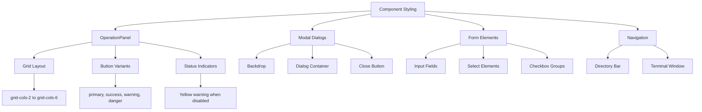
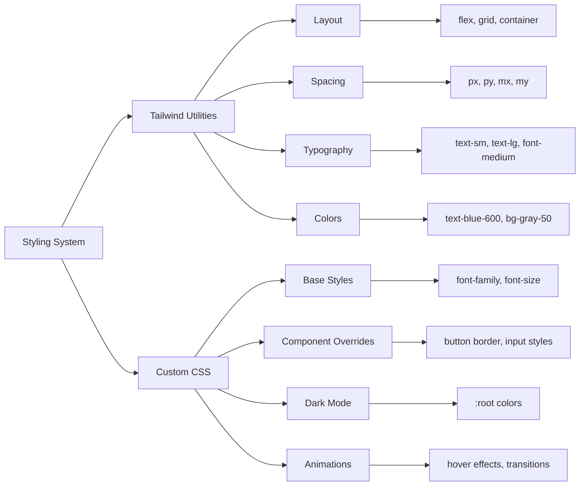
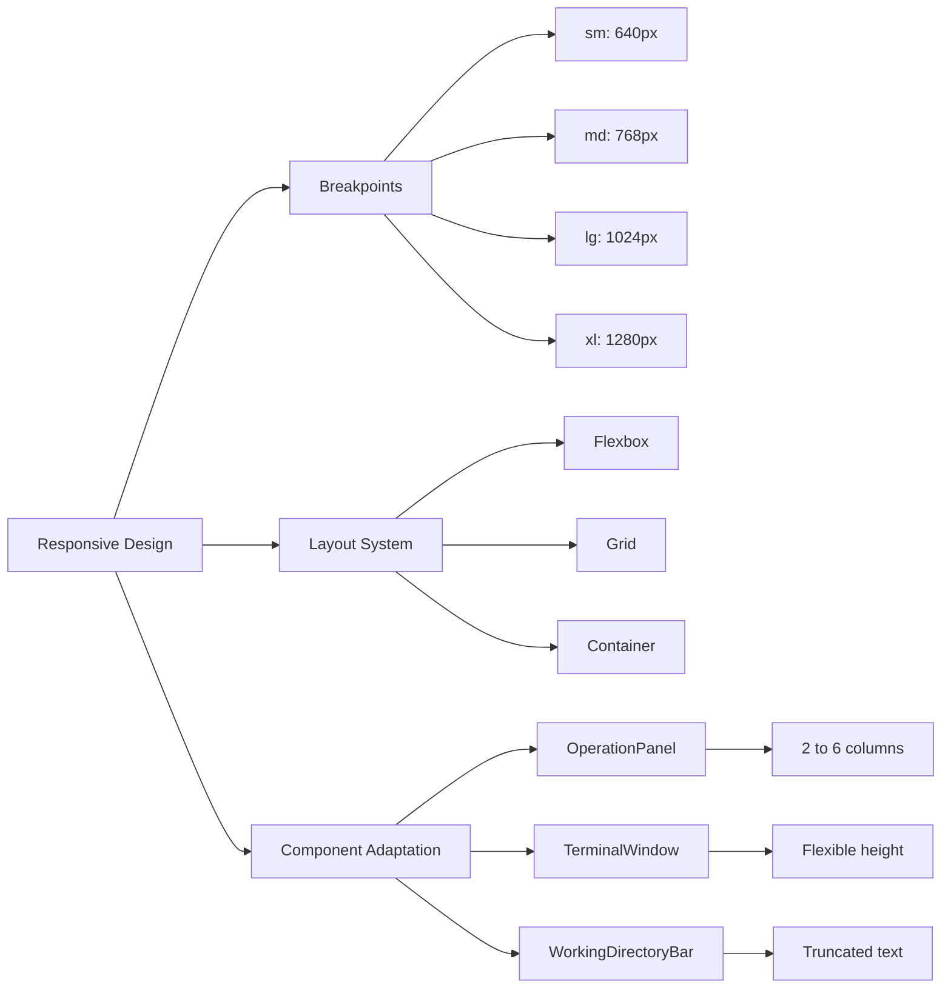
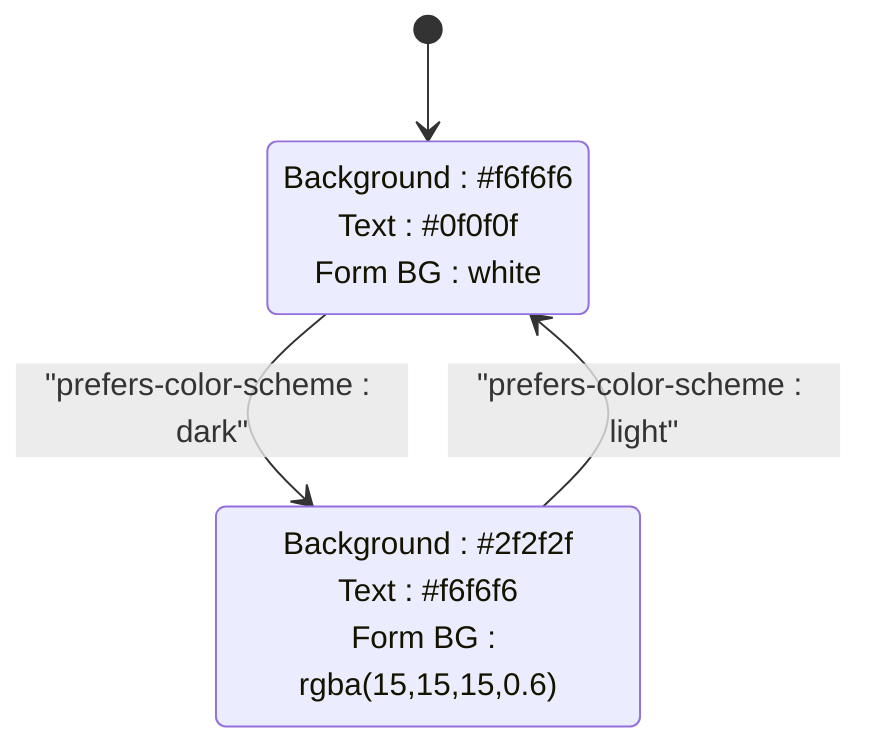
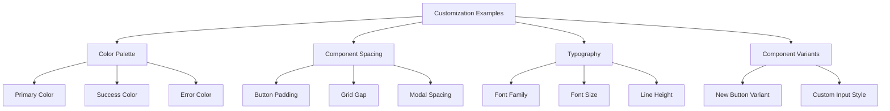
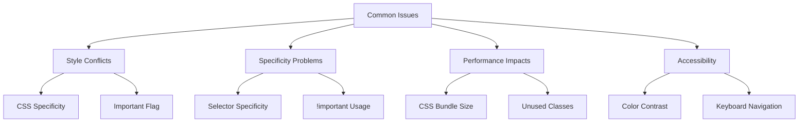
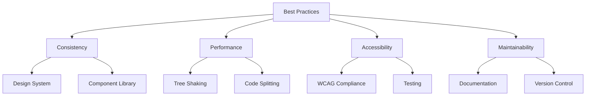

# Interface Customization and Theming

<cite>
**Referenced Files in This Document**   
- [tailwind.config.js](file://cli-ui/tailwind.config.js)
- [App.css](file://cli-ui/src/App.css)
- [OperationPanel.tsx](file://cli-ui/src/components/OperationPanel.tsx)
- [ParameterInputModal.tsx](file://cli-ui/src/components/ParameterInputModal.tsx)
- [App.tsx](file://cli-ui/src/App.tsx)
- [WorkingDirectoryBar.tsx](file://cli-ui/src/components/WorkingDirectoryBar.tsx)
- [TerminalWindow.tsx](file://cli-ui/src/components/TerminalWindow.tsx)
- [ErrorBoundary.tsx](file://cli-ui/src/components/ErrorBoundary.tsx)
- [WelcomeSetupModal.tsx](file://cli-ui/src/components/WelcomeSetupModal.tsx)
</cite>

## Table of Contents
1. [Introduction](#introduction)
2. [Tailwind CSS Integration Overview](#tailwind-css-integration-overview)
3. [Theming System Architecture](#theming-system-architecture)
4. [Component Styling with Utility Classes](#component-styling-with-utility-classes)
5. [Custom CSS and Tailwind Integration](#custom-css-and-tailwind-integration)
6. [Responsive Design Implementation](#responsive-design-implementation)
7. [Dark Mode Support](#dark-mode-support)
8. [Practical Customization Examples](#practical-customization-examples)
9. [Common Customization Issues](#common-customization-issues)
10. [Best Practices for Theme Modifications](#best-practices-for-theme-modifications)

## Introduction
This document provides comprehensive guidance on customizing the appearance and behavior of the Duck CLI GUI application. It covers the Tailwind CSS integration, theming system, component styling patterns, and practical customization techniques. The application uses a utility-first CSS approach with Tailwind CSS, combined with targeted custom CSS for specific styling needs. The documentation explains how to modify visual elements while maintaining consistency with the existing design system and ensuring accessibility across platforms.

## Tailwind CSS Integration Overview

The application integrates Tailwind CSS as its primary styling framework, following a utility-first approach that enables rapid UI development through atomic CSS classes. The configuration is minimal but effective, focusing on content scanning and theme extension.

```mermaid
graph TD
A[Tailwind CSS Integration] --> B[tailwind.config.js]
A --> C[postcss.config.js]
A --> D[App.css]
B --> E[Content Configuration]
B --> F[Theme Extension]
C --> G[Tailwind Plugin]
D --> H[@tailwind Directives]
D --> I[Custom Styles]
E --> J["./src/**/*.{js,ts,jsx,tsx}"]
F --> K[Empty extend object]
H --> L[base, components, utilities]
```

**Diagram sources**
- [tailwind.config.js](file://cli-ui/tailwind.config.js)
- [postcss.config.js](file://cli-ui/postcss.config.js)
- [App.css](file://cli-ui/src/App.css)

**Section sources**
- [tailwind.config.js](file://cli-ui/tailwind.config.js)
- [postcss.config.js](file://cli-ui/postcss.config.js)
- [App.css](file://cli-ui/src/App.css)

## Theming System Architecture

The theming system combines Tailwind's utility classes with custom CSS variables and dark mode support to create a cohesive visual experience. The application defines its color palette, typography, and spacing through a combination of framework defaults and custom overrides.

```mermaid
classDiagram
class ThemeSystem {
+string primaryColor
+string secondaryColor
+string fontFamily
+number fontSize
+number lineHeight
+boolean darkMode
+getColorScheme()
+applyTypography()
+handleDarkMode()
}
class ColorPalette {
+string blue500
+string green500
+string yellow500
+string red500
+string gray500
+getVariantColor()
+getStatusColor()
}
class Typography {
+string fontFamily
+number fontSize
+number lineHeight
+number fontWeight
+applyFontStyles()
}
ThemeSystem --> ColorPalette : "uses"
ThemeSystem --> Typography : "uses"
ThemeSystem --> "darkMode" : "media query"
```

**Diagram sources**
- [App.css](file://cli-ui/src/App.css#L82-L137)
- [tailwind.config.js](file://cli-ui/tailwind.config.js)

### Color Schemes and Palette
The application implements a comprehensive color scheme using both Tailwind's default palette and custom color definitions. The primary color system is based on blue tones, with secondary colors for success (green), warning (yellow), and error (red) states.

The color palette is applied consistently across components:
- **Primary**: Blue tones (#646cff, #396cd8) for main actions and links
- **Success**: Green tones for positive states and success messages
- **Warning**: Yellow tones for cautionary states and warnings
- **Error**: Red tones for error states and destructive actions
- **Neutral**: Gray tones for backgrounds, borders, and disabled states

The application also defines specific status colors for different validation states in the WorkingDirectoryBar component, using green for valid, red for invalid, blue for validating, and yellow for unset states.

### Typography and Font Configuration
The typography system is defined in the App.css file using CSS custom properties in the :root selector. The application uses a clean, modern font stack with Inter as the primary font, falling back to system fonts.

Key typography settings:
- **Font Family**: Inter, Avenir, Helvetica, Arial, sans-serif
- **Base Font Size**: 16px
- **Line Height**: 24px (1.5rem)
- **Font Weight**: 400 (normal), with 500 for medium emphasis
- **Text Rendering**: Optimized for legibility with anti-aliasing

The application maintains consistent typography across components, using Tailwind's text utility classes (text-sm, text-base, text-lg) for size variations and font-medium/font-semibold for weight variations.

### Responsive Design Breakpoints
The application leverages Tailwind's responsive design system with the following breakpoints:
- **Default (mobile)**: Up to 639px
- **sm**: 640px and above
- **md**: 768px and above
- **lg**: 1024px and above
- **xl**: 1280px and above

These breakpoints are used extensively throughout the components to create a responsive layout that adapts to different screen sizes. For example, the OperationPanel uses a grid layout that changes from 2 columns on mobile to 6 columns on extra-large screens.

**Section sources**
- [App.css](file://cli-ui/src/App.css#L82-L137)
- [tailwind.config.js](file://cli-ui/tailwind.config.js)
- [OperationPanel.tsx](file://cli-ui/src/components/OperationPanel.tsx#L430-L435)

## Component Styling with Utility Classes

The application components extensively use Tailwind utility classes to create consistent, responsive UI elements. This section analyzes key components and their styling patterns.



**Diagram sources**
- [OperationPanel.tsx](file://cli-ui/src/components/OperationPanel.tsx)
- [ParameterInputModal.tsx](file://cli-ui/src/components/ParameterInputModal.tsx)
- [WorkingDirectoryBar.tsx](file://cli-ui/src/components/WorkingDirectoryBar.tsx)

### OperationPanel Component Styling
The OperationPanel component demonstrates sophisticated use of Tailwind utility classes for layout, spacing, and interactive states. It uses a responsive grid system that adapts to screen size:

```tsx
<div className="grid grid-cols-2 sm:grid-cols-3 md:grid-cols-4 lg:grid-cols-5 xl:grid-cols-6 gap-3 sm:gap-4 md:gap-5 auto-rows-fr">
```

The component implements a button styling system through the getButtonStyle function, which generates Tailwind class strings based on button variant, disabled state, and execution status:

```tsx
const getButtonStyle = (variant: string, disabled: boolean, executing: boolean) => {
  const baseClasses = "relative inline-flex items-center px-3 py-2 border text-sm font-medium rounded-lg focus:outline-none focus:ring-2 focus:ring-offset-2 transition-all duration-200 h-20 w-full";
  
  if (disabled) {
    return `${baseClasses} border-gray-200 text-gray-400 bg-gray-50 cursor-not-allowed`;
  }
  
  if (executing) {
    return `${baseClasses} border-blue-300 text-blue-700 bg-blue-50 cursor-wait`;
  }

  switch (variant) {
    case 'primary':
      return `${baseClasses} border-blue-300 text-blue-700 bg-blue-50 hover:bg-blue-100 focus:ring-blue-500`;
    // ... other variants
  }
};
```

The button states include:
- **Default**: Gray border and background
- **Primary**: Blue border, text, and background with hover effect
- **Success**: Green variant for positive actions
- **Warning**: Yellow variant for cautionary actions
- **Danger**: Red variant for destructive actions
- **Disabled**: Grayed out with not-allowed cursor
- **Executing**: Blue loading state with wait cursor

### Modal Dialog Styling
Modal components like ParameterInputModal and WelcomeSetupModal use Tailwind classes to create accessible, responsive dialogs. The styling includes:

- **Backdrop**: Fixed position with gray overlay and opacity
- **Dialog Container**: Centered with shadow, rounded corners, and appropriate sizing
- **Header**: Clear title with close button using XMarkIcon
- **Content**: Spaced sections with appropriate typography
- **Footer**: Right-aligned action buttons with proper spacing

The ParameterInputModal uses utility classes for form layout and validation states:

```tsx
<div className="space-y-6">
  {commandConfig.parameters.map(param => (
    <div key={param.name}>
      <label className="block text-sm font-medium text-gray-700">
        {param.label}
        {param.required && <span className="text-red-500 ml-1">*</span>}
      </label>
      
      {renderParameterInput(param)}
      
      {errors[param.name] && (
        <div className="mt-1 flex items-center">
          <XCircleIcon className="h-4 w-4 text-red-500 mr-1" />
          <span className="text-sm text-red-600">{errors[param.name]}</span>
        </div>
      )}
    </div>
  ))}
</div>
```

The modal implements proper accessibility features including focus management, keyboard navigation, and screen reader support through appropriate ARIA attributes and semantic HTML structure.

**Section sources**
- [OperationPanel.tsx](file://cli-ui/src/components/OperationPanel.tsx)
- [ParameterInputModal.tsx](file://cli-ui/src/components/ParameterInputModal.tsx)
- [WelcomeSetupModal.tsx](file://cli-ui/src/components/WelcomeSetupModal.tsx)

## Custom CSS and Tailwind Integration

The application combines Tailwind's utility classes with custom CSS in App.css to create a cohesive design system. This hybrid approach allows for both rapid development and fine-grained control over specific styling needs.



**Diagram sources**
- [App.css](file://cli-ui/src/App.css)
- [OperationPanel.tsx](file://cli-ui/src/components/OperationPanel.tsx)

### App.css Structure and Purpose
The App.css file serves as the foundation for the application's styling, importing Tailwind's base layers and defining custom overrides:

```css
@tailwind base;
@tailwind components;
@tailwind utilities;

:root {
  font-family: Inter, Avenir, Helvetica, Arial, sans-serif;
  font-size: 16px;
  line-height: 24px;
  font-weight: 400;

  color: #0f0f0f;
  background-color: #f6f6f6;
}

input,
button {
  border-radius: 8px;
  border: 1px solid transparent;
  padding: 0.6em 1.2em;
  font-size: 1em;
  font-weight: 500;
  font-family: inherit;
  color: #0f0f0f;
  background-color: #ffffff;
  transition: border-color 0.25s;
  box-shadow: 0 2px 2px rgba(0, 0, 0, 0.2);
}
```

The file structure follows the Tailwind import order:
1. **@tailwind base**: Resets and element defaults
2. **@tailwind components**: Component classes (not used extensively)
3. **@tailwind utilities**: All utility classes

The custom CSS defines:
- **Base typography** through :root variables
- **Form element styling** for inputs and buttons
- **Link styles** with hover states
- **Layout containers** like .container and .row
- **Logo animations** with hover effects and shadows

### Extending the Design System
The application extends the Tailwind design system by defining custom styles that complement the utility classes. For example, the button styling in App.css provides a consistent base appearance that is then modified by Tailwind utility classes in components:

```css
button {
  cursor: pointer;
}

button:hover {
  border-color: #396cd8;
}

button:active {
  border-color: #396cd8;
  background-color: #e8e8e8;
}
```

This approach allows components to use Tailwind's responsive and state-based utilities while maintaining consistent base styling. The button hover effect changes the border color to blue, which complements the Tailwind hover:bg-blue-100 class used in the OperationPanel.

The application also defines custom dark mode styles using the prefers-color-scheme media query, overriding the light mode defaults:

```css
@media (prefers-color-scheme: dark) {
  :root {
    color: #f6f6f6;
    background-color: #2f2f2f;
  }

  input,
  button {
    color: #ffffff;
    background-color: #0f0f0f98;
  }
  
  button:active {
    background-color: #0f0f0f69;
  }
}
```

**Section sources**
- [App.css](file://cli-ui/src/App.css)
- [OperationPanel.tsx](file://cli-ui/src/components/OperationPanel.tsx)

## Responsive Design Implementation

The application implements responsive design through Tailwind's breakpoint system and flexible layout components. The design adapts to different screen sizes while maintaining usability and visual consistency.



**Diagram sources**
- [App.tsx](file://cli-ui/src/App.tsx)
- [OperationPanel.tsx](file://cli-ui/src/components/OperationPanel.tsx)
- [TerminalWindow.tsx](file://cli-ui/src/components/TerminalWindow.tsx)

### Layout Structure
The main application layout in App.tsx uses a combination of flexbox and responsive classes to create a flexible interface:

```tsx
<div className="h-screen flex flex-col bg-gray-100">
  {/* Top bar */}
  <WorkingDirectoryBar />
  
  {/* Main content */}
  <div className="flex-1 flex flex-col min-h-0">
    {/* Operation panel - fixed height */}
    <div className="flex-shrink-0 overflow-auto">
      <OperationPanel />
    </div>
    
    {/* Terminal window - flexible height */}
    <div className="flex-1 border-t border-gray-200 min-h-0">
      <TerminalWindow />
    </div>
  </div>
</div>
```

This layout uses:
- **flex-col**: Vertical flexbox layout
- **flex-1**: TerminalWindow takes remaining vertical space
- **flex-shrink-0**: OperationPanel maintains its height
- **min-h-0**: Prevents flex items from overflowing

### Component-Level Responsiveness
Components adapt to screen size through responsive utility classes. The OperationPanel uses a responsive grid:

```tsx
<div className="grid grid-cols-2 sm:grid-cols-3 md:grid-cols-4 lg:grid-cols-5 xl:grid-cols-6 gap-3 sm:gap-4 md:gap-5 auto-rows-fr">
```

This creates:
- 2 columns on mobile
- 3 columns on small screens (640px+)
- 4 columns on medium screens (768px+)
- 5 columns on large screens (1024px+)
- 6 columns on extra-large screens (1280px+)

The TerminalWindow component uses responsive typography and spacing:

```tsx
<div className="flex items-center justify-between px-4 py-2 border-b border-gray-200 bg-gray-50">
  <div className="flex items-center space-x-2">
    <CommandLineIcon className="h-4 w-4 text-gray-500" />
    <span className="text-sm font-medium text-gray-700">Terminal Output</span>
    {/* ... */}
    <div className="flex items-center space-x-2 text-xs text-gray-500">
      {/* Responsive stats */}
    </div>
  </div>
  {/* Responsive action buttons */}
</div>
```

The WorkingDirectoryBar truncates long directory paths on smaller screens using Tailwind's truncate utility:

```tsx
<div className="text-sm font-medium text-gray-900 truncate">
  {currentDirectory || 'No directory selected'}
</div>
```

**Section sources**
- [App.tsx](file://cli-ui/src/App.tsx)
- [OperationPanel.tsx](file://cli-ui/src/components/OperationPanel.tsx)
- [TerminalWindow.tsx](file://cli-ui/src/components/TerminalWindow.tsx)
- [WorkingDirectoryBar.tsx](file://cli-ui/src/components/WorkingDirectoryBar.tsx)

## Dark Mode Support

The application implements dark mode support through CSS media queries and component-level state management. The dark mode system provides a consistent visual experience across all components.



**Diagram sources**
- [App.css](file://cli-ui/src/App.css#L82-L137)

### System-Level Dark Mode
The application detects the user's preferred color scheme using the prefers-color-scheme media query:

```css
@media (prefers-color-scheme: dark) {
  :root {
    color: #f6f6f6;
    background-color: #2f2f2f;
  }

  a:hover {
    color: #24c8db;
  }

  input,
  button {
    color: #ffffff;
    background-color: #0f0f0f98;
  }
  
  button:active {
    background-color: #0f0f0f69;
  }
}
```

This system-level approach ensures that the entire application respects the user's OS-level dark mode preference. The color transitions are smooth and maintain proper contrast ratios for accessibility.

### Component-Specific Dark Mode
Components also implement dark mode through utility classes that respond to the system setting. For example, the ErrorBoundary component uses Tailwind's default dark mode classes:

```tsx
<div className="min-h-screen bg-gray-50 flex flex-col justify-center py-12 sm:px-6 lg:px-8">
  {/* ... */}
  <div className="bg-white py-8 px-4 shadow sm:rounded-lg sm:px-10">
    {/* ... */}
  </div>
</div>
```

The bg-gray-50 and bg-white classes automatically adapt to dark mode, changing to appropriate dark variants when the prefers-color-scheme: dark media query is active.

The TerminalWindow component implements a custom dark theme for the terminal output area:

```tsx
<div className="flex-1 overflow-y-auto p-4 bg-gray-900 text-green-400 font-mono text-sm">
```

This creates a classic terminal appearance with a black background and green text, which remains consistent regardless of the system dark mode setting, as it's appropriate for a terminal interface.

**Section sources**
- [App.css](file://cli-ui/src/App.css#L82-L137)
- [TerminalWindow.tsx](file://cli-ui/src/components/TerminalWindow.tsx)
- [ErrorBoundary.tsx](file://cli-ui/src/components/ErrorBoundary.tsx)

## Practical Customization Examples

This section provides practical examples of how to modify the application's visual style while maintaining consistency with the design system.



**Diagram sources**
- [tailwind.config.js](file://cli-ui/tailwind.config.js)
- [App.css](file://cli-ui/src/App.css)
- [OperationPanel.tsx](file://cli-ui/src/components/OperationPanel.tsx)

### Changing the Primary Color Palette
To modify the primary color palette, update the tailwind.config.js file to extend the theme:

```javascript
// cli-ui/tailwind.config.js
export default {
  content: [
    "./index.html",
    "./src/**/*.{js,ts,jsx,tsx}",
  ],
  theme: {
    extend: {
      colors: {
        primary: {
          50: '#f0f9ff',
          100: '#e0f2fe',
          200: '#bae6fd',
          300: '#7dd3fc',
          400: '#38bdf8',
          500: '#0ea5e9', // New primary blue
          600: '#0284c7',
          700: '#0369a1',
          800: '#075985',
          900: '#0c4a6e',
        },
        secondary: {
          500: '#7c3aed', // New purple secondary
        },
      },
      fontFamily: {
        sans: ['Inter', 'system-ui', 'sans-serif'],
      },
    },
  },
  plugins: [],
}
```

Then update the App.css file to use the new colors:

```css
/* cli-ui/src/App.css */
a {
  font-weight: 500;
  color: theme('colors.primary.500');
  text-decoration: inherit;
}

a:hover {
  color: theme('colors.primary.600');
}

button.primary {
  background-color: theme('colors.primary.500');
  border-color: theme('colors.primary.300');
}

button.primary:hover {
  background-color: theme('colors.primary.600');
}
```

### Adjusting Component Spacing
To modify component spacing, update the utility classes in the components or extend Tailwind's spacing scale:

```javascript
// Extend spacing in tailwind.config.js
theme: {
  extend: {
    spacing: {
      '18': '4.5rem',
      '22': '5.5rem',
      '26': '6.5rem',
      '30': '7.5rem',
    },
    gap: {
      '18': '4.5rem',
      '22': '5.5rem',
    }
  },
},
```

Or modify specific component spacing directly:

```tsx
// OperationPanel.tsx - Increase button spacing
<div className="grid grid-cols-2 sm:grid-cols-3 md:grid-cols-4 lg:grid-cols-5 xl:grid-cols-6 gap-4 sm:gap-6 md:gap-8 auto-rows-fr">
```

```css
/* App.css - Increase form element spacing */
.container {
  margin: 0;
  padding-top: 15vh; /* Increased from 10vh */
  display: flex;
  flex-direction: column;
  justify-content: center;
  text-align: center;
}
```

### Creating Custom Component Variants
To create new component variants, extend the existing styling functions:

```tsx
// OperationPanel.tsx - Add info variant to getButtonStyle
const getButtonStyle = (variant: string, disabled: boolean, executing: boolean) => {
  const baseClasses = "relative inline-flex items-center px-3 py-2 border text-sm font-medium rounded-lg focus:outline-none focus:ring-2 focus:ring-offset-2 transition-all duration-200 h-20 w-full";
  
  if (disabled) {
    return `${baseClasses} border-gray-200 text-gray-400 bg-gray-50 cursor-not-allowed`;
  }
  
  if (executing) {
    return `${baseClasses} border-blue-300 text-blue-700 bg-blue-50 cursor-wait`;
  }

  switch (variant) {
    case 'primary':
      return `${baseClasses} border-blue-300 text-blue-700 bg-blue-50 hover:bg-blue-100 focus:ring-blue-500`;
    case 'info':
      return `${baseClasses} border-cyan-300 text-cyan-700 bg-cyan-50 hover:bg-cyan-100 focus:ring-cyan-500`;
    // ... other variants
  }
};
```

**Section sources**
- [tailwind.config.js](file://cli-ui/tailwind.config.js)
- [App.css](file://cli-ui/src/App.css)
- [OperationPanel.tsx](file://cli-ui/src/components/OperationPanel.tsx)

## Common Customization Issues

This section addresses common issues encountered when customizing the application's theme and provides solutions.



**Diagram sources**
- [App.css](file://cli-ui/src/App.css)
- [OperationPanel.tsx](file://cli-ui/src/components/OperationPanel.tsx)

### Style Conflicts and Specificity Problems
When customizing the application, style conflicts can occur between Tailwind utility classes and custom CSS. The most common issues include:

**CSS Specificity Conflicts**: Custom CSS rules may not override Tailwind classes due to specificity differences. For example:

```css
/* This may not override Tailwind's bg-white */
.bg-custom {
  background-color: #f8f9fa;
}
```

**Solution**: Increase specificity or use !important (sparingly):

```css
/* Higher specificity */
.component .bg-custom {
  background-color: #f8f9fa;
}

/* Or use !important */
.bg-custom {
  background-color: #f8f9fa !important;
}
```

**Tailwind Class Order**: Tailwind classes are applied in the order they appear in the className string, with later classes potentially overriding earlier ones:

```tsx
{/* bg-red-500 will override bg-blue-500 */}
<div className="bg-blue-500 bg-red-500"></div>
```

**Solution**: Carefully order utility classes or use conditional class generation.

### Performance Impacts of Large CSS Bundles
The application's CSS bundle size can impact performance, especially with unused Tailwind classes. The current configuration scans all TSX files but may generate unused utilities.

**Optimization Strategies**:
1. **Purge unused classes** in production:
```javascript
// tailwind.config.js
module.exports = {
  purge: [
    './index.html',
    './src/**/*.{js,ts,jsx,tsx}',
  ],
  // ...
}
```

2. **Use dynamic class generation** instead of static utility combinations:
```tsx
// Instead of long className strings
const buttonClass = getButtonStyle(variant, disabled, executing);
return <button className={buttonClass} />;
```

3. **Remove unused components** from the content configuration.

### Accessibility Considerations
When modifying themes, ensure accessibility is maintained:

**Color Contrast**: Verify sufficient contrast between text and background colors:
- Minimum 4.5:1 for normal text
- Minimum 3:1 for large text
- Use tools like WebAIM Contrast Checker

**Keyboard Navigation**: Ensure all interactive elements are keyboard accessible:
- Maintain focus outlines
- Ensure logical tab order
- Provide visible focus states

**Screen Reader Support**: Maintain proper ARIA attributes and semantic HTML structure when customizing components.

**Section sources**
- [App.css](file://cli-ui/src/App.css)
- [OperationPanel.tsx](file://cli-ui/src/components/OperationPanel.tsx)

## Best Practices for Theme Modifications

This section outlines best practices for modifying the application's theme while maintaining consistency, performance, and accessibility.



**Diagram sources**
- [tailwind.config.js](file://cli-ui/tailwind.config.js)
- [App.css](file://cli-ui/src/App.css)

### Ensuring Cross-Platform Visual Consistency
To maintain visual consistency across platforms:

1. **Use Semantic Color Names**: Instead of literal colors, use semantic names that describe the purpose:
```javascript
theme: {
  extend: {
    colors: {
      'primary': colors.blue,
      'secondary': colors.gray,
      'success': colors.green,
      'warning': colors.yellow,
      'error': colors.red,
    }
  }
}
```

2. **Test on Multiple Devices**: Verify the appearance on different screen sizes, resolutions, and operating systems.

3. **Use Relative Units**: Prefer rem, em, and percentage units over pixels for better scalability.

4. **Maintain Spacing System**: Use a consistent spacing scale (e.g., 4px, 8px, 16px, 24px, 32px) throughout the application.

### Performance Optimization
To optimize theme performance:

1. **Minimize Custom CSS**: Use Tailwind utilities whenever possible instead of custom CSS rules.

2. **Purge Unused Classes**: Configure Tailwind to remove unused classes in production:
```javascript
// tailwind.config.js
module.exports = {
  mode: 'jit',
  purge: {
    enabled: process.env.NODE_ENV === 'production',
    content: [
      './index.html',
      './src/**/*.{js,ts,jsx,tsx}',
    ],
  },
}
```

3. **Use Component-Specific Styles**: Apply styles at the component level rather than globally when possible.

4. **Optimize Images and Assets**: Compress any custom images or icons used in the theme.

### Accessibility Guidelines
To ensure accessibility when modifying themes:

1. **Maintain Color Contrast**: Use tools to verify contrast ratios meet WCAG 2.1 standards.

2. **Support Reduced Motion**: Respect the prefers-reduced-motion media query:
```css
@media (prefers-reduced-motion: reduce) {
  * {
    animation-duration: 0.01ms !important;
    animation-iteration-count: 1 !important;
    transition-duration: 0.01ms !important;
  }
}
```

3. **Ensure Keyboard Accessibility**: Test all interactive elements with keyboard navigation.

4. **Use Semantic HTML**: Maintain proper heading hierarchy and ARIA attributes.

5. **Test with Screen Readers**: Verify the application works with common screen readers.

**Section sources**
- [tailwind.config.js](file://cli-ui/tailwind.config.js)
- [App.css](file://cli-ui/src/App.css)