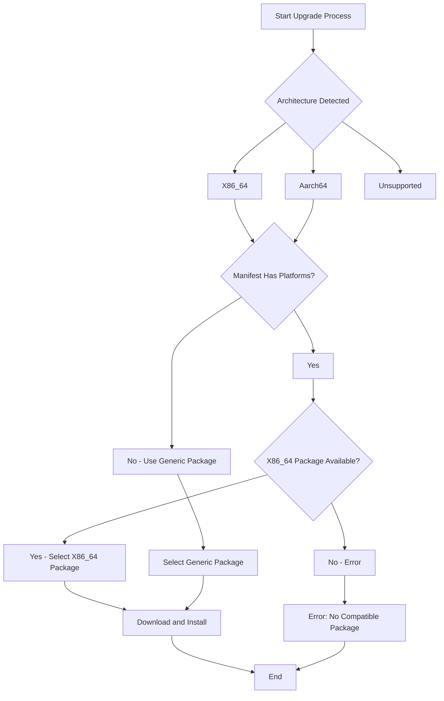
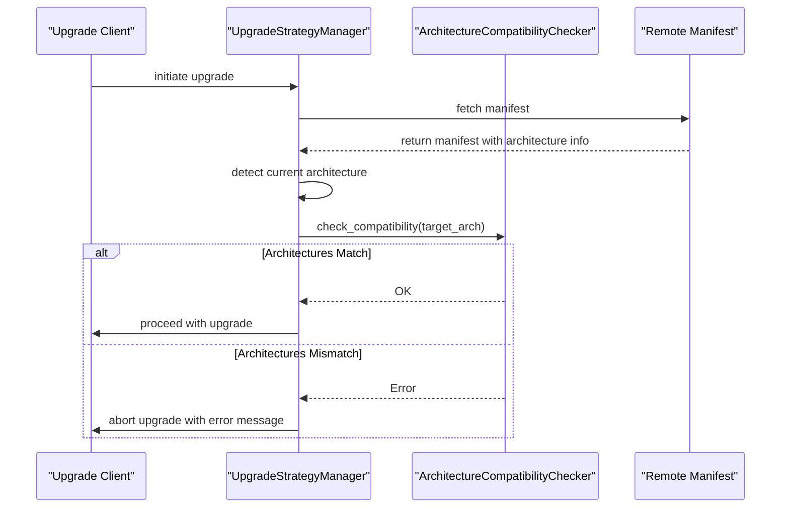
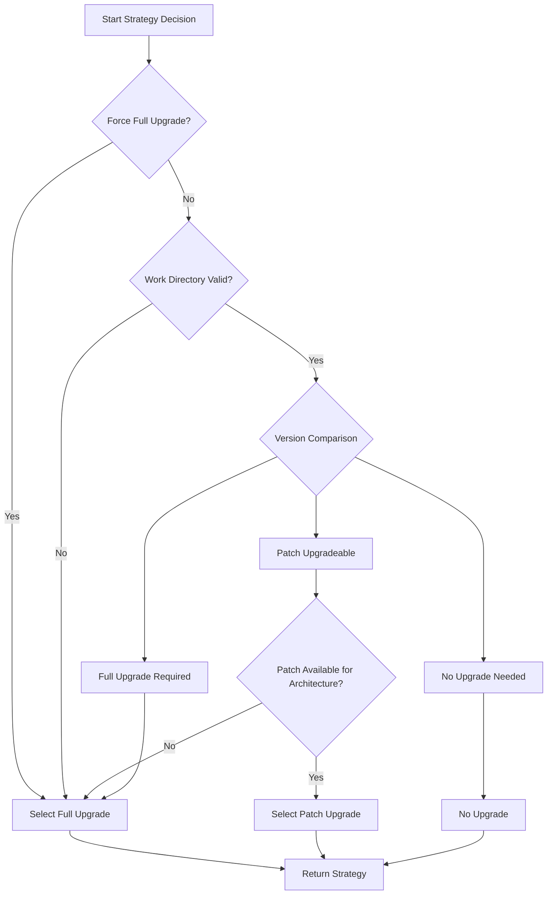

# Architecture Detection Mechanism

<cite>
**Referenced Files in This Document**   
- [architecture.rs](file://client-core/src/architecture.rs)
- [upgrade_strategy.rs](file://client-core/src/upgrade_strategy.rs)
- [api_types.rs](file://client-core/src/api_types.rs)
- [constants.rs](file://client-core/src/constants.rs)
</cite>

## Table of Contents
1. [Introduction](#introduction)
2. [Architecture Enum and Detection Logic](#architecture-enum-and-detection-logic)
3. [Package Selection During Upgrades](#package-selection-during-upgrades)
4. [Compatibility Checking and Error Handling](#compatibility-checking-and-error-handling)
5. [Runtime Architecture Detection Example](#runtime-architecture-detection-example)
6. [Integration with Upgrade Strategy](#integration-with-upgrade-strategy)
7. [Fallback Mechanisms and Unsupported Architectures](#fallback-mechanisms-and-unsupported-architectures)
8. [Common Issues and Troubleshooting](#common-issues-and-troubleshooting)
9. [Testing Architecture-Specific Behavior](#testing-architecture-specific-behavior)
10. [Extending Support to New Platforms](#extending-support-to-new-platforms)

## Introduction
The architecture detection system in the Duck Client project is responsible for identifying the underlying system architecture at runtime and using this information to make intelligent decisions about package selection during upgrade operations. This document provides a comprehensive analysis of the architecture detection mechanism implemented in `architecture.rs`, its integration with the upgrade strategy system, and how it ensures compatibility between the client system and available service packages. The system supports both x86_64 and aarch64 platforms, with extensible design for future architecture support.

## Architecture Enum and Detection Logic

The core of the architecture detection system is the `Architecture` enum defined in `architecture.rs`. This enum represents the supported system architectures and provides methods for detection, conversion, and compatibility checking.

```rust
/// Supported system architecture enumeration
#[derive(Debug, Clone, PartialEq, Eq, Hash, Serialize, Deserialize)]
pub enum Architecture {
    /// x86_64 architecture (Intel/AMD 64-bit)
    X86_64,
    /// aarch64 architecture (ARM 64-bit)
    Aarch64,
    /// Unsupported architecture
    Unsupported(String),
}
```

The detection logic uses Rust's standard library constant `std::env::consts::ARCH` to determine the current system architecture at runtime. This approach provides reliable detection across different operating systems and platforms.

```mermaid
classDiagram
class Architecture {
+X86_64
+Aarch64
+Unsupported(String)
+detect() Architecture
+get_docker_file_name() String
+as_str() &str
+from_str(arch_str : &str) Result<Architecture>
+is_supported() bool
+display_name() &str
+file_suffix() &str
+is_64bit() bool
+supported_architectures() Vec<Architecture>
+supports_incremental_upgrade() bool
}
class ArchitectureCompatibilityChecker {
+check_compatibility(target_arch : &Architecture) Result<()>
+get_system_summary() String
+supports_cross_architecture_operation(from_arch : &Architecture, to_arch : &Architecture) bool
}
note right of Architecture : : detect
Uses std : : env : : consts : : ARCH
for runtime detection
end note
note right of Architecture : : from_str
Supports multiple variants :
"x86_64", "amd64", "x64" → X86_64
"aarch64", "arm64", "armv8" → Aarch64
end note
```

**Diagram sources**
- [architecture.rs](file://client-core/src/architecture.rs#L15-L150)

**Section sources**
- [architecture.rs](file://client-core/src/architecture.rs#L15-L150)

### Detection Implementation
The `detect()` method is the primary entry point for architecture detection:

```rust
pub fn detect() -> Self {
    let arch_str = std::env::consts::ARCH;
    Self::from_str(arch_str).unwrap_or_else(|_| {
        warn!("Detected unknown architecture: {}", arch_str);
        Self::Unsupported(arch_str.to_string())
    })
}
```

This implementation follows a robust pattern:
1. Retrieve the architecture string from `std::env::consts::ARCH`
2. Attempt to parse it using `from_str()`
3. If parsing fails, create an `Unsupported` variant and log a warning

The `from_str()` method supports multiple common architecture string formats, making the system resilient to variations in how architectures are represented:

```rust
pub fn from_str(arch_str: &str) -> Result<Self> {
    match arch_str.to_lowercase().as_str() {
        "x86_64" | "amd64" | "x64" => Ok(Self::X86_64),
        "aarch64" | "arm64" | "armv8" => Ok(Self::Aarch64),
        _ => Err(anyhow::anyhow!("Unsupported architecture: {}", arch_str)),
    }
}
```

## Package Selection During Upgrades

The detected architecture directly influences package selection during both patch and full upgrades. The system uses the architecture information to match with available service packages in remote manifests, ensuring that the correct platform-specific binaries are downloaded and installed.

### Remote Manifest Structure
The `EnhancedServiceManifest` structure in `api_types.rs` contains architecture-specific package information:

```rust
/// Enhanced service update manifest response (supports architecture-specific and incremental upgrades)
#[derive(Debug, Deserialize)]
pub struct EnhancedServiceManifest {
    #[serde(deserialize_with = "crate::version::version_from_str")]
    pub version: Version,
    pub release_date: String,
    pub release_notes: String,
    pub packages: Option<ServicePackages>,
    pub platforms: Option<PlatformPackages>,
    pub patch: Option<PatchInfo>,
}

/// Platform-specific package information
#[derive(Debug, Deserialize)]
pub struct PlatformPackages {
    #[serde(rename = "x86_64")]
    pub x86_64: Option<PlatformPackageInfo>,
    #[serde(rename = "aarch64")]
    pub aarch64: Option<PlatformPackageInfo>,
}

/// Platform package information
#[derive(Debug, Deserialize, Clone)]
pub struct PlatformPackageInfo {
    pub signature: String,
    pub url: String,
}
```

This structure allows the server to provide different packages for different architectures, optimizing downloads and ensuring compatibility.



**Diagram sources**
- [api_types.rs](file://client-core/src/api_types.rs#L270-L285)
- [upgrade_strategy.rs](file://client-core/src/upgrade_strategy.rs#L250-L300)

**Section sources**
- [api_types.rs](file://client-core/src/api_types.rs#L270-L285)
- [upgrade_strategy.rs](file://client-core/src/upgrade_strategy.rs#L250-L300)

### Full Upgrade Package Selection
During a full upgrade, the system selects the appropriate package based on the detected architecture:

```rust
fn get_platform_package<'a>(&self) -> Result<crate::api_types::PlatformPackageInfo> {
    if let Some(platforms) = self.manifest.platforms.as_ref() {
        match self.architecture {
            Architecture::X86_64 => platforms
                .x86_64
                .clone()
                .ok_or_else(|| anyhow::anyhow!("No full upgrade package found for this architecture")),
            Architecture::Aarch64 => platforms
                .aarch64
                .clone()
                .ok_or_else(|| anyhow::anyhow!("No full upgrade package found for this architecture")),
            Architecture::Unsupported(_) => Err(anyhow::anyhow!("No full upgrade package found for this architecture")),
        }
    } else {
        Err(anyhow::anyhow!("No full upgrade package found for this architecture"))
    }
}
```

The system first checks if the manifest contains platform-specific packages. If so, it selects the package matching the detected architecture. If no platform-specific packages are available, it falls back to the generic package.

### Patch Upgrade Package Selection
For patch upgrades, the selection process is similar but focuses on incremental update packages:

```rust
fn get_patch_package(&self) -> Result<&PatchPackageInfo> {
    let patch_info = self
        .manifest
        .patch
        .as_ref()
        .ok_or_else(|| anyhow::anyhow!("Server does not support incremental upgrades"))?;
    match self.architecture {
        Architecture::X86_64 => patch_info
            .x86_64
            .as_ref()
            .ok_or_else(|| anyhow::anyhow!("x86_64 patch package unavailable")),
        Architecture::Aarch64 => patch_info
            .aarch64
            .as_ref()
            .ok_or_else(|| anyhow::anyhow!("aarch64 patch package unavailable")),
        Architecture::Unsupported(_) => Err(anyhow::anyhow!("Unsupported architecture")),
    }
}
```

The system verifies that both the manifest supports patch upgrades and that a patch package is available for the detected architecture.

## Compatibility Checking and Error Handling

The architecture detection system includes robust compatibility checking to prevent incompatible upgrades and provide meaningful error messages.

### Architecture Compatibility Checker
The `ArchitectureCompatibilityChecker` struct provides methods for verifying compatibility between the current system and target architectures:

```rust
pub struct ArchitectureCompatibilityChecker;

impl ArchitectureCompatibilityChecker {
    /// Check if target architecture is compatible with current system
    pub fn check_compatibility(target_arch: &Architecture) -> Result<()> {
        let current_arch = Architecture::detect();

        if current_arch == *target_arch {
            Ok(())
        } else {
            Err(anyhow::anyhow!(format!(
                "Architecture mismatch: Current system is {}, target architecture is {}",
                current_arch.display_name(),
                target_arch.display_name()
            )))
        }
    }

    /// Check if cross-architecture operations are supported
    pub fn supports_cross_architecture_operation(
        from_arch: &Architecture,
        to_arch: &Architecture,
    ) -> bool {
        // Currently does not support cross-architecture operations
        from_arch == to_arch
    }
}
```



**Diagram sources**
- [architecture.rs](file://client-core/src/architecture.rs#L200-L230)
- [upgrade_strategy.rs](file://client-core/src/upgrade_strategy.rs#L100-L150)

**Section sources**
- [architecture.rs](file://client-core/src/architecture.rs#L200-L230)
- [upgrade_strategy.rs](file://client-core/src/upgrade_strategy.rs#L100-L150)

### Error Handling for Unsupported Architectures
When an unsupported architecture is detected, the system handles it gracefully:

```rust
pub fn detect() -> Self {
    let arch_str = std::env::consts::ARCH;
    Self::from_str(arch_str).unwrap_or_else(|_| {
        warn!("Detected unknown architecture: {}", arch_str);
        Self::Unsupported(arch_str.to_string())
    })
}
```

The system creates an `Unsupported` variant of the `Architecture` enum and logs a warning message. This allows the application to continue running while making it clear that the architecture is not officially supported.

## Runtime Architecture Detection Example

Here is a practical example of architecture detection at runtime:

```rust
use client_core::architecture::Architecture;

fn main() {
    // Detect current architecture
    let current_arch = Architecture::detect();
    
    println!("Current architecture: {}", current_arch);
    println!("Architecture display name: {}", current_arch.display_name());
    println!("Is supported: {}", current_arch.is_supported());
    println!("Is 64-bit: {}", current_arch.is_64bit());
    
    // Get the appropriate Docker package filename
    let docker_filename = current_arch.get_docker_file_name();
    println!("Docker package filename: {}", docker_filename);
    
    // Check if incremental upgrade is supported
    if current_arch.supports_incremental_upgrade() {
        println!("Incremental upgrade is supported");
    } else {
        println!("Incremental upgrade is not supported");
    }
}
```

This example demonstrates the key methods available on the `Architecture` enum:
- `detect()`: Detects the current system architecture
- `display_name()`: Provides a user-friendly name for the architecture
- `is_supported()`: Checks if the architecture is officially supported
- `get_docker_file_name()`: Returns the appropriate package filename
- `supports_incremental_upgrade()`: Determines if incremental upgrades are available

**Section sources**
- [architecture.rs](file://client-core/src/architecture.rs#L30-L150)

## Integration with Upgrade Strategy

The architecture detection system is tightly integrated with the upgrade strategy decision process, ensuring that the detected architecture influences the choice between patch and full upgrades.

### Upgrade Strategy Manager
The `UpgradeStrategyManager` uses the detected architecture when determining the appropriate upgrade strategy:

```rust
pub struct UpgradeStrategyManager {
    manifest: EnhancedServiceManifest,
    current_version: String,
    force_full: bool,
    architecture: Architecture,
}

impl UpgradeStrategyManager {
    pub fn new(
        current_version: String,
        force_full: bool,
        manifest: EnhancedServiceManifest,
    ) -> Self {
        Self {
            manifest,
            current_version,
            force_full,
            architecture: Architecture::detect(),
        }
    }
}
```

The manager automatically detects the architecture during initialization and uses it throughout the decision process.

### Strategy Decision Process
The decision process considers the architecture when selecting between patch and full upgrades:

```rust
pub fn determine_strategy(&self) -> Result<UpgradeStrategy> {
    info!("🔍 Starting upgrade strategy decision");
    info!("   Current version: {}", self.current_version);
    info!("   Server version: {}", self.manifest.version);
    info!("   Target architecture: {}", self.architecture.as_str());
    info!("   Force full: {}", self.force_full);

    // ... version comparison logic ...

    match base_comparison {
        crate::version::VersionComparison::PatchUpgradeable => {
            if !self.has_patch_for_architecture() {
                info!("📦 No patch package available for current architecture, selecting full upgrade strategy");
                self.select_full_upgrade_strategy()
            } else {
                info!("⚡ Selecting patch upgrade strategy");
                self.select_patch_upgrade_strategy()
            }
        }
        crate::version::VersionComparison::FullUpgradeRequired => {
            info!("📦 Selecting full upgrade strategy");
            self.select_full_upgrade_strategy()
        }
    }
}
```



**Diagram sources**
- [upgrade_strategy.rs](file://client-core/src/upgrade_strategy.rs#L100-L200)

**Section sources**
- [upgrade_strategy.rs](file://client-core/src/upgrade_strategy.rs#L100-L200)

## Fallback Mechanisms and Unsupported Architectures

The system includes several fallback mechanisms to handle edge cases and unsupported architectures.

### Fallback to Generic Packages
When architecture-specific packages are not available, the system can fall back to generic packages:

```rust
pub fn select_full_upgrade_strategy(&self) -> Result<UpgradeStrategy> {
    debug!("🔍 Selecting full upgrade strategy");

    if let Some(_) = &self.manifest.platforms {
        // Use architecture-specific full package
        let platform_info = self.get_platform_package()?;
        debug!("📦 Using architecture-specific full package: {}", &platform_info.url);
        Ok(UpgradeStrategy::FullUpgrade {
            url: platform_info.url.clone(),
            hash: "external".to_string(),
            signature: platform_info.signature.clone(),
            target_version: self.manifest.version.clone(),
            download_type: DownloadType::Full,
        })
    } else {
        if let Some(package_info) = &self.manifest.packages {
            let full_info = &package_info.full;
            debug!("📦 Using generic full package: {}", &full_info.url);
            Ok(UpgradeStrategy::FullUpgrade {
                url: full_info.url.clone(),
                hash: full_info.hash.clone(),
                signature: full_info.signature.clone(),
                target_version: self.manifest.version.clone(),
                download_type: DownloadType::Full,
            })
        } else {
            Err(anyhow::anyhow!("No full upgrade package found for this architecture"))
        }
    }
}
```

### Handling Unsupported Architectures
For unsupported architectures, the system provides clear error messages and graceful degradation:

```rust
impl Architecture {
    pub fn is_supported(&self) -> bool {
        match self {
            Self::X86_64 | Self::Aarch64 => true,
            Self::Unsupported(_) => false,
        }
    }

    pub fn supports_incremental_upgrade(&self) -> bool {
        self.is_supported()
    }
}
```

The `is_supported()` method returns `false` for `Unsupported` variants, which prevents incremental upgrades and guides the system toward appropriate fallback behaviors.

**Section sources**
- [architecture.rs](file://client-core/src/architecture.rs#L120-L150)
- [upgrade_strategy.rs](file://client-core/src/upgrade_strategy.rs#L250-L350)

## Common Issues and Troubleshooting

### Cross-Platform Deployment Mismatches
One common issue is attempting to deploy a package built for one architecture on a different architecture. The system prevents this with strict compatibility checking:

```rust
pub fn check_compatibility(target_arch: &Architecture) -> Result<()> {
    let current_arch = Architecture::detect();

    if current_arch == *target_arch {
        Ok(())
    } else {
        Err(anyhow::anyhow!(format!(
            "Architecture mismatch: Current system is {}, target architecture is {}",
            current_arch.display_name(),
            target_arch.display_name()
        )))
    }
}
```

**Troubleshooting Steps:**
1. Verify the architecture of the deployment package
2. Check the target system architecture using `rustc --print target-list`
3. Ensure the correct package is being downloaded for the target architecture

### Emulation Scenarios
When running under emulation (e.g., Rosetta 2 on Apple Silicon), the detected architecture may not reflect the native architecture:

```rust
// The system detects the emulated architecture
let arch_str = std::env::consts::ARCH; // May report x86_64 even on aarch64 hardware
```

**Mitigation Strategies:**
1. Check for emulation environment variables
2. Use system-specific APIs to detect native architecture
3. Provide manual architecture override options

### Manifest Configuration Errors
Errors in the remote manifest can prevent proper package selection:

```rust
// Missing architecture-specific packages
{
    "version": "0.0.13",
    "platforms": {
        "x86_64": null,  // Package missing
        "aarch64": null  // Package missing
    }
}
```

**Validation Methods:**
1. Use the `validate()` method on `EnhancedServiceManifest`
2. Check for required fields before attempting upgrade
3. Provide clear error messages for missing packages

**Section sources**
- [api_types.rs](file://client-core/src/api_types.rs#L300-L400)
- [architecture.rs](file://client-core/src/architecture.rs#L200-L250)

## Testing Architecture-Specific Behavior

### Unit Testing
The system includes comprehensive unit tests for architecture detection and package selection:

```rust
#[cfg(test)]
mod tests {
    use super::*;

    #[test]
    fn test_architecture_parsing() {
        // Test x86_64 variants
        assert_eq!(
            Architecture::from_str("x86_64").unwrap(),
            Architecture::X86_64
        );
        assert_eq!(
            Architecture::from_str("amd64").unwrap(),
            Architecture::X86_64
        );
        assert_eq!(Architecture::from_str("x64").unwrap(), Architecture::X86_64);

        // Test aarch64 variants
        assert_eq!(
            Architecture::from_str("aarch64").unwrap(),
            Architecture::Aarch64
        );
        assert_eq!(
            Architecture::from_str("arm64").unwrap(),
            Architecture::Aarch64
        );
        assert_eq!(
            Architecture::from_str("armv8").unwrap(),
            Architecture::Aarch64
        );

        // Test unsupported architecture
        assert!(Architecture::from_str("mips").is_err());
    }

    #[test]
    fn test_compatibility_checker() {
        let current_arch = Architecture::detect();
        
        // Should be compatible with itself
        assert!(ArchitectureCompatibilityChecker::check_compatibility(&current_arch).is_ok());
        
        // System summary should contain useful information
        let summary = ArchitectureCompatibilityChecker::get_system_summary();
        assert!(summary.contains("Operating System"));
        assert!(summary.contains("Architecture"));
        assert!(summary.contains("64-bit support"));
    }
}
```

### Integration Testing
Integration tests verify the complete upgrade flow with architecture-specific packages:

```rust
#[test]
fn test_patch_upgrade_same_base_version() {
    let _temp_dir = setup_test_environment();
    let manager = UpgradeStrategyManager::new(
        "0.0.13".to_string(), 
        false, 
        create_test_manifest()
    );

    // Same base version, can incremental upgrade
    let strategy = manager.determine_strategy().unwrap();

    match strategy {
        UpgradeStrategy::PatchUpgrade { target_version, .. } => {
            assert_eq!(target_version, "0.0.13.2".parse::<Version>().unwrap());
        }
        _ => panic!("Should select patch upgrade strategy"),
    }
}
```

**Section sources**
- [architecture.rs](file://client-core/src/architecture.rs#L300-L450)
- [upgrade_strategy.rs](file://client-core/src/upgrade_strategy.rs#L400-L500)

## Extending Support to New Platforms

The architecture detection system is designed to be extensible for new platforms. Here are the steps to add support for a new architecture:

### 1. Update the Architecture Enum
Add the new architecture variant to the enum:

```rust
#[derive(Debug, Clone, PartialEq, Eq, Hash, Serialize, Deserialize)]
pub enum Architecture {
    X86_64,
    Aarch64,
    RiscV64,  // New architecture
    Unsupported(String),
}
```

### 2. Update String Parsing
Add support for the new architecture in `from_str()`:

```rust
pub fn from_str(arch_str: &str) -> Result<Self> {
    match arch_str.to_lowercase().as_str() {
        "x86_64" | "amd64" | "x64" => Ok(Self::X86_64),
        "aarch64" | "arm64" | "armv8" => Ok(Self::Aarch64),
        "riscv64" | "risc-v" => Ok(Self::RiscV64),  // New architecture variants
        _ => Err(anyhow::anyhow!("Unsupported architecture: {}", arch_str)),
    }
}
```

### 3. Update Display Names
Add a user-friendly display name:

```rust
pub fn display_name(&self) -> &str {
    match self {
        Self::X86_64 => "Intel/AMD 64-bit",
        Self::Aarch64 => "ARM 64-bit",
        Self::RiscV64 => "RISC-V 64-bit",  // New display name
        Self::Unsupported(_) => "Unsupported architecture",
    }
}
```

### 4. Update Package Constants
Add constants for the new package filenames in `constants.rs`:

```rust
pub mod upgrade {
    pub const DOCKER_SERVICE_RISCV64_PACKAGE: &str = "docker-riscv64.zip";
    // ... other constants
}
```

### 5. Update File Name Generation
Add the new architecture to `get_docker_file_name()`:

```rust
pub fn get_docker_file_name(&self) -> String {
    match self {
        Self::X86_64 => DOCKER_SERVICE_X86_64_PACKAGE.to_string(),
        Self::Aarch64 => DOCKER_SERVICE_AARCH64_PACKAGE.to_string(),
        Self::RiscV64 => DOCKER_SERVICE_RISCV64_PACKAGE.to_string(),  // New package
        Self::Unsupported(arch) => format!("docker-{arch}.zip"),
    }
}
```

### 6. Update Remote Manifest Support
Ensure the `EnhancedServiceManifest` structure supports the new architecture:

```rust
#[derive(Debug, Deserialize)]
pub struct PlatformPackages {
    #[serde(rename = "x86_64")]
    pub x86_64: Option<PlatformPackageInfo>,
    #[serde(rename = "aarch64")]
    pub aarch64: Option<PlatformPackageInfo>,
    #[serde(rename = "riscv64")]
    pub riscv64: Option<PlatformPackageInfo>,  // New architecture
}
```

These steps ensure that the system can detect the new architecture, select the appropriate packages, and handle compatibility checks correctly.

**Section sources**
- [architecture.rs](file://client-core/src/architecture.rs#L15-L150)
- [constants.rs](file://client-core/src/constants.rs#L330-L340)
- [api_types.rs](file://client-core/src/api_types.rs#L270-L285)