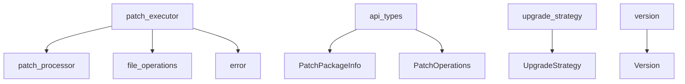
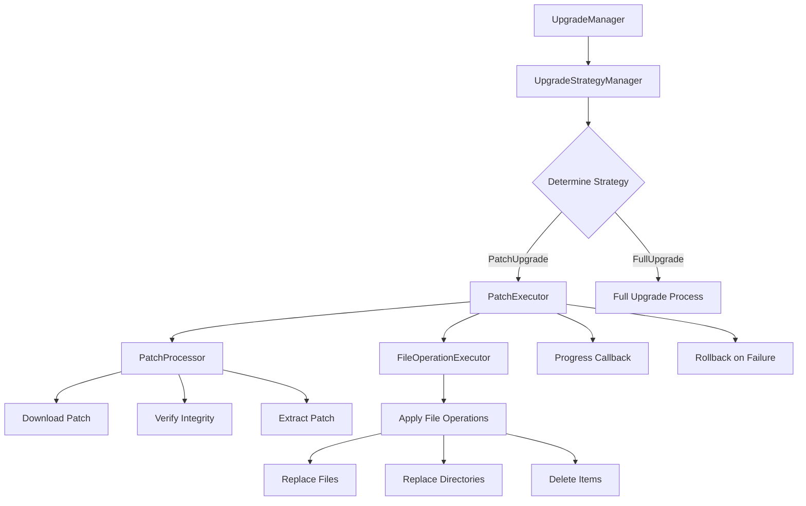
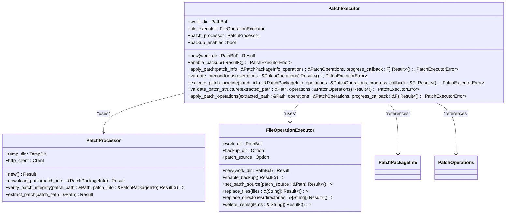
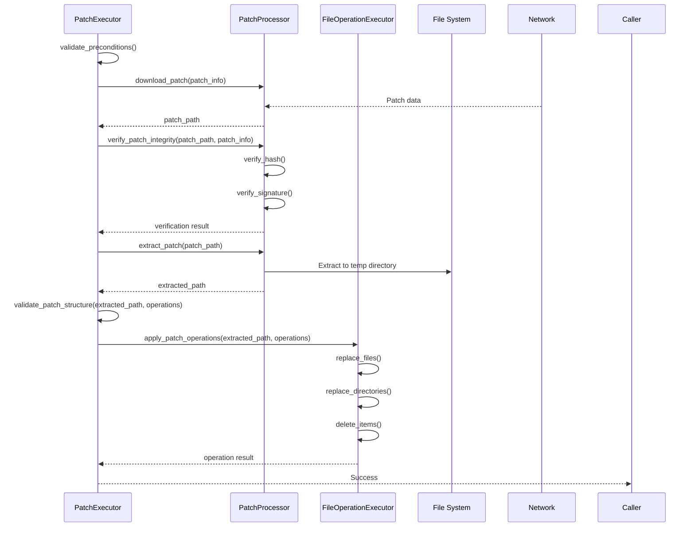
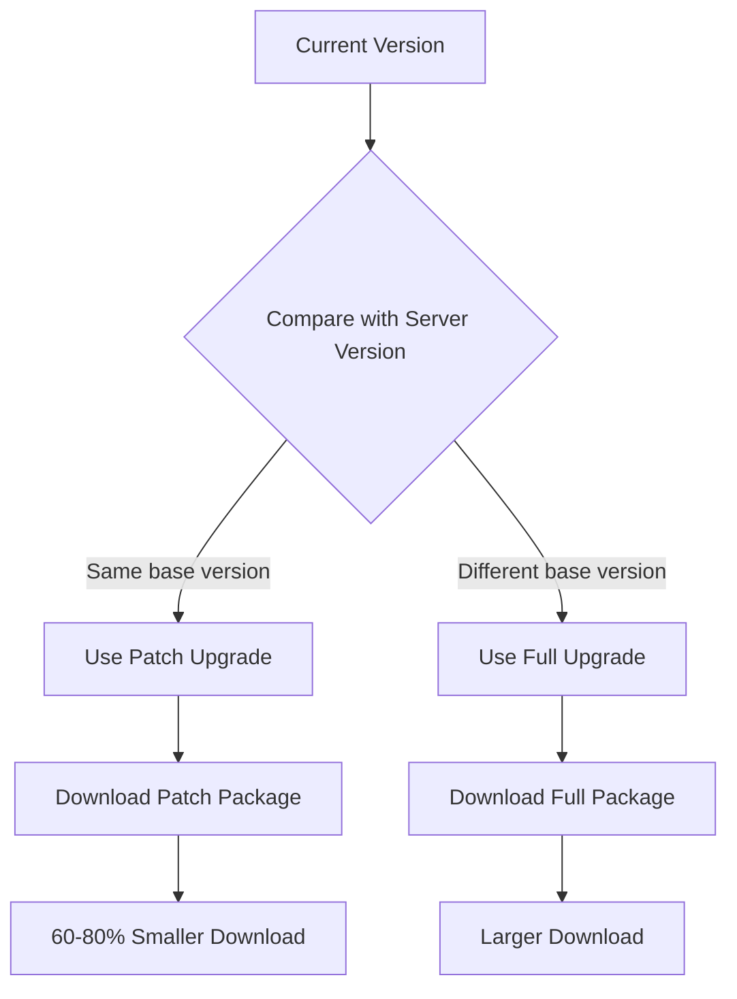
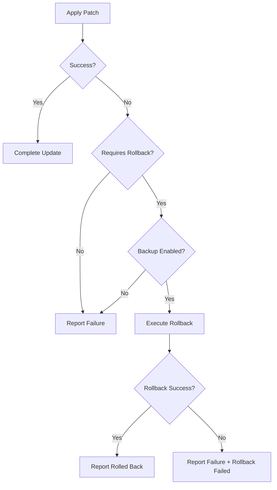

# Incremental Patch Updates

<cite>
**Referenced Files in This Document**   
- [mod.rs](file://client-core/src/patch_executor/mod.rs)
- [patch_processor.rs](file://client-core/src/patch_executor/patch_processor.rs)
- [file_operations.rs](file://client-core/src/patch_executor/file_operations.rs)
- [api_types.rs](file://client-core/src/api_types.rs)
- [upgrade_strategy.rs](file://client-core/src/upgrade_strategy.rs)
- [version.rs](file://client-core/src/version.rs)
- [patch-version-management-final.md](file://spec/patch-version-management-final.md)
</cite>

## Table of Contents
1. [Introduction](#introduction)
2. [Project Structure](#project-structure)
3. [Core Components](#core-components)
4. [Architecture Overview](#architecture-overview)
5. [Detailed Component Analysis](#detailed-component-analysis)
6. [Patch Application Workflow](#patch-application-workflow)
7. [Performance Optimizations](#performance-optimizations)
8. [Error Handling and Rollback](#error-handling-and-rollback)
9. [Best Practices](#best-practices)
10. [Conclusion](#conclusion)

## Introduction
The incremental patch update system is designed to reduce bandwidth usage by 60-80% through differential updates. This document provides a comprehensive analysis of the patch update mechanism, focusing on the implementation details, workflow, and optimization strategies. The system enables efficient updates by applying only the necessary changes rather than full package replacements.

## Project Structure
The patch update functionality is primarily located in the `client-core/src/patch_executor` module, with supporting components in related modules. The system follows a modular architecture with clear separation of concerns between patch processing, file operations, and upgrade strategy management.

**Diagram sources**
- [mod.rs](file://client-core/src/patch_executor/mod.rs)
- [api_types.rs](file://client-core/src/api_types.rs)
- [upgrade_strategy.rs](file://client-core/src/upgrade_strategy.rs)
- [version.rs](file://client-core/src/version.rs)

## Core Components
The incremental patch update system consists of several core components that work together to deliver efficient updates. The main components include the PatchExecutor, PatchProcessor, FileOperationExecutor, and supporting data structures for patch management.

**Section sources**
- [mod.rs](file://client-core/src/patch_executor/mod.rs#L1-L50)
- [api_types.rs](file://client-core/src/api_types.rs#L1-L50)

## Architecture Overview
The patch update system follows a pipeline architecture that coordinates multiple stages of patch application. The system is designed to be modular, with each component responsible for a specific aspect of the update process.

**Diagram sources**
- [mod.rs](file://client-core/src/patch_executor/mod.rs#L1-L50)
- [upgrade_strategy.rs](file://client-core/src/upgrade_strategy.rs#L1-L50)
- [patch_processor.rs](file://client-core/src/patch_executor/patch_processor.rs#L1-L50)
- [file_operations.rs](file://client-core/src/patch_executor/file_operations.rs#L1-L50)

## Detailed Component Analysis

### PatchExecutor Analysis
The PatchExecutor is the main coordinator for the patch application process. It manages the workflow from download to application, handling progress tracking and error recovery.

**Diagram sources**
- [mod.rs](file://client-core/src/patch_executor/mod.rs#L1-L200)
- [patch_processor.rs](file://client-core/src/patch_executor/patch_processor.rs#L1-L50)
- [file_operations.rs](file://client-core/src/patch_executor/file_operations.rs#L1-L50)

**Section sources**
- [mod.rs](file://client-core/src/patch_executor/mod.rs#L1-L200)

### Patch Processing Workflow
The patch processing workflow involves several sequential steps that ensure safe and reliable patch application. The process begins with download and verification, followed by extraction and structural validation.

**Diagram sources**
- [mod.rs](file://client-core/src/patch_executor/mod.rs#L1-L200)
- [patch_processor.rs](file://client-core/src/patch_executor/patch_processor.rs#L1-L200)
- [file_operations.rs](file://client-core/src/patch_executor/file_operations.rs#L1-L200)

**Section sources**
- [mod.rs](file://client-core/src/patch_executor/mod.rs#L1-L200)
- [patch_processor.rs](file://client-core/src/patch_executor/patch_processor.rs#L1-L200)
- [file_operations.rs](file://client-core/src/patch_executor/file_operations.rs#L1-L200)

## Patch Application Workflow

### Download and Verification Process
The patch application workflow begins with downloading the patch package from the specified URL. The PatchProcessor handles the download using an HTTP client with a 5-minute timeout. During download, progress is tracked based on content length, providing real-time feedback through debug logs.

After download, the patch integrity is verified through multiple checks:
1. File existence verification
2. Hash validation (SHA256) against the expected hash in PatchPackageInfo
3. Digital signature verification (currently simplified, with base64 format checking)

The hash verification compares the computed SHA256 hash of the downloaded file with the expected hash, which can be provided in "sha256:hash_value" format or as a plain hash value.

### Patch Extraction and Structure Validation
Once verified, the patch is extracted from its tar.gz format to a temporary directory. This operation is performed in a blocking task to prevent async runtime blocking. The extraction process creates a dedicated "extracted" subdirectory within the temporary directory.

Following extraction, the patch structure is validated against the declared operations in PatchOperations. The validation ensures that:
- All files listed for replacement exist in the extracted patch
- All directories listed for replacement exist as directories in the extracted patch
- The file structure matches the expected layout

### File Operations Execution
The FileOperationExecutor applies the patch operations to the working directory. The executor supports three types of operations:
- File replacement
- Directory replacement
- Item deletion

Each operation is performed atomically with backup support. When backup is enabled, the executor creates a temporary backup directory and copies existing files/directories before modification. This enables rollback in case of failure.

For file replacement, the process involves:
1. Creating a backup of the target file if it exists
2. Atomically replacing the file with the new version from the patch

Directory replacement follows a similar pattern:
1. Backing up the existing directory if it exists
2. Removing the target directory
3. Copying the new directory from the patch

Deletion operations also create backups before removing files or directories, allowing restoration if needed.

**Section sources**
- [mod.rs](file://client-core/src/patch_executor/mod.rs#L1-L432)
- [patch_processor.rs](file://client-core/src/patch_executor/patch_processor.rs#L1-L455)
- [file_operations.rs](file://client-core/src/patch_executor/file_operations.rs#L1-L524)
- [api_types.rs](file://client-core/src/api_types.rs#L1-L902)

## Performance Optimizations

### Parallel Processing and Memory Efficiency
The patch update system incorporates several performance optimizations to minimize resource usage and maximize efficiency:

1. **Asynchronous Operations**: All I/O operations are performed asynchronously using Tokio, allowing non-blocking execution and efficient resource utilization.

2. **Streaming Downloads**: The patch download process uses streaming to avoid loading the entire file into memory at once. Data is written directly to disk as it arrives.

3. **Blocking Task for Extraction**: CPU-intensive tar.gz extraction is offloaded to a blocking task to prevent async runtime thread blocking.

4. **Progressive Processing**: The pipeline architecture processes the patch in stages, releasing resources as each stage completes.

5. **Temporary Directory Management**: The system uses temporary directories for patch storage and extraction, ensuring automatic cleanup and preventing disk space leaks.

### Bandwidth Reduction Through Differential Updates
The incremental patch system achieves 60-80% bandwidth reduction by only transmitting changed files. The PatchOperations structure explicitly defines which files and directories need to be replaced or deleted, eliminating the need to transfer unchanged content.

The versioning system supports this optimization through a four-segment version format (major.minor.patch.build), where the build number represents the patch level. This allows the upgrade strategy manager to determine when a patch upgrade is possible versus requiring a full upgrade.

**Diagram sources**
- [version.rs](file://client-core/src/version.rs#L1-L410)
- [upgrade_strategy.rs](file://client-core/src/upgrade_strategy.rs#L1-L463)

**Section sources**
- [version.rs](file://client-core/src/version.rs#L1-L410)
- [upgrade_strategy.rs](file://client-core/src/upgrade_strategy.rs#L1-L463)

## Error Handling and Rollback

### Failure Recovery Mechanism
The patch update system includes comprehensive error handling and automatic rollback capabilities. When an error occurs during patch application, the system evaluates whether rollback is required based on the error type.

If backup mode is enabled and the error requires rollback, the system automatically initiates the rollback process. The rollback restores all modified files and directories from the backup, returning the system to its pre-update state.

The error handling workflow:
1. Attempt patch application
2. On failure, check if rollback is required and backup is enabled
3. If conditions are met, execute rollback
4. Report final status (success, failed with rollback, or failed without rollback)

### Common Failure Scenarios
The system handles several common failure scenarios:

**Partial Patch Failures**: When a patch operation fails midway, the system stops further operations and initiates rollback if enabled. This prevents the system from being left in an inconsistent state.

**Hash Mismatches**: If the downloaded patch hash doesn't match the expected hash, the system aborts the update process before any changes are applied. This ensures file integrity and prevents corrupted updates.

**Interrupted Transfers**: Network interruptions during download are handled gracefully. The download process can be resumed, and partial downloads are cleaned up automatically.

**File System Errors**: Permission issues, disk space limitations, and other file system errors trigger appropriate error responses and rollback when possible.

**Diagram sources**
- [mod.rs](file://client-core/src/patch_executor/mod.rs#L1-L432)
- [error.rs](file://client-core/src/patch_executor/error.rs#L1-L50)

**Section sources**
- [mod.rs](file://client-core/src/patch_executor/mod.rs#L1-L432)

## Best Practices

### Patch Package Design
To maximize efficiency and reliability, follow these best practices for designing patch packages:

1. **Minimize Patch Size**: Include only files that have actually changed. Avoid including unchanged files or directories.

2. **Atomic Operations**: Design patches to be atomic - either all operations succeed or none do. This simplifies rollback and error recovery.

3. **Clear Operation Definitions**: Explicitly define all file replacements and deletions in the PatchOperations structure.

4. **Comprehensive Testing**: Test patches thoroughly in staging environments before deployment.

5. **Version Compatibility**: Ensure patches are compatible with the target version range and include appropriate version constraints.

### Server-Side Manifest Generation
For optimal efficiency, follow these guidelines for server-side manifest generation:

1. **Accurate Hash Calculation**: Generate accurate SHA256 hashes for patch packages to enable integrity verification.

2. **Proper Versioning**: Use the four-segment version format (major.minor.patch.build) to enable proper patch applicability determination.

3. **Architecture-Specific Packages**: Provide separate patch packages for different architectures (x86_64, aarch64) to optimize downloads.

4. **Complete Operation Lists**: Include comprehensive lists of all files and directories that will be modified.

5. **Digital Signatures**: Implement proper digital signature verification to ensure patch authenticity.

6. **Clear Release Notes**: Include descriptive notes about the changes in each patch to inform users.

**Section sources**
- [patch-version-management-final.md](file://spec/patch-version-management-final.md#L1-L705)
- [api_types.rs](file://client-core/src/api_types.rs#L1-L902)

## Conclusion
The incremental patch update system provides an efficient mechanism for reducing bandwidth usage by 60-80% through differential updates. By applying only the necessary changes rather than full package replacements, the system optimizes both download times and storage requirements.

The architecture is modular and robust, with clear separation between download, verification, extraction, and application phases. The system includes comprehensive error handling and automatic rollback capabilities to ensure reliability and prevent system corruption.

Key advantages of the system include:
- Significant bandwidth reduction through differential updates
- Atomic operations with backup and rollback support
- Comprehensive integrity verification through hash and signature checking
- Asynchronous, non-blocking operations for optimal performance
- Clear versioning system that enables intelligent upgrade decisions

The implementation follows best practices for secure and reliable software updates, making it a robust solution for maintaining up-to-date client applications with minimal resource consumption.