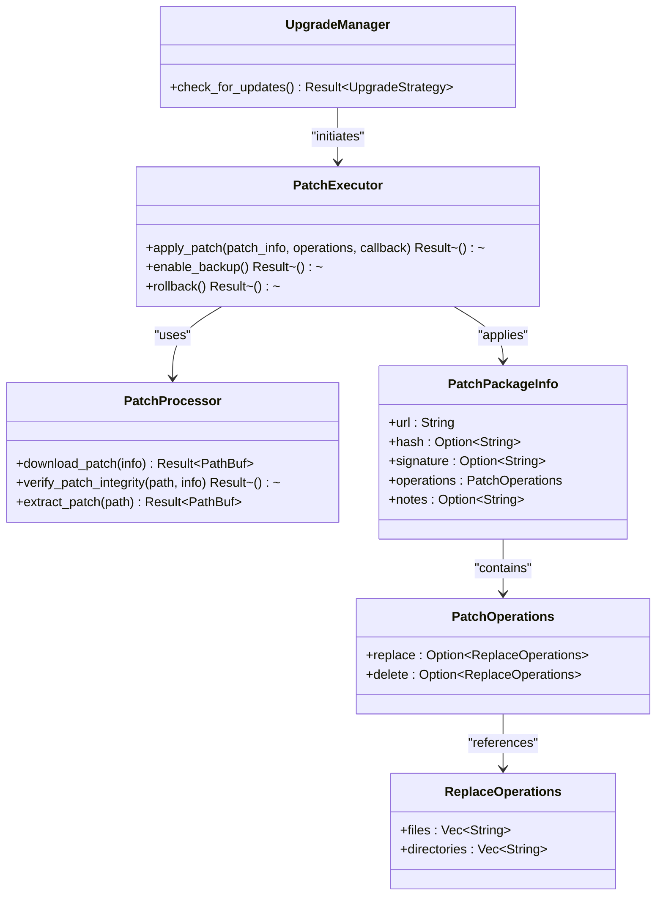
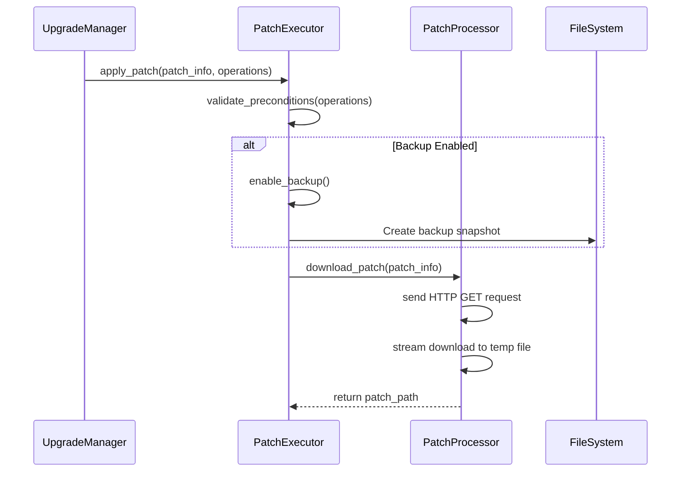
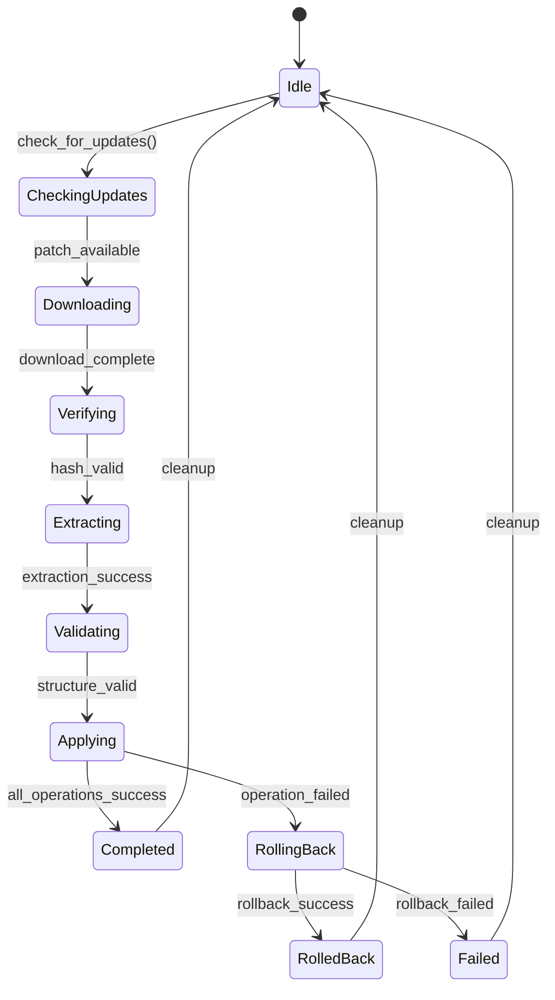
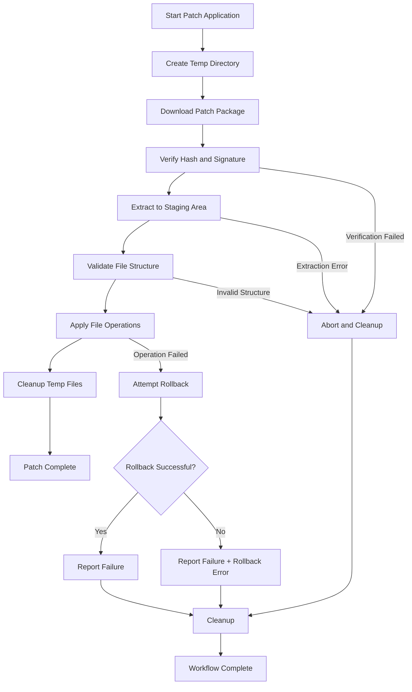

# Patch Application Workflow

<cite>
**Referenced Files in This Document**   
- [upgrade.rs](file://client-core/src/upgrade.rs#L1-L89)
- [patch_processor.rs](file://client-core/src/patch_executor/patch_processor.rs#L1-L455)
- [api_types.rs](file://client-core/src/api_types.rs#L1-L902)
- [mod.rs](file://client-core/src/patch_executor/mod.rs#L1-L400)
</cite>

## Table of Contents
1. [Patch Application Workflow](#patch-application-workflow)
2. [Core Components](#core-components)
3. [Patch Application Lifecycle](#patch-application-lifecycle)
4. [State Transitions and Error Handling](#state-transitions-and-error-handling)
5. [Data Consistency and Transactional Patterns](#data-consistency-and-transactional-patterns)
6. [Performance Considerations](#performance-considerations)

## Core Components

The patch application workflow is orchestrated through several core components that work together to ensure reliable and atomic updates. The primary components include `UpgradeManager`, `PatchProcessor`, and `PatchExecutor`, each responsible for distinct phases of the patch lifecycle.

The `UpgradeManager` in `upgrade.rs` serves as the entry point for the patch workflow, coordinating high-level operations such as update checking and strategy determination. It interacts with the API client to retrieve service manifests and determine whether a patch or full upgrade is required.

The `PatchProcessor` handles the low-level operations of downloading, verifying, and extracting patch packages. It uses a temporary directory to safely stage patch contents before application, ensuring that the main application directory remains unaffected until all validations pass.

The `PatchPackageInfo` structure, defined in `api_types.rs`, encapsulates metadata about a patch including its download URL, cryptographic hash, digital signature, and a set of file operations to be applied. This structure is central to the patching process, as it defines exactly what changes will be made to the system.



**Diagram sources**
- [upgrade.rs](file://client-core/src/upgrade.rs#L1-L89)
- [patch_processor.rs](file://client-core/src/patch_executor/patch_processor.rs#L1-L455)
- [api_types.rs](file://client-core/src/api_types.rs#L1-L902)
- [mod.rs](file://client-core/src/patch_executor/mod.rs#L1-L400)

**Section sources**
- [upgrade.rs](file://client-core/src/upgrade.rs#L1-L89)
- [patch_processor.rs](file://client-core/src/patch_executor/patch_processor.rs#L1-L455)
- [api_types.rs](file://client-core/src/api_types.rs#L1-L902)

## Patch Application Lifecycle

The patch application lifecycle follows a well-defined sequence of operations that ensures reliability and data integrity. The process begins with pre-patch validation and ends with final verification.

### Pre-Patch Validation and Backup Preparation

Before any patch operations begin, the system performs a series of validation checks. The `validate_preconditions` method in `patch_executor/mod.rs` verifies that the working directory exists and is writable, and that the patch contains at least one operation to perform.



**Diagram sources**
- [mod.rs](file://client-core/src/patch_executor/mod.rs#L41-L90)
- [patch_processor.rs](file://client-core/src/patch_executor/patch_processor.rs#L50-L100)

**Section sources**
- [mod.rs](file://client-core/src/patch_executor/mod.rs#L41-L90)
- [patch_processor.rs](file://client-core/src/patch_executor/patch_processor.rs#L50-L100)

### Concurrent Download and Verification

The patch download process is implemented in `PatchProcessor::download_patch`, which uses an asynchronous HTTP client to stream the patch file to a temporary location. The download includes progress reporting through debug logs that show percentage completion.

After download, the system verifies the patch integrity through multiple mechanisms:
- File existence check
- SHA-256 hash verification against the expected value in `PatchPackageInfo`
- Digital signature validation (currently a placeholder for base64 format checking)

The verification process is implemented in `verify_patch_integrity` and its helper methods, ensuring that only authentic and uncorrupted patches are applied.

### Atomic Application of Changes

The patch application is designed to be atomic through the use of temporary staging directories and transactional patterns. The `execute_patch_pipeline` method orchestrates the entire process:

1. Download patch to temporary directory
2. Verify integrity and signature
3. Extract to isolated temporary directory
4. Validate file structure matches expected operations
5. Apply file operations atomically

The actual file operations are performed by the `file_executor`, which handles replacing and deleting files as specified in the `PatchOperations` structure. Progress is reported through the callback function at key milestones.

## State Transitions and Error Handling

The patch application system implements robust error handling with automatic rollback capabilities when failures occur.

### State Transition Model



**Diagram sources**
- [mod.rs](file://client-core/src/patch_executor/mod.rs#L131-L174)
- [patch_processor.rs](file://client-core/src/patch_executor/patch_processor.rs#L150-L200)

**Section sources**
- [mod.rs](file://client-core/src/patch_executor/mod.rs#L131-L174)

### Error Handling and Rollback

When a patch operation fails, the system attempts automatic rollback if backup mode is enabled. The error handling pattern in `apply_patch` captures the original error and attempts rollback:

```rust
match self.execute_patch_pipeline(...).await {
    Ok(_) => { /* success path */ }
    Err(e) => {
        if e.requires_rollback() && self.backup_enabled {
            warn!("🔄 Starting automatic rollback...");
            if let Err(rollback_err) = self.rollback().await {
                return Err(PatchExecutorError::rollback_failed(
                    format!("Original error: {e}, Rollback error: {rollback_err}")
                ));
            }
            info!("✅ Automatic rollback completed");
        }
        Err(e)
    }
}
```

The `requires_rollback()` method determines whether a given error condition necessitates reverting changes, typically for errors that occur after file modifications have begun.

## Data Consistency and Transactional Patterns

The system ensures data consistency through several mechanisms:

### Temporary Staging Directories

All patch operations use temporary directories managed by the `tempfile` crate. The `PatchProcessor` creates a `TempDir` on initialization, which is automatically cleaned up when dropped. This ensures that incomplete or failed operations do not leave residual files.

The staging process follows this pattern:
1. Download patch to `temp_dir/patch.tar.gz`
2. Extract to `temp_dir/extracted/`
3. Validate extracted files against expected operations
4. Apply changes from extracted directory to target

### Isolated File Operations

File operations are isolated through the `file_executor`, which maintains a reference to the patch source directory. This separation ensures that only files explicitly listed in the `PatchOperations` structure are modified, preventing accidental changes to unrelated files.

The system also includes security checks to prevent path traversal attacks by rejecting any file paths that contain `../` or start with root references.



**Diagram sources**
- [patch_processor.rs](file://client-core/src/patch_executor/patch_processor.rs#L1-L455)
- [mod.rs](file://client-core/src/patch_executor/mod.rs#L1-L400)

**Section sources**
- [patch_processor.rs](file://client-core/src/patch_executor/patch_processor.rs#L1-L455)
- [mod.rs](file://client-core/src/patch_executor/mod.rs#L1-L400)

## Performance Considerations

The patch application system includes several optimizations for performance and resource usage.

### Memory Usage During Large Patch Application

Large patches are handled efficiently through streaming operations:
- The download process streams data directly to disk without loading the entire file into memory
- Extraction occurs in a blocking task to prevent async runtime blocking
- File operations are processed sequentially to minimize memory footprint

The system does not attempt to load the entire patch into memory, instead processing it in chunks during download and using the filesystem as the primary storage medium.

### Disk I/O Optimization Strategies

Several strategies are employed to optimize disk I/O:

1. **Sequential Processing**: Operations are performed in a defined sequence to minimize disk head movement
2. **Batched Operations**: File replacements and deletions are grouped by type to reduce filesystem metadata updates
3. **Progressive Verification**: Integrity checks are performed as early as possible to avoid unnecessary I/O on corrupted files

The progress callback system provides visibility into the operation's progress, reporting key milestones at 5%, 25%, 35%, 45%, 50%, and 100% completion, allowing the UI to provide meaningful feedback to users.

The system also includes appropriate timeouts (5 minutes for HTTP operations) to prevent indefinite hangs during network operations, ensuring that the patch process remains responsive even under poor network conditions.