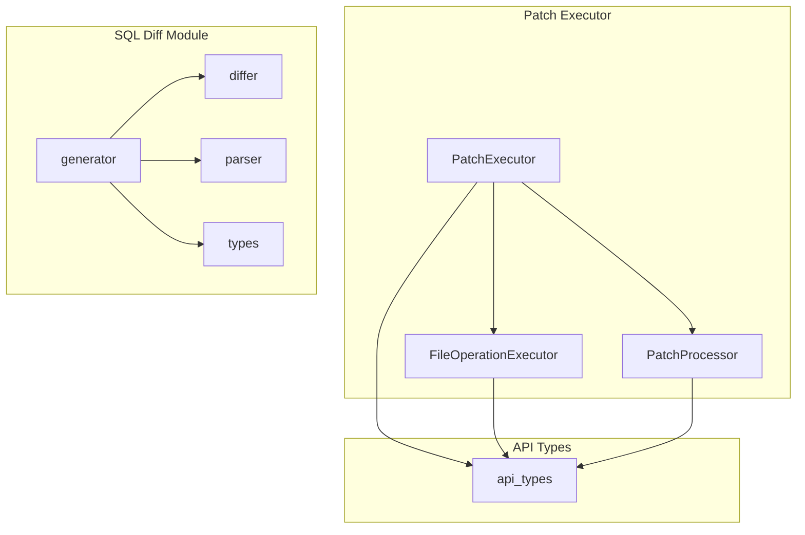
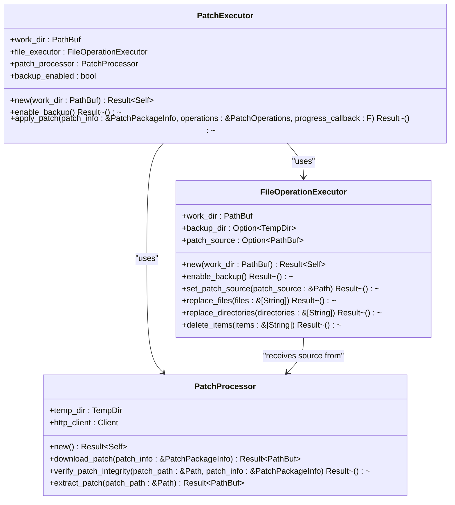
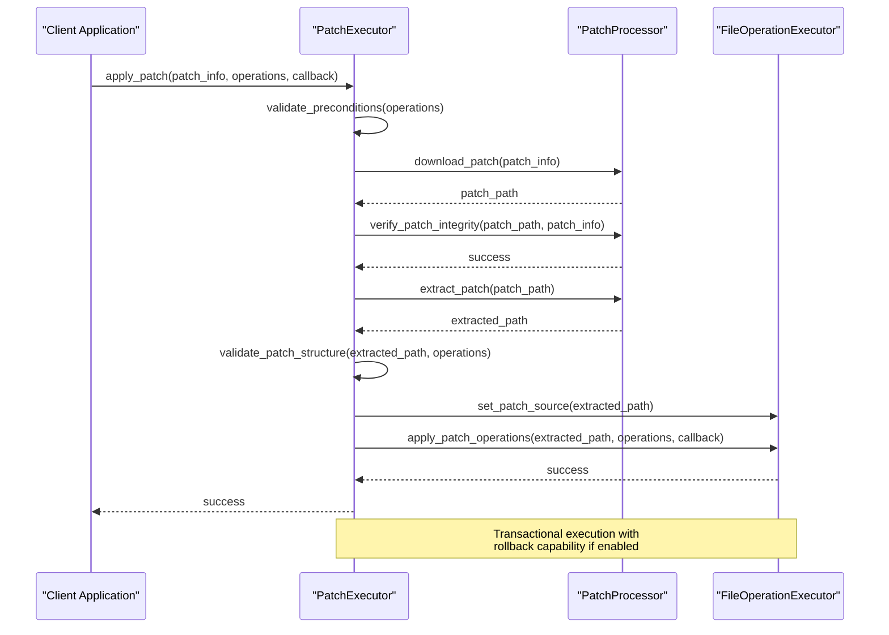
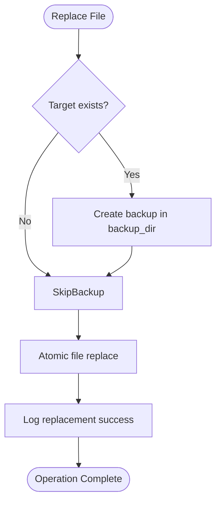
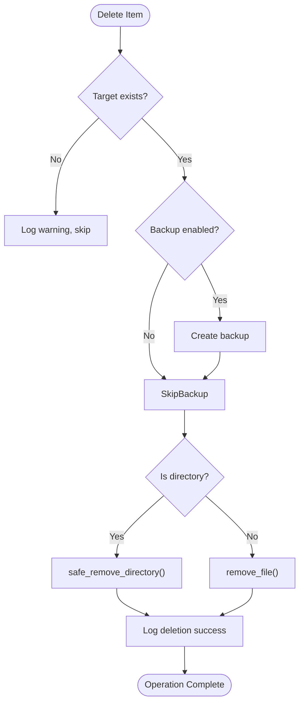
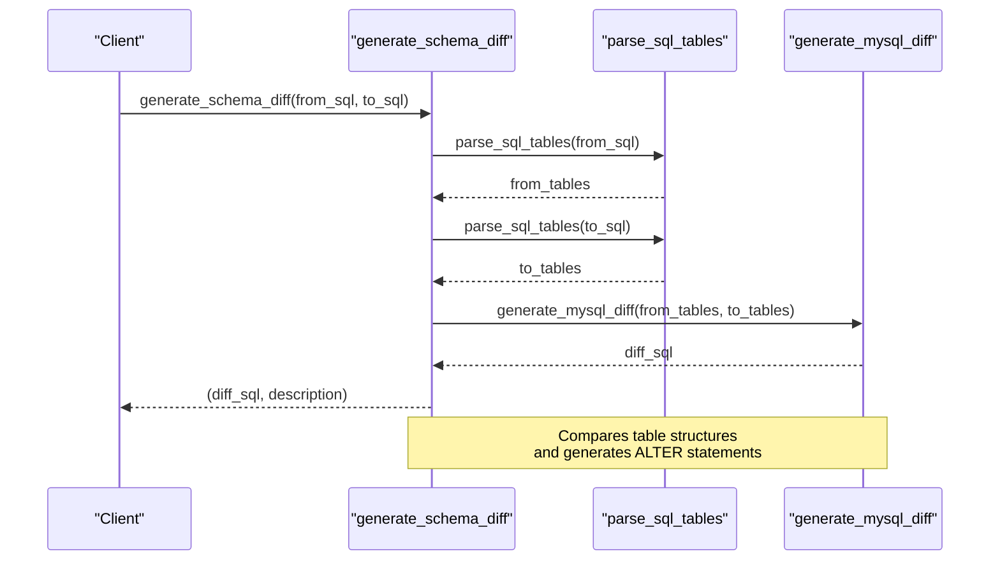
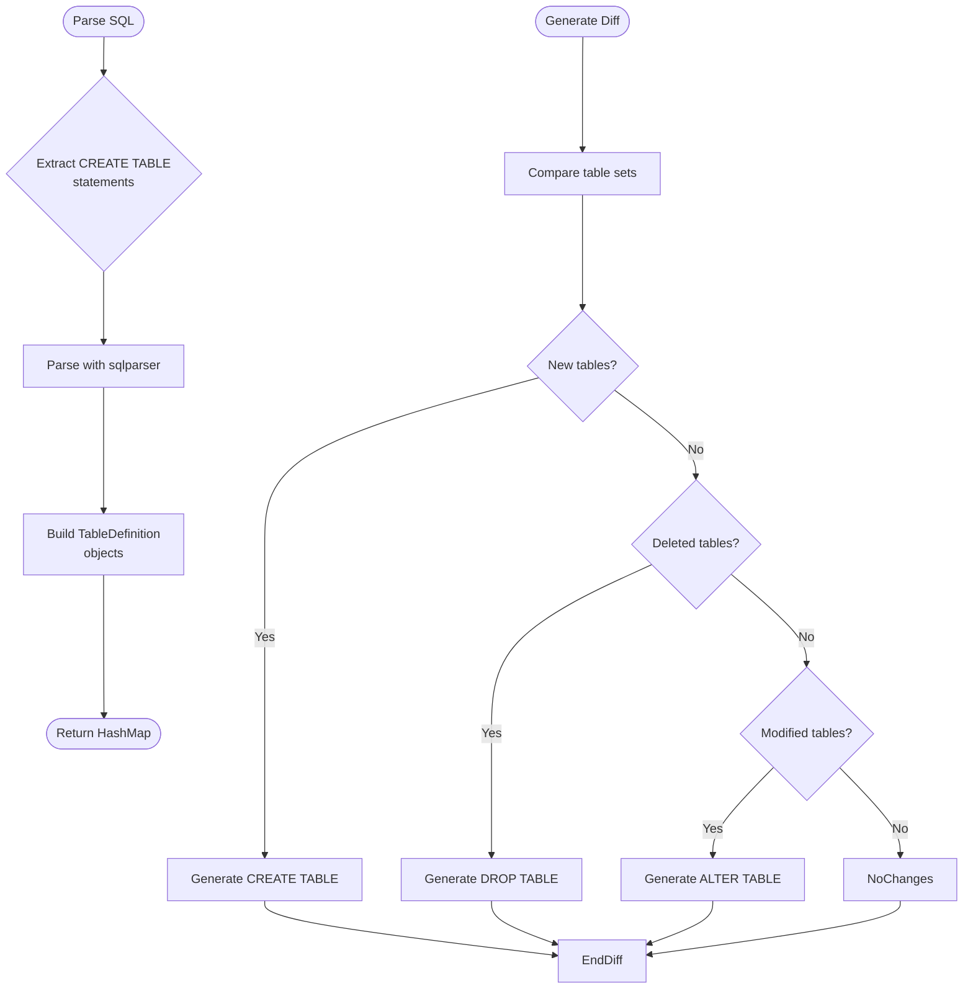
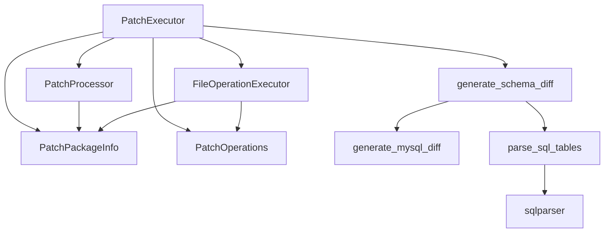
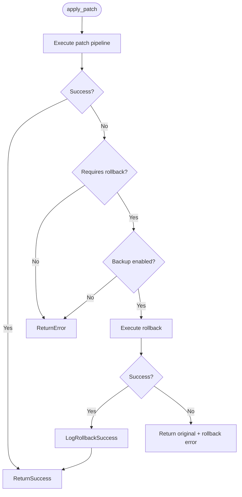

# Patch Operations Engine

<cite>
**Referenced Files in This Document**   
- [mod.rs](file://client-core/src/patch_executor/mod.rs#L0-L432)
- [file_operations.rs](file://client-core/src/patch_executor/file_operations.rs#L0-L524)
- [patch_processor.rs](file://client-core/src/patch_executor/patch_processor.rs#L0-L455)
- [generator.rs](file://client-core/src/sql_diff/generator.rs#L0-L195)
- [differ.rs](file://client-core/src/sql_diff/differ.rs#L0-L266)
- [parser.rs](file://client-core/src/sql_diff/parser.rs#L0-L381)
- [types.rs](file://client-core/src/sql_diff/types.rs#L0-L31)
- [api_types.rs](file://client-core/src/api_types.rs#L0-L902)
</cite>

## Table of Contents
1. [Introduction](#introduction)
2. [Project Structure](#project-structure)
3. [Core Components](#core-components)
4. [Patch Application Workflow](#patch-application-workflow)
5. [File Operations Implementation](#file-operations-implementation)
6. [SQL Schema Migration System](#sql-schema-migration-system)
7. [Dependency Analysis](#dependency-analysis)
8. [Error Handling and Recovery](#error-handling-and-recovery)
9. [Performance Considerations](#performance-considerations)
10. [Conclusion](#conclusion)

## Introduction
The Patch Operations Engine is responsible for executing incremental updates in the duck_client application. It handles both file system modifications and database schema migrations through a robust, transactional process that ensures data integrity and supports rollback capabilities. The engine is designed to apply binary file replacements, directory restructuring, and SQL schema changes in a safe and atomic manner.

This document provides a comprehensive analysis of the patch operations engine, focusing on its architecture, implementation details, and integration points. The system is built using Rust and follows a modular design with clear separation of concerns between patch downloading, verification, file operations, and database migrations.

**Section sources**
- [mod.rs](file://client-core/src/patch_executor/mod.rs#L0-L432)

## Project Structure
The patch operations engine is located in the `client-core/src/patch_executor` module and consists of three main components:
- `mod.rs`: Main entry point and coordinator for patch execution
- `file_operations.rs`: Handles file system operations like replacement, deletion, and backup
- `patch_processor.rs`: Manages patch package downloading, verification, and extraction

Additionally, the SQL schema migration functionality is implemented in the `sql_diff` module:
- `generator.rs`: Generates SQL differences between database versions
- `differ.rs`: Calculates schema differences
- `parser.rs`: Parses SQL files into structured data
- `types.rs`: Defines data structures for SQL schema elements

The engine integrates with the API types defined in `api_types.rs`, which specify the structure of patch operations and package information.

**Diagram sources**
- [mod.rs](file://client-core/src/patch_executor/mod.rs#L0-L432)
- [file_operations.rs](file://client-core/src/patch_executor/file_operations.rs#L0-L524)
- [patch_processor.rs](file://client-core/src/patch_executor/patch_processor.rs#L0-L455)
- [generator.rs](file://client-core/src/sql_diff/generator.rs#L0-L195)
- [api_types.rs](file://client-core/src/api_types.rs#L0-L902)

**Section sources**
- [mod.rs](file://client-core/src/patch_executor/mod.rs#L0-L432)
- [file_operations.rs](file://client-core/src/patch_executor/file_operations.rs#L0-L524)
- [patch_processor.rs](file://client-core/src/patch_executor/patch_processor.rs#L0-L455)
- [generator.rs](file://client-core/src/sql_diff/generator.rs#L0-L195)
- [api_types.rs](file://client-core/src/api_types.rs#L0-L902)

## Core Components

The patch operations engine consists of several key components that work together to apply incremental updates:

### PatchExecutor
The main coordinator that manages the entire patch application process. It validates preconditions, executes the patch pipeline, and handles error recovery with rollback capabilities.

### FileOperationExecutor
Responsible for safe file system operations including atomic file replacements, directory restructuring, and permission preservation. It supports backup mode for rollback functionality.

### PatchProcessor
Handles the downloading, integrity verification, and extraction of patch packages. It uses HTTP requests to download patches and verifies their integrity using hash and signature checks.

### SQL Diff System
Generates and applies SQL schema migrations by comparing database schemas from different versions. The system parses SQL files, calculates differences, and generates executable migration scripts.

**Diagram sources**
- [mod.rs](file://client-core/src/patch_executor/mod.rs#L24-L199)
- [file_operations.rs](file://client-core/src/patch_executor/file_operations.rs#L15-L199)
- [patch_processor.rs](file://client-core/src/patch_executor/patch_processor.rs#L12-L199)

**Section sources**
- [mod.rs](file://client-core/src/patch_executor/mod.rs#L0-L432)
- [file_operations.rs](file://client-core/src/patch_executor/file_operations.rs#L0-L524)
- [patch_processor.rs](file://client-core/src/patch_executor/patch_processor.rs#L0-L455)

## Patch Application Workflow
The patch application process follows a structured pipeline that ensures reliability and data integrity. The workflow is coordinated by the `PatchExecutor` and involves multiple stages of validation and execution.

**Diagram sources**
- [mod.rs](file://client-core/src/patch_executor/mod.rs#L75-L199)
- [patch_processor.rs](file://client-core/src/patch_executor/patch_processor.rs#L35-L199)
- [file_operations.rs](file://client-core/src/patch_executor/file_operations.rs#L85-L199)

**Section sources**
- [mod.rs](file://client-core/src/patch_executor/mod.rs#L75-L199)

## File Operations Implementation
The file operations engine provides robust functionality for modifying the file system during patch application. It supports four main operation types: create (via replacement), update (via replacement), delete, and rename (via replacement with path changes).

### Operation Types and Implementation

#### Replace Operations
The `FileOperationExecutor` handles file and directory replacements atomically to prevent corruption during updates.

**Diagram sources**
- [file_operations.rs](file://client-core/src/patch_executor/file_operations.rs#L85-L199)

#### Delete Operations
Deletion operations are performed safely with optional backup creation for rollback purposes.

**Diagram sources**
- [file_operations.rs](file://client-core/src/patch_executor/file_operations.rs#L135-L199)

### Atomic Move Operations and Permission Preservation
The engine ensures atomicity in file operations by using temporary files and atomic rename operations where possible. When replacing files, it first copies the new version to a temporary location and then performs an atomic rename to replace the original. This prevents partial updates and ensures that applications reading the files always see a consistent state.

Permission preservation is handled implicitly by the file system operations, as the new files are extracted from the patch archive with their original permissions intact. The engine does not modify file permissions during replacement operations, maintaining the permissions specified in the patch package.

**Section sources**
- [file_operations.rs](file://client-core/src/patch_executor/file_operations.rs#L85-L524)

## SQL Schema Migration System
The SQL schema migration system enables safe database updates by generating and applying incremental schema changes. It uses a sophisticated diff algorithm to compare database schemas and produce executable SQL migration scripts.

### SQL Patch Generation Process
The system generates SQL patches by comparing the database schema of the current version with the target version. This process involves parsing SQL files, extracting table structures, and calculating differences.

**Diagram sources**
- [generator.rs](file://client-core/src/sql_diff/generator.rs#L0-L195)
- [parser.rs](file://client-core/src/sql_diff/parser.rs#L0-L381)
- [differ.rs](file://client-core/src/sql_diff/differ.rs#L0-L266)

### Schema Comparison and Migration Application
The system parses SQL files using the `sqlparser` crate to extract structured table definitions. It then compares these definitions to identify changes in tables, columns, and indexes.

**Diagram sources**
- [parser.rs](file://client-core/src/sql_diff/parser.rs#L0-L381)
- [differ.rs](file://client-core/src/sql_diff/differ.rs#L0-L266)

The migration system handles the following operation types:
- **Create**: New tables are created using `CREATE TABLE` statements
- **Update**: Existing tables are modified using `ALTER TABLE` statements for column and index changes
- **Delete**: Tables are removed using `DROP TABLE` statements
- **Rename**: Handled as a combination of create and delete operations

Data integrity is preserved by carefully ordering operations and using `IF EXISTS` clauses where appropriate to prevent errors when applying patches to databases that may already have some changes applied.

**Section sources**
- [generator.rs](file://client-core/src/sql_diff/generator.rs#L0-L195)
- [differ.rs](file://client-core/src/sql_diff/differ.rs#L0-L266)
- [parser.rs](file://client-core/src/sql_diff/parser.rs#L0-L381)
- [types.rs](file://client-core/src/sql_diff/types.rs#L0-L31)

## Dependency Analysis
The patch operations engine has a well-defined dependency structure that ensures modularity and testability. The components are organized in a layered architecture with clear interfaces between them.

The engine depends on several external crates for its functionality:
- `reqwest`: For downloading patch packages over HTTP
- `flate2` and `tar`: For decompressing tar.gz patch packages
- `sqlparser`: For parsing SQL schema files
- `sha2`: For calculating and verifying cryptographic hashes
- `tempfile`: For managing temporary directories and files
- `tokio`: For asynchronous file operations
- `tracing`: For logging and diagnostics

The dependency graph shows that the `PatchExecutor` is the central coordinator that depends on both the `FileOperationExecutor` and `PatchProcessor`. These components, in turn, depend on the API types defined in `api_types.rs` for their input parameters. The SQL diff system is a separate module that can be used independently but is integrated into the patch process when database migrations are required.

**Diagram sources**
- [mod.rs](file://client-core/src/patch_executor/mod.rs#L0-L432)
- [Cargo.toml](file://client-core/Cargo.toml#L0-L50)

**Section sources**
- [mod.rs](file://client-core/src/patch_executor/mod.rs#L0-L432)
- [Cargo.toml](file://client-core/Cargo.toml#L0-L50)

## Error Handling and Recovery
The patch operations engine implements comprehensive error handling and recovery mechanisms to ensure system stability and data integrity during update operations.

### Error Types and Recovery Strategies
The system defines a hierarchy of error types in the `error.rs` module, with specific error variants for different failure modes:
- `PatchSourceNotSet`: When the patch source directory is not configured
- `PathError`: When file system paths are invalid or inaccessible
- `DownloadFailed`: When patch package download fails
- `VerificationFailed`: When patch integrity verification fails
- `ExtractionFailed`: When patch package extraction fails
- `HashMismatch`: When calculated hash doesn't match expected hash
- `SignatureVerificationFailed`: When digital signature verification fails
- `RollbackFailed`: When automatic rollback fails after an error

The engine implements automatic rollback functionality when backup mode is enabled. If a patch application fails, the system attempts to restore the previous state using the backups created before applying changes. This ensures that the system remains in a consistent state even when updates fail.

Transactional execution is achieved through a combination of pre-operation backups and careful ordering of operations. The system validates preconditions before starting the patch process and verifies the patch structure after extraction but before applying changes.

**Section sources**
- [mod.rs](file://client-core/src/patch_executor/mod.rs#L150-L199)
- [error.rs](file://client-core/src/patch_executor/error.rs#L0-L50)

## Performance Considerations
The patch operations engine is designed with performance in mind, particularly for handling large binary assets and minimizing downtime during updates.

### Large Asset Handling
For large binary assets, the engine uses streaming downloads and extraction to minimize memory usage. The `download_patch` function processes data in chunks, writing directly to disk without loading the entire patch into memory:

This approach allows the system to handle patch packages of arbitrary size limited only by available disk space rather than RAM.

### Concurrent Database Access
During database patching, the system must handle potential conflicts with concurrent database access. While the current implementation does not include explicit locking mechanisms, it relies on database-level transaction support for SQL migrations. The generated ALTER TABLE statements are executed as individual transactions, allowing the database to handle concurrency according to its isolation level settings.

For critical updates, the application should coordinate with other components to minimize concurrent access during schema migrations. The system could be enhanced with explicit database locking or maintenance mode functionality to prevent conflicts during sensitive operations.

**Section sources**
- [patch_processor.rs](file://client-core/src/patch_executor/patch_processor.rs#L85-L199)

## Conclusion
The Patch Operations Engine provides a robust and reliable system for applying incremental updates to both file system assets and database schemas. Its modular architecture separates concerns between patch downloading, verification, file operations, and database migrations, making it maintainable and extensible.

Key strengths of the system include:
- **Atomic operations**: Ensures file system consistency during updates
- **Backup and rollback**: Supports recovery from failed updates when enabled
- **Comprehensive verification**: Validates patch integrity through hash and signature checks
- **SQL schema migrations**: Generates and applies incremental database changes safely
- **Streaming processing**: Handles large patch packages efficiently with minimal memory usage

The engine could be enhanced with additional features such as:
- More sophisticated dependency resolution between operations
- Better handling of concurrent database access during migrations
- Support for more database types beyond MySQL
- Enhanced progress reporting for large file operations
- Pre- and post-patch hooks for custom logic

Overall, the patch operations engine provides a solid foundation for reliable incremental updates in the duck_client application, balancing safety, performance, and maintainability.