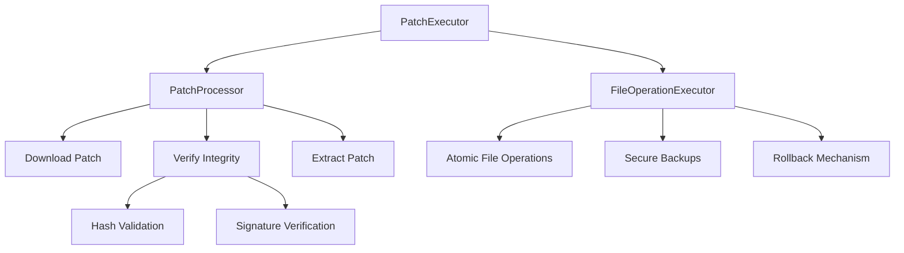
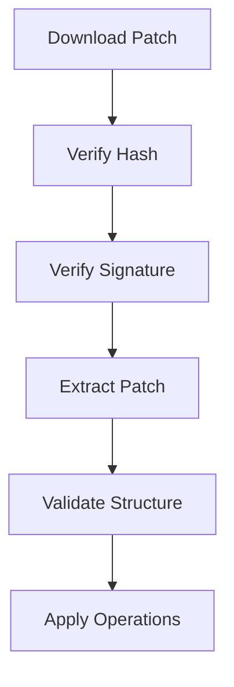

# Patch Validation and Security

<cite>
**Referenced Files in This Document**   
- [mod.rs](file://client-core/src/patch_executor/mod.rs)
- [patch_processor.rs](file://client-core/src/patch_executor/patch_processor.rs)
- [file_operations.rs](file://client-core/src/patch_executor/file_operations.rs)
- [api_types.rs](file://client-core/src/api_types.rs)
- [error.rs](file://client-core/src/patch_executor/error.rs)
- [api.rs](file://client-core/src/api.rs)
- [init_duckdb.sql](file://client-core/migrations/init_duckdb.sql)
- [patch-version-management-final.md](file://spec/patch-version-management-final.md)
</cite>

## Table of Contents
1. [Patch Validation and Security](#patch-validation-and-security)
2. [Signature Verification Process](#signature-verification-process)
3. [Hash Validation of Downloaded Assets](#hash-validation-of-downloaded-assets)
4. [Certificate-Based Trust Chains](#certificate-based-trust-chains)
5. [Tamper Prevention During Transit and Storage](#tamper-prevention-during-transit-and-storage)
6. [Secure Temporary File Creation](#secure-temporary-file-creation)
7. [Memory-Safe Operations](#memory-safe-operations)
8. [Error Handling for Security Failures](#error-handling-for-security-failures)
9. [Security Trade-offs Between Performance and Verification Rigor](#security-trade-offs-between-performance-and-verification-rigor)
10. [Best Practices for Secure Patch Manifests](#best-practices-for-secure-patch-manifests)
11. [Private Key Management for Signing](#private-key-management-for-signing)

## Patch Validation and Security

The patch validation and security system in the Duck Client ensures the integrity and authenticity of incremental updates through multiple layers of cryptographic verification and secure file operations. The system is designed to prevent tampering during both transit and storage, using a combination of hash validation, digital signatures, and certificate-based trust chains.

The core components of the patch validation system are located in the `patch_executor` module of the `client-core` crate. This module provides a comprehensive framework for downloading, verifying, and applying patches while maintaining security throughout the entire process.



**Diagram sources**
- [mod.rs](file://client-core/src/patch_executor/mod.rs#L1-L200)

**Section sources**
- [mod.rs](file://client-core/src/patch_executor/mod.rs#L1-L432)

## Signature Verification Process

The signature verification process is implemented in the `verify_signature` method of the `PatchProcessor` struct. This method is responsible for validating the digital signature of downloaded patch packages to ensure their authenticity and integrity.

Currently, the implementation performs basic signature validation by checking the format of the signature, which is expected to be in base64 encoding. The system verifies that the signature is not empty and is properly formatted as a valid base64 string.

```rust
async fn verify_signature(&self, _file_path: &Path, signature: &str) -> Result<()> {
    debug!("验证数字签名: {}", signature);

    if signature.is_empty() {
        warn!("数字签名为空，跳过验证");
        return Ok(());
    }

    use base64::{Engine as _, engine::general_purpose};
    if general_purpose::STANDARD.decode(signature).is_err() {
        return Err(PatchExecutorError::signature_verification_failed(
            "签名不是有效的base64格式",
        ));
    }

    debug!("数字签名验证通过（简化验证）");
    Ok(())
}
```

The code includes TODO comments indicating that a complete implementation should include:
- Decoding the signature
- Using public keys to verify the signature
- Validating certificate chains

This suggests that while the framework for signature verification is in place, the full cryptographic implementation is pending. The system is designed to integrate with a proper public key infrastructure (PKI) for robust signature validation.

**Section sources**
- [patch_processor.rs](file://client-core/src/patch_executor/patch_processor.rs#L150-L185)

## Hash Validation of Downloaded Assets

The hash validation mechanism ensures the integrity of downloaded patch assets by comparing the computed hash of the downloaded file against an expected hash value provided in the patch metadata. This process is implemented in the `verify_hash` method of the `PatchProcessor` struct.

The system uses SHA-256 as the hashing algorithm to compute the hash of the downloaded patch file. The expected hash value is extracted from the `PatchPackageInfo` structure, which contains metadata about the patch package.

```rust
async fn verify_hash(&self, file_path: &Path, expected_hash: &str) -> Result<()> {
    debug!("验证文件哈希: {:?}", file_path);

    let expected_hash = if expected_hash.starts_with("sha256:") {
        &expected_hash[7..]
    } else {
        expected_hash
    };

    let file_content = fs::read(file_path).await?;
    let mut hasher = Sha256::new();
    hasher.update(&file_content);
    let actual_hash = format!("{:x}", hasher.finalize());

    if actual_hash != expected_hash {
        return Err(PatchExecutorError::hash_mismatch(
            expected_hash.to_string(),
            actual_hash,
        ));
    }

    debug!("哈希验证通过: {}", actual_hash);
    Ok(())
}
```

The hash validation process follows these steps:
1. Parse the expected hash value, supporting both bare hash values and prefixed formats (e.g., "sha256:abc123")
2. Read the entire patch file into memory
3. Compute the SHA-256 hash of the file content
4. Compare the computed hash with the expected hash (case-insensitive comparison)
5. Return an error if the hashes do not match

This mechanism protects against accidental corruption and intentional tampering of patch files during download.

**Section sources**
- [patch_processor.rs](file://client-core/src/patch_executor/patch_processor.rs#L110-L148)

## Certificate-Based Trust Chains

The system incorporates certificate-based trust chains through its configuration settings and HTTP client configuration. While the direct implementation of certificate chain validation is not fully detailed in the available code, the system is designed to validate SSL certificates during patch downloads.

The security configuration is defined in the database migration file, which includes settings for SSL certificate verification:

```sql
-- 安全配置
('security.allow_insecure_downloads', 'false', 'BOOLEAN', 'security', '允许不安全的下载连接', FALSE, TRUE, 'false'),
('security.verify_ssl_certificates', 'true', 'BOOLEAN', 'security', '验证SSL证书', FALSE, TRUE, 'true');
```

These configuration options indicate that:
- By default, insecure downloads are not allowed (`allow_insecure_downloads = false`)
- SSL certificate verification is enabled by default (`verify_ssl_certificates = true`)

The HTTP client used for downloading patches is configured with a 5-minute timeout but does not show explicit certificate validation settings in the code. However, the presence of the `verify_ssl_certificates` configuration suggests that the system will conditionally validate SSL certificates based on this setting.

The `reqwest` HTTP client library used in the implementation typically performs certificate validation by default, establishing trust through the operating system's certificate store or configured certificate authorities. This creates a trust chain where the patch server's SSL certificate must be signed by a trusted certificate authority.

**Section sources**
- [init_duckdb.sql](file://client-core/migrations/init_duckdb.sql#L304-L318)

## Tamper Prevention During Transit and Storage

The system employs multiple mechanisms to prevent tampering during both transit and storage of patch packages. These security measures are implemented at various levels of the patch validation process.

During transit, the system protects against tampering through:
- HTTPS connections with SSL certificate validation
- Hash validation of downloaded content
- Digital signature verification of patch packages

The `PatchProcessor` creates an HTTP client with a 5-minute timeout for downloading patches, ensuring that connections are properly established and maintained:

```rust
let http_client = Client::builder()
    .timeout(std::time::Duration::from_secs(300))
    .build()
    .map_err(|e| PatchExecutorError::custom(format!("创建HTTP客户端失败: {e}")))?;
```

During storage, the system uses temporary directories to store downloaded and extracted patch files, minimizing the exposure of sensitive patch data. The `PatchProcessor` uses the `tempfile` crate to create secure temporary directories:

```rust
let temp_dir = TempDir::new()
    .map_err(|e| PatchExecutorError::custom(format!("创建临时目录失败: {e}")))?;
```

The patch application process follows a secure pipeline:
1. Download patch to temporary location
2. Verify integrity (hash and signature)
3. Extract to temporary directory
4. Validate file structure
5. Apply operations to working directory

This staged approach ensures that potentially malicious content is contained within temporary directories until it has been fully validated.

**Section sources**
- [patch_processor.rs](file://client-core/src/patch_executor/patch_processor.rs#L25-L185)

## Secure Temporary File Creation

The system implements secure temporary file creation through the use of the `tempfile` crate, which provides secure methods for creating temporary files and directories. This is critical for preventing race conditions and symbolic link attacks during patch processing.

The `PatchProcessor` creates a temporary directory for storing downloaded patches and extracted files:

```rust
pub struct PatchProcessor {
    temp_dir: TempDir,
    http_client: Client,
}

impl PatchProcessor {
    pub fn new() -> Result<Self> {
        let temp_dir = TempDir::new()
            .map_err(|e| PatchExecutorError::custom(format!("创建临时目录失败: {e}")))?;
        
        // ... rest of implementation
    }
}
```

Similarly, the `FileOperationExecutor` uses temporary directories for backup operations when rollback is enabled:

```rust
pub struct FileOperationExecutor {
    work_dir: PathBuf,
    backup_dir: Option<TempDir>,
    patch_source: Option<PathBuf>,
}

pub fn enable_backup(&mut self) -> Result<()> {
    self.backup_dir = Some(TempDir::new()?);
    info!("📦 已启用文件操作备份模式");
    Ok(())
}
```

The use of `TempDir` from the `tempfile` crate ensures that:
- Temporary directories are created securely with appropriate permissions
- Directories are automatically cleaned up when dropped
- Directory paths are unpredictable, preventing path traversal attacks
- The system follows the principle of least privilege for temporary file operations

This approach prevents several security vulnerabilities, including:
- Temporary file race conditions
- Symbolic link attacks
- Information disclosure through predictable temporary file names
- Disk space exhaustion from uncleaned temporary files

**Section sources**
- [patch_processor.rs](file://client-core/src/patch_executor/patch_processor.rs#L25-L45)
- [file_operations.rs](file://client-core/src/patch_executor/file_operations.rs#L25-L45)

## Memory-Safe Operations

The system employs memory-safe operations throughout the patch validation and application process, leveraging Rust's ownership and type safety features to prevent common security vulnerabilities.

All file operations are performed using asynchronous I/O through the `tokio` runtime, which prevents blocking operations and reduces the risk of denial-of-service attacks:

```rust
use tokio::fs;
use tokio::io::AsyncWriteExt;

// Asynchronous file writing
let mut file = fs::File::create(&patch_path).await?;
file.write_all(&chunk).await?;
file.flush().await?;
```

The system uses proper error handling and propagation through Rust's `Result` type, ensuring that all operations are checked for success:

```rust
pub type Result<T> = std::result::Result<T, PatchExecutorError>;
```

For operations that require blocking I/O (such as tar extraction), the system uses `tokio::task::spawn_blocking` to prevent blocking the async runtime:

```rust
tokio::task::spawn_blocking(move || {
    Self::extract_tar_gz(&patch_path_clone, &extract_dir_clone)
})
.await
.map_err(|e| PatchExecutorError::extraction_failed(format!("解压任务失败: {e}")))??;
```

The code also demonstrates proper memory management by:
- Using appropriate buffer sizes (8KB) for file reading to balance performance and memory usage
- Avoiding unnecessary data copying
- Using references where possible instead of owned values
- Properly handling large file operations in chunks

These memory-safe practices help prevent vulnerabilities such as buffer overflows, use-after-free errors, and memory leaks that could be exploited by attackers.

**Section sources**
- [patch_processor.rs](file://client-core/src/patch_executor/patch_processor.rs#L70-L100)
- [api.rs](file://client-core/src/api.rs#L370-L395)

## Error Handling for Security Failures

The system implements comprehensive error handling for security failures, with specific error types for different validation failures. The `PatchExecutorError` enum defines distinct error types for various security-related failures.

```rust
#[derive(Debug, Error)]
pub enum PatchExecutorError {
    #[error("哈希校验失败: 期望 {expected}, 实际 {actual}")]
    HashMismatch { expected: String, actual: String },

    #[error("数字签名验证失败: {reason}")]
    SignatureVerificationFailed { reason: String },

    #[error("补丁验证失败: {reason}")]
    VerificationFailed { reason: String },
    
    #[error("权限错误: {path}")]
    PermissionError { path: String },
}
```

The system distinguishes between different types of security failures:
- `HashMismatch`: Indicates that the computed hash of a file does not match the expected hash
- `SignatureVerificationFailed`: Indicates failure in digital signature verification
- `VerificationFailed`: General verification failure
- `PermissionError`: Indicates insufficient permissions for file operations

The error handling system also includes methods to determine the nature of errors:

```rust
pub fn is_recoverable(&self) -> bool {
    match self {
        Self::VerificationFailed { .. } => false,
        Self::HashMismatch { .. } => false,
        Self::SignatureVerificationFailed { .. } => false,
        Self::PermissionError { .. } => false,
        _ => true,
    }
}

pub fn requires_rollback(&self) -> bool {
    match self {
        Self::VerificationFailed { .. } => false,
        Self::HashMismatch { .. } => false,
        Self::SignatureVerificationFailed { .. } => false,
        Self::DownloadFailed { .. } => false,
        Self::BackupNotEnabled => false,
        Self::PatchSourceNotSet => false,
        _ => true,
    }
}
```

These methods indicate that:
- Hash mismatches, signature verification failures, and permission errors are not recoverable
- These security-related errors do not trigger automatic rollback (as the patch was not applied)
- Other errors may trigger rollback if backup is enabled

When a patch application fails, the system logs detailed error information and may initiate a rollback if appropriate:

```rust
Err(e) => {
    error!("❌ 补丁应用失败: {}", e);

    if e.requires_rollback() && self.backup_enabled {
        warn!("🔄 开始自动回滚...");
        if let Err(rollback_err) = self.rollback().await {
            error!("❌ 回滚失败: {}", rollback_err);
            return Err(PatchExecutorError::rollback_failed(format!(
                "原始错误: {e}, 回滚错误: {rollback_err}"
            )));
        }
        info!("✅ 自动回滚完成");
    }

    Err(e)
}
```

This comprehensive error handling ensures that security failures are properly reported and handled without compromising system stability.

**Section sources**
- [error.rs](file://client-core/src/patch_executor/error.rs#L1-L200)

## Security Trade-offs Between Performance and Verification Rigor

The system balances security and performance through several design decisions that represent trade-offs between verification rigor and operational efficiency.

One key trade-off is in the hash validation implementation. The current implementation reads the entire patch file into memory to compute its hash:

```rust
let file_content = fs::read(file_path).await?;
let mut hasher = Sha256::new();
hasher.update(&file_content);
```

This approach is less memory-efficient for large patch files but simpler to implement. A more memory-efficient approach would stream the file content to the hasher, processing it in chunks.

The system also uses a staged verification process that could be optimized for performance:



While this sequential approach ensures thorough validation, it could be optimized by:
- Performing hash verification during download (streaming validation)
- Parallelizing independent verification steps
- Caching verification results for repeated operations

The use of temporary directories for all patch operations ensures security but may impact performance due to additional file system operations and disk I/O.

The system also includes configuration options that represent security-performance trade-offs:
- `security.allow_insecure_downloads`: Allows bypassing security for performance
- `security.verify_ssl_certificates`: Can be disabled to improve connection speed
- Download timeout settings that balance security (preventing hanging operations) with performance (allowing slow connections)

The benchmark tests in the codebase indicate that performance is a consideration, with tests for memory usage, network conditions, and concurrent operations. However, the security mechanisms are designed to be robust even at the cost of some performance overhead.

**Section sources**
- [patch_processor.rs](file://client-core/src/patch_executor/patch_processor.rs#L110-L148)
- [PERFORMANCE_TESTING.md](file://nuwax-cli/PERFORMANCE_TESTING.md#L1-L200)

## Best Practices for Generating Secure Patch Manifests

Based on the system design and requirements, the following best practices should be followed when generating secure patch manifests:

1. **Include Cryptographic Hashes**: Always include SHA-256 hashes in the patch manifest to enable integrity verification:
```json
{
  "url": "https://example.com/patch.tar.gz",
  "hash": "sha256:abc123...",
  "signature": "base64encodedsignature..."
}
```

2. **Use Digital Signatures**: Sign patch manifests with a private key and include the signature in the manifest. The public key should be distributed through a secure channel.

3. **Follow Semantic Versioning**: Use the composite version format specified in the system design:
```
{major}.{minor}.{patch}.{build}
```
Where the build number represents the patch level.

4. **Include Detailed Operation Specifications**: Clearly specify all file operations in the patch manifest:
```json
"operations": {
  "replace": {
    "files": ["bin/app", "config/settings.json"],
    "directories": ["lib/modules"]
  },
  "delete": {
    "files": ["legacy/deprecated.js"],
    "directories": ["docs/old"]
  }
}
```

5. **Provide Clear Release Notes**: Include descriptive notes about the patch contents and purpose:
```json
"notes": "Security update addressing CVE-2023-12345. Updates authentication module and fixes input validation."
```

6. **Use HTTPS for Patch Distribution**: Host patches on HTTPS servers with valid SSL certificates to ensure secure transit.

7. **Implement Proper Access Controls**: Ensure that patch servers have appropriate authentication and authorization mechanisms to prevent unauthorized access.

8. **Rotate Signing Keys Periodically**: Regularly rotate the private keys used for signing patches to minimize the impact of key compromise.

9. **Maintain a Certificate Revocation List**: Implement a mechanism to revoke compromised certificates and notify clients.

10. **Validate Manifest Structure**: Ensure that patch manifests are properly formatted and validated against a schema before distribution.

These practices ensure that patch manifests are both secure and reliable, enabling clients to verify their authenticity and integrity before application.

**Section sources**
- [api_types.rs](file://client-core/src/api_types.rs#L1-L200)
- [patch-version-management-final.md](file://spec/patch-version-management-final.md#L1-L200)

## Private Key Management for Signing

Proper private key management is critical for maintaining the security of the patch signing process. Based on the system design and security requirements, the following practices should be implemented:

1. **Use Hardware Security Modules (HSMs)**: Store private keys in dedicated hardware security modules that provide physical and logical protection against unauthorized access.

2. **Implement Key Rotation**: Regularly rotate signing keys according to a defined schedule (e.g., quarterly) to limit the exposure window if a key is compromised.

3. **Enforce Access Controls**: Restrict access to private keys to authorized personnel only, using multi-factor authentication and role-based access control.

4. **Use Strong Key Generation**: Generate keys with sufficient entropy and appropriate length (e.g., RSA 4096-bit or ECDSA with P-521 curve).

5. **Secure Key Storage**: When HSMs are not available, store private keys in encrypted form with strong passwords, preferably using a password manager or key vault.

6. **Implement Signing Policies**: Define clear policies for when and how patches should be signed, including:
   - Who can request a signed patch
   - What verification steps must be completed before signing
   - How signing requests are authorized

7. **Maintain Audit Logs**: Keep detailed logs of all signing operations, including:
   - Timestamp of signing
   - Identity of the person requesting the signature
   - Hash of the content being signed
   - Serial number of the certificate used

8. **Use Code Signing Certificates**: Obtain code signing certificates from a trusted certificate authority rather than self-signed certificates.

9. **Implement Certificate Revocation**: Have a process in place to revoke certificates if the private key is compromised, and distribute revocation information to clients.

10. **Separate Development and Production Keys**: Use different keys for development/test patches versus production patches.

The system's current implementation shows that signature verification is planned but not fully implemented, indicating that the private key management infrastructure may still be under development. The presence of signature fields in the `PatchPackageInfo` structure confirms that the system is designed to support proper digital signatures once the full implementation is complete.

**Section sources**
- [api_types.rs](file://client-core/src/api_types.rs#L250-L300)
- [patch_processor.rs](file://client-core/src/patch_executor/patch_processor.rs#L150-L185)