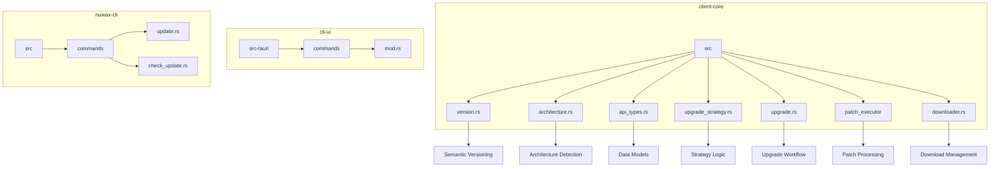
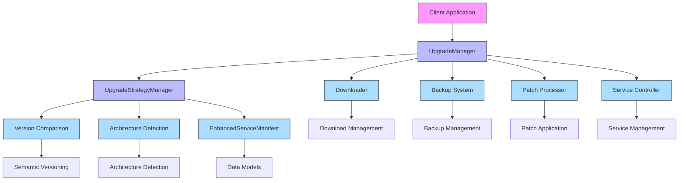
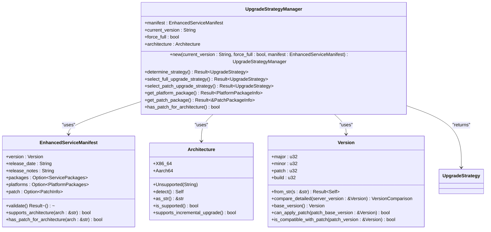
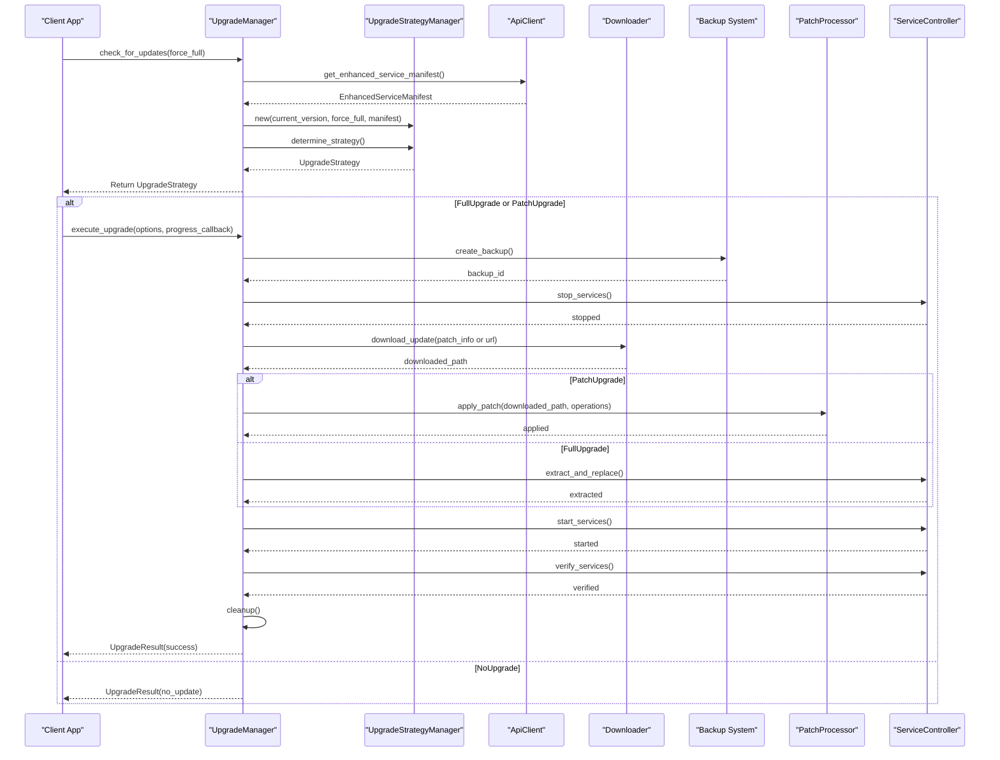
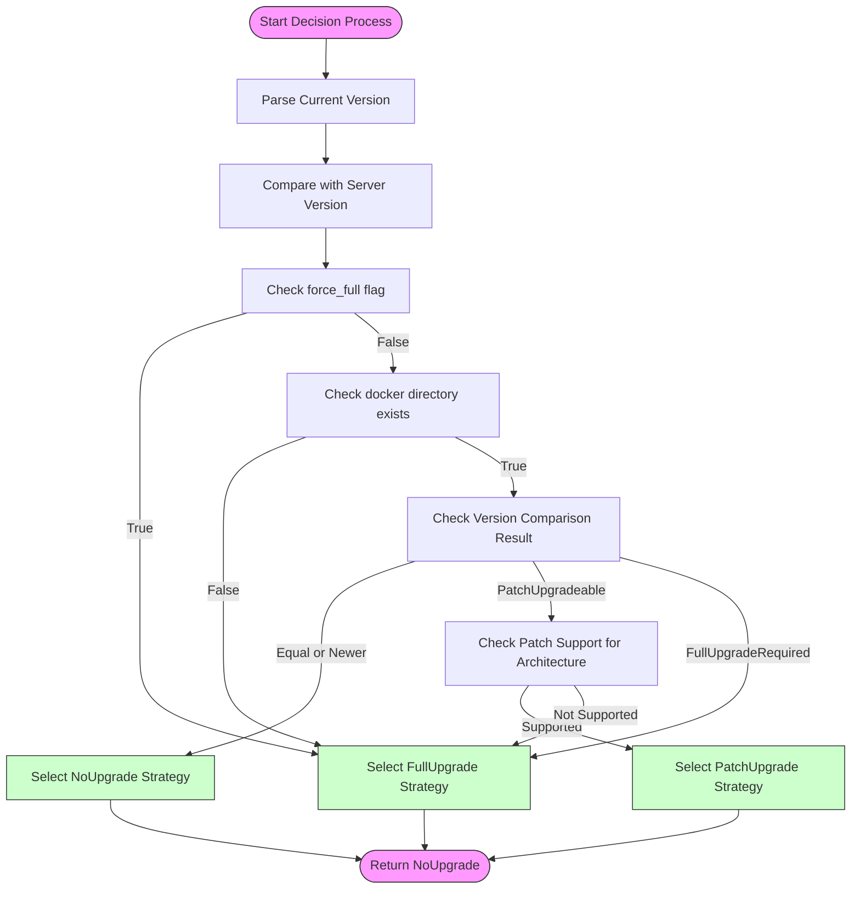
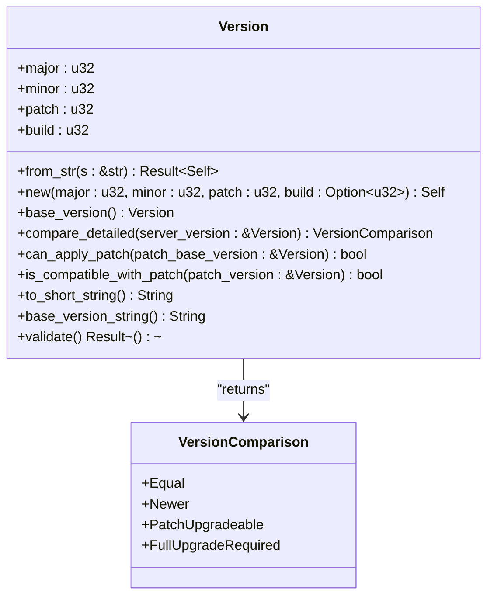
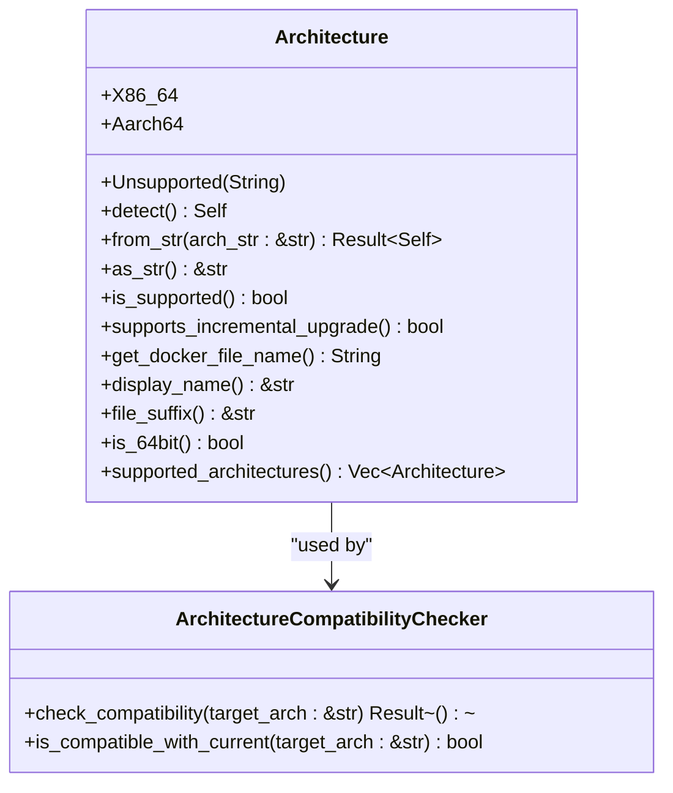
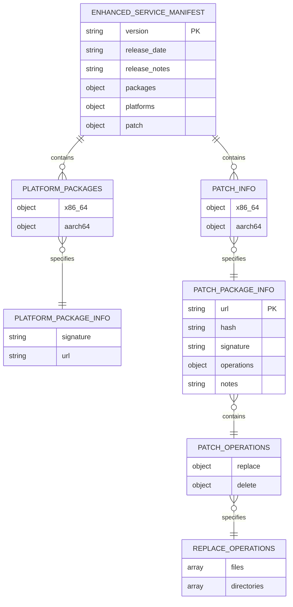
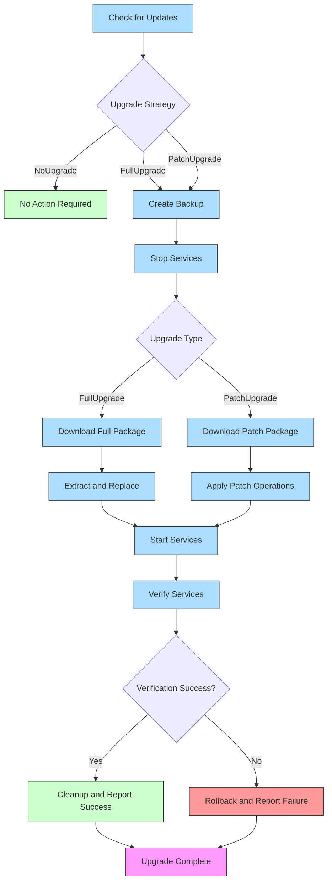

# Intelligent Upgrade System

<cite>
**Referenced Files in This Document**   
- [version.rs](file://client-core/src/version.rs#L1-L410)
- [architecture.rs](file://client-core/src/architecture.rs#L1-L451)
- [api_types.rs](file://client-core/src/api_types.rs#L1-L902)
- [upgrade_strategy.rs](file://client-core/src/upgrade_strategy.rs#L1-L463)
- [upgrade.rs](file://client-core/src/upgrade.rs#L1-L90)
- [patch_processor.rs](file://client-core/src/patch_executor/patch_processor.rs)
- [downloader.rs](file://client-core/src/downloader.rs)
</cite>

## Table of Contents
1. [Introduction](#introduction)
2. [Project Structure](#project-structure)
3. [Core Components](#core-components)
4. [Architecture Overview](#architecture-overview)
5. [Detailed Component Analysis](#detailed-component-analysis)
6. [Upgrade Strategy Decision Process](#upgrade-strategy-decision-process)
7. [Semantic Versioning Implementation](#semantic-versioning-implementation)
8. [Architecture Detection](#architecture-detection)
9. [Data Models](#data-models)
10. [Upgrade Workflow](#upgrade-workflow)
11. [Performance Considerations](#performance-considerations)
12. [Troubleshooting Guide](#troubleshooting-guide)
13. [Conclusion](#conclusion)

## Introduction
The Intelligent Upgrade System is a comprehensive solution for managing both full and incremental updates in the duck_client application. This system enables efficient version management by intelligently selecting between FullUpgrade, PatchUpgrade, and NoUpgrade strategies based on version comparison and architecture compatibility. The upgrade mechanism reduces bandwidth usage by 60-80% through patch-based updates that download only changed components. The system incorporates robust security features including signature verification and hash validation, while maintaining backward compatibility with legacy update formats. This documentation provides a detailed analysis of the system's architecture, data models, decision logic, and implementation details.

## Project Structure
The project structure reveals a well-organized codebase with clear separation of concerns. The core upgrade functionality resides in the client-core module, with supporting components in nuwax-cli and cli-ui. The upgrade system components are primarily located in the client-core/src directory, with specialized modules for version management, architecture detection, and upgrade strategy.

**Diagram sources**
- [version.rs](file://client-core/src/version.rs#L1-L410)
- [architecture.rs](file://client-core/src/architecture.rs#L1-L451)
- [api_types.rs](file://client-core/src/api_types.rs#L1-L902)
- [upgrade_strategy.rs](file://client-core/src/upgrade_strategy.rs#L1-L463)
- [upgrade.rs](file://client-core/src/upgrade.rs#L1-L90)

**Section sources**
- [version.rs](file://client-core/src/version.rs#L1-L410)
- [architecture.rs](file://client-core/src/architecture.rs#L1-L451)
- [api_types.rs](file://client-core/src/api_types.rs#L1-L902)
- [upgrade_strategy.rs](file://client-core/src/upgrade_strategy.rs#L1-L463)
- [upgrade.rs](file://client-core/src/upgrade.rs#L1-L90)

## Core Components
The Intelligent Upgrade System consists of several core components that work together to provide a seamless update experience. The system is built around a modular architecture that separates concerns into distinct components: version management, architecture detection, data modeling, strategy decision-making, and workflow execution. The core components include the Version module for semantic versioning, Architecture module for system detection, EnhancedServiceManifest for data modeling, UpgradeStrategyManager for decision logic, and UpgradeManager for workflow orchestration. These components are designed to be loosely coupled, allowing for independent testing and maintenance.

**Section sources**
- [version.rs](file://client-core/src/version.rs#L1-L410)
- [architecture.rs](file://client-core/src/architecture.rs#L1-L451)
- [api_types.rs](file://client-core/src/api_types.rs#L1-L902)
- [upgrade_strategy.rs](file://client-core/src/upgrade_strategy.rs#L1-L463)
- [upgrade.rs](file://client-core/src/upgrade.rs#L1-L90)

## Architecture Overview
The Intelligent Upgrade System follows a layered architecture with clear separation between data models, business logic, and workflow execution. The system is designed to be extensible and maintainable, with well-defined interfaces between components. The architecture supports both full and incremental updates, with intelligent decision-making based on version comparison and architecture compatibility.

**Diagram sources**
- [upgrade.rs](file://client-core/src/upgrade.rs#L1-L90)
- [upgrade_strategy.rs](file://client-core/src/upgrade_strategy.rs#L1-L463)
- [version.rs](file://client-core/src/version.rs#L1-L410)
- [architecture.rs](file://client-core/src/architecture.rs#L1-L451)
- [api_types.rs](file://client-core/src/api_types.rs#L1-L902)

## Detailed Component Analysis

### Upgrade Strategy Manager Analysis
The UpgradeStrategyManager is the central component responsible for determining the appropriate upgrade strategy based on version comparison and architecture compatibility. It evaluates multiple factors including version differences, architecture support, and system conditions to select between FullUpgrade, PatchUpgrade, or NoUpgrade strategies.

**Diagram sources**
- [upgrade_strategy.rs](file://client-core/src/upgrade_strategy.rs#L1-L463)
- [api_types.rs](file://client-core/src/api_types.rs#L1-L902)
- [architecture.rs](file://client-core/src/architecture.rs#L1-L451)
- [version.rs](file://client-core/src/version.rs#L1-L410)

**Section sources**
- [upgrade_strategy.rs](file://client-core/src/upgrade_strategy.rs#L1-L463)

### Upgrade Workflow Analysis
The UpgradeManager orchestrates the complete upgrade workflow from update check to verification. It coordinates with various components to ensure a smooth and reliable upgrade process.

**Diagram sources**
- [upgrade.rs](file://client-core/src/upgrade.rs#L1-L90)
- [upgrade_strategy.rs](file://client-core/src/upgrade_strategy.rs#L1-L463)
- [downloader.rs](file://client-core/src/downloader.rs)
- [patch_processor.rs](file://client-core/src/patch_executor/patch_processor.rs)

**Section sources**
- [upgrade.rs](file://client-core/src/upgrade.rs#L1-L90)

## Upgrade Strategy Decision Process
The upgrade strategy decision process is a sophisticated mechanism that evaluates multiple factors to determine the optimal upgrade approach. The process begins with version comparison between the current client version and the server manifest version, followed by architecture compatibility checks and system condition assessments.

The decision process follows these key steps:
1. **Version Parsing**: The current version string is parsed into a structured Version object
2. **Version Comparison**: The current version is compared with the server version using detailed comparison logic
3. **Force Check**: The system checks if full upgrade is forced by configuration
4. **Environment Check**: The system verifies the presence of necessary directories and files
5. **Architecture Check**: The system confirms compatibility between the client architecture and available packages
6. **Strategy Selection**: Based on the above factors, the system selects the appropriate upgrade strategy

The process prioritizes incremental updates when possible to minimize bandwidth usage and downtime, falling back to full updates when necessary for compatibility or when incremental updates are not available.

**Section sources**
- [upgrade_strategy.rs](file://client-core/src/upgrade_strategy.rs#L1-L463)
- [version.rs](file://client-core/src/version.rs#L1-L410)

## Semantic Versioning Implementation
The semantic versioning system implements a four-segment version format (major.minor.patch.build) that extends traditional semantic versioning with a build-level component for incremental updates. This approach enables fine-grained version tracking and precise patch applicability determination.

The Version struct provides several key methods for version management:
- **from_str**: Parses version strings in formats like "1.2.3" or "1.2.3.4", with optional 'v' prefix
- **base_version**: Extracts the base version (major.minor.patch) with build set to 0
- **compare_detailed**: Returns a VersionComparison enum indicating the relationship between versions
- **can_apply_patch**: Determines if a patch can be applied based on base version compatibility
- **is_compatible_with_patch**: Checks if the current version is compatible with a patch version

The version comparison logic follows these rules:
- **Equal**: Versions are identical
- **Newer**: Current version is newer than server version
- **PatchUpgradeable**: Same base version, current build < server build
- **FullUpgradeRequired**: Different base versions

This implementation enables the system to support both traditional full upgrades and incremental patch updates within a unified versioning framework.

**Section sources**
- [version.rs](file://client-core/src/version.rs#L1-L410)

## Architecture Detection
The architecture detection system provides reliable identification of the client's system architecture, enabling architecture-specific package selection and compatibility checking. The system supports both x86_64 and aarch64 architectures, with extensibility for future architectures.

The Architecture enum provides several key features:
- **Automatic Detection**: Uses std::env::consts::ARCH to detect the current system architecture
- **Flexible Parsing**: Supports multiple string representations (x86_64, amd64, x64, aarch64, arm64, armv8)
- **Architecture Information**: Provides methods to retrieve architecture-specific details
- **Compatibility Checking**: Determines if the architecture supports incremental upgrades

The detection process follows these steps:
1. Retrieve the system architecture from std::env::consts::ARCH
2. Normalize the architecture string to lowercase
3. Map common architecture aliases to standard representations
4. Return the appropriate Architecture enum variant

The system handles unsupported architectures gracefully by returning an Unsupported variant, allowing the application to continue with appropriate fallback behavior. This robust detection mechanism ensures that the correct packages are selected for the client's architecture, preventing compatibility issues during upgrades.

**Section sources**
- [architecture.rs](file://client-core/src/architecture.rs#L1-L451)

## Data Models
The data models in the Intelligent Upgrade System are designed to support both traditional and enhanced update formats, ensuring backward compatibility while enabling new features like architecture-specific packages and incremental updates.

### EnhancedServiceManifest
The EnhancedServiceManifest is the primary data model that represents the server's update manifest. It extends the legacy ServiceManifest with support for architecture-specific packages and incremental updates.

**Structure:**
- **version**: The target version (Version struct with major, minor, patch, build)
- **release_date**: RFC 3339 formatted release date
- **release_notes**: Human-readable release notes
- **packages**: Optional legacy package information (backward compatibility)
- **platforms**: Optional architecture-specific package information
- **patch**: Optional incremental update information

### PatchPackageInfo
The PatchPackageInfo model contains all information needed for an incremental update.

**Structure:**
- **url**: Download URL for the patch package
- **hash**: Optional hash for integrity verification
- **signature**: Optional signature for authenticity verification
- **operations**: Patch operations to apply
- **notes**: Optional patch notes

The model includes validation methods to ensure data integrity and security, including URL format validation, hash validation, and path safety checks to prevent directory traversal attacks.

**Section sources**
- [api_types.rs](file://client-core/src/api_types.rs#L1-L902)

## Upgrade Workflow
The upgrade workflow encompasses the complete process from update check to final verification, ensuring a reliable and safe upgrade experience.

The workflow follows these key stages:

### 1. Update Check
The process begins with checking for available updates by retrieving the EnhancedServiceManifest from the server and determining the appropriate upgrade strategy.

### 2. Preparation
- **Backup Creation**: A backup of the current system state is created
- **Service Stop**: Running services are gracefully stopped to prevent data corruption

### 3. Download
The appropriate package (full or patch) is downloaded from the specified URL with integrity verification.

### 4. Application
- **Full Upgrade**: The downloaded package is extracted and replaces the existing installation
- **Patch Upgrade**: Patch operations (replace, delete) are applied to modify specific files and directories

### 5. Verification
Services are restarted and their functionality is verified to ensure the upgrade was successful.

### 6. Cleanup
Temporary files are removed and the upgrade result is reported.

The workflow includes comprehensive error handling and rollback capabilities to ensure system stability even if the upgrade fails.

**Section sources**
- [upgrade.rs](file://client-core/src/upgrade.rs#L1-L90)
- [upgrade_strategy.rs](file://client-core/src/upgrade_strategy.rs#L1-L463)

## Performance Considerations
The Intelligent Upgrade System is designed with performance optimization as a key priority, particularly in reducing bandwidth usage through incremental updates.

### Bandwidth Efficiency
The system achieves 60-80% bandwidth reduction by using patch-based updates that only download changed components. This is accomplished through:
- **Delta Updates**: Only modified files and directories are included in patch packages
- **Efficient Compression**: Patch packages are compressed to minimize download size
- **Architecture-Specific Packages**: Clients only download packages for their specific architecture

### Processing Efficiency
The system optimizes processing efficiency through:
- **Lazy Loading**: Components are loaded only when needed
- **Stream Processing**: Large files are processed in streams rather than loading entirely into memory
- **Parallel Operations**: Independent operations are executed in parallel when possible

### Memory Usage
Memory usage is optimized by:
- **Minimal Data Loading**: Only essential data is loaded into memory
- **Efficient Data Structures**: Data structures are designed for minimal memory footprint
- **Timely Cleanup**: Resources are released as soon as they are no longer needed

### Large Service Updates
For large service updates, the system implements:
- **Progress Reporting**: Real-time progress updates through the ProgressCallback mechanism
- **Resumable Downloads**: Support for resuming interrupted downloads
- **Chunked Processing**: Large operations are broken into smaller chunks to prevent timeouts

These performance optimizations ensure that the upgrade system remains responsive and efficient even with large updates or on systems with limited resources.

## Troubleshooting Guide
This section addresses common issues that may occur during the upgrade process and provides guidance for resolution.

### Failed Patch Applications
**Symptoms**: Patch application fails with file operation errors
**Causes**:
- Insufficient disk space
- File permission issues
- Corrupted patch package
- Conflicting file locks

**Solutions**:
1. Check available disk space and free up space if needed
2. Verify file permissions for the target directories
3. Retry the upgrade to download a fresh patch package
4. Ensure no other processes are using the files being modified

### Signature Verification Errors
**Symptoms**: Upgrade fails with signature verification errors
**Causes**:
- Invalid or corrupted signature
- Clock skew between client and server
- Compromised security keys

**Solutions**:
1. Verify system clock is synchronized
2. Clear local cache and retry the upgrade
3. Contact support if the issue persists

### Rollback Scenarios
The system automatically triggers rollback in the following scenarios:
- **Service Verification Failure**: Services fail to start or respond after upgrade
- **Critical Error During Application**: Unrecoverable error during patch application
- **Timeout**: Upgrade process exceeds maximum allowed time

**Rollback Process**:
1. Stop any partially started services
2. Restore files from the backup created before the upgrade
3. Restart services with the previous configuration
4. Report the failure and provide diagnostic information

### Common Issues and Solutions
| Issue | Possible Cause | Solution |
|------|---------------|----------|
| "No upgrade needed" when update expected | Version comparison logic | Verify version format and build numbers |
| "Architecture not supported" | Missing platform package | Check server manifest for required architecture |
| "Patch not available" | No patch for current base version | Perform full upgrade to latest base version |
| "Insufficient disk space" | Low storage | Free up space or use external storage |
| "Network timeout" | Slow connection | Retry or use alternative network |

## Conclusion
The Intelligent Upgrade System provides a robust and efficient solution for managing application updates. By implementing a sophisticated strategy decision process, semantic versioning, and architecture detection, the system delivers optimal upgrade experiences while minimizing bandwidth usage. The modular architecture with well-defined components enables maintainability and extensibility, while comprehensive error handling and rollback mechanisms ensure system stability. The system successfully balances advanced features like incremental updates with backward compatibility, making it suitable for diverse deployment scenarios. Future enhancements could include support for more architectures, improved progress reporting, and enhanced security features.