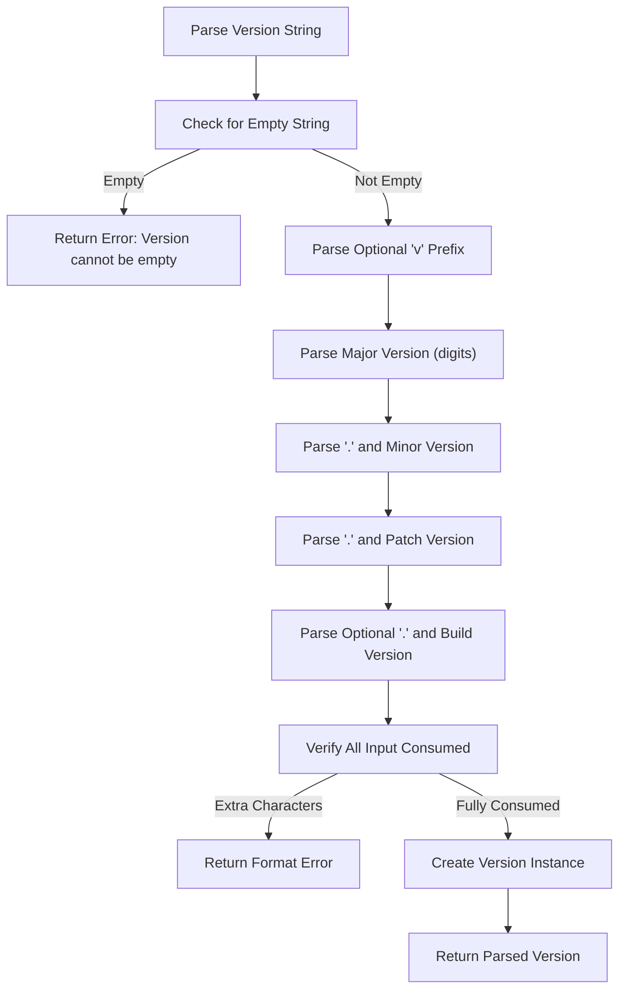
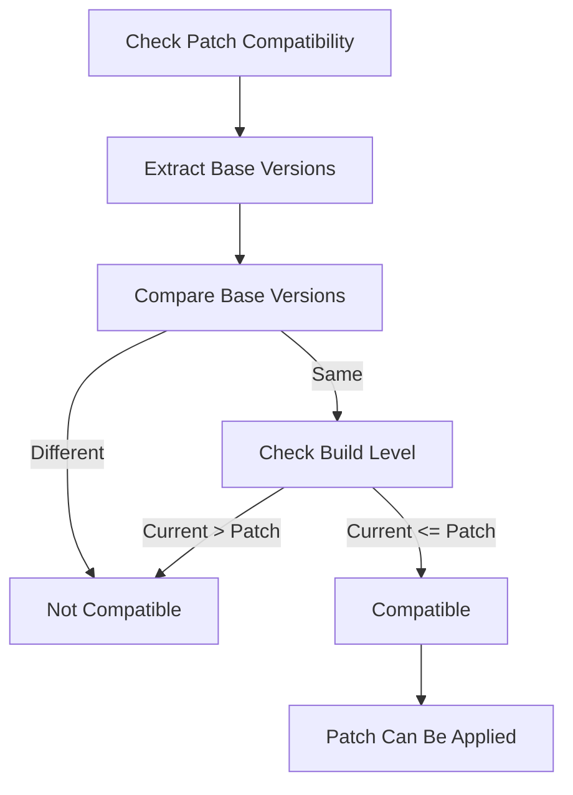
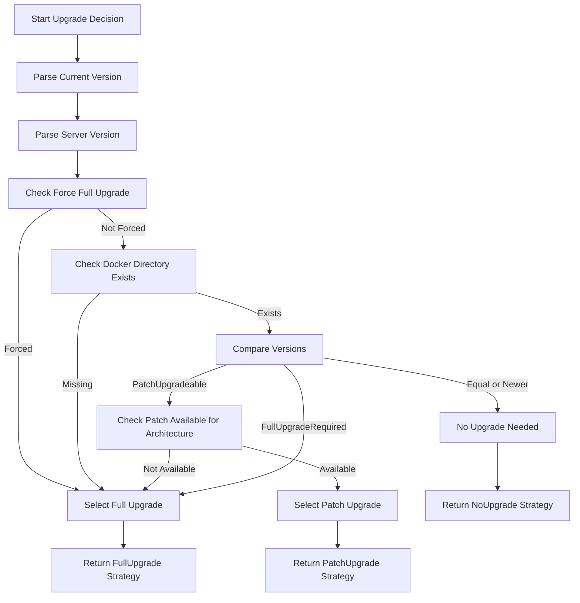
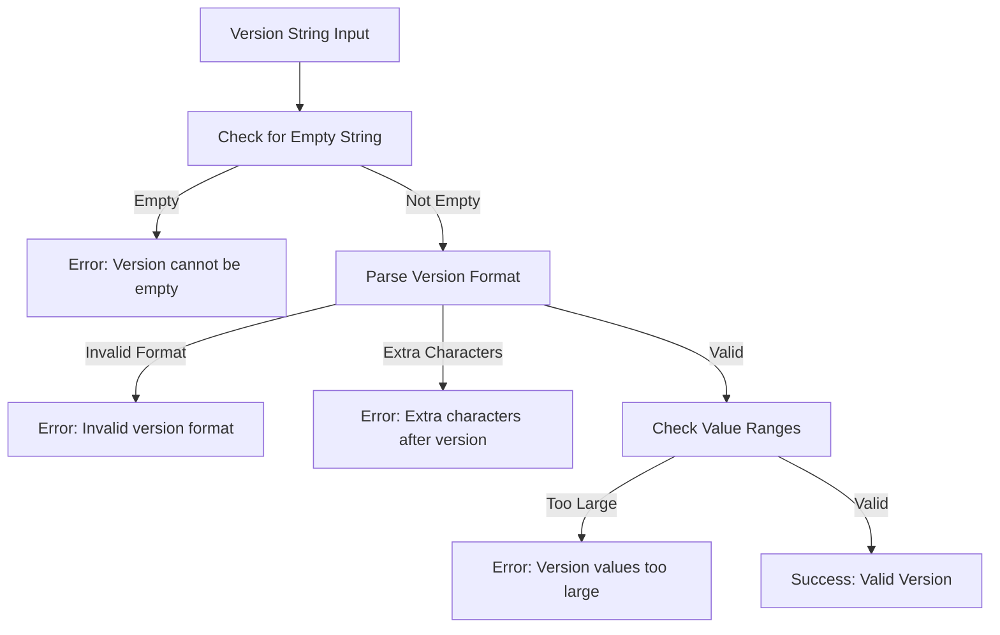
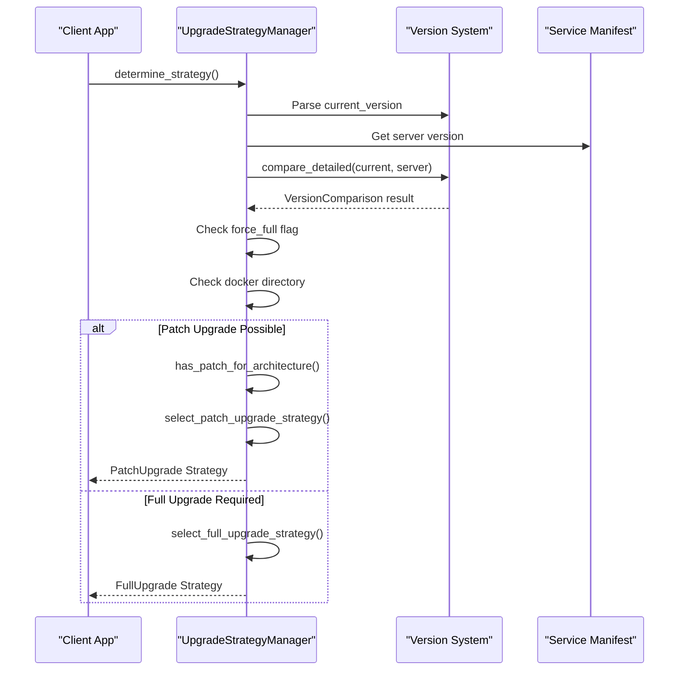

# Semantic Versioning Implementation

<cite>
**Referenced Files in This Document**   
- [version.rs](file://client-core/src/version.rs)
- [upgrade_strategy.rs](file://client-core/src/upgrade_strategy.rs)
- [patch-version-management-final.md](file://spec/patch-version-management-final.md)
- [upgrade-architecture-enhancement.md](file://spec/upgrade-architecture-enhancement.md)
</cite>

## Table of Contents
1. [Introduction](#introduction)
2. [Version Structure and Parsing](#version-structure-and-parsing)
3. [Version Comparison and Compatibility](#version-comparison-and-compatibility)
4. [Upgrade Strategy Decision Logic](#upgrade-strategy-decision-logic)
5. [Validation and Error Handling](#validation-and-error-handling)
6. [Integration with Service Manifests](#integration-with-service-manifests)
7. [Best Practices and Common Issues](#best-practices-and-common-issues)

## Introduction
The semantic versioning system implemented in the Duck Client repository provides a robust framework for managing software versions using a four-segment format: major.minor.patch.build. This system enables precise version control, supports both full and incremental upgrades, and ensures backward compatibility while allowing for flexible extension. The implementation is centered around the `Version` struct in version.rs, which supports parsing, comparison, and compatibility checks essential for upgrade decisions. This document details the architecture, functionality, and usage patterns of this versioning system, providing comprehensive guidance for developers working with service manifests and upgrade strategies.

## Version Structure and Parsing

The `Version` struct in version.rs defines a four-segment version format that supports major, minor, patch, and build components. This structure enables fine-grained version tracking where the build segment represents patch levels applied to a base version.

```rust
#[derive(Debug, Clone, PartialEq, Eq, PartialOrd, Ord, Serialize, Deserialize, Default)]
pub struct Version {
    pub major: u32,
    pub minor: u32,
    pub patch: u32,
    pub build: u32,
}
```

The system supports multiple version string formats:
- Three-segment format (e.g., "1.2.3") where build defaults to 0
- Four-segment format (e.g., "1.2.3.4") with explicit build level
- Optional "v" prefix (e.g., "v0.0.13.5")

Version parsing is implemented using the winnow parser combinator library, which provides efficient and reliable string parsing:



**Diagram sources**
- [version.rs](file://client-core/src/version.rs#L89-L129)

**Section sources**
- [version.rs](file://client-core/src/version.rs#L0-L36)
- [version.rs](file://client-core/src/version.rs#L38-L87)

## Version Comparison and Compatibility

The versioning system implements comprehensive comparison logic through the `PartialOrd` and `PartialEq` traits, enabling direct version comparisons using standard operators. Additionally, a detailed comparison method provides nuanced upgrade decision information.

### Comparison Results
The `compare_detailed` method returns a `VersionComparison` enum that categorizes the relationship between versions:

```mermaid
stateDiagram-v2
[*] --> Equal
[*] --> Newer
[*] --> PatchUpgradeable
[*] --> FullUpgradeRequired
state Equal {
direction LR
description : "Versions are identical"
}
state Newer {
direction LR
description : "Current version is newer than target"
}
state PatchUpgradeable {
direction LR
description : "Same base version, higher build level available"
}
state FullUpgradeRequired {
direction LR
description : "Different base version requires full upgrade"
}
```

**Diagram sources**
- [version.rs](file://client-core/src/version.rs#L208-L257)

The comparison logic follows these rules:
1. **Equal**: Versions are identical in all segments
2. **Newer**: Current version is more recent than the target
3. **PatchUpgradeable**: Same major.minor.patch with higher build number
4. **FullUpgradeRequired**: Different major.minor.patch base version

Compatibility checking is implemented through two key methods:
- `can_apply_patch()`: Checks if versions share the same base (major.minor.patch)
- `is_compatible_with_patch()`: Verifies base compatibility and build level progression



**Diagram sources**
- [version.rs](file://client-core/src/version.rs#L131-L169)

**Section sources**
- [version.rs](file://client-core/src/version.rs#L131-L169)
- [version.rs](file://client-core/src/version.rs#L235-L257)

## Upgrade Strategy Decision Logic

The upgrade strategy system uses version comparison results to determine the optimal upgrade path, balancing efficiency and compatibility requirements.

### Strategy Selection Process
The `UpgradeStrategyManager` in upgrade_strategy.rs implements a decision tree that evaluates multiple factors:



**Diagram sources**
- [upgrade_strategy.rs](file://client-core/src/upgrade_strategy.rs#L104-L184)

The decision process follows these priority rules:
1. **Forced Full Upgrade**: When the `force_full` flag is set
2. **Missing Docker Environment**: When docker directory or compose file is missing
3. **Version Status**: Based on the detailed version comparison result
4. **Architecture Compatibility**: Ensuring patch packages exist for the target architecture

Key decision factors include:
- **Version Compatibility**: Determined by `compare_detailed()` results
- **Architecture Detection**: Automatic detection of x86_64 or aarch64
- **File System State**: Presence of required docker directories and files
- **Network and Storage**: Implied by the strategy selection process

**Section sources**
- [upgrade_strategy.rs](file://client-core/src/upgrade_strategy.rs#L104-L184)
- [upgrade-architecture-enhancement.md](file://spec/upgrade-architecture-enhancement.md#L224-L241)

## Validation and Error Handling

The versioning system implements comprehensive validation and error handling to ensure data integrity and provide meaningful feedback.

### Validation Rules
The `validate()` method enforces reasonable limits on version components:

```rust
pub fn validate(&self) -> Result<()> {
    if self.major > 999 || self.minor > 999 || self.patch > 999 || self.build > 9999 {
        return Err(anyhow::anyhow!("版本号数值过大，可能不是有效的版本号"));
    }
    Ok(())
}
```

Key validation rules:
- Major, minor, and patch components limited to 999
- Build component limited to 9999
- All components must be valid unsigned integers
- Proper formatting with dots between segments

### Error Handling
The system handles various error conditions with specific error messages:



**Diagram sources**
- [version.rs](file://client-core/src/version.rs#L89-L129)

Common error scenarios:
- Empty version strings
- Invalid characters in version components
- Incorrect number of segments (e.g., "1.2" or "1.2.3.4.5")
- Non-numeric characters in version segments
- Values exceeding maximum allowed ranges

The system uses `anyhow::Result` for error propagation, allowing rich error context to be maintained throughout the call stack.

**Section sources**
- [version.rs](file://client-core/src/version.rs#L181-L198)
- [version.rs](file://client-core/src/version.rs#L261-L308)

## Integration with Service Manifests

The versioning system is tightly integrated with service manifests and upgrade workflows, enabling intelligent upgrade decisions based on version relationships.

### Manifest Structure
The enhanced service manifest includes version information for both full and patch upgrades:

```json
{
    "version": "0.0.13",
    "platforms": {
        "x86_64": {
            "url": "https://packages/x86_64/docker.zip",
            "signature": "x86_64_signature"
        },
        "aarch64": {
            "url": "https://packages/aarch64/docker.zip",
            "signature": "aarch64_signature"
        }
    },
    "patch": {
        "x86_64": {
            "url": "https://packages/patches/x86_64-patch.tar.gz",
            "hash": "sha256:patch_hash_x86_64",
            "operations": {
                "replace": {
                    "files": ["app.jar", "config.yml"],
                    "directories": ["front/"]
                }
            }
        }
    }
}
```

### Upgrade Strategy Integration
The `UpgradeStrategyManager` uses version comparison to select appropriate strategies:



**Diagram sources**
- [upgrade_strategy.rs](file://client-core/src/upgrade_strategy.rs#L104-L184)

The integration supports:
- Architecture-specific package selection
- Fallback to legacy upgrade methods
- Detailed logging of decision factors
- Backup planning based on upgrade type

**Section sources**
- [upgrade_strategy.rs](file://client-core/src/upgrade_strategy.rs#L62-L102)
- [patch-version-management-final.md](file://spec/patch-version-management-final.md#L327-L547)

## Best Practices and Common Issues

### Best Practices for Versioning
1. **Consistent Formatting**: Always use the major.minor.patch.build format
2. **Semantic Meaning**: Follow semantic versioning principles for major/minor/patch
3. **Build Incrementation**: Increment build number for each patch release
4. **Manifest Updates**: Ensure service manifests are updated with new version information
5. **Testing**: Test version comparison logic with edge cases

### Common Issues and Solutions
**Incorrect Version Ordering**
- **Issue**: Versions not sorting correctly due to string comparison
- **Solution**: Use the `Version` struct which implements proper numerical comparison

**Build Number Conflicts**
- **Issue**: Multiple patches with same build number
- **Solution**: Implement strict build number incrementation in CI/CD pipeline

**Backward Compatibility Challenges**
- **Issue**: Older clients cannot parse new version formats
- **Solution**: Maintain backward compatibility with three-segment versions

**Architecture-Specific Issues**
- **Issue**: Missing patch packages for certain architectures
- **Solution**: Implement fallback to full upgrade when patch packages are unavailable

### Testing Recommendations
1. **Version Parsing Tests**: Verify all supported formats
2. **Comparison Tests**: Test all comparison scenarios
3. **Edge Cases**: Test maximum values and boundary conditions
4. **Integration Tests**: Test full upgrade decision workflows
5. **Error Handling**: Verify proper error messages for invalid inputs

The implementation includes comprehensive tests that validate the acceptance criteria for version management, ensuring reliability and correctness.

**Section sources**
- [version.rs](file://client-core/src/version.rs#L261-L382)
- [upgrade_strategy.rs](file://client-core/src/upgrade_strategy.rs#L399-L461)
- [patch-version-management-final.md](file://spec/patch-version-management-final.md#L327-L547)