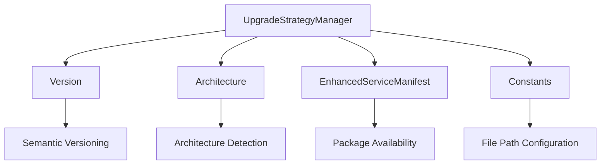
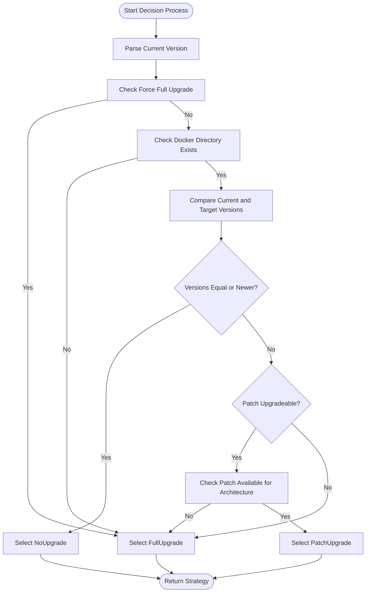
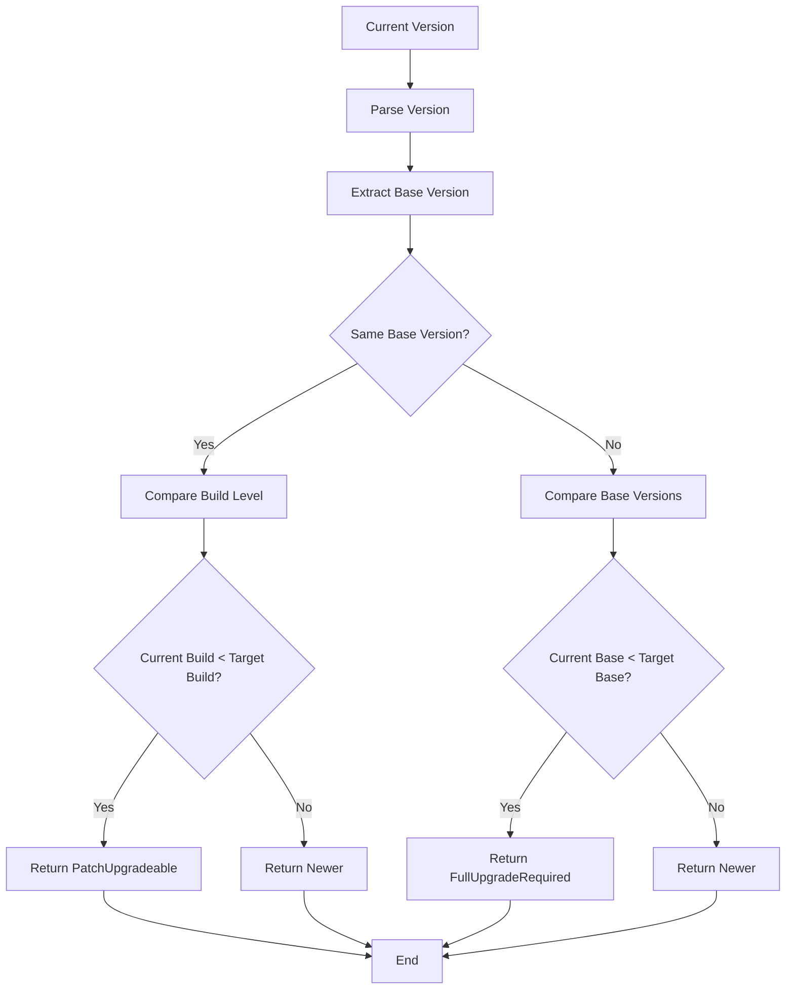
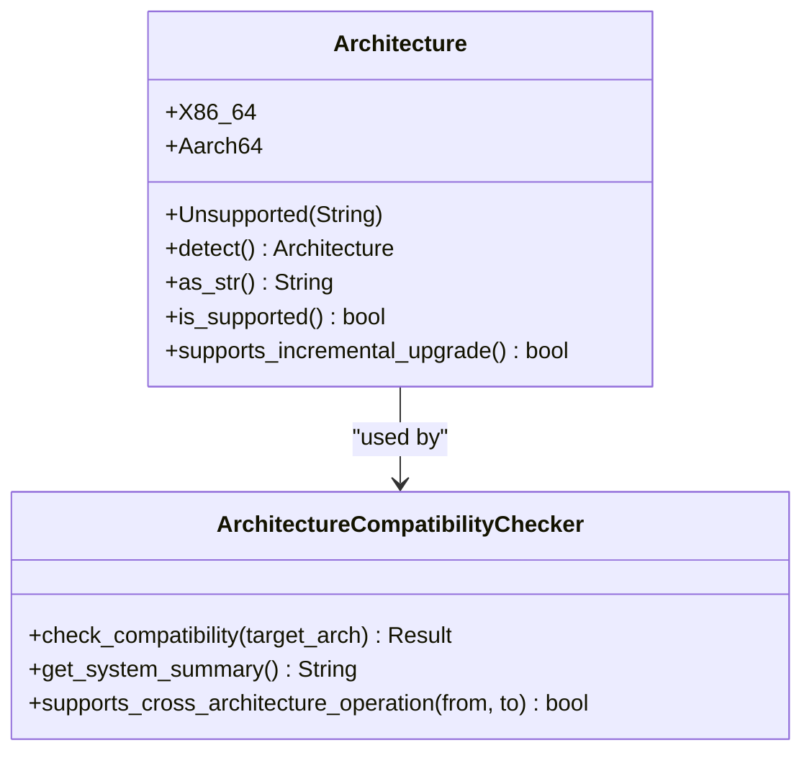
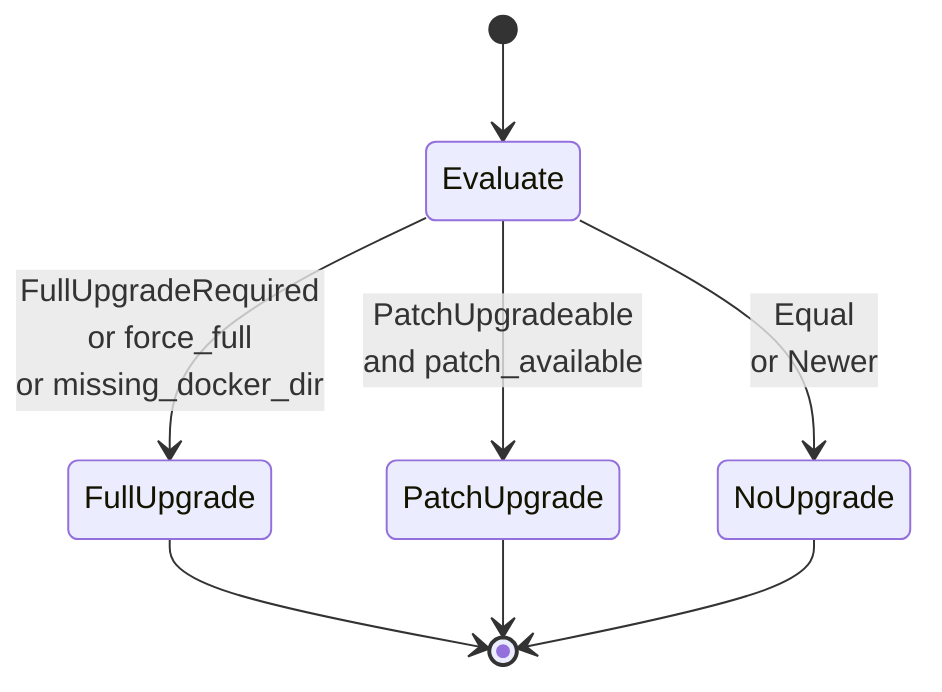
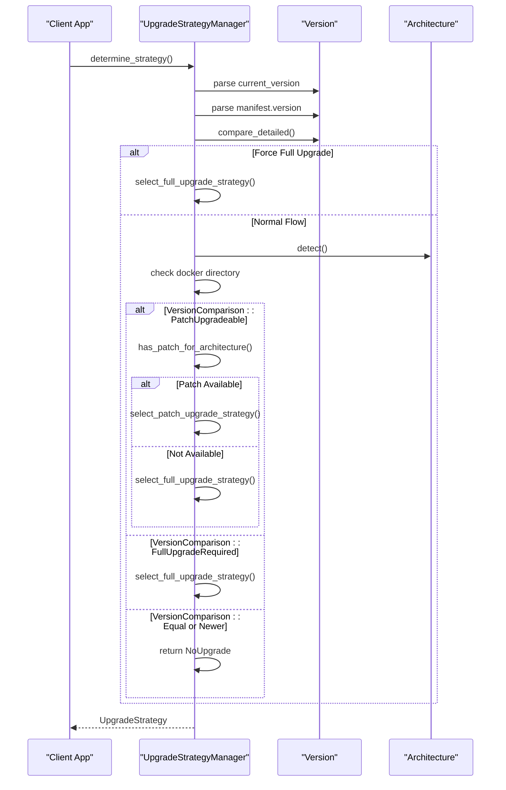
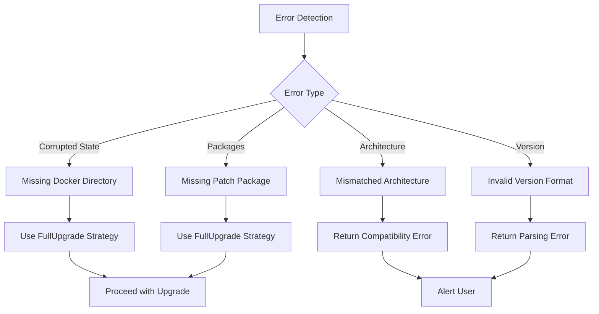

# Upgrade Strategy Decision Process

<cite>
**Referenced Files in This Document**   
- [upgrade_strategy.rs](file://client-core/src/upgrade_strategy.rs)
- [version.rs](file://client-core/src/version.rs)
- [architecture.rs](file://client-core/src/architecture.rs)
- [api_types.rs](file://client-core/src/api_types.rs)
- [constants.rs](file://client-core/src/constants.rs)
- [upgrade.rs](file://client-core/src/upgrade.rs)
</cite>

## Table of Contents
1. [Upgrade Strategy Decision Process](#upgrade-strategy-decision-process)
2. [Core Components](#core-components)
3. [Decision Logic Flow](#decision-logic-flow)
4. [Version Comparison System](#version-comparison-system)
5. [Architecture Compatibility](#architecture-compatibility)
6. [Upgrade Strategy Types](#upgrade-strategy-types)
7. [Real-World Scenarios](#real-world-scenarios)
8. [Edge Cases and Troubleshooting](#edge-cases-and-troubleshooting)
9. [Performance Implications](#performance-implications)

## Core Components

The upgrade strategy decision process is implemented across several core components that work together to determine the appropriate upgrade path. The system uses semantic versioning, architecture detection, and manifest analysis to make intelligent decisions about whether to perform a FullUpgrade, PatchUpgrade, or NoUpgrade.

The main components involved in the decision process are:

- **UpgradeStrategyManager**: The central coordinator that evaluates all factors and determines the final strategy
- **Version**: Handles semantic version parsing, comparison, and compatibility checks
- **Architecture**: Detects and validates system architecture compatibility
- **EnhancedServiceManifest**: Contains server-side version information and package availability
- **Constants**: Provides configuration for file paths and directory structures



**Diagram sources**
- [upgrade_strategy.rs](file://client-core/src/upgrade_strategy.rs#L120-L250)
- [version.rs](file://client-core/src/version.rs#L1-L50)
- [architecture.rs](file://client-core/src/architecture.rs#L1-L50)
- [api_types.rs](file://client-core/src/api_types.rs#L1-L50)

**Section sources**
- [upgrade_strategy.rs](file://client-core/src/upgrade_strategy.rs#L1-L50)
- [version.rs](file://client-core/src/version.rs#L1-L50)
- [architecture.rs](file://client-core/src/architecture.rs#L1-L50)

## Decision Logic Flow

The decision process follows a systematic flow to determine the appropriate upgrade strategy. The `determine_strategy` method in `UpgradeStrategyManager` implements a multi-step evaluation process that considers version differences, architecture compatibility, and system state.



**Diagram sources**
- [upgrade_strategy.rs](file://client-core/src/upgrade_strategy.rs#L120-L250)

**Section sources**
- [upgrade_strategy.rs](file://client-core/src/upgrade_strategy.rs#L120-L250)

## Version Comparison System

The version comparison system uses a four-segment semantic versioning scheme (major.minor.patch.build) to determine compatibility and upgrade requirements. The `Version` struct provides detailed comparison capabilities that go beyond simple version ordering.

The `compare_detailed` method returns one of four possible outcomes:
- **Equal**: Versions are identical
- **Newer**: Current version is more recent than target
- **PatchUpgradeable**: Same base version, higher build level available
- **FullUpgradeRequired**: Different base version requires full upgrade



**Diagram sources**
- [version.rs](file://client-core/src/version.rs#L208-L255)

**Section sources**
- [version.rs](file://client-core/src/version.rs#L208-L255)

## Architecture Compatibility

The architecture compatibility system ensures that upgrades are only performed when the target packages are available for the current system architecture. The `Architecture` enum supports x86_64 and aarch64 platforms with flexible string parsing.

Key architecture detection features:
- Automatic detection using `std::env::consts::ARCH`
- Support for multiple architecture aliases (x86_64, amd64, x64, aarch64, arm64, armv8)
- Case-insensitive parsing
- Support for custom/unsupported architectures



**Diagram sources**
- [architecture.rs](file://client-core/src/architecture.rs#L1-L50)

**Section sources**
- [architecture.rs](file://client-core/src/architecture.rs#L1-L50)

## Upgrade Strategy Types

The system implements three distinct upgrade strategies based on the decision logic:

### FullUpgrade
Performed when:
- Major or minor version changes
- No patch package available for current architecture
- Force full upgrade flag is set
- Docker directory or compose file is missing

```rust
pub enum UpgradeStrategy {
    FullUpgrade {
        url: String,
        hash: String,
        signature: String,
        target_version: Version,
        download_type: DownloadType,
    },
    // ... other variants
}
```

### PatchUpgrade
Performed when:
- Same base version (major.minor.patch)
- Higher build level available
- Patch package exists for current architecture
- No force full upgrade flag

```rust
pub enum UpgradeStrategy {
    PatchUpgrade {
        patch_info: PatchPackageInfo,
        target_version: Version,
        download_type: DownloadType,
    },
    // ... other variants
}
```

### NoUpgrade
Selected when:
- Current version equals target version
- Current version is newer than target
- No upgrade is needed or recommended

```rust
pub enum UpgradeStrategy {
    NoUpgrade {
        target_version: Version,
    },
    // ... other variants
}
```



**Diagram sources**
- [upgrade_strategy.rs](file://client-core/src/upgrade_strategy.rs#L30-L80)
- [api_types.rs](file://client-core/src/api_types.rs#L1-L50)

**Section sources**
- [upgrade_strategy.rs](file://client-core/src/upgrade_strategy.rs#L30-L80)

## Real-World Scenarios

### Scenario 1: Minor Patch Update
**Situation**: Current version is 0.0.13.2, server version is 0.0.13.5
**Decision Process**:
1. Parse versions and extract base version (0.0.13)
2. Confirm same base version
3. Check that build level 5 > 2
4. Verify patch package exists for x86_64 architecture
5. Return PatchUpgrade strategy

**Outcome**: Efficient patch download and application, minimal bandwidth usage.

### Scenario 2: Major Version Upgrade
**Situation**: Current version is 0.0.12.0, server version is 0.0.13.2
**Decision Process**:
1. Parse versions and extract base versions
2. Detect different base versions (0.0.12 vs 0.0.13)
3. Confirm current base version is older
4. Return FullUpgradeRequired
5. Select appropriate architecture-specific full package

**Outcome**: Complete package download and installation, ensuring compatibility with new features.

### Scenario 3: Downgrade Prevention
**Situation**: Current version is 0.0.14.0, server version is 0.0.13.5
**Decision Process**:
1. Parse versions and compare
2. Detect current version is newer
3. Return Newer result from version comparison
4. Select NoUpgrade strategy

**Outcome**: System remains on current version, preventing accidental downgrade.



**Diagram sources**
- [upgrade_strategy.rs](file://client-core/src/upgrade_strategy.rs#L120-L250)
- [version.rs](file://client-core/src/version.rs#L208-L255)
- [architecture.rs](file://client-core/src/architecture.rs#L1-L50)

**Section sources**
- [upgrade_strategy.rs](file://client-core/src/upgrade_strategy.rs#L120-L250)

## Edge Cases and Troubleshooting

### Corrupted Local State
**Symptom**: Missing docker directory or compose file
**Detection**: Check existence of `./docker` directory and `docker-compose.yml` file
**Resolution**: Automatically select FullUpgrade strategy to restore complete state
**Code Reference**: `get_docker_work_dir()` and `get_compose_file_path()` from constants.rs

### Mixed Architectures
**Symptom**: Client running on x86_64 but only aarch64 packages available
**Detection**: Architecture detection and package availability check
**Resolution**: Return error as cross-architecture upgrades are not supported
**Prevention**: Server should provide packages for all supported architectures

### Invalid Version Formats
**Symptom**: Version string cannot be parsed
**Detection**: `Version::from_str()` returns error
**Resolution**: Propagate error to caller for handling
**Validation**: Check for proper format (major.minor.patch[.build])

### Missing Patch Packages
**Symptom**: Server does not provide patch packages for current architecture
**Detection**: `has_patch_for_architecture()` returns false
**Resolution**: Fall back to FullUpgrade strategy
**Consideration**: This ensures upgrade can proceed even without optimized patch delivery



**Diagram sources**
- [upgrade_strategy.rs](file://client-core/src/upgrade_strategy.rs#L150-L180)
- [constants.rs](file://client-core/src/constants.rs#L1-L50)

**Section sources**
- [upgrade_strategy.rs](file://client-core/src/upgrade_strategy.rs#L150-L180)

## Performance Implications

The upgrade strategy decision process has several performance implications that affect user experience and system efficiency:

### Network Efficiency
- **PatchUpgrade**: Minimal bandwidth usage (typically 5-20% of full package size)
- **FullUpgrade**: High bandwidth usage but ensures complete consistency
- **NoUpgrade**: No network usage

### Storage Requirements
- **PatchUpgrade**: Requires storage for patch file plus temporary space for application
- **FullUpgrade**: Requires storage for complete package plus existing installation
- **NoUpgrade**: No additional storage required

### Processing Overhead
- **Decision Process**: Lightweight evaluation (typically < 100ms)
- **Patch Application**: Moderate processing for file replacement
- **Full Installation**: High processing for complete extraction and setup

### Optimization Opportunities
1. **Cache Architecture Detection**: Architecture detection is performed once per session
2. **Lazy Manifest Loading**: Manifest is only fetched when needed
3. **Early Exit Conditions**: Quick returns for NoUpgrade cases
4. **Parallel Operations**: Download and extraction can be parallelized

The system prioritizes reliability over optimization, ensuring that upgrades are performed correctly even at the cost of some efficiency. The fallback to FullUpgrade when patch packages are unavailable ensures that the upgrade process can always proceed, maintaining system updateability as the highest priority.

**Section sources**
- [upgrade_strategy.rs](file://client-core/src/upgrade_strategy.rs#L1-L50)
- [version.rs](file://client-core/src/version.rs#L1-L50)