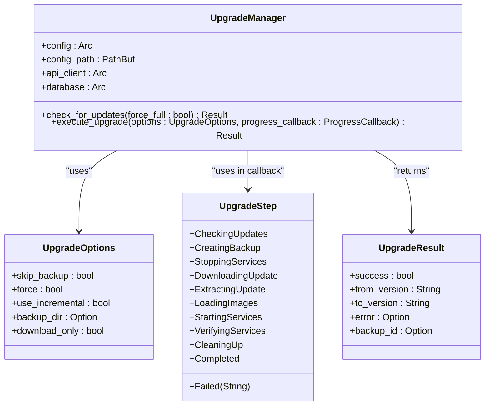
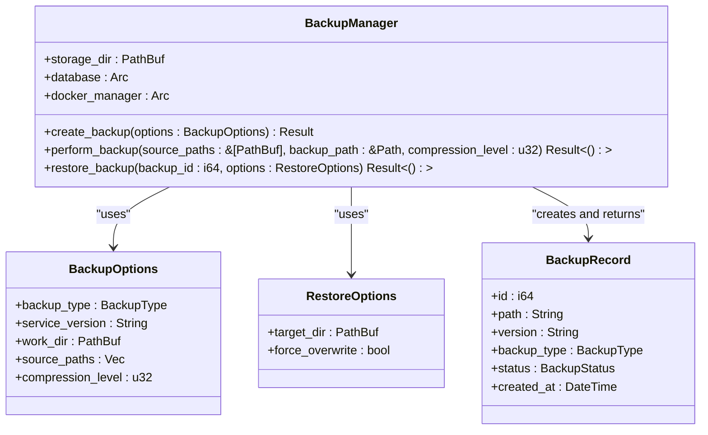
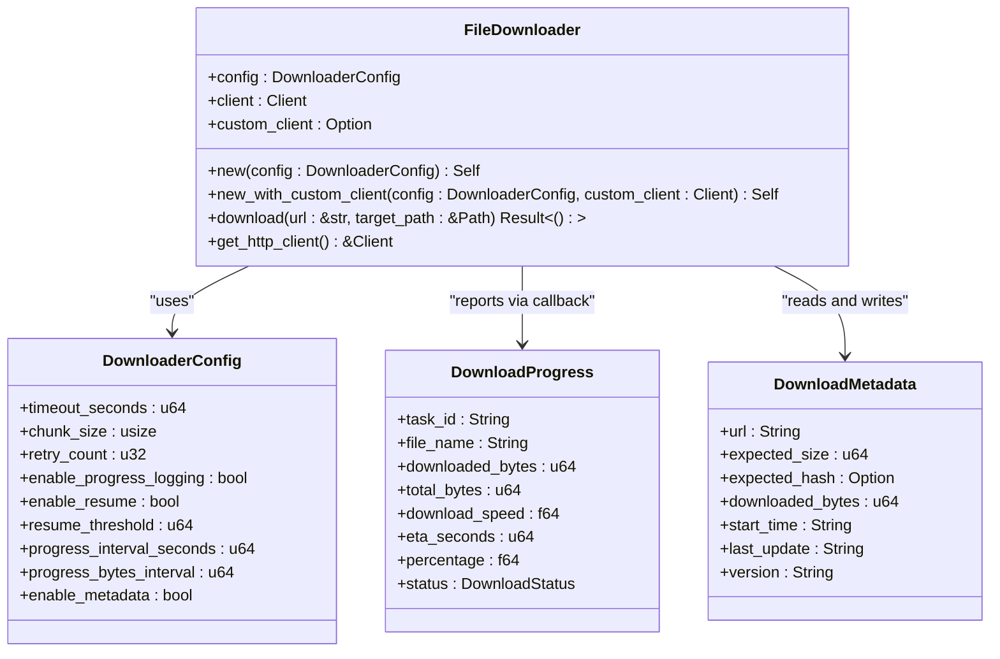
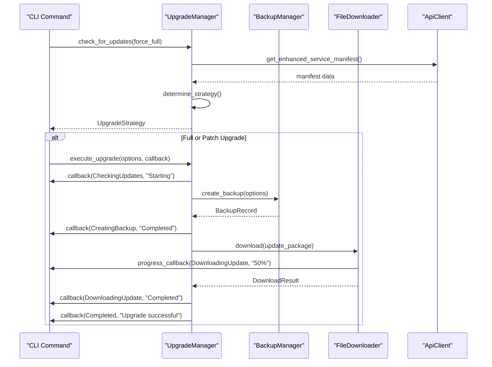
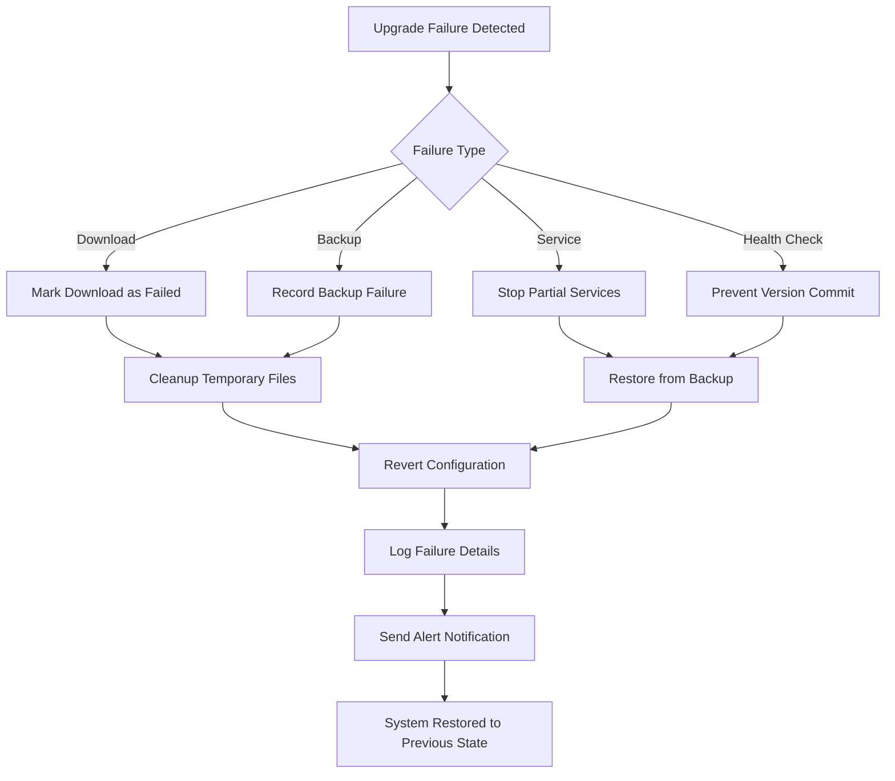

# Upgrade Workflow Execution

<cite>
**Referenced Files in This Document**   
- [upgrade.rs](file://client-core/src/upgrade.rs#L0-L89)
- [downloader.rs](file://client-core/src/downloader.rs#L0-L199)
- [backup.rs](file://client-core/src/backup.rs#L0-L199)
- [update.rs](file://nuwax-cli/src/commands/update.rs#L0-L161)
- [upgrade_strategy.rs](file://client-core/src/upgrade_strategy.rs#L0-L462)
</cite>

## Table of Contents
1. [Upgrade Workflow Execution](#upgrade-workflow-execution)
2. [Upgrade Process Sequence](#upgrade-process-sequence)
3. [Core Module Integration](#core-module-integration)
4. [Orchestration and Progress Reporting](#orchestration-and-progress-reporting)
5. [Rollback and Recovery Procedures](#rollback-and-recovery-procedures)
6. [Common Failure Points](#common-failure-points)
7. [Monitoring and Logging Recommendations](#monitoring-and-logging-recommendations)

## Upgrade Process Sequence

The upgrade execution workflow follows a well-defined sequence from initiation to final verification. This process ensures system integrity, data safety, and service continuity throughout the upgrade operation.

### Update Check
The upgrade process begins with checking for available updates by comparing the current version against the latest version available on the server. The `UpgradeManager::check_for_updates()` method initiates this process by retrieving the enhanced service manifest from the API client and using the `UpgradeStrategyManager` to determine the appropriate upgrade strategy.

```rust
pub async fn check_for_updates(&self, force_full: bool) -> Result<UpgradeStrategy> {
    info!("Checking for service updates...");
    let current_version = &self.config.get_docker_versions();
    debug!("Current version: {}", current_version);
    let enhanced_service_manifest = self.api_client.get_enhanced_service_manifest().await?;

    let upgrade_strategy_manager = UpgradeStrategyManager::new(
        current_version.to_string(),
        force_full,
        enhanced_service_manifest,
    );
    let upgrade_strategy: UpgradeStrategy = upgrade_strategy_manager.determine_strategy()?;

    Ok(upgrade_strategy)
}
```

### Strategy Selection
The `UpgradeStrategyManager` analyzes several factors to determine the optimal upgrade approach:
- **Version compatibility**: Compares current and target versions to determine if a patch or full upgrade is needed
- **Architecture compatibility**: Ensures the upgrade package matches the system architecture (x86_64 or aarch64)
- **Force flag**: Respects the `force_full` parameter to override intelligent strategy selection
- **File system state**: Checks for the presence of essential files like docker-compose.yml

The strategy selection logic returns one of three possible outcomes:
- `FullUpgrade`: Complete replacement of all service components
- `PatchUpgrade`: Incremental update with only changed files
- `NoUpgrade`: Current version is already up-to-date

### Download Process
Once the upgrade strategy is determined, the system proceeds with downloading the necessary files. The downloader module supports multiple download types with advanced features:

**Download Features**
- **Intelligent download strategy**: Automatic detection of HTTP vs. extended timeout HTTP
- **Resumable downloads**: Support for HTTP Range requests to continue interrupted downloads
- **Progress monitoring**: Real-time feedback on download speed, percentage, and estimated time
- **Integrity verification**: SHA-256 hash validation to ensure file integrity
- **Metadata management**: Tracking of download state for resumption across sessions

The `FileDownloader` class handles the actual download operations with configurable parameters such as timeout, chunk size, and retry count.

### Pre-Upgrade Backup
Before applying any changes, the system creates a comprehensive backup of critical data. The `BackupManager` handles this process with the following characteristics:

**Backup Options**
- **Backup type**: Manual or pre-upgrade
- **Compression level**: Configurable from 0-9
- **Source paths**: Specific files and directories to include in backup

The backup process uses tar.gz compression and records metadata in the database for tracking and restoration purposes. For pre-upgrade backups, the system specifically targets the `data` directory and any files identified as modified in the upgrade strategy.

### Patch/Full Application
The application phase differs based on the selected upgrade strategy:

**Patch Upgrade Process**
- Downloads only changed files as specified in the patch manifest
- Applies file replacements and deletions according to the patch operations
- Preserves configuration files and user data

**Full Upgrade Process**
- Downloads complete service package
- Replaces all service components
- Maintains data directory but updates application files completely

### Service Restart
After the upgrade files are in place, the system restarts the Docker services. This involves:
1. Stopping all running containers
2. Loading new Docker images
3. Starting services with updated configurations
4. Waiting for services to become responsive

### Health Check
The health check phase verifies that all services are functioning correctly after the restart. This includes:
- HTTP endpoint responsiveness
- Database connectivity
- Background service operation
- Resource utilization within normal parameters

### Version Commit
Once health checks pass successfully, the system commits the upgrade by:
- Updating the version record in configuration
- Removing temporary files
- Logging the successful upgrade
- Notifying monitoring systems

**Section sources**
- [upgrade.rs](file://client-core/src/upgrade.rs#L0-L89)
- [upgrade_strategy.rs](file://client-core/src/upgrade_strategy.rs#L0-L462)

## Core Module Integration

The upgrade workflow integrates three core modules: `upgrade.rs`, `backup.rs`, and `downloader.rs`. These modules work together to ensure a reliable and transactional upgrade process.

### Upgrade Module
The `UpgradeManager` serves as the central coordinator for the entire upgrade process. It manages the state transitions and delegates specific tasks to specialized modules.



**Diagram sources**
- [upgrade.rs](file://client-core/src/upgrade.rs#L0-L89)

### Backup Module
The `BackupManager` ensures data integrity before any upgrade operations. It integrates with the database to record backup metadata and supports both manual and automated backup scenarios.



**Diagram sources**
- [backup.rs](file://client-core/src/backup.rs#L0-L199)

### Downloader Module
The `FileDownloader` provides robust file download capabilities with support for resumable transfers and integrity verification.



**Diagram sources**
- [downloader.rs](file://client-core/src/downloader.rs#L0-L199)

### Error Handling and Transactional Integrity
The upgrade system implements comprehensive error handling to maintain transactional integrity:

**Error Handling Strategy**
- **Atomic operations**: Each major step is designed to be atomic
- **Rollback capability**: Failed operations trigger automatic rollback procedures
- **State persistence**: Progress is recorded to survive process restarts
- **Comprehensive logging**: Detailed logs enable post-failure analysis

The system uses Rust's `Result` type extensively and converts errors to the `anyhow::Result` type for flexible error handling across module boundaries.

**Section sources**
- [upgrade.rs](file://client-core/src/upgrade.rs#L0-L89)
- [backup.rs](file://client-core/src/backup.rs#L0-L199)
- [downloader.rs](file://client-core/src/downloader.rs#L0-L199)

## Orchestration and Progress Reporting

The upgrade process is orchestrated through the `update.rs` command module, which coordinates the entire workflow from the CLI interface.

### Command Orchestration
The `run_upgrade` function in `update.rs` serves as the entry point for upgrade operations:

```rust
pub async fn run_upgrade(app: &mut CliApp, args: UpgradeArgs) -> Result<UpgradeStrategy> {
    info!("Checking Docker service upgrade version");
    
    let upgrade_strategy = app.upgrade_manager.check_for_updates(args.force).await?;
    
    match &upgrade_strategy {
        UpgradeStrategy::FullUpgrade { url, target_version, .. } => {
            handle_service_download(app, url, target_version, download_dir, &version_str, "full").await?;
        }
        UpgradeStrategy::PatchUpgrade { patch_info, target_version, .. } => {
            handle_service_download(app, &patch_info.url, target_version, download_dir, &base_version, &version_str).await?;
        }
        UpgradeStrategy::NoUpgrade { target_version } => {
            info!("Already on latest version: {}", target_version);
        }
    }
    
    Ok(upgrade_strategy)
}
```

### Progress Reporting Mechanism
The system implements a callback-based progress reporting mechanism using the `ProgressCallback` type:

```rust
pub type ProgressCallback = Box<dyn Fn(UpgradeStep, &str) + Send + Sync>;
```

This allows the upgrade manager to notify the UI or CLI of progress updates in real-time. The `UpgradeStep` enum provides a standardized way to communicate the current phase of the upgrade process.



**Diagram sources**
- [update.rs](file://nuwax-cli/src/commands/update.rs#L0-L161)
- [upgrade.rs](file://client-core/src/upgrade.rs#L0-L89)

**Section sources**
- [update.rs](file://nuwax-cli/src/commands/update.rs#L0-L161)

## Rollback and Recovery Procedures

The system implements automatic rollback and recovery procedures to handle upgrade failures and maintain system stability.

### Rollback Triggers
Automatic rollback is triggered by the following conditions:
- **Download failure**: Inability to retrieve upgrade packages after retries
- **Backup failure**: Inability to create a pre-upgrade backup
- **Service startup failure**: Services fail to start or become unresponsive
- **Health check failure**: Services start but fail health verification
- **Timeout**: Any phase exceeds its maximum allowed duration

### Automatic Recovery
When a rollback is triggered, the system executes the following recovery procedure:

1. **Service termination**: Stop any partially started services
2. **Backup restoration**: Restore the system to its pre-upgrade state using the backup created at the beginning
3. **Configuration rollback**: Revert configuration changes
4. **Cleanup**: Remove temporary upgrade files
5. **Notification**: Log the failure and notify administrators

The `BackupManager` plays a critical role in this process by providing reliable restoration capabilities that preserve data integrity.



**Diagram sources**
- [backup.rs](file://client-core/src/backup.rs#L0-L199)
- [upgrade.rs](file://client-core/src/upgrade.rs#L0-L89)

**Section sources**
- [backup.rs](file://client-core/src/backup.rs#L0-L199)

## Common Failure Points

Despite robust error handling, certain failure points are more common in production environments. Understanding these helps in proactive monitoring and prevention.

### Disk Space Exhaustion
Insufficient disk space is a frequent cause of upgrade failures, particularly for full upgrades which require space for both the existing installation and the new package.

**Mitigation Strategies**
- **Pre-check**: Verify available disk space before starting the upgrade
- **Cleanup**: Automatically remove old backups and temporary files
- **Streaming**: Implement streaming extraction to minimize temporary storage needs
- **Monitoring**: Set up alerts for low disk space conditions

### Network Timeouts
Network issues can interrupt downloads, especially for large upgrade packages.

**Mitigation Strategies**
- **Resumable downloads**: Support for HTTP Range requests to continue interrupted transfers
- **Retry logic**: Configurable retry attempts with exponential backoff
- **Multiple mirrors**: Support for alternative download sources
- **Bandwidth throttling**: Adjustable download speed to prevent network congestion

### Service Startup Failures
After applying updates, services may fail to start due to configuration incompatibilities or dependency issues.

**Mitigation Strategies**
- **Pre-validation**: Validate configuration files before applying updates
- **Dependency checking**: Verify all required dependencies are present
- **Gradual rollout**: Start services individually to isolate failures
- **Fallback configurations**: Maintain known-good configurations for emergency recovery

**Section sources**
- [upgrade.rs](file://client-core/src/upgrade.rs#L0-L89)
- [downloader.rs](file://client-core/src/downloader.rs#L0-L199)

## Monitoring and Logging Recommendations

Effective monitoring and logging are essential for maintaining upgrade reliability in production environments.

### Logging Best Practices
Implement comprehensive logging at multiple levels:

**Log Levels and Usage**
- **Trace**: Detailed step-by-step execution for debugging
- **Debug**: Internal state and decision points
- **Info**: Major milestones and user-visible events
- **Warn**: Potential issues that don't halt execution
- **Error**: Failures and exceptions
- **Critical**: System-critical failures requiring immediate attention

**Structured Logging**
Use structured logging with consistent fields for easy parsing and analysis:

```json
{
  "timestamp": "2025-01-15T10:30:00Z",
  "level": "INFO",
  "module": "upgrade",
  "event": "upgrade_step_completed",
  "step": "CreatingBackup",
  "backup_id": 12345,
  "duration_ms": 2450
}
```

### Monitoring Recommendations
Implement monitoring at multiple levels to ensure upgrade reliability:

**Key Metrics to Monitor**
- **Upgrade success rate**: Percentage of successful upgrades
- **Duration by phase**: Time taken for each upgrade step
- **Failure types**: Categorization of common failure modes
- **Resource utilization**: CPU, memory, and disk usage during upgrades
- **Network performance**: Download speeds and success rates

**Alerting Strategy**
- **Immediate alerts**: For critical failures that impact service availability
- **Warning alerts**: For non-critical issues that may affect future upgrades
- **Trend alerts**: For gradual degradation in performance or success rates
- **Capacity alerts**: For approaching resource limits

**Audit Trail**
Maintain a comprehensive audit trail of all upgrade activities:

- **Who initiated** the upgrade
- **When** it was performed
- **What** version was targeted
- **Outcome** of the upgrade
- **Backup** created and its status
- **Rollback** events and reasons

**Section sources**
- [upgrade.rs](file://client-core/src/upgrade.rs#L0-L89)
- [downloader.rs](file://client-core/src/downloader.rs#L0-L199)
- [backup.rs](file://client-core/src/backup.rs#L0-L199)