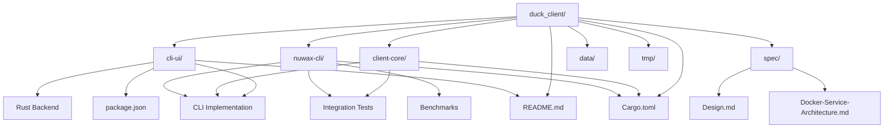
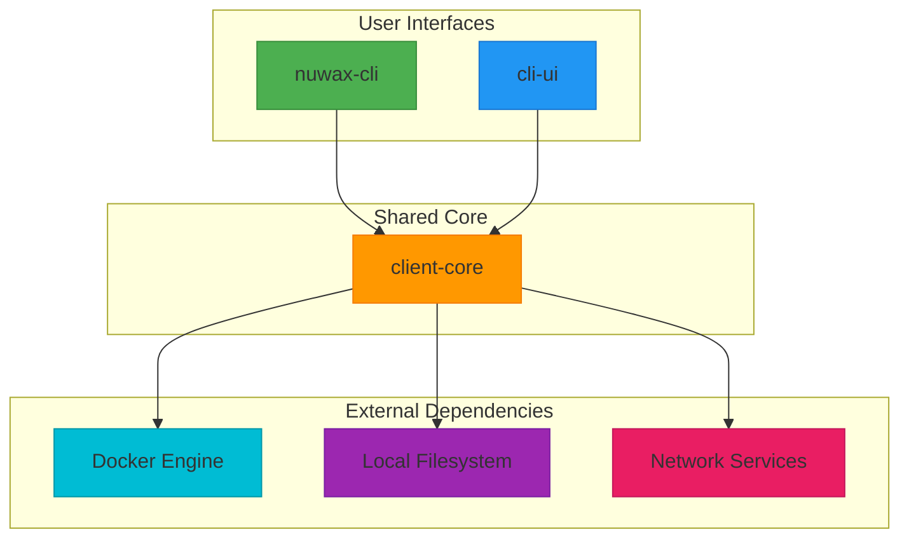
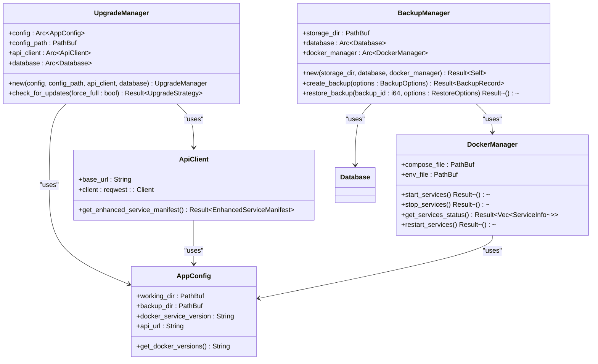
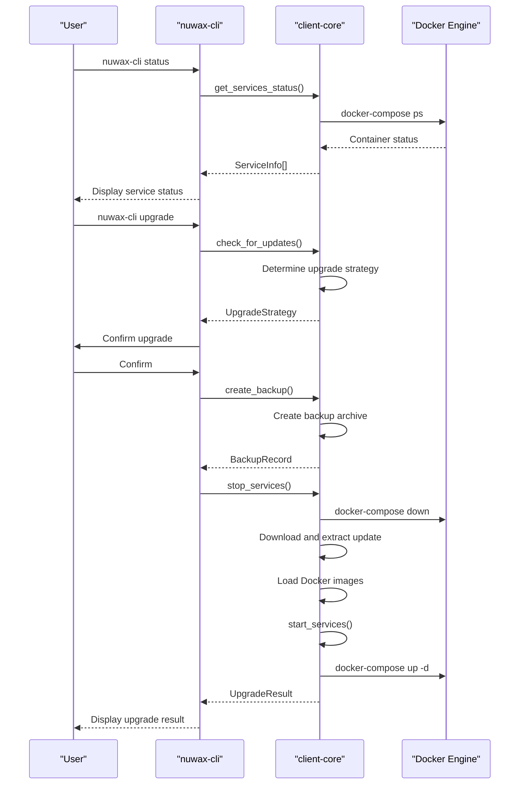
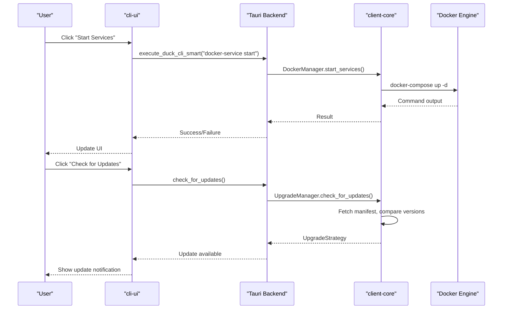
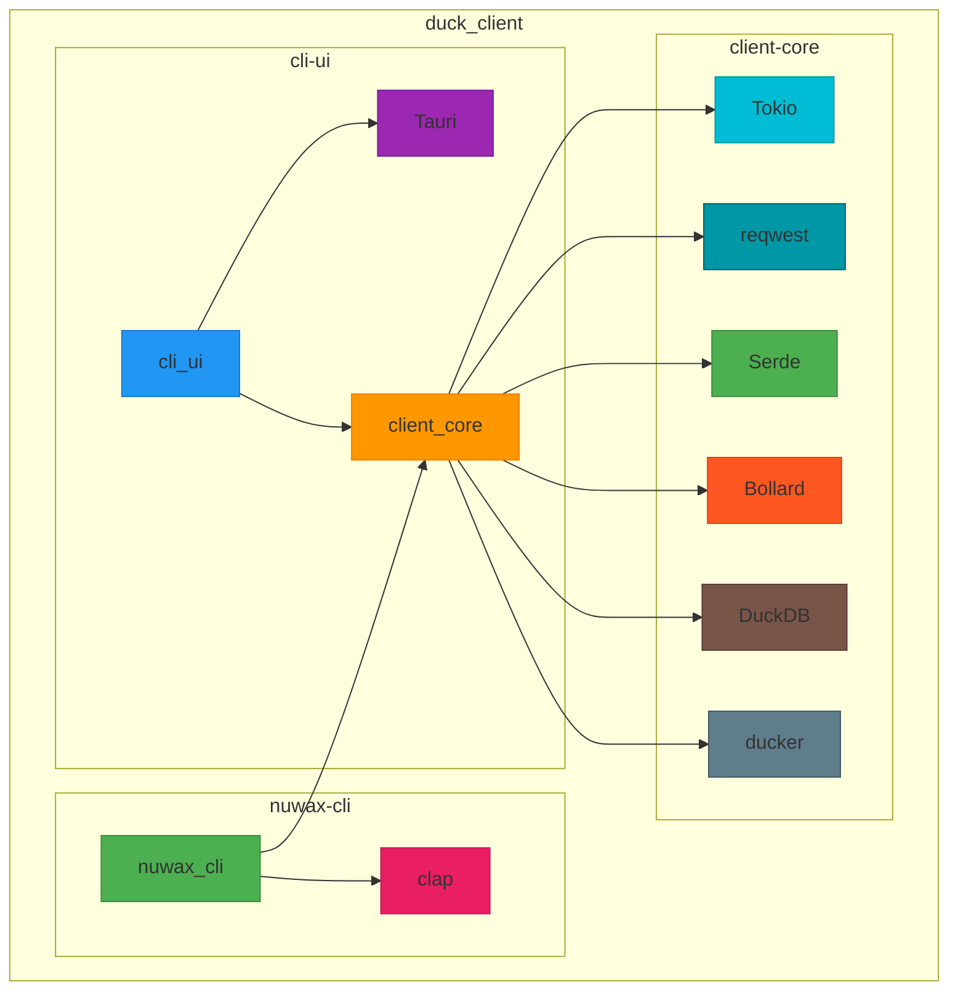

# Project Overview

<cite>
**Referenced Files in This Document**   
- [README.md](file://README.md)
- [Cargo.toml](file://Cargo.toml)
- [spec/Design.md](file://spec/Design.md)
- [spec/Docker-Service-Architecture.md](file://spec/Docker-Service-Architecture.md)
- [client-core/src/lib.rs](file://client-core/src/lib.rs)
- [client-core/src/upgrade.rs](file://client-core/src/upgrade.rs)
- [client-core/src/backup.rs](file://client-core/src/backup.rs)
- [client-core/src/container/service.rs](file://client-core/src/container/service.rs)
- [client-core/src/version.rs](file://client-core/src/version.rs)
- [nuwax-cli/src/lib.rs](file://nuwax-cli/src/lib.rs)
- [nuwax-cli/src/cli.rs](file://nuwax-cli/src/cli.rs)
- [nuwax-cli/src/commands/status.rs](file://nuwax-cli/src/commands/status.rs)
- [cli-ui/src-tauri/src/lib.rs](file://cli-ui/src-tauri/src/lib.rs)
- [cli-ui/src-tauri/src/commands/cli.rs](file://cli-ui/src-tauri/src/commands/cli.rs)
- [client-core/Cargo.toml](file://client-core/Cargo.toml)
- [nuwax-cli/Cargo.toml](file://nuwax-cli/Cargo.toml)
- [cli-ui/src-tauri/Cargo.toml](file://cli-ui/src-tauri/Cargo.toml)
</cite>

## Table of Contents
1. [Introduction](#introduction)
2. [Project Structure](#project-structure)
3. [Core Components](#core-components)
4. [Architecture Overview](#architecture-overview)
5. [Detailed Component Analysis](#detailed-component-analysis)
6. [Dependency Analysis](#dependency-analysis)
7. [Performance Considerations](#performance-considerations)
8. [Troubleshooting Guide](#troubleshooting-guide)
9. [Conclusion](#conclusion)

## Introduction
The duck_client project is a sophisticated desktop application designed for managing containerized services through Docker, offering both command-line interface (CLI) and graphical user interface (GUI) capabilities. Its primary purpose is to streamline the lifecycle management of Docker Compose services, providing intelligent upgrade mechanisms, robust backup and rollback features, and cross-platform support. The application is built as a monorepo with three main components: a Tauri-based GUI (cli-ui), a Rust CLI tool (nuwax-cli), and a shared business logic library (client-core). This document provides a comprehensive overview of the project's architecture, functionality, and technology stack, making it accessible to both technical and non-technical users.

## Project Structure
The duck_client project is organized as a monorepo with a clear separation of concerns. The root directory contains the workspace configuration and shared dependencies, while the main components are housed in dedicated subdirectories. The `cli-ui` directory contains the Tauri-based GUI application, including both the Rust backend and the React frontend. The `client-core` directory houses the shared business logic, which is used by both the CLI and GUI interfaces. The `nuwax-cli` directory contains the standalone Rust CLI tool. Additional directories include `spec` for design documents, `data` for static web content, and `tmp` for temporary files. This structure promotes code reuse and maintainability, with the shared `client-core` library ensuring consistent behavior across both interfaces.

**Diagram sources**
- [README.md](file://README.md)
- [Cargo.toml](file://Cargo.toml)

**Section sources**
- [README.md](file://README.md#L1-L92)
- [Cargo.toml](file://Cargo.toml#L1-L136)

## Core Components
The duck_client project is built around three core components that work together to provide a seamless user experience. The **client-core** library is the heart of the application, containing all shared business logic such as Docker service management, backup and restore operations, version control, and API communication. This library is designed to be platform-agnostic and is used by both the CLI and GUI interfaces. The **nuwax-cli** component is a feature-rich Rust command-line tool that provides direct access to all of the application's functionality, making it ideal for automation and scripting. The **cli-ui** component is a modern desktop application built with Tauri, React, and TypeScript, offering an intuitive graphical interface for users who prefer a visual workflow. This modular architecture ensures that core functionality is centralized and consistent, while the interfaces can be developed and optimized independently.

**Section sources**
- [README.md](file://README.md#L1-L92)
- [spec/Design.md](file://spec/Design.md#L1-L533)
- [client-core/src/lib.rs](file://client-core/src/lib.rs#L1-L27)

## Architecture Overview
The duck_client project follows a clean, modular architecture that separates concerns and promotes code reuse. At the core is the `client-core` library, which encapsulates all business logic and provides a stable API for the two user-facing components. The `nuwax-cli` tool acts as a thin wrapper around `client-core`, using the `clap` library to parse command-line arguments and invoke the appropriate functions. The `cli-ui` application uses Tauri's architecture to bridge the React frontend with the Rust backend, which in turn calls into `client-core`. This design ensures that both interfaces have access to the same underlying functionality, providing a consistent user experience regardless of the chosen interface. The application is designed to be cross-platform, supporting Windows, macOS, and Linux, and leverages Rust's performance and safety guarantees for critical operations.

**Diagram sources**
- [spec/Design.md](file://spec/Design.md#L1-L533)
- [client-core/src/lib.rs](file://client-core/src/lib.rs#L1-L27)

## Detailed Component Analysis

### client-core Analysis
The `client-core` library is the foundation of the duck_client project, providing all essential business logic. It is implemented in Rust and designed to be used as a dependency by both the CLI and GUI applications. The library is organized into several modules, each responsible for a specific aspect of the application's functionality. Key modules include `container` for Docker service lifecycle management, `backup` for backup and restore operations, `upgrade` for intelligent upgrade strategies, `database` for local data persistence, and `api` for communication with external services. The library uses modern Rust practices, including async/await for non-blocking operations, `serde` for serialization, and `anyhow` for error handling. By centralizing this logic, the project ensures that both interfaces behave consistently and can be updated in tandem.

#### For Object-Oriented Components:

**Diagram sources**
- [client-core/src/lib.rs](file://client-core/src/lib.rs#L1-L27)
- [client-core/src/upgrade.rs](file://client-core/src/upgrade.rs#L1-L89)
- [client-core/src/backup.rs](file://client-core/src/backup.rs#L1-L199)
- [client-core/src/container/service.rs](file://client-core/src/container/service.rs#L1-L199)

**Section sources**
- [client-core/src/lib.rs](file://client-core/src/lib.rs#L1-L27)
- [client-core/src/upgrade.rs](file://client-core/src/upgrade.rs#L1-L89)
- [client-core/src/backup.rs](file://client-core/src/backup.rs#L1-L199)
- [client-core/src/container/service.rs](file://client-core/src/container/service.rs#L1-L199)

### nuwax-cli Analysis
The `nuwax-cli` component is a powerful command-line interface for the duck_client project. It is implemented as a Rust binary and uses the `clap` library for command-line argument parsing. The CLI provides a comprehensive set of commands for managing Docker services, including initialization, status checking, backup creation, service control, and upgrades. The implementation is straightforward, with the main `nuwax-cli` binary acting as a thin wrapper that parses user input and delegates to the appropriate functions in the `client-core` library. This design ensures that the CLI has access to all the same functionality as the GUI, making it suitable for both interactive use and automation scripts. The CLI also includes features like progress reporting and detailed error messages to enhance the user experience.

#### For API/Service Components:

**Diagram sources**
- [nuwax-cli/src/lib.rs](file://nuwax-cli/src/lib.rs#L1-L27)
- [nuwax-cli/src/cli.rs](file://nuwax-cli/src/cli.rs#L1-L130)
- [nuwax-cli/src/commands/status.rs](file://nuwax-cli/src/commands/status.rs#L85-L115)

**Section sources**
- [nuwax-cli/src/lib.rs](file://nuwax-cli/src/lib.rs#L1-L27)
- [nuwax-cli/src/cli.rs](file://nuwax-cli/src/cli.rs#L1-L130)
- [nuwax-cli/src/commands/status.rs](file://nuwax-cli/src/commands/status.rs#L85-L115)

### cli-ui Analysis
The `cli-ui` component is a modern desktop application built with the Tauri framework. It provides a graphical interface for users who prefer a visual approach to managing their Docker services. The application is built using React and TypeScript for the frontend, with a Rust backend that communicates with the `client-core` library. The Tauri architecture allows the application to run natively on Windows, macOS, and Linux while providing a web-like user experience. The GUI exposes all the core functionality of the duck_client project, including service status monitoring, backup and restore operations, and upgrade management. It also includes additional features like a terminal window for viewing real-time logs and modal dialogs for critical operations, enhancing the user experience compared to the CLI.

#### For API/Service Components:

**Diagram sources**
- [cli-ui/src-tauri/src/lib.rs](file://cli-ui/src-tauri/src/lib.rs#L1-L35)
- [cli-ui/src-tauri/src/commands/cli.rs](file://cli-ui/src-tauri/src/commands/cli.rs#L408-L449)

**Section sources**
- [cli-ui/src-tauri/src/lib.rs](file://cli-ui/src-tauri/src/lib.rs#L1-L35)
- [cli-ui/src-tauri/src/commands/cli.rs](file://cli-ui/src-tauri/src/commands/cli.rs#L408-L449)

## Dependency Analysis
The duck_client project has a well-defined dependency structure that supports its modular architecture. The root `Cargo.toml` file defines the workspace and shared dependencies, ensuring version consistency across all components. The `client-core` library depends on a wide range of crates for various functionalities, including `tokio` for async runtime, `reqwest` for HTTP requests, `serde` for serialization, `bollard` for Docker API interaction, and `duckdb` for local data storage. The `nuwax-cli` component depends on `client-core` and `clap` for command-line argument parsing, while the `cli-ui` component depends on `client-core` and the Tauri framework. This dependency graph ensures that each component has access to the tools it needs while maintaining a clear separation of concerns.

**Diagram sources**
- [Cargo.toml](file://Cargo.toml#L1-L136)
- [client-core/Cargo.toml](file://client-core/Cargo.toml#L1-L109)
- [nuwax-cli/Cargo.toml](file://nuwax-cli/Cargo.toml#L1-L118)
- [cli-ui/src-tauri/Cargo.toml](file://cli-ui/src-tauri/Cargo.toml#L1-L32)

**Section sources**
- [Cargo.toml](file://Cargo.toml#L1-L136)
- [client-core/Cargo.toml](file://client-core/Cargo.toml#L1-L109)
- [nuwax-cli/Cargo.toml](file://nuwax-cli/Cargo.toml#L1-L118)
- [cli-ui/src-tauri/Cargo.toml](file://cli-ui/src-tauri/Cargo.toml#L1-L32)

## Performance Considerations
The duck_client project is designed with performance in mind, leveraging Rust's strengths to provide a fast and efficient user experience. The use of async/await throughout the codebase ensures that I/O operations do not block the main thread, allowing the application to remain responsive even during long-running tasks like downloading updates or creating backups. The `client-core` library is optimized for minimal overhead, with careful attention paid to memory allocation and CPU usage. For operations that involve large amounts of data, such as backup creation, the application uses efficient compression algorithms and streams data to disk to minimize memory usage. The CLI interface is particularly performant, as it avoids the overhead of a graphical interface and can be used in automated scripts with minimal latency.

## Troubleshooting Guide
When encountering issues with the duck_client project, users should first check the application logs for detailed error messages. Common issues include Docker not being installed or running, insufficient permissions to access the working directory, and network connectivity problems when checking for updates. For the CLI, users can use the `--verbose` flag to get more detailed output. For the GUI, the terminal window can provide real-time feedback on ongoing operations. If an upgrade fails, the application's automatic backup feature can be used to restore the previous state. Users should also ensure that they are using compatible versions of Docker and Docker Compose, as specified in the project's requirements. For persistent issues, the project's GitHub repository is the best place to report bugs and seek support.

**Section sources**
- [README.md](file://README.md#L1-L92)
- [spec/Design.md](file://spec/Design.md#L1-L533)
- [spec/Docker-Service-Architecture.md](file://spec/Docker-Service-Architecture.md#L1-L300)

## Conclusion
The duck_client project is a well-architected, feature-rich application for managing containerized services with Docker. Its monorepo structure, with a shared `client-core` library and dual CLI/GUI interfaces, provides a flexible and maintainable codebase. The application's focus on intelligent upgrades, automatic backups, and cross-platform support makes it a valuable tool for developers and DevOps engineers alike. By leveraging modern technologies like Rust, Tauri, and React, the project delivers a high-performance, user-friendly experience that simplifies the complex task of Docker service management. As the project continues to evolve, its modular design will make it easy to add new features and adapt to changing requirements.