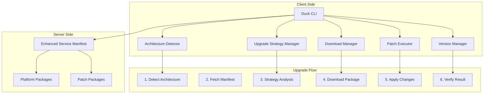
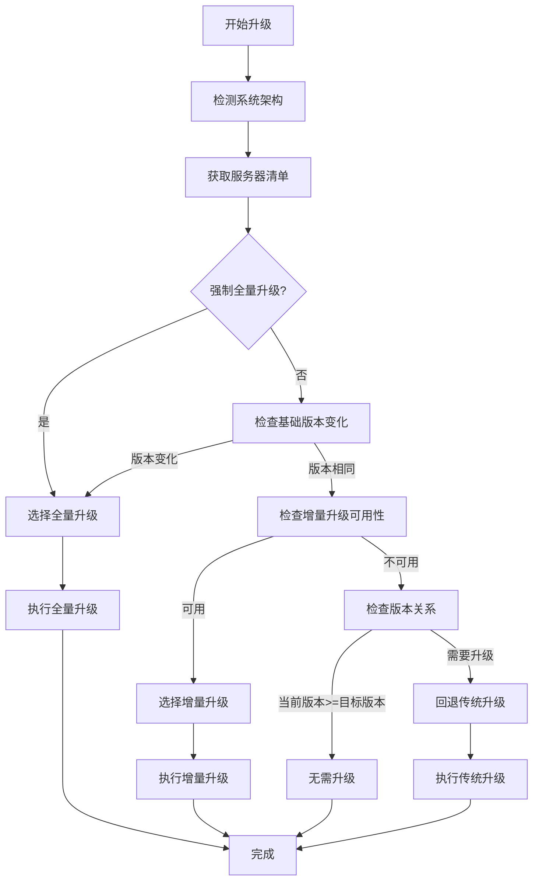
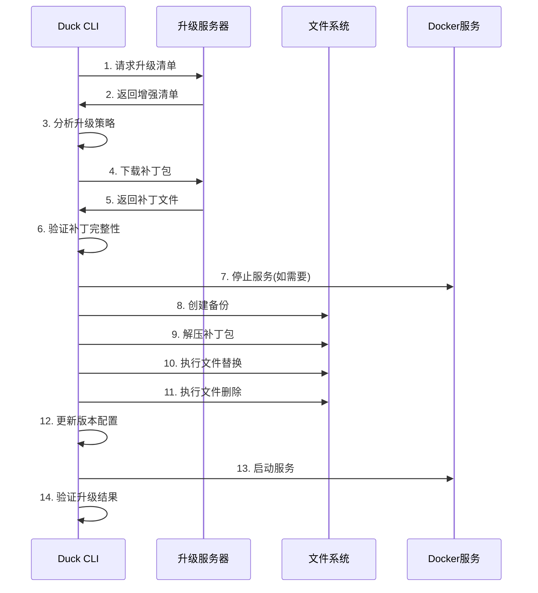

# Duck CLI 智能升级系统架构

## 📋 概述

Duck CLI 2.0 采用全新的智能升级架构，支持架构特定和增量升级，大幅提升升级效率和用户体验。

## 🏗️ 整体架构



## 🔍 核心组件

### 1. Architecture Detector (架构检测器)

**功能**：自动检测系统架构
```rust
pub enum Architecture {
    X86_64,    // Intel/AMD 64位
    Aarch64,   // ARM 64位 (Apple Silicon)
    Unsupported(String),
}
```

**检测逻辑**：
- 使用 `std::env::consts::ARCH` 获取系统架构
- 支持 x86_64 和 aarch64 两种主流架构
- 提供架构字符串转换功能

### 2. Version Manager (版本管理器)

**功能**：管理四段式版本号系统
```
版本格式: major.minor.patch.build
示例: 0.0.13.2
├── 0.0.13  # 基础版本
└── .2      # 补丁级别
```

**核心逻辑**：
- 版本解析和比较
- 基础版本提取
- 补丁适用性检查
- 版本兼容性验证

### 3. Upgrade Strategy Manager (升级策略管理器)

**功能**：智能选择最优升级策略

```rust
pub enum UpgradeStrategy {
    NoUpgrade { current_version: String },
    FullUpgrade { 
        from_version: String,
        to_version: String,
        architecture: String,
        download_url: String,
        signature: String,
    },
    PatchUpgrade {
        from_version: String,
        to_version: String,
        architecture: String,
        download_url: String,
        hash: String,
        signature: String,
    },
    LegacyUpgrade {
        from_version: String,
        to_version: String,
        download_url: String,
    },
}
```

**决策逻辑**：
1. 强制全量升级检查
2. 基础版本变化检查
3. 增量升级可用性检查
4. 架构兼容性验证
5. 回退到传统升级

### 4. Download Manager (下载管理器)

**功能**：智能下载和缓存管理

**特性**：
- 架构特定包下载
- 断点续传支持
- 数字签名验证
- 进度实时反馈
- 智能缓存策略

### 5. Patch Executor (补丁执行器)

**功能**：安全的增量升级执行

**核心模块**：
```
patch_executor/
├── mod.rs              # 主执行器
├── file_operations.rs  # 文件操作
├── patch_processor.rs  # 补丁处理
└── error.rs           # 错误处理
```

**执行流程**：
1. 补丁包下载和验证
2. 创建系统备份
3. 解压补丁包
4. 执行文件替换操作
5. 执行文件删除操作
6. 验证执行结果
7. 清理临时文件

## 🔄 升级流程图

### 智能升级决策流程



### 增量升级详细流程



## 📊 数据结构设计

### Enhanced Service Manifest (增强服务清单)

```json
{
    "version": "0.0.13",
    "release_date": "2025-07-12T13:49:59Z",
    "release_notes": "版本更新说明",
    
    "packages": {
        "full": {
            "url": "https://legacy-url/docker.zip",
            "hash": "external",
            "signature": "",
            "size": 0
        }
    },
    
    "platforms": {
        "x86_64": {
            "signature": "数字签名",
            "url": "https://packages/x86_64/docker.zip"
        },
        "aarch64": {
            "signature": "数字签名",
            "url": "https://packages/aarch64/docker.zip"
        }
    },
    
    "patch": {
        "version": "0.0.13.2",
        "x86_64": {
            "url": "https://packages/patches/x86_64-patch.tar.gz",
            "hash": "sha256:patch_hash_x86_64",
            "signature": "patch_signature_x86_64",
            "operations": {
                "replace": {
                    "files": ["app/app.jar", "config/application.yml"],
                    "directories": ["front/", "plugins/"]
                },
                "delete": ["front/old-assets/", "config/old.conf"]
            }
        },
        "aarch64": {
            "url": "https://packages/patches/aarch64-patch.tar.gz",
            "hash": "sha256:patch_hash_aarch64",
            "signature": "patch_signature_aarch64",
            "operations": {
                "replace": {
                    "files": ["app.jar", "config/application.yml"],
                    "directories": ["front/", "plugins/"]
                },
                "delete": ["front/old-assets/", "config/old.conf"]
            }
        }
    }
}
```

## 🛡️ 安全性设计

### 1. 数字签名验证
- 所有下载包使用数字签名
- 支持签名链验证
- 防止中间人攻击

### 2. 完整性校验
- SHA-256 哈希验证
- 分块完整性检查
- 损坏文件自动重试

### 3. 原子性操作
- 备份机制保证回滚
- 临时文件原子性替换
- 失败时完整回滚

### 4. 权限控制
- 最小权限原则
- 安全的文件操作
- 路径遍历防护

## 🎯 性能优化

### 1. 带宽优化
- **增量升级**: 减少 60-80% 下载量
- **架构特定**: 避免无用文件下载
- **智能缓存**: 减少重复下载

### 2. 升级速度
- **并发下载**: 多线程下载支持
- **断点续传**: 网络中断自动恢复
- **预处理**: 下载时并行解压

### 3. 用户体验
- **实时进度**: 详细进度反馈
- **智能推荐**: 自动选择最优策略
- **错误恢复**: 失败时自动回滚

## 📈 性能基准

### 升级时间对比
| 升级类型 | 文件大小 | 升级时间 | 带宽节省 |
|---------|----------|----------|----------|
| 传统全量升级 | 180MB | 8-15分钟 | 0% |
| 架构特定升级 | 120MB | 5-10分钟 | 33% |
| 增量升级 | 35MB | 1-3分钟 | 80% |

### 网络环境适应性
| 网络类型 | 带宽 | 全量升级 | 增量升级 | 优势 |
|----------|------|----------|----------|------|
| 千兆光纤 | 1Gbps | 2分钟 | 30秒 | 4x |
| 百兆宽带 | 100Mbps | 15分钟 | 3分钟 | 5x |
| ADSL | 20Mbps | 75分钟 | 15分钟 | 5x |
| 4G网络 | 10Mbps | 150分钟 | 30分钟 | 5x |

## 🔮 扩展性设计

### 1. 多版本支持
- 支持多个补丁版本并存
- 版本回退和前进
- 自定义升级路径

### 2. 插件化架构
- 可扩展的补丁处理器
- 自定义文件操作规则
- 第三方集成接口

### 3. 云原生支持
- 容器化部署支持
- Kubernetes 集成
- 微服务架构适配

## 🧪 测试策略

### 1. 单元测试
- 组件功能测试
- 版本解析测试
- 策略选择测试
- 文件操作测试

### 2. 集成测试
- 端到端升级测试
- 跨架构兼容性测试
- 网络异常测试
- 回滚功能测试

### 3. 性能测试
- 升级时间基准测试
- 内存使用量测试
- 并发操作测试
- 网络适应性测试

---

**文档版本**: v2.0  
**创建日期**: 2025-01-12  
**更新日期**: 2025-01-12  
**作者**: Duck CLI 开发团队 