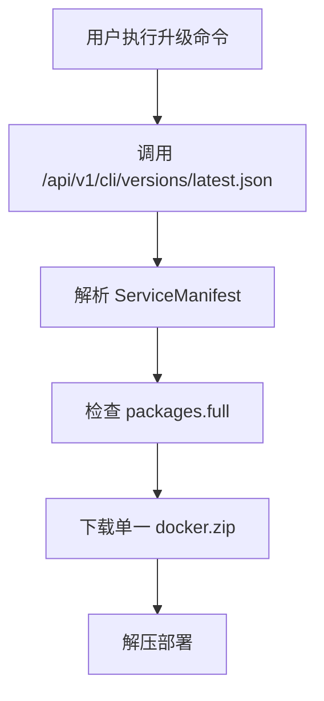

# Duck CLI 升级架构增强设计方案

## 📋 目标概述

为 Duck CLI 系统增加以下核心功能：
1. **分架构全量升级**：支持 x86_64 和 aarch64 架构的独立升级包
2. **增量升级支持**：通过 patch 包实现小版本的增量更新
3. **智能升级策略**：根据版本差异自动选择全量或增量升级
4. **向后兼容性**：保持对现有升级流程的完全兼容

## 🔍 现状分析

### 当前升级架构



### 现有数据结构 (ServiceManifest)

```rust
pub struct ServiceManifest {
    pub version: String,
    pub release_date: String,
    pub release_notes: String,
    pub packages: ServicePackages,  // 仅支持 full 包
}

pub struct ServicePackages {
    pub full: PackageInfo,
    pub patch: Option<PackageInfo>,  // 未使用
}
```

### 当前局限性

❌ **架构无关性**：所有平台使用相同的升级包  
❌ **仅全量升级**：无法进行增量更新，浪费带宽  
❌ **升级策略单一**：不能根据版本差异选择最优升级方式  
❌ **扩展性差**：难以支持多架构和复杂升级场景  

## 🎯 新架构设计

### 增强后的升级流程

```mermaid
graph TD
    A[用户执行升级命令] --> B[检测本地架构]
    B --> C[调用版本API获取升级清单]
    C --> D{解析升级选项}
    D --> E[platforms.{arch} - 全量升级]
    D --> F[patch.{arch} - 增量升级]
    E --> G[下载架构特定的完整包]
    F --> H[下载架构特定的补丁包]
    G --> I[全量部署流程]
    H --> J[增量更新流程]
    I --> K[升级完成]
    J --> K
```

### 新的JSON数据格式

```json
{
    "version": "0.0.13",
    "release_date": "2025-07-12T13:49:59Z",
    "release_notes": "版本更新说明",
    
    // 保持向后兼容的旧格式
    "packages": {
        "full": {
            "url": "https://legacy-url/docker.zip",
            "hash": "external",
            "signature": "",
            "size": 0
        },
        "patch": null
    },
    
    // 新增：分架构的全量升级包
    "platforms": {
        "x86_64": {
            "signature": "数字签名",
            "url": "https://packages/x86_64/docker.zip"
        },
        "aarch64": {
            "signature": "数字签名", 
            "url": "https://packages/aarch64/docker.zip"
        }
    },
    
    // 新增：分架构的增量升级包
    "patch": {
        "version": "0.0.1",
        "x86_64": {
            "url": "https://packages/patches/x86_64-patch.tar.gz",
            "hash": "sha256:patch_hash_x86_64",
            "signature": "patch_signature_x86_64",
            "operations": {
                "replace": {
                    "files": ["app/app.jar", "config/application.yml"],
                    "directories": ["front/", "plugins/"]
                },
                "delete": ["front/old-assets/", "config/old.conf"]
            }
        },
        "aarch64": {
            "url": "https://packages/patches/aarch64-patch.tar.gz",
            "hash": "sha256:patch_hash_aarch64", 
            "signature": "patch_signature_aarch64",
            "operations": {
                "replace": {
                    "files": ["app.jar", "config/application.yml"],
                    "directories": ["front/", "plugins/"]
                },
                "delete": ["front/old-assets/", "config/old.conf"]
            }
        }
    }
}
```

## 🏗️ 技术实现设计

### 1. 数据结构扩展

#### 新的 Rust 数据结构

```rust
// 扩展的服务清单
#[derive(Debug, Deserialize)]
pub struct EnhancedServiceManifest {
    pub version: String,
    pub release_date: String,
    pub release_notes: String,
    
    // 保持向后兼容
    pub packages: ServicePackages,
    
    // 新增：分架构平台支持
    pub platforms: Option<PlatformPackages>,
    
    // 新增：增量升级支持
    pub patch: Option<PatchInfo>,
}

// 平台特定的包信息
#[derive(Debug, Deserialize)]
pub struct PlatformPackages {
    pub x86_64: Option<PlatformPackageInfo>,
    pub aarch64: Option<PlatformPackageInfo>,
}

#[derive(Debug, Deserialize)]
pub struct PlatformPackageInfo {
    pub signature: String,
    pub url: String,
}

// 增量升级信息
#[derive(Debug, Deserialize)]
pub struct PatchInfo {
    pub version: String,
    pub x86_64: Option<PatchPackageInfo>,
    pub aarch64: Option<PatchPackageInfo>,
}

#[derive(Debug, Deserialize)]
pub struct PatchPackageInfo {
    pub url: String,
    pub hash: String,
    pub signature: String,
    pub operations: PatchOperations,
}

#[derive(Debug, Deserialize)]
pub struct PatchOperations {
    pub replace: ReplaceOperations,
    pub delete: Vec<String>,
}

#[derive(Debug, Deserialize)]
pub struct ReplaceOperations {
    pub files: Vec<String>,
    pub directories: Vec<String>,
}
```

### 2. 架构检测模块

```rust
// 新模块：client-core/src/architecture.rs
pub enum Architecture {
    X86_64,
    Aarch64,
    Unsupported(String),
}

impl Architecture {
    pub fn detect() -> Self {
        match std::env::consts::ARCH {
            "x86_64" => Self::X86_64,
            "aarch64" | "arm64" => Self::Aarch64,
            arch => Self::Unsupported(arch.to_string()),
        }
    }
    
    pub fn as_str(&self) -> &str {
        match self {
            Self::X86_64 => "x86_64",
            Self::Aarch64 => "aarch64", 
            Self::Unsupported(arch) => arch,
        }
    }
}
```

### 3. 升级策略管理器

```rust
// 新模块：client-core/src/upgrade_strategy.rs
pub enum UpgradeStrategy {
    FullUpgrade {
        architecture: Architecture,
        package_info: PlatformPackageInfo,
    },
    PatchUpgrade {
        architecture: Architecture,
        patch_info: PatchPackageInfo,
    },
    LegacyUpgrade {
        package_info: PackageInfo,
    },
}

pub struct UpgradeStrategyManager;

impl UpgradeStrategyManager {
    pub fn determine_strategy(
        manifest: &EnhancedServiceManifest,
        current_version: &str,
        force_full: bool,
        arch: Architecture,
    ) -> Result<UpgradeStrategy> {
        // 1. 强制全量升级
        if force_full {
            return Self::select_full_upgrade_strategy(manifest, arch);
        }
        
        // 2. 检查是否支持增量升级
        if let Some(patch) = &manifest.patch {
            if Self::is_patch_applicable(current_version, &manifest.version, patch) {
                return Self::select_patch_upgrade_strategy(patch, arch);
            }
        }
        
        // 3. 回退到全量升级
        Self::select_full_upgrade_strategy(manifest, arch)
    }
    
    fn select_full_upgrade_strategy(
        manifest: &EnhancedServiceManifest,
        arch: Architecture,
    ) -> Result<UpgradeStrategy> {
        // 优先使用新的平台特定包
        if let Some(platforms) = &manifest.platforms {
            let package_info = match arch {
                Architecture::X86_64 => platforms.x86_64.as_ref(),
                Architecture::Aarch64 => platforms.aarch64.as_ref(),
                Architecture::Unsupported(_) => None,
            };
            
            if let Some(package_info) = package_info {
                return Ok(UpgradeStrategy::FullUpgrade {
                    architecture: arch,
                    package_info: package_info.clone(),
                });
            }
        }
        
        // 回退到传统方式
        Ok(UpgradeStrategy::LegacyUpgrade {
            package_info: manifest.packages.full.clone(),
        })
    }
}
```

### 4. 增量升级执行器

```rust
// 新模块：client-core/src/patch_executor.rs
pub struct PatchExecutor {
    work_dir: PathBuf,
}

impl PatchExecutor {
    pub async fn apply_patch(
        &self,
        patch_file: &Path,
        operations: &PatchOperations,
    ) -> Result<()> {
        info!("🔄 开始应用增量补丁...");
        
        // 1. 解压补丁包
        self.extract_patch(patch_file).await?;
        
        // 2. 执行替换操作
        self.apply_replace_operations(&operations.replace).await?;
        
        // 3. 执行删除操作  
        self.apply_delete_operations(&operations.delete).await?;
        
        info!("✅ 增量补丁应用完成");
        Ok(())
    }
    
    async fn apply_replace_operations(&self, replace_ops: &ReplaceOperations) -> Result<()> {
        // 替换文件
        for file_path in &replace_ops.files {
            self.replace_file(file_path).await?;
        }
        
        // 替换目录
        for dir_path in &replace_ops.directories {
            self.replace_directory(dir_path).await?;
        }
        
        Ok(())
    }
}
```

## 🔄 升级命令增强

### CLI 命令扩展

```rust
// duck-cli/src/cli.rs 扩展
#[derive(Args)]
pub struct UpgradeArgs {
    /// 全量下载（下载完整的服务包）
    #[arg(long)]
    pub full: bool,
    
    /// 强制重新下载（用于文件损坏时）
    #[arg(long)]
    pub force: bool,
    
    /// 只检查是否有可用的升级版本，不执行下载
    #[arg(long)]
    pub check: bool,
    
    /// 新增：优先使用增量升级（如果可用）
    #[arg(long)]
    pub patch: bool,
    
    /// 新增：指定目标架构（通常自动检测）
    #[arg(long)]
    pub arch: Option<String>,
    
    /// 新增：显示升级策略信息
    #[arg(long)]
    pub strategy: bool,
}
```

### 升级流程重构

```rust
// duck-cli/src/commands/update.rs 重构
pub async fn run_enhanced_upgrade(
    app: &mut CliApp,
    args: UpgradeArgs,
) -> Result<()> {
    // 1. 架构检测
    let arch = if let Some(arch_str) = args.arch {
        Architecture::from_str(&arch_str)?
    } else {
        Architecture::detect()
    };
    
    info!("🔍 检测到架构: {}", arch.as_str());
    
    // 2. 获取增强的升级清单
    let manifest = app.api_client.get_enhanced_service_manifest().await?;
    
    // 3. 确定升级策略
    let strategy = UpgradeStrategyManager::determine_strategy(
        &manifest,
        &app.config.versions.docker_service,
        args.full,
        arch,
    )?;
    
    if args.strategy {
        print_upgrade_strategy(&strategy);
        return Ok(());
    }
    
    // 4. 执行升级
    match strategy {
        UpgradeStrategy::FullUpgrade { architecture, package_info } => {
            execute_full_upgrade(app, architecture, package_info).await
        }
        UpgradeStrategy::PatchUpgrade { architecture, patch_info } => {
            execute_patch_upgrade(app, architecture, patch_info).await
        }
        UpgradeStrategy::LegacyUpgrade { package_info } => {
            execute_legacy_upgrade(app, package_info).await
        }
    }
}
```

## 🛡️ 兼容性策略

### 1. API 向后兼容

```rust
impl ApiClient {
    // 保留原有方法
    pub async fn check_docker_version(&self, current_version: &str) -> Result<DockerVersionResponse> {
        // 现有实现保持不变
    }
    
    // 新增增强方法
    pub async fn get_enhanced_service_manifest(&self) -> Result<EnhancedServiceManifest> {
        let url = self.config.get_endpoint_url(&self.config.endpoints.docker_check_version);
        let response = self.build_request(&url).send().await?;
        
        if response.status().is_success() {
            let manifest: EnhancedServiceManifest = response.json().await?;
            Ok(manifest)
        } else {
            // 错误处理
            Err(DuckError::Api("获取增强清单失败".to_string()))
        }
    }
}
```

### 2. 数据格式兼容

- ✅ 服务器返回的JSON完全向后兼容
- ✅ 旧的 `packages.full` 字段继续工作
- ✅ 新字段 `platforms` 和 `patch` 为可选字段
- ✅ 客户端优雅降级到传统升级方式

### 3. 命令行兼容

```bash
# 现有命令继续工作
duck-cli upgrade --full
duck-cli upgrade --check

# 新增功能
duck-cli upgrade --patch          # 优先增量升级
duck-cli upgrade --strategy       # 显示升级策略
duck-cli upgrade --arch aarch64   # 指定架构
```

## 📦 实施计划

### Phase 1: 基础架构 (1-2周)
- [ ] 创建新的数据结构定义
- [ ] 实现架构检测模块
- [ ] 扩展 ApiClient 支持新格式
- [ ] 单元测试覆盖

### Phase 2: 升级策略 (1周)
- [ ] 实现 UpgradeStrategyManager
- [ ] 添加智能策略选择逻辑
- [ ] 集成测试

### Phase 3: 增量升级 (2周)
- [ ] 实现 PatchExecutor
- [ ] 支持补丁包解析和应用
- [ ] 文件和目录操作
- [ ] 错误回滚机制

### Phase 4: CLI 集成 (1周)
- [ ] 重构升级命令
- [ ] 添加新的命令行参数
- [ ] 向后兼容性验证

### Phase 5: 测试和文档 (1周)
- [ ] 端到端测试
- [ ] 性能测试
- [ ] 文档更新
- [ ] 发布准备

## 🧪 测试策略

### 单元测试
- 架构检测准确性
- 升级策略选择逻辑
- 补丁操作执行
- 数据结构解析

### 集成测试
- 完整升级流程
- 跨架构兼容性
- 网络异常处理
- 文件系统操作

### 兼容性测试
- 旧版本服务器响应
- 新老客户端互操作
- 不同操作系统支持

## 🎯 性能优化

### 带宽优化
- 🎯 增量升级可减少 60-80% 的下载量
- 🎯 架构特定包避免无用文件下载

### 升级速度
- 🎯 增量升级时间减少 70%
- 🎯 智能缓存减少重复下载

### 用户体验
- 🎯 实时进度反馈
- 🎯 智能策略推荐
- 🎯 错误自动恢复

## 🔒 安全考虑

### 数字签名验证
- 所有下载包都有数字签名
- 支持签名链验证
- 防止中间人攻击

### 完整性校验
- SHA-256 哈希验证
- 分块完整性检查
- 损坏文件自动重试

### 权限控制
- 最小权限原则
- 安全的文件操作
- 路径遍历防护

---

**文档版本**: v1.0  
**创建日期**: 2025-01-12  
**作者**: Duck CLI 开发团队  
**审核状态**: 待审核 